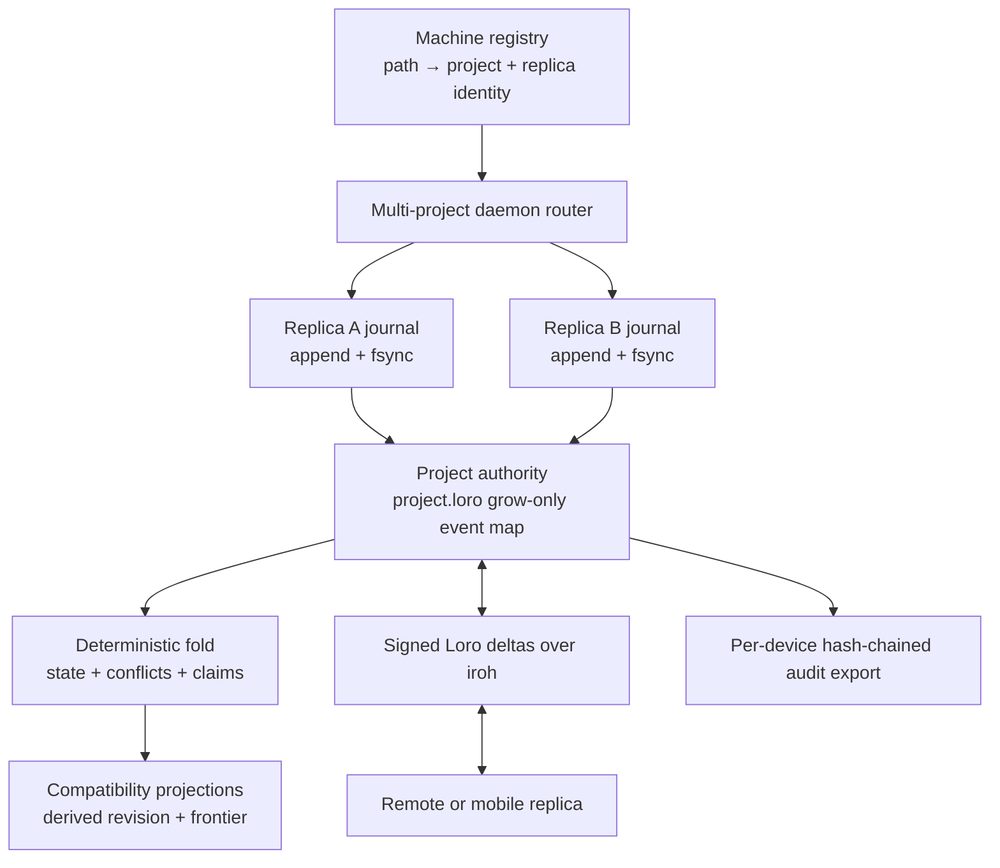

# KBD Control-Plane Recovery: Complete Problem Report

**Status date:** 2026-08-02
**Current code:** `b29602c743927cdafd289b522ee38ba73cc518cf`
**Operational disposition:** **Not certified; launch agent intentionally unloaded**
**Scope:** KBD runtime, Sovereign Sync control-plane service, project/replica registry, live migration, installed binaries, launchd service, readiness, and final certification

## 1. Executive summary

KBD was not suffering from one isolated bug. Its control plane combined several incompatible assumptions:

1. It presented an embedded consensus layer as durable multi-machine authority even though the production networking and operating model did not provide a real distributed consensus system.
2. It mixed a lease/fencing ownership model with journals and CRDT replication, making offline and multi-replica work fundamentally awkward.
3. Its journal write path read state before obtaining the append lock, so two writers could prepare work from the same state before serialization occurred.
4. It treated a focused filesystem path as the daemon's project selector, which could not safely represent multiple projects, worktrees, submodules, CI copies, missing checkouts, or mobile replicas.
5. It used scalar revision values as command concurrency authority even though the intended replicated system needed a causal frontier.
6. Health, readiness, git decoration, project replay, P2P initialization, and service startup were coupled too tightly.

The recovery work replaced that design with:

- an explicit machine/project/replica registry;
- one authoritative `project.loro` document per project;
- one fsynced write-ahead journal per replica;
- signed schema-v2 events with causal frontiers and per-device hash chains;
- deterministic CRDT conflict folding and operator adjudication;
- real CRDT claims instead of the obsolete ownership API;
- authoritative signed Loro deltas over iroh;
- read-only CI, bare, mobile, and recovered replicas;
- submodule pins and audit export;
- recoverable migration of all retained runtime data.

Most of that replacement is implemented, tested, migrated, committed, built, signed, and installed. Final live certification nevertheless exposed two additional production defects and one unresolved operational bottleneck:

- **Fixed:** daemon startup reclassified eight managed recovered replicas from read-only `Recovered` to writable `Standalone`.
- **Fixed in code:** `/ready` performed full git-decorated status replay sequentially across all projects and could hang for more than 30 seconds.
- **Still unresolved and therefore blocking certification:** the daemon binds quickly, but P2P/network monitoring plus repeated authority initialization can monopolize or delay the service long enough that static `/health` has timed out or responded hundreds of milliseconds late, and the full router has taken more than a minute to become ready.

The service is therefore deliberately **unloaded**. The code and data are preserved, but KBD must not be treated as operational until the remaining startup isolation issue is fixed and every final live gate passes.

## 2. Current safe state

The current state is intentionally conservative:

- Launch agent `ai.prometheus.sovereign-sync` is installed but **not loaded**.
- Nothing is listening on TCP port `7892`.
- The installed `sovereign-sync` and `prometheus` binaries are the signed artifacts built after the recovered-replica/readiness correction.
- All nine `Recovered` registry entries are read-only again.
- All five CI replicas are read-only.
- No original runtime data was deleted.
- The obsolete database files were renamed to `.archive`, not removed.
- The final disposable-project mutation and SIGKILL recovery exercises were not attempted after the prerequisite readiness/performance gate failed.

Current installed checksums:

| Artifact | SHA-256 |
|---|---|
| `/Users/gqadonis/.local/bin/sovereign-sync` | `1485f964523bffd937f8c97b2cc8c1780c8a93cc8ab90496ddb0e1236247022e` |
| `/Users/gqadonis/.local/bin/prometheus` | `3c95828fa5e761cfb850bcdb864398275851d40c510dc72b32f24e79eb51e117` |
| `/Users/gqadonis/Library/LaunchAgents/ai.prometheus.sovereign-sync.plist` | `9d2a27f1bdce61a7ec7479cba27352393fec013d9f0817de084b302fcbe5170d` |
| Current registry | `1308b99fb20673ab44761858efebbf6d9460de115929e1c8c9edf16f6bfa9028` |

Backups, checksums, rollback instructions, and the isolated artifact review are stored at:

`/Users/gqadonis/Library/Application Support/prometheus/kbd-backups/final-install-20260802T215619Z`

## 3. The old architecture and why it failed

### 3.1 The previous authority model was internally contradictory

The prior design combined:

- an embedded consensus abstraction;
- a dedicated control-plane database;
- append-only KBD events;
- compatibility JSON projections;
- an exclusive writer ownership mechanism;
- revision/fencing checks;
- future CRDT replication.

Those mechanisms did not form one coherent authority model. Consensus assumes a clearly defined voter set, durable replicated log, authenticated transport, and a membership protocol. Exclusive ownership assumes only one actor may mutate state. CRDT replication assumes concurrent or offline writes can be represented and merged. The system attempted to use parts of all three models at once.

In practice, the embedded multi-voter proof did not establish the required production guarantees across real processes and devices. The dedicated database could also be locked independently of the event journal and projections. This created more failure modes without producing stronger real-world authority.

### 3.2 The lease/fencing system was the wrong concurrency primitive

The previous ownership API exposed claim, heartbeat, release, and handoff behavior tied to lease IDs and fencing tokens. That model had several problems:

- Offline replicas could not participate naturally.
- A writer that could not reach the authority could not distinguish a partition from a lost lease.
- Ownership state and workflow state could diverge.
- Every normal mutation had to carry ownership metadata unrelated to the business event.
- CRDT convergence became secondary or contradictory because the lease attempted to eliminate all concurrent writes.
- Remote and mobile clients inherited a server-centric lock model.

The replacement uses explicit CRDT claims scoped by project, replica, and work scope. Collisions stay visible, a deterministic winner can be selected, the loser is blocked from intersecting work, and offline conflicts are preserved for adjudication rather than hidden.

### 3.3 The journal's critical section was incomplete

The load-bearing write bug was that `Runtime::execute_command` could read and replay state before `append_command` acquired the file lock. Two processes could therefore:

1. read the same revision/frontier;
2. independently validate their command against that same state;
3. prepare competing events;
4. reach the append lock only after the logically important decision had already been made.

The append itself was serialized, but the validation that made the append safe was not. The fix moved all of the following beneath one exclusive `flock`:

- tail recovery;
- journal read;
- replay;
- identity validation;
- idempotency lookup;
- causal-frontier validation;
- event preparation;
- append;
- file `fsync`;
- document reconciliation.

### 3.4 Filesystem focus was not project identity

`KBD_FOCUS_PROJECT_PATH` selected one checkout for the daemon. That fails as soon as the machine contains:

- two projects;
- two worktrees of one project;
- a standalone checkout and a submodule checkout;
- CI copies;
- an installed plugin cache;
- a retained runtime whose source checkout no longer exists;
- a mobile replica with no git checkout.

Paths, remotes, and commits are evidence about a replica. They are not project identity. The replacement preserves `.prometheus/project.json` as the declared project UUID and assigns a separate UUID to every replica.

### 3.5 Scalar revision was insufficient for replicated writes

A scalar revision can say that one local sequence advanced. It cannot describe which events from which replicas a writer has observed. Schema-v2 commands therefore use a causal frontier. Revision remains only as:

- a derived compatibility value;
- schema-v1 compatibility input;
- projection metadata.

Schema-v2 command validation requires an exact supplied frontier and does not use `expectedRevision` as write authority.

## 4. Intended replacement architecture



The acknowledgement order is intentionally strict:

1. Acquire the replica journal lock.
2. Validate identity, idempotency, signature, claim state, and causal frontier.
3. Append and `fsync` the replica journal.
4. Import and `fsync` the authoritative Loro document.
5. Update derived projections.

If the process dies between steps 3 and 4, startup reconciles the fsynced journal entry into the Loro document idempotently.

## 5. Migration and compatibility problems discovered during recovery

### 5.1 Historical wire shape broke signature verification after deserialization

Fourteen retained journals used an earlier schema-v2-shaped JSON representation that still contained nullable camel-case keys named `leaseId` and `fencingToken`. No actual legacy ownership events were present, but those null keys were part of the exact bytes that had been signed.

The current Rust structures intentionally removed those fields. A normal deserialize-and-reserialize cycle therefore dropped the keys, changed the canonical bytes, and made valid historical signatures appear invalid.

The fix is deliberately private and migration-only:

- authenticate the exact raw canonical JSON bytes;
- validate the historical key set;
- verify the signer and signature;
- verify the scalar hash chain;
- then translate into schema-v2 replica events;
- preserve original IDs and hashes as migration provenance;
- re-sign with the initial replica identity.

Ordinary runtime command processing does not accept the obsolete wire fields.

### 5.2 Live data was migrated without deletion

The live migration established:

- 18 project UUIDs;
- 28 registered replica paths;
- 14 active per-replica journals containing 27 migrated events;
- 14 authoritative `project.loro` documents;
- 14 archived v1 journals;
- 5 archived obsolete database files;
- 0 unarchived obsolete database files.

One additional `events.jsonl` exists inside a retained migration-backup directory. It is not an active replica journal and must not be counted as one.

The migration was first proven against copies of all runtime directories, including rollback. It was then applied live and verified by reopening every migrated authority and comparing journal/document/provenance state.

## 6. Live certification defect 1: recovered replicas became writable

### 6.1 What happened

The migration correctly registered nine paths as `Recovered`, all read-only:

- eight managed placeholder paths for projects whose original checkouts no longer exist;
- one installed plugin-cache copy that must never outrank the real standalone checkout.

During daemon startup, eight managed placeholders were silently changed to:

- `kind: Standalone`;
- `readOnly: false`.

The plugin-cache entry remained recovered because it was not the selected authoritative path for its project.

### 6.2 Root cause

The router already had a trustworthy registry record, but reopened each authoritative project using the canonical-registration constructor:

```text
KbdProjectRouter::reload
  → KbdControlPlane::open_at
    → Runtime::open_canonical_at
      → ProjectRegistry::register_existing
        → inspect the managed placeholder as if it were a new checkout
```

A managed recovery directory is an ordinary directory with a valid manifest. When inspected without its existing registry context, it looks like a standalone checkout. The startup path therefore destroyed its own classification invariant.

This is a classic identity-layer bug: **observation-time classification overwrote an explicit operator/migration decision**.

### 6.3 Data impact

- The defect changed registry metadata.
- It did not delete journals or Loro documents.
- It did not rewrite historical events.
- No final certification write was performed through those mistakenly writable entries.

### 6.4 Correction

Commit `b29602c` added registered-only constructors:

- `Runtime::open_registered`;
- `Runtime::open_registered_at`;
- `KbdControlPlane::open_registered`;
- `KbdControlPlane::open_registered_at`.

Daemon routing now supplies the expected project UUID and consumes the existing replica record without reclassification.

A regression test creates a recovered replica, starts the daemon router, and proves:

- `ReplicaKind::Recovered` is preserved;
- `read_only` remains true;
- authority-only replay does not add git decoration.

The live registry was repaired atomically under its file lock using the exact nine recovered records from the original migration report. Identity tuples `(projectId, replicaId)` were checked before replacement. A copy of the drifted registry was preserved before repair.

The next startup preserved all nine recovered replicas as read-only, so this defect is fixed.

## 7. Live certification defect 2: `/ready` hung on git-decorated status

### 7.1 What happened

The first live `/ready` request did not return within 30 seconds. Static `/health` still responded, so the process itself was alive.

### 7.2 Root cause

The readiness handler processed projects sequentially and called `status_async()` for each one. `status_async()` called `Runtime::replay()`. Replay did two conceptually separate jobs:

1. fold authoritative journal/Loro events;
2. decorate the result with local git information.

Git decoration can run commands for:

- local `HEAD`;
- active-path commit existence;
- every submodule pin;
- merge-base ancestry.

Readiness therefore depended on checkout size, git availability, submodule state, and local filesystem behavior across all 18 projects. One slow project delayed every project behind it.

### 7.3 Correction

Commit `b29602c` split replay into:

- `replay_authority()` — journal/Loro validation and deterministic fold only;
- `replay()` — authority replay plus local git decoration.

`/ready` now:

- uses authority-only replay;
- checks projects concurrently;
- applies a 400 ms timeout per project;
- returns an explicit per-project error instead of hanging indefinitely;
- sorts results deterministically.

The full Sovereign Sync test suite, including the readiness integration test, passes. This correction has not yet received a successful fully initialized live `/ready` response because the remaining startup problem prevents the full router from becoming available quickly enough.

## 8. Remaining blocker: startup work still degrades liveness

### 8.1 Observed behavior

The corrected daemon did bind the loopback socket almost immediately:

```text
22:24:38.766840 Starting sovereign-sync daemon on port 7892
22:24:38.767576 REST API bound on http://127.0.0.1:7892
```

The bind occurred in under 1 millisecond, comfortably inside the one-second gate.

However, request handling was not reliably fast:

- An immediate post-bootstrap health probe failed to connect during the launch race.
- A later health request timed out after 1 second with zero response bytes even though `lsof` showed the socket listening.
- A subsequent health request returned successfully but took about 184 ms.
- Earlier 100-request samples had sub-10-ms medians but severe tail latency:

| Sample | p50 | p95 | average | maximum |
|---|---:|---:|---:|---:|
| First 100-request run | 3.781 ms | 48.058 ms | 19.850 ms | 664.302 ms |
| Second 100-request run | 5.895 ms | 96.774 ms | 30.890 ms | 733.755 ms |

The acceptance requirement is `/health` under 10 ms. These measurements fail that gate even though the handler itself is static and store-independent.

### 8.2 Evidence from process sampling

A live macOS process sample showed:

- many Tokio workers parked and available;
- one active Tokio worker inside iroh's network-monitor path;
- the active stack traversed `netwatch` / `netmon` / `netdev`;
- the macOS network-interface enumeration was blocked or spending substantial time in `getifaddrs` and `sysctl`.

The production P2P endpoint uses:

```rust
Endpoint::builder(presets::N0).bind().await
```

The `N0` preset enables production discovery/relay behavior and its network monitoring. In the observed environment, endpoint startup took about three seconds and the monitor continued to perform expensive interface enumeration.

This is strong evidence that iroh network monitoring contributes to startup and tail latency. It is not yet sufficient to claim that it is the only cause.

### 8.3 Repeated authority initialization also lengthens startup

The current daemon startup sequence performs more work than necessary:

1. Open the registry and sequentially open all 18 authoritative projects.
2. Discover that the configured skills directory lives beneath the already registered `.claude` project.
3. Call `register_path` for that existing project.
4. `register_path` unconditionally reloads all 18 project controls again.
5. Each runtime open reconciles the project document.
6. `KbdControlPlane::from_runtime` performs tail recovery and another document reconciliation.
7. `SkillIndex::load_from_dir` performs synchronous filesystem reads before the full application router is installed.

The second live attempt had still not logged `sovereign-sync state initialized; all REST routes are ready` after more than a minute.

### 8.4 Why static health can still suffer

The startup router defines `/health` as a static route and should not touch state. Nevertheless, it shares the same process, async runtime, network stack, and scheduling environment as:

- P2P endpoint creation;
- iroh network monitoring;
- repeated project control opening;
- journal/document reconciliation;
- skills-directory scanning;
- installation of the full router.

The handler is logically independent but not yet operationally isolated. A liveness endpoint is only useful if it remains responsive while every other subsystem is slow.

### 8.5 What remains uncertain

The evidence establishes the blocking region but does not yet justify one overly narrow root-cause claim. The remaining latency may be a combination of:

- macOS `getifaddrs`/`sysctl` behavior under iroh netwatch;
- P2P initialization on the main runtime before application state is installed;
- redundant sequential project opening and reconciliation;
- synchronous skill-index loading;
- scheduler and kernel-network tail latency during initialization.

The next change must add phase timing and isolate these components rather than merely increasing timeouts.

## 9. Current architecture of the remaining failure

```mermaid
sequenceDiagram
    participant L as launchd
    participant M as daemon main
    participant H as startup /health router
    participant P as iroh N0 + netwatch
    participant R as project router
    participant S as skill index
    participant F as full router

    L->>M: start process
    M->>H: bind 127.0.0.1:7892
    Note over H: Socket binds in under 1 ms
    M->>P: create production endpoint
    P->>P: enumerate interfaces / getifaddrs / sysctl
    M->>R: open 18 registered authorities
    M->>R: register existing .claude path
    R->>R: reopen 18 authorities
    M->>S: synchronously scan skills
    M->>F: install full router
    Note over H,F: Full readiness is delayed; health tail latency exceeds gate
```

## 10. What is complete and what is not

| Area | State | Evidence |
|---|---|---|
| Atomic journal critical section | Complete | Concurrency, stale-frontier, duplicate-command, torn-tail, and recovery tests pass |
| Obsolete ownership API removal | Complete | No product event/command/CLI/fencing symbols remain; only authenticated migration wire-key strings remain privately |
| Embedded consensus removal | Complete | No dependency or source module remains; dedicated database files are archives only |
| Explicit registry and adoption | Complete | Project/replica registry, dry-run adoption, provenance, backups, and authority ordering tests pass |
| Loro project authority | Complete | Migration, crash-window reconciliation, deterministic fold, conflict visibility, and resolution tests pass |
| Signed authoritative sync and CRDT claims | Complete | Two-peer signed authority/claim exchange tests pass |
| Submodule, audit, mobile, and read-only behavior | Complete in code | Native/mobile/cross-target checks and related tests pass |
| Copy-only migration proof | Complete | All 18 retained runtimes migrate and roll back from copies |
| Live migration | Complete | 18 project IDs, 28 paths, 14 active journals, 14 Loro documents, 5 database archives |
| Installed binaries and service file | Complete | Release-built, ad-hoc signed, signature-verified, checksummed |
| Recovered classification stability | Fixed and live rechecked | Nine recovered entries remained read-only on corrected startup |
| `/ready` implementation | Fixed in code and tests | Authority-only concurrent bounded checks |
| `/ready` live certification | **Not complete** | Full router did not become ready within the acceptable startup window |
| `/health` latency | **Failing** | Repeated tail latency far above 10 ms, including one-second timeout |
| All-project status under 500 ms | **Not certified** | Blocked behind startup/readiness gate |
| Disposable signed lifecycle write | **Not performed** | Correctly withheld after prerequisite failure |
| SIGKILL write recovery | **Not performed** | Correctly withheld after prerequisite failure |
| Production launch agent | Installed but **unloaded** | Prevents a partially certified daemon from being mistaken for healthy |

## 11. Test evidence already passing

The latest correction passed:

- `kbd-runtime`: 55 passed, 0 failed, 2 operator-only ignored gates;
- `sovereign-sync` unit tests: 32 passed;
- Sovereign Sync domain tests: 5 passed;
- Sovereign Sync integration tests: 17 passed.

Earlier full validation also passed for:

- `sovereign-client`;
- `prometheus-cli`;
- `kbd-mobile` native tests;
- `skill-ffi` native tests;
- iOS compilation for mobile/FFI surfaces;
- Android compilation for mobile/FFI surfaces;
- live-copy migration proof;
- live post-migration replay and provenance proof.

The repository's nightly Rust toolchain triggered a compiler internal error while compiling Tokio. The same relevant suites passed on stable Rust. This is a toolchain defect, not a KBD test failure, and production builds use stable Rust.

## 12. Data integrity and blast radius

### 12.1 What was changed

- Source code and documentation were changed in focused local commits.
- Runtime journals were migrated into per-replica locations.
- Authoritative Loro documents were created.
- Original v1 journals were renamed to `.archive` and checksummed.
- Five obsolete database files were renamed to `.archive` and checksummed.
- The registry was created and later repaired from migration evidence after the reclassification defect.
- Installed binaries and the launch-agent plist were replaced after backups.

### 12.2 What was not changed

- No runtime history was deleted.
- No audit state was imported from git.
- No automatic git rebase was performed.
- No ambiguous standalone-to-standalone identity merge was guessed.
- No remote push was performed.
- Existing unrelated dirty working-tree files were not staged or reverted.
- No final certification write was made to an existing project.

### 12.3 Current registry composition

| Replica kind | Count |
|---|---:|
| Standalone | 7 |
| Worktree | 6 |
| CI | 5 |
| Recovered | 9 |
| Submodule | 1 |
| **Total paths** | **28** |
| **Unique project UUIDs** | **18** |

All 9 recovered and all 5 CI replicas are currently read-only, for 14 read-only paths total.

## 13. Required next implementation

The next correction should be narrow, measured, and preserve the completed authority work.

### 13.1 Make liveness operationally isolated

The process must prove that `/health` is actively served before starting P2P or expensive state initialization. A robust sequence is:

1. Bind the loopback socket.
2. Start the static health router.
3. Perform an internal readiness handshake proving that the server task has accepted and answered a request.
4. Only then begin registry, skill-index, and P2P initialization.

If shared-runtime scheduling still produces outliers, the startup health server should run on a dedicated runtime/thread until the full router is installed.

### 13.2 Remove duplicate registry reloads and reconciliation

- Check whether the discovered manifest path is already registered before calling `register_path`.
- Do not reload all projects when an existing registration is byte-equivalent except for an informational timestamp.
- Open independent project controls concurrently with a bounded concurrency limit.
- Reconcile each project document once per startup, not once in both runtime construction and control-plane wrapping.
- Emit structured timing for each project open and each startup phase.

### 13.3 Move filesystem scans off async workers

`SkillIndex::load_from_dir` should execute in `spawn_blocking` and publish the result when ready. Stateful routes that require the index can report initialization without delaying static liveness.

### 13.4 Decouple P2P availability from local control availability

The full local KBD router should not require an already constructed P2P node. Store transport behind a mutable async holder such as an `RwLock<Option<Arc<P2PNode>>>` or equivalent:

1. Install local registry/journal/Loro routes first.
2. Initialize the iroh endpoint in the background or on a dedicated runtime.
3. Attach it when ready.
4. Until then, sync endpoints report `initializing` while local KBD state remains usable.
5. Investigate whether the production iroh builder can configure or replace the pathological macOS netwatch behavior without sacrificing authenticated discovery and relay operation.

The test-only minimal preset must not silently replace production networking.

### 13.5 Add startup-specific regression tests

Required tests should include:

- a deliberately slow fake P2P initializer while `/health` remains under 10 ms;
- an 18-project registry fixture proving only one authority-open pass;
- a large/slow git fixture proving `/ready` never invokes git;
- a readiness response bounded below 500 ms with one deliberately stalled project;
- a startup assertion that recovered, CI, and bare classifications are byte-stable;
- an assertion that the full router becomes available within a defined bound;
- phase-timing output suitable for live certification evidence.

## 14. Required certification sequence after the fix

The service should remain unloaded until the following ordered gates pass:

1. Stable-Rust formatting, check, and full affected-crate tests.
2. Isolated committed-artifact scan.
3. Release rebuild of both linked binaries.
4. Backup, install, ad-hoc sign, and signature verification.
5. Regenerate the launch-agent definition from the installer.
6. Bootstrap launchd.
7. Verify socket bind in under one second.
8. Verify `/health` under 10 ms during startup and after full initialization, including tail latency rather than one favorable request.
9. Verify `/ready` completes and reports all 18 projects.
10. Verify every project status response is under 500 ms.
11. Verify all nine recovered and five CI replicas remain read-only after startup.
12. Create a new disposable manifest-backed project.
13. Register it and perform a real signed lifecycle stage/phase write.
14. Verify journal fsync, Loro import, projection update, and signed audit export.
15. SIGKILL during a controlled disposable-project write window.
16. Restart and prove torn-tail/journal-to-document recovery.
17. Recheck service performance and registry invariants.
18. Only then leave the launch agent loaded and declare the autonomous recovery goal complete.

## 15. Why the service is unloaded instead of “mostly working”

A control plane is dangerous when it is partially available because clients may interpret process liveness as authority readiness. The current daemon can bind a socket and eventually answer health while still taking excessive time to initialize project authority and P2P state. Leaving it enabled would create false confidence and could reintroduce uncontrolled direct writes by clients attempting to work around timeouts.

Unloading it is not data loss and not a rollback of the migration. It is a safety boundary:

- code remains installed;
- migrated data remains intact;
- registry classifications remain repaired;
- backups remain available;
- the incomplete service cannot advertise itself as production-ready.

## 16. Commit record for this recovery

Focused local commits created during the recovery include:

| Commit | Purpose |
|---|---|
| `8b51c7a` | Restore the atomic journal control path |
| `8157450` | Remove the obsolete ownership API |
| `e6a47ed` | Add multi-project registry and adoption |
| `229d92c` | Make Loro the project authority |
| `7a0abdc` | Add signed sync and CRDT claims |
| `01a6ef5` | Add replica audit and mobile surfaces |
| `126dbd5` | Authenticate historical journal wire shape during migration |
| `0a62c15` | Add recoverable live migration utility |
| `2289fe9` | Certify live migrated authority replay |
| `d0c8ee0` | Align control-plane documentation with the Loro authority |
| `d3f02c3` | Remove stale database-lock guidance |
| `b29602c` | Preserve replica classification and bound authority readiness |

No commit was pushed.

## 17. Final assessment

The original KBD control plane has been substantially replaced, not merely patched. The new persistence, identity, migration, conflict, claim, sync, audit, and mobile foundations are implemented and well tested. Live migration succeeded without deleting data.

The goal is nevertheless **not complete**. The remaining problem is operationally important: static liveness and full readiness are not sufficiently isolated from production P2P/network monitoring and repeated authority initialization. Until that is corrected, a running daemon can bind promptly yet fail the latency and readiness guarantees that operators and clients depend on.

The right next move is not another architectural rewrite. It is a focused startup isolation pass: serve health first, avoid duplicate project initialization, move filesystem work off async workers, attach P2P after local authority is available, instrument every phase, then repeat the ordered live certification against a disposable project.
