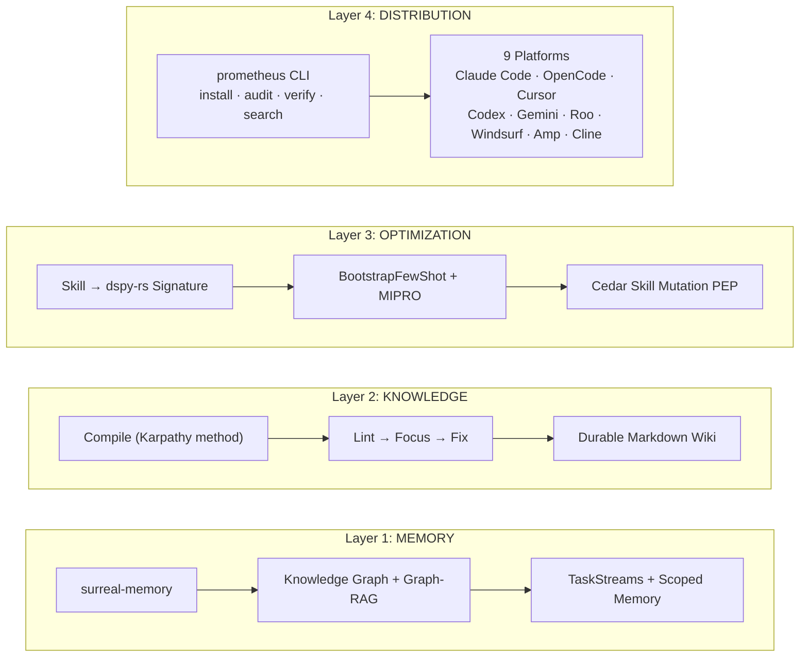
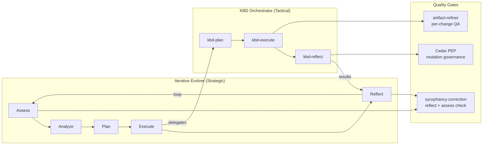
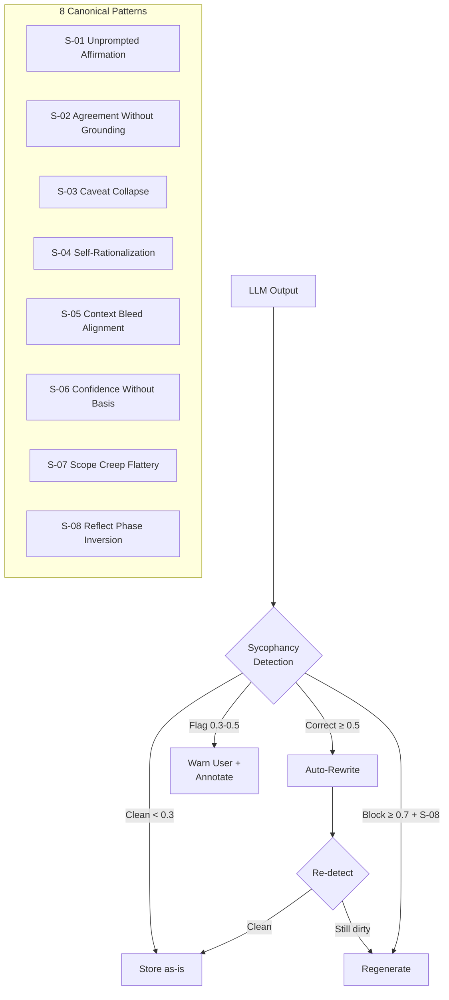
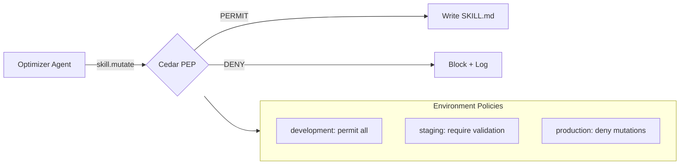

# Prometheus Skill System

A self-improving AI skill execution engine. 62 validated skills across 5 domains, a 4-crate Rust CLI, Cedar governance, surreal-memory distributed state, sycophancy correction, and a nested PMPO pipeline that learns from every execution.

Built for teams deploying AI agents in production environments where capability improvement must be governed, audited, and reproducible.

[](https://github.com/Prometheus-AGS/prometheus-skill-system/actions/workflows/validate.yml)

## Compliance Scores

| Standard               | Score      | Evidence                                                                                 |
| ---------------------- | ---------- | ---------------------------------------------------------------------------------------- |
| **AgentSkills.io**     | **97/100** | 62/62 skills pass with 0 errors, 0 warnings. Recursive validation covers all sub-skills. |
| **Claude Code Plugin** | **96/100** | plugin.json has all 9 fields. 5 hook events. 3 MCP servers. CI workflow.                 |
| **OpenCode Support**   | **93/100** | 3 typed TypeScript tool definitions, `.opencode/package.json`, 8-platform compatibility. |
| **Marketplace**        | **95/100** | 5 granular plugin entries, v1.1.0 semver, git tag, CI badge.                             |

## How Skills Improve Themselves

This is not a static skill collection. Skills improve from execution data through a four-layer feedback loop — the first production implementation of the [Hermes/GEPA self-learning architecture](https://github.com/NousResearch/hermes-agent-self-evolution) using a Rust-native toolchain.



The self-learning loop:

1. **Trace capture**: Cross-platform `TraceCapture` protocol logs every skill execution — not locked to one platform
2. **Knowledge compilation**: [prometheus-knowledge](https://github.com/Prometheus-AGS/prometheus-knowledge-rs) compiles traces into a durable wiki via compile→lint→focus→fix
3. **Prompt optimization**: [dspy-rs](https://github.com/GQAdonis/dspy-rs) BootstrapFewShot + MIPRO — routed through local models by default (zero data egress)
4. **Cedar governance**: All mutations gated by environment-aware policies — development permits, staging validates, production denies
5. **Sycophancy correction**: Every reflect and assess output checked for the [8 canonical sycophancy patterns](https://github.com/Know-Me-Tools/sycophancy-correction-skill) before storage

Feature flags control pipeline stages — see [Rust CLI Development](#rust-cli-development).

## Architecture

### Nested PMPO Pipeline



### Sycophancy Correction Integration



### Cedar Governance Flow



## What's Inside

### Skills (62 total)

| Domain       | Skills | Highlights                                                            |
| ------------ | ------ | --------------------------------------------------------------------- |
| **React**    | 27     | Entity CRUD, GraphQL, Prisma, realtime sync, performance optimization |
| **Process**  | 20     | KBD orchestrator, iterative evolver, PMPO skill creator               |
| **DevOps**   | 4      | GitOps bootstrap, transform, ArgoCD multi-cloud, Kustomize overlays   |
| **Testing**  | 1      | BDD with Cucumber.js + Playwright + video recording                   |
| **Imported** | 10     | Artifact refiner (9) + Sycophancy correction (1) via git submodules   |

### Rust CLI (`tools/prometheus-cli/`)

4-crate workspace with 16 subcommands:

| Crate               | Purpose                                                                                |
| ------------------- | -------------------------------------------------------------------------------------- |
| `prometheus-cli`    | Binary: install, audit, verify, search, learn, optimize, evolve, policy, and more      |
| `prometheus-agents` | 10-platform adapter library with `TraceCapture` protocol                               |
| `prometheus-learn`  | Self-learning pipeline: trace capture, evaluation, knowledge compilation, optimization |
| `prometheus-cedar`  | Cedar Skill Mutation PEP — governs skill.mutate/generate/promote/trace.capture         |

## Quick Start

### Prerequisites

- Node.js >= 18 (for skill validation)
- Rust toolchain (for CLI + MCP server — `rustup` recommended)
- Git with submodule support

### Clone

```bash
git clone --recurse-submodules git@github.com:Prometheus-AGS/prometheus-skill-system.git
cd prometheus-skill-system
npm install
```

### Validate Skills

```bash
npm run validate
# 62 skill(s) validated — 0 errors, 0 warnings
```

### Build and Install

```bash
# Build the Rust CLI
cd tools/prometheus-cli && cargo build --release && cd ../..
sudo cp tools/prometheus-cli/target/release/prometheus /usr/local/bin/

# Build the sycophancy MCP server
cd skills/imported/sycophancy-correction && cargo build --release && cd ../../..
sudo cp skills/imported/sycophancy-correction/target/release/sycophancy-correction /usr/local/bin/

# Install all skills as slash commands across 9 platforms
npm run install:skills

# Verify
prometheus doctor
prometheus --version
sycophancy-correction --help 2>&1 | head -1 || echo "MCP server installed (stdio mode)"
```

### Platform-Specific Paths

| Platform    | Global Skills                 | Slash Commands |
| ----------- | ----------------------------- | -------------- |
| Claude Code | `~/.claude/skills/`           | 53 skills      |
| OpenCode    | `~/.config/opencode/skills/`  | 53 skills      |
| Cursor      | `~/.cursor/skills/`           | 53 skills      |
| Codex / Amp | `~/.agents/skills/`           | 53 skills      |
| Gemini CLI  | `~/.gemini/skills/`           | 53 skills      |
| Roo Code    | `~/.roo/skills/`              | 53 skills      |
| Windsurf    | `~/.codeium/windsurf/skills/` | 53 skills      |
| Cline       | `~/.cline/skills/`            | 53 skills      |

## Slash Commands

### Process Orchestration

| Command                  | Purpose                                                                      |
| ------------------------ | ---------------------------------------------------------------------------- |
| `/evolve`                | Full iterative evolution cycle (assess → analyze → plan → execute → reflect) |
| `/evolve-assess`         | Assess current state against goals                                           |
| `/evolve-plan`           | Create prioritized improvement plan                                          |
| `/evolve-execute`        | Execute plan (delegates to KBD for software domain)                          |
| `/evolve-report`         | Generate evolution report with artifact quality metrics                      |
| `/kbd-init`              | Initialize KBD orchestrator in a project                                     |
| `/kbd-assess`            | Assess codebase against phase goals                                          |
| `/kbd-plan`              | Create ordered change list with OpenSpec detection                           |
| `/kbd-execute`           | Dispatch to best tool with artifact-refiner QA                               |
| `/kbd-reflect`           | Phase retrospective with Cedar audit trail                                   |
| `/create-skill`          | Generate a new skill from scratch via PMPO                                   |
| `/clone-skill`           | Adapt an existing skill for a new domain                                     |
| `/sycophancy-correction` | Detect and correct sycophantic patterns in any artifact                      |

### GitOps CI/CD

| Command              | Purpose                                           |
| -------------------- | ------------------------------------------------- |
| `/gitops-bootstrap`  | Scaffold complete multi-cloud GitOps from scratch |
| `/gitops-transform`  | Transform existing CI/CD to GitOps standard       |
| `/argocd-multicloud` | Install + configure ArgoCD across GKE/AKS/EKS     |
| `/kustomize-overlay` | Generate 3D Kustomize overlay structure           |

### React Entity Management

| Command                  | Purpose                                              |
| ------------------------ | ---------------------------------------------------- |
| `/entity-graph-init`     | Initialize entity graph in a project                 |
| `/entity-crud-page`      | Full CRUD page with list, create, edit, delete       |
| `/entity-gql-setup`      | Wire GraphQL with entity descriptors                 |
| `/entity-prisma-setup`   | Generate entity configs from Prisma schema           |
| `/entity-realtime-setup` | Add realtime sync (WebSocket, Supabase, ElectricSQL) |
| `/entity-audit`          | Architecture compliance audit                        |

### Testing

| Command        | Purpose                                          |
| -------------- | ------------------------------------------------ |
| `/bdd-testing` | Generate BDD tests with Cucumber.js + Playwright |

## CLI Commands

```bash
# Skill management
prometheus install <repo>       # Install skills from GitHub or local path
prometheus uninstall <name>     # Remove skill from all platforms
prometheus list [--verbose]     # List installed skills with symlink targets
prometheus search <query>       # Search GitHub for skill repos

# Security & integrity
prometheus audit [--path .]     # Security scan (credentials, injection, anti-patterns)
prometheus verify [--update]    # SHA256 checksum validation against Skills.lock
prometheus doctor               # Health check (platforms, surreal-memory, KBD, evolver)
prometheus validate [path]      # Run agentskills.io validator

# Self-learning pipeline
prometheus learn --seed         # Capture traces from Claude Code session history
prometheus learn --compile      # Compile traces into knowledge wiki
prometheus optimize <skill>     # Run dspy-rs prompt optimization

# Cedar governance
prometheus policy show          # Display loaded Cedar policies
prometheus policy validate      # Validate Cedar policy syntax
prometheus policy check -o skill.mutate -s <skill> -e <env>  # Test a policy decision

# Project state
prometheus status               # Show Skills.toml + KBD waypoint + evolver state
prometheus evolve <name>        # Trigger iterative evolution cycle
prometheus memory ping          # Check surreal-memory server
prometheus build -s svc -o env  # Kustomize build + validation
```

## MCP Servers

The system uses three MCP servers configured in `.mcp.json`:

| Server                  | Transport | Purpose                                                        |
| ----------------------- | --------- | -------------------------------------------------------------- |
| `surreal-memory`        | HTTP SSE  | Knowledge graph, scoped memory, TaskStreams, Graph-RAG         |
| `sycophancy-correction` | stdio     | Detect and correct sycophantic patterns (8 canonical patterns) |
| `tavily`                | stdio     | Web research for landscape analysis                            |
| `sequential-thinking`   | stdio     | Multi-step reasoning for complex planning                      |

```bash
# Verify MCP servers
prometheus memory ping                    # surreal-memory
sycophancy-correction --help 2>&1 || true # sycophancy (stdio mode)
```

## Surreal-Memory Integration

All skills detect and use [surreal-memory](https://github.com/Prometheus-AGS/surreal-memory-server) for distributed state. Skills degrade gracefully when unavailable.

```bash
export SURREAL_MEMORY_URL=http://localhost:23001
```

See `shared/references/surreal-memory-integration.md` for entity mapping patterns.

## Cedar Governance

The `prometheus-cedar` crate and UAR's `GovernanceEngine` gate all skill mutations:

| Operation           | Cedar Action     | When                                       |
| ------------------- | ---------------- | ------------------------------------------ |
| Prompt optimization | `skill.mutate`   | dspy-rs writes back to SKILL.md            |
| Skill generation    | `skill.generate` | PMPO creates new skills from gap detection |
| Skill promotion     | `skill.promote`  | Generated skills promoted from staging     |
| Trace capture       | `trace.capture`  | Execution data collection                  |

Environment policies: **development** permits all, **staging** requires validation, **production** denies mutations. Additional policies for healthcare (audit trail) and financial (dual approval) verticals.

## Self-Learning Pipeline

```bash
# Default build — trace capture + evaluation + Cedar governance
cargo build --release -p prometheus-cli

# With knowledge compilation (requires prometheus-knowledge-rs)
cargo build --release -p prometheus-cli --features prometheus-learn/knowledge

# With prompt optimization (requires dspy-rs)
cargo build --release -p prometheus-cli --features prometheus-learn/optimize

# Full pipeline
cargo build --release -p prometheus-cli --features prometheus-learn/full
```

See `shared/references/self-learning-architecture.md` for the complete architecture.

## Sycophancy Correction

Every reflect and assess output is checked for the 8 canonical sycophancy patterns before storage. Research shows sycophancy appears in **58% of LLM interactions** and causes **r=0.902 correlation with abandoning correct answers** in multi-agent debate.

Key patterns enforced:

- **S-08 (Reflect Phase Inversion)**: Forces Delta → Root Cause → Corrective Actions
- **S-03 (Caveat Collapse)**: Requires at least one trade-off/risk/concern
- **S-02 (Agreement Without Grounding)**: Demands evidence for approval statements
- **S-04 (Self-Rationalization)**: Blocks self-congratulatory evaluation

The MCP server (`sycophancy-correction`) is installed globally and referenced in `.mcp.json`.

## Development

### Creating a New Skill

```bash
mkdir -p skills/{category}/{skill-name}
cp docs/SKILL_TEMPLATE.md skills/{category}/{skill-name}/SKILL.md
npm run validate:skill skills/{category}/{skill-name}
```

### Validation

```bash
npm run validate          # All 62 skills
npm run check-format      # Prettier formatting
```

### Rust CLI Development

```bash
cd tools/prometheus-cli
cargo check               # Type check
cargo clippy -- -D warnings  # Lint
cargo build --release     # Release build
```

## Project Structure

```
prometheus-skill-system/
├── .claude-plugin/plugin.json     # Claude Code plugin manifest
├── .mcp.json                      # MCP servers (surreal-memory, sycophancy, tavily)
├── .opencode/tools/               # OpenCode TypeScript tool definitions
├── .github/workflows/             # CI: validate + format + cargo check
├── hooks/hooks.json               # 5 hook events
├── policies/                      # Cedar governance policies + entities
├── agents/                        # Orchestration agents
├── marketplace/marketplace.json   # 5-entry marketplace distribution
├── skills/
│   ├── react/prometheus-entity-skills/  # 27 skills
│   ├── process/
│   │   ├── iterative-evolver/           # 8 skills + sycophancy checks
│   │   ├── kbd-process-orchestrator/    # 7 skills + sycophancy checks
│   │   └── pmpo-skill-creator/          # 5 skills + sycophancy correction pass
│   ├── devops/                          # 4 GitOps skills (TJ-CICD-001)
│   ├── testing/bdd-testing/             # 1 skill
│   └── imported/
│       ├── artifact-refiner/            # 9 skills (submodule)
│       └── sycophancy-correction/       # 1 skill + MCP server (submodule)
├── shared/references/             # Architecture docs, surreal-memory integration
├── tools/prometheus-cli/          # 4-crate Rust workspace
│   └── crates/
│       ├── prometheus-cli/        # 16-subcommand binary
│       ├── prometheus-agents/     # 10 platform adapters + TraceCapture
│       ├── prometheus-learn/      # Self-learning pipeline
│       └── prometheus-cedar/      # Cedar Skill Mutation PEP
├── scripts/
│   ├── validate-skills.js         # Recursive agentskills.io validator
│   ├── install-skills-flat.sh     # Flat symlink installer for slash commands
│   └── install-platforms.ts       # Multi-platform TypeScript installer
└── docs/                          # Templates, contributing guide
```

## License

MIT
