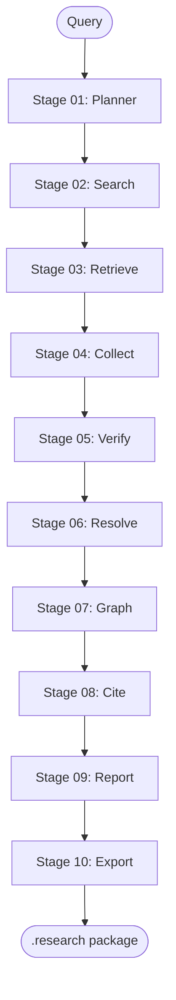

# Deep Research Pipeline Architecture

## Stage DAG

All stages execute sequentially by default. The `threaded` feature flag (in `skill.toml`) enables
future parallel execution for stages 02-04.

## Stage Descriptions

| # | Name | Input | Output | Model class |
|---|------|-------|--------|-------------|
| 01 | Planner | query, depth, kb_ids | research plan, sub-questions, token budget | frontier |
| 02 | Search | plan, sub-questions | source URL list (deduplicated, ranked) | medium |
| 03 | Retrieve | source URLs | content chunks (≤2K tokens, 100-token overlap) | medium |
| 04 | Collect | chunks | surreal-memory entities, source registry JSON | medium |
| 05 | Verify | source registry, credibility threshold | credibility scores per source | frontier |
| 06 | Resolve | source registry, credibility scores | resolved claims, contradiction log | frontier |
| 07 | Graph | verified sources, resolved claims | knowledge graph (nodes + edges) | frontier |
| 08 | Cite | verified sources, resolved claims | formatted citations with confidence scores | small |
| 09 | Report | graph, citations, resolved claims | OKF report + Feynman grade | frontier |
| 10 | Export | all stage outputs | .research package on disk | small |

## Token Budget by Depth

| Depth | Total budget | Stage distribution |
|-------|-------------|-------------------|
| shallow | ~50K tokens | Stages 01-05 only |
| deep | ~150K tokens | All 10 stages, balanced |
| exhaustive | ~400K tokens | All 10 stages, extended search |

**Frontier stage allocation (60%):** Stages 01, 05, 06, 07, 09
**Medium stage allocation (30%):** Stages 02, 03, 04
**Small stage allocation (10%):** Stages 08, 10

## Retry Policy

- Each stage retries up to 2 times on transient error (network timeout, rate limit)
- Non-retryable errors (missing API key, parse failure) fail immediately with clear message
- Stage failure propagates — later stages do not run if an earlier required stage fails
- Exception: stages 02-04 degrade gracefully when surreal-memory is unavailable (disk fallback)

## Sequential Execution Contract

The current implementation is strictly sequential. The `threaded = true` feature flag in
`skill.toml` marks future intent to parallelize stages 02-04 (search/retrieve/collect) via
a Rust `prometheus-research` binary (`phase-prometheus-research-binary`, deferred).

Until that phase ships, do not assume parallelism. Output from stage N is the input to stage N+1.
