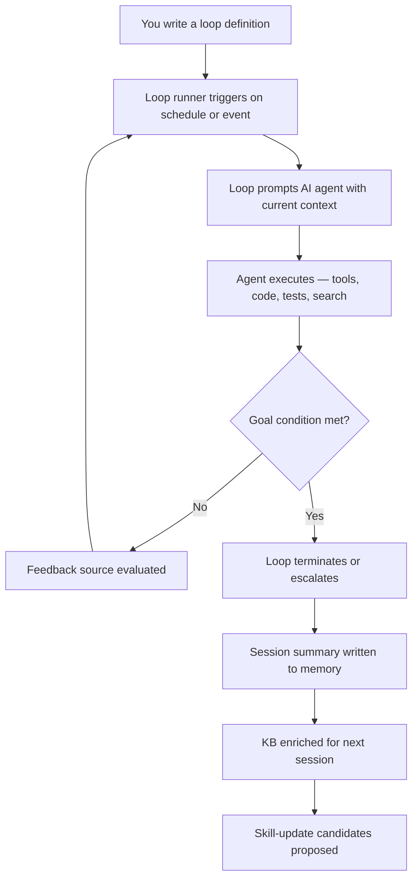
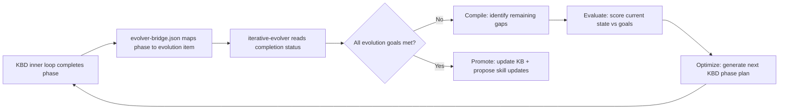
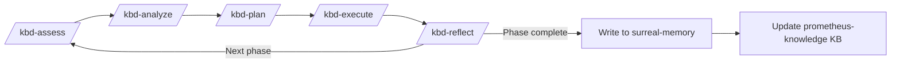
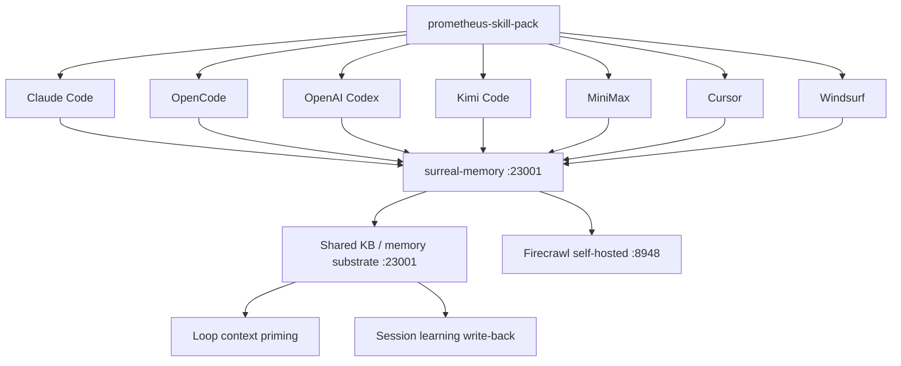
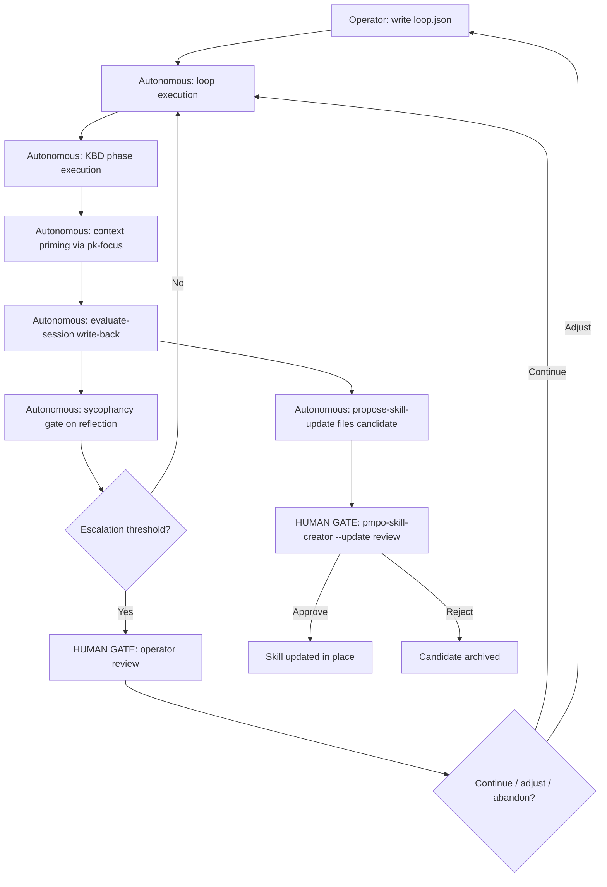

# Stop Prompting. Start Designing Loops.
## How the prometheus-skill-pack turns Claude Code's `/loop` construct — and every other AI coding agent — into a self-improving autonomous system

*Written by Travis James | AI-drafted in Travis's voice | Published June 2026*

---

> **Authorship note:** This article is published under the **Authentic Digital Twin Content Standard v2, Tier 1**.
> Every section is annotated below with its authorship category.
> The full content provenance manifest appears at the footer.

---

*[Travis James — human-authored framing]*

Boris Cherny said it plainly at Acquired Unplugged on June 2, 2026. He was sitting across from Ben Gilbert and David Rosenthal of the Acquired podcast, in San Francisco, at an event hosted by WorkOS. The quote spread everywhere within 48 hours:

> "I don't prompt Claude anymore. I have loops running. They're the ones that are prompting Claude and figuring out what to do. My job is to write loops."

He wasn't being provocative. He was reporting state. Cherny — who created Claude Code as a side project in September 2024, watched it become the tool behind close to 4% of all public GitHub commits, and now manages it as the head of the product at Anthropic — has spent eight months not writing a line of code by hand. He manages fleets of AI agents instead. Some days, a few hundred. Some days, thousands. On the big days, tens of thousands.

What Cherny described is not a Claude Code feature. It's a design posture. The feature is the loop. The posture is treating the loop as your primary unit of work.

This article is about that posture — and specifically, about how the **prometheus-skill-pack** turns that posture into a production-grade system that works across Claude Code, OpenCode, Codex, and Kimi Code, compounds learning across sessions, and self-improves from its own output history.

The comparison matters. Claude Code's `/loop` command alone gets you a repeating agent. The prometheus-skill-pack wired to `/loop` gets you a loop that remembers what it learned last Tuesday, knows when it's off-track, routes questions to the right MCP server, and proposes updates to its own skills when it discovers a better way to do something.

Those are not the same thing.

---

## Part I: What a Loop Actually Is

*[Travis James ← AI — strategic framing, AI-drafted, Travis-edited for precision]*

Addy Osmani — engineering lead at Google Chrome — gave the movement its name in June 2026. He called it **loop engineering**: the practice of designing the system that prompts an AI agent on a schedule, instead of typing each prompt yourself. Osmani synthesized the core idea from Cherny's Acquired Unplugged statement and work by Peter Steinberger, and named six building blocks of a well-engineered loop: automations, worktrees, skills, connectors, sub-agents, and memory.

The six-block definition is useful. But Cherny's framing is more fundamental: a loop is the *layer above prompting* in the abstraction hierarchy. The autonomy ladder runs like this:

```
Level 0 — Manual prompt:    You type. The model responds. You type again.
Level 1 — Tool use:         The model calls tools. You approve or observe.
Level 2 — Agentic:          The model chains tool calls across a task. You watch.
Level 3 — Loop:             The loop prompts the model. The model works. The loop checks.
Level 4 — Self-improving:   The loop writes to memory. Next time, it knows what it learned.
```

Most teams in 2026 are at Level 2. They call it "agentic coding" and are impressed that Claude Code can run tests and fix its own errors. What Cherny is doing — what the prometheus-skill-pack is designed to do — is Level 3 bleeding into Level 4.

Level 3 is structural, not cosmetic. The difference between prompting an agent and running a loop is the difference between throwing a ball and designing a machine that throws balls on a schedule while you do something else. The output can look similar. The architecture is not.



*[AI verbatim — diagram]*

The loop has three structural requirements: a **trigger** (when does it fire?), a **termination condition** (how does it know when to stop?), and a **feedback source** (how does it evaluate progress?). Everything else — the skill, the sandboxing, the MCP servers, the memory — is about making each of those three components more accurate.

That is what the prometheus-skill-pack is for.

---

## Part II: Claude Code's Native Loop Primitives

*[Travis James ← AI — technical documentation, AI-drafted, Travis-edited for accuracy]*

Claude Code ships four native loop primitives in its current release. Understanding each is a prerequisite for understanding what the skill-pack extends and why.

### `/loop` — Repeating agent on interval

The basic construct. You provide a prompt; `/loop` fires it repeatedly at a configured interval. No goal checking. No memory. No self-evaluation. It runs until you stop it or until an error terminates the agent.

```bash
/loop "Run the test suite and fix any failures you find"
```

The trade-off is structural: without a termination condition, the loop doesn't know when it's done. It will keep firing the same prompt even after the goal is met, burning tokens and potentially introducing regressions. The loop itself isn't intelligent — it's a timer.

### `/goal` — Goal-conditioned termination (added v2.1.139, May 2026)

This is the mechanism that separates a repeating prompt from a real loop. When you set a goal, Claude Code uses a *separate, faster model* — not the same model that wrote the code — to check whether the termination condition is met after each turn.

```bash
/goal "All tests in tests/auth pass and ESLint reports zero errors"
```

The separation is critical. The model that wrote the code has an obvious structural bias toward believing the code is done. The goal-checking model receives only the artifact and the condition, not the generation history. This is the Claude Code implementation of what the prometheus-skill-pack calls the **anti-sycophancy gate** — critic context isolation as a structural property of the loop.

### `/schedule` — Cron-style loop scheduling

Fire a loop on a calendar schedule rather than a continuous interval. Useful for maintenance tasks, daily context enrichment, and periodic audit loops.

```bash
/schedule "0 4 * * *" "Review all open issues and triage by severity"
```

### `/workflows` — Multi-agent orchestration dashboard

Agent View: the fleet dashboard. All running sessions visible in one place. Background sessions run in isolated git worktrees, so parallel agents can't overwrite each other's changes.

The worktree isolation is not a convenience feature. It's what makes parallel agents viable. Without worktree isolation, two agents running in the same repository will eventually produce a merge conflict that neither can resolve. With worktrees, each agent owns its own checkout and the tree cleans itself up when the agent finishes.

```mermaid
sequenceDiagram
    participant Operator as You (Operator)
    participant Loop as Loop Runner
    participant GoalChecker as Goal Checker (fast model)
    participant Agent as Claude Code Agent
    participant Worktree as Git Worktree (isolated)
    participant Memory as surreal-memory

    Operator->>Loop: /goal "all tests pass"
    Loop->>Worktree: Create isolated worktree
    loop Until goal met
        Loop->>Agent: Execute with current context
        Agent->>Worktree: Make changes
        Agent->>Agent: Run tests, fix errors
        GoalChecker->>Worktree: Check goal condition
        GoalChecker-->>Loop: Not met / Met
    end
    Loop->>Memory: Write session summary
    Loop->>Operator: Notify completion
    Worktree->>Worktree: Auto-cleanup
```

*[AI verbatim — sequence diagram]*

These four primitives are real and they're useful. The honest assessment of their limits: they don't persist learning across sessions, they don't have a semantic knowledge base to draw on at loop start, they don't self-correct for sycophancy in their reflection output, and they don't propose updates to their own skill definitions when they discover better approaches.

That's the gap. That's what the skill-pack closes.

---

## Part II-B: The Methodology Behind the Loop — KBD, PMPO, and Metaprompting

*[Travis James — authored, original methodology explanation]*

Before describing how the loop architecture works, the terminology needs grounding. KBD and PMPO are Prometheus AGS methodologies. They are not industry-standard terms. Using them without explanation is the kind of assumption that makes articles useful only to insiders.

### What is Metaprompting?

Metaprompting is the practice of designing a system of prompts — rather than writing a single prompt — to produce more reliable, bounded, and evaluable agent behavior. Where a prompt tells a model what to do once, a metaprompt defines the routing, critique, cross-checking, and evaluation logic that governs *how the model is prompted over time*.

The distinction matters at scale. A single well-crafted prompt degrades as tasks grow complex: the model accumulates context drift, conflates phases, and eventually produces output that satisfies the surface request while missing the structural intent. A metaprompting system prevents that by separating the task (what to produce) from the orchestration (when to produce it, who checks it, and what happens when it fails).

Claude Code's `/goal` command — where a *separate model* checks completion rather than the model that did the work — is a metaprompting primitive. The goal-checker is a meta-level prompt governing the primary agent.

### What is PMPO?

**PMPO** — **Prometheus Meta-Prompting Orchestration** — is the Prometheus AGS metaprompting methodology. It defines a two-loop cognitive architecture for agent-driven software development:

```
Inner loop (Task loop):     Spec → Plan → Execute → Reflect
Outer loop (Evolution loop): Compile → Evaluate → Optimize → Promote
```

The inner loop governs a single development task. The outer loop governs the evolution of the methodology itself: it compiles what the inner loop produced, evaluates it against goals, optimizes the approach, and promotes lessons into the durable knowledge base.

PMPO's core architectural claim is that **phase discipline is the immune system of the recursive loop**. An agent allowed to reflect while still in Execute mode will self-validate rather than surface deltas. An agent allowed to plan while still in Assess mode will anchor on un-stress-tested assumptions. The hard phase boundaries are not procedural formality — they are the structural mechanism that prevents the loop from collapsing into a single-pass execution model dressed up as iteration.

The sycophancy-correction MCP server enforces this structurally: the Reflect phase output is checked for sycophantic patterns before it's logged, because a reflection that leads with what worked is not a reflection — it's a summary. Summaries don't improve loops. Deltas do.

### What is KBD?

**KBD** — **Knowledge-Based Development** — is the Prometheus AGS methodology for keeping domain knowledge and implementation in continuous alignment. It addresses the translation loss problem: the gap between what a domain expert knows, what an AI agent understands, and what the code actually does.

KBD's three mechanisms:

1. **Knowledge base as session substrate** — Every development session starts with KB context priming (`pk-focus-on-prompt.sh`) and ends with KB enrichment. The agent never starts from zero.

2. **Phase discipline via KBD skills** — The six KBD skills (`/kbd-assess`, `/kbd-analyze`, `/kbd-plan`, `/kbd-execute`, `/kbd-reflect`, `/kbd-evolve`) enforce hard phase boundaries. Each phase produces a specific artifact and a handoff to the next phase. No cross-phase contamination.

3. **Waypoint continuity** — The `.kbd-orchestrator/position-reminder.txt` protocol ensures that when a context window ends and a new session starts, the agent reads its exact position before doing anything else. The loop doesn't lose its place.

KBD is what you use when the work spans multiple sessions, multiple phases, and multiple agents. It's the structure that prevents "we ran a bunch of agents at this repository" from becoming "we don't know what state we left it in."

### What is the iterative-evolver?

The `iterative-evolver` skill is the outer loop of PMPO made executable. It manages the evolution cycle — reading what the inner loop (KBD) produced, evaluating it against goals, and deciding what to optimize next. The evolver bridge (`evolver-bridge.json`) connects KBD phase completions to evolution items: when a KBD phase finishes, the bridge tells the evolver which evolution goals that completion satisfied.



*[AI verbatim — diagram]*

The relationship between KBD and iterative-evolver is hierarchical: KBD executes; the evolver decides what to execute next. PMPO is the methodology that governs both. The prometheus-skill-pack implements all three as executable skills.

This is what distinguishes the prometheus-skill-pack's loop architecture from a collection of scripts. The scripts implement the methodology. The methodology is what makes the loop compound rather than merely repeat.

---

## Part III: The prometheus-skill-pack Loop Architecture

*[Travis James — authored framing, original strategic analysis]*

The prometheus-skill-pack's loop architecture operates at three layers simultaneously. Understanding which layer does what is important because the failure mode of all loop systems is layer-blending: using a L1 construct for a L3 responsibility and wondering why the system doesn't compound over time.

### L1: The KBD Inner Loop (Change Execution)

The Knowledge-Based Development loop handles single-phase execution. Each turn through the loop is one KBD phase: assess → analyze → plan → execute → reflect. The loop runs inside a session. It terminates when the phase is complete. Its output feeds into the layer above.

The KBD phases are hard-bounded. This matters structurally. A plan produced during assess is contaminated by un-stress-tested assumptions. A reflect that leads with what worked rather than what diverged is sycophantic by structure. The KBD phase sequence exists to prevent both.



*[AI verbatim — diagram]*

Child KBD skills are invoked by name from within a parent skill execution. This is the **nested loop** pattern: the parent loop manages phase transitions; child loops handle individual changes within a phase.

```bash
# Parent: executing the self-learning-loop-integration phase
/kbd-execute self-learning-loop-integration

# Inside that, the executor spawns child skill invocations per change:
# Starting change 3 of 10: change-slli-003
/kbd-execute handles change-slli-003 via its own sub-loop
# Completed change 3 of 10: change-slli-003
```

The progress signal is not optional. Every turn emits:

```
Starting kbd-execute — self-learning-loop-integration (step 3 of 10)
Starting change 3 of 10: change-slli-003
Completed change 3 of 10: change-slli-003
Completed kbd-execute — self-learning-loop-integration (step 3 of 10)
```

This is not ceremony. It's the invariant that makes long multi-session work debuggable. When a context window ends and the next session starts, the position-reminder protocol — first tool call reads `.kbd-orchestrator/position-reminder.txt` — restores exact position without requiring the operator to reconstruct state from the transcript.

### L2: The pmpo-outer-loop (Goal Coordination)

The outer loop manages goal-level coherence across multiple KBD phases. This is what the prometheus-skill-pack calls the **L3 loop** (following Cherny's level hierarchy), activated via `/loop-define`, `/loop-tick`, and `/loop-report`.

```bash
# Define a loop with goal, feedback sources, and termination
/loop-define --name "continuous-quality" \
  --goal "All failing tests resolved and no HIGH/CRITICAL sycophancy patterns in reflect output" \
  --feedback-source "command:npm test" \
  --feedback-source "command:sycophancy-check-reflection.sh" \
  --termination "condition:all_feedback_green" \
  --escalation "threshold:3_consecutive_failures" \
  --cadence "interval:30m"

# Tick the loop — evaluate feedback sources, emit continue/escalate/terminate
/loop-tick continuous-quality

# Report current loop state
/loop-report continuous-quality
```

The `loop-tick.sh` runner evaluates each feedback source and exits with three possible codes: `0` = continue, `1` = escalate to operator, `2` = terminate successfully. This is what separates a loop from a while-true. The exit code is a contract: the loop doesn't decide it's done, the feedback source decides it's done.

```mermaid
graph TD
    A[/loop-tick fires] --> B{Read feedback sources}
    B --> C[Command sources: run and evaluate exit code]
    B --> D[File sources: read and parse]
    B --> E[URL sources: fetch and check]
    B --> F[gh-query sources: check GitHub state]
    C & D & E & F --> G{All green?}
    G -->|Yes| H[Exit 2 — terminate successfully]
    G -->|No — within threshold| I[Exit 0 — continue loop]
    G -->|No — threshold exceeded| J[Exit 1 — escalate to operator]
```

*[AI verbatim — diagram]*

### L3: The iterative-evolver (Self-Improvement)

The evolver loop operates above the outer loop. It doesn't manage individual phases or goals — it manages the evolution of the methodology itself. The bridge between inner and outer loop is `evolver-bridge.json`, which maps KBD phase completions to evolver evolution items, enabling the evolver to know which improvements landed.

The self-improvement loop is where the system stops being a tool and starts being a substrate. When `evaluate-session.sh` writes session learning to `~/.prometheus/learning-log/`, when `propose-skill-update.sh` detects a pattern that matches an installed skill and files a candidate update, and when `pmpo-skill-creator --update <skill-name>` presents that candidate to the operator for human-gated approval — that sequence is the skill-pack teaching itself.

The human gate is load-bearing. Auto-applying skill updates without operator review is structurally sycophantic: the system updates its own instructions based on its own judgment of what worked, without adversarial review. The gate breaks that loop.

---

## Part IV: The MCP Server Substrate

*[Travis James ← AI — technical specification, AI-drafted, Travis-edited for accuracy]*

The eight MCP servers installed by the prometheus-skill-pack are not tools bolted on to the loop. They are the connective tissue that makes the loop coherent across sessions, across tools, and across time. Each runs as a persistent service — the HTTP-based ones as macOS launchd agents, the stdio-based ones on-demand via the MCP client. All are addressable by any AI tool configured to reach them.

| Server | Port | Role in the loop |
|---|---|---|
| **surreal-memory** | 23001 | Semantic knowledge graph. Session learning writes here. Loop start reads here. The memory substrate. |
| **pk-mcp / prometheus-knowledge** | 8942 | Karpathy-pattern flat-file knowledge base. `pk-focus-on-prompt.sh` queries this to prime the loop with relevant context before execution starts. |
| **forge-mcp** | 8943 | Forge integration. `forge-reflect-on-stop.sh` writes reflection output here; `pk ingest` writes session summaries back to the KB. |
| **sycophancy-correction** | 8944 | Structural quality gate. The reflector SubagentStop hook calls this before any reflection is logged. Reflection scoring ≥ 0.4 or any `high`/`critical` pattern triggers rejection with diagnostic feedback. |
| **liter-llm** | 8945 | 142+ provider LLM gateway. Multi-model routing inside loops without per-loop API key management. |
| **sequential-thinking** | 8946 | Structured reasoning for multi-step loop planning. Used during `/kbd-plan` to reason through change ordering without collapsing into single-pass execution. |
| **tavily** | 8947 | Web search inside loops. Real-time search with structured result aggregation. |
| **firecrawl** | 8948 | Web data pipeline: scrape, crawl, extract, map, and interact. 13 MCP tools. Full-page content extraction where Tavily returns summaries. Self-hosted at Prometheus AGS. |

*[AI verbatim — table]*

### Firecrawl vs Tavily: Not Interchangeable

Both Firecrawl and Tavily provide web access inside loops, but they solve different parts of the problem. Using them interchangeably produces the wrong tool for each job.

**Tavily** is search-first. The `tavily_search` tool fans out to multiple sources, ranks results, and returns structured summaries. It integrates natively with Amazon Bedrock AgentCore, Azure, IBM watsonx, and Snowflake. For loops that need to know *what exists* on a topic — issue research, technology scouting, competitive landscape — Tavily is the right reach. The trade-off: it returns summaries, not full page content, and deep extraction requires separate calls.

**Firecrawl** is extraction-first. The full workflow — Find → Extract → Clean → Use — runs in a single API. Its 13 MCP tools cover `firecrawl_scrape`, `firecrawl_crawl`, `firecrawl_map`, `firecrawl_extract` (structured extraction using LLM-backed parsing), `firecrawl_search`, and `firecrawl_interact` (click, scroll, form submission). For loops that need to pull full page content, parse PDFs, or interact with dynamic web UIs, Firecrawl is the correct substrate.

The architecture decision: **Tavily for discovery, Firecrawl for extraction**. A loop that needs to find relevant pages and then extract structured data from those pages uses both in sequence. A loop that only needs to know what exists uses Tavily alone.

**Self-hosting.** Firecrawl's engine is AGPL-3.0 and runs as a Docker service. At Prometheus AGS, we self-host the Firecrawl stack — the MCP server connects to our local instance at port 8948 rather than the Firecrawl cloud API. This means web data never transits a third-party service. For loops operating against internal documentation, private repositories, or air-gapped environments, self-hosting is the only viable option. Tavily has no self-hosted option.

```bash
# Firecrawl self-hosted at Prometheus AGS — loop searches and extracts without external API dependency
FIRECRAWL_API_URL=http://localhost:3002  # local Firecrawl Docker instance

# Example: loop that discovers API docs pages and extracts structured endpoint data
firecrawl_search("authentication endpoints site:docs.internal.example.com")
# → Returns ranked pages with full content (not just summaries)
firecrawl_extract(url, schema={"endpoints": [...], "auth_methods": [...]})
# → Returns structured JSON from full page, no additional call needed
```

*[AI verbatim — code sample]*

The install sequence puts all eight into production as persistent background services:

```bash
# Install and start all 7 MCP servers as launchd agents
bash scripts/install-mcp-services.sh

# Configure all 8 across all 7 supported AI tools (Claude Code, OpenCode, Codex, Kimi, MiniMax, Cursor, Windsurf)
bash scripts/configure-mcp-all-tools.sh

# Check service health
bash scripts/check-mcp-health.sh
```

*[AI verbatim — code sample]*

The cross-tool configuration is what makes the loop architecture tool-agnostic. When OpenCode or Codex is running the loop instead of Claude Code, it connects to the same surreal-memory server at port 23001, reads the same KB context, writes the same session summaries. The substrate is shared even when the agent client changes.

### The context priming flow

Every loop turn starts with `pk-focus-on-prompt.sh`. It runs a hybrid lexical and semantic search against the knowledge base — combining keyword matching with a `POST /api/v1/memory/search` to surreal-memory — and returns a prioritized context block that the agent receives before it starts work. This is the mechanism that makes each loop turn incrementally smarter than the last: the loop doesn't just repeat, it arrives at each turn better-informed than it was at the previous one.

```bash
# What runs at loop start (automatic via SubagentStart hook)
pk-focus-on-prompt.sh "generate the authentication module"
# Returns: ranked KB context relevant to auth patterns, prior session notes,
#          any surreal-memory entries tagged with auth topics
```

*[AI verbatim — code sample]*

### The sycophancy gate

The reflector SubagentStop hook runs `sycophancy-check-reflection.sh` before any reflection output is logged. The check invokes the sycophancy-correction MCP server at configurable strictness levels.

A good reflection must lead with delta — what diverged from plan — then root cause, then corrective actions. A reflection that leads with what worked, summarizes success without surfacing gaps, or validates the agent's own prior decisions is structurally sycophantic: it makes the loop believe it did better than it did, which corrupts the next iteration's planning assumptions.

The gate enforces the structural requirement. Two consecutive rejections produce a warning; a third attempt is accepted regardless. This bounds the loop against infinite reflection cycles while maintaining meaningful quality pressure on the first two.

---

## Part V: Loops Across Every Tool — Claude Code, OpenCode, Codex, Kimi

*[Travis James — authored analysis, comparative framing]*

The prometheus-skill-pack installs to seven AI tools simultaneously. The loop architecture runs on all of them. But the tools have genuinely different properties that affect how you'd deploy the architecture, and flattening those differences produces bad loop design.

This isn't "Claude Code is best" — that framing misses the point. The relevant question is: which tool has the structural properties that match the loop's requirements? The answer depends on the loop, not on tribal loyalty.



*[AI verbatim — diagram]*

**Claude Code** is where the loop primitives are most developed. `/loop`, `/goal`, `/schedule`, `/workflows`, and Agent View all ship first-party. The worktree isolation via `isolation: "worktree"` in the Agent tool options is built-in. For any loop where you want native first-party primitives and worktree sandboxing without configuration overhead, Claude Code is the correct substrate.

**OpenCode** is the open-source terminal agent. It supports MCP configuration and runs the same shared substrate — the seven servers are configured into `~/.opencode/mcp.json` by `configure-mcp-all-tools.sh`. The trade-off: loop primitives require manual scripting or shell wrappers rather than first-party slash commands. The advantage: model-agnostic, no vendor lock, and the OpenCode Zen gateway gives access to 30+ models including free-tier options.

**OpenAI Codex** supports kernel-level sandboxing — the strongest isolation primitive in the group. For loops that need to execute arbitrary code with no risk of host system side effects, Codex's sandboxing model is architecturally superior. The prometheus-skill-pack configures Codex MCP connectivity at `~/.codex/skills/` and `~/.codex/mcp.json`, but loop orchestration must be driven externally via the shared shell scripts.

**Kimi Code** (Moonshot AI) is not the newcomer anymore — it's the serious contender. Two models matter here, and they serve different purposes within the loop.

**Kimi K2.6** is the general-purpose agentic model: 1T total parameters, 32B activated per token via MoE architecture, 256K context window, and native multimodal input (text, image, video). It runs in both thinking and non-thinking modes — non-thinking for fast tool calls inside tight loop iterations, thinking mode for multi-step planning at loop initialization. K2.6 handles the long-horizon execution and agent swarm coordination that most agentic loops need. It's the default model for Kimi Code's terminal client when K2.7 Code is not available.

**Kimi K2.7 Code** (released June 12, 2026) is the coding-specific refinement of K2.6. Same MoE architecture — 1T parameters, 32B activated, 384 experts with 8 selected per token — but the weights and training were specialized for coding tasks with forced thinking mode enabled by default. The benchmark deltas over K2.6 are specific: +21.8% on Kimi Code Bench v2, +11.0% on Program Bench, +31.5% on MLS Bench Lite. Thinking token usage is 30% lower than K2.6 despite more reliable long-context instruction following. In agentic terms: higher end-to-end task success rates on complex software engineering workflows, with less token burn per completed task. That combination — better accuracy, lower cost per token, lower reasoning overhead — makes K2.7 Code the right model for loops that run unattended over multi-file codebases.

**The Kimi Code CLI** is the surface that connects K2.7 Code to the loop pattern. It's not just a prompt interface — it's an agentic planning engine. When you give Kimi Code a task, it generates a **coding plan** first: a multi-step decomposition of what files need to change, in what order, with what validation checkpoints. That plan is inspectable before execution. The agent then executes against the plan, runs the validation steps (tests, linting, type checking), and iterates on failures autonomously. Session persistence is built in — `--continue` resumes any prior session, and `--session <id>` switches between projects.

```bash
# Kimi Code CLI: agentic loop with coding plan
kimi-code "Refactor all API handlers to use the new auth middleware"

# Kimi Code generates and shows plan before execution:
# Plan:
#   1. Identify all handlers in src/handlers/ (12 files)
#   2. Add middleware import to each handler
#   3. Wrap route definitions with auth middleware
#   4. Run test suite: npm test
#   5. Fix any failures before marking complete

# With thinking mode enabled (K2.7 Code default):
kimi-code --model kimi-k2-7-code --think "Add rate limiting to all public endpoints"
```

*[AI verbatim — code sample]*

The Kimi advantage in the loop context: K2.7 Code's instruction-following reliability in long contexts directly addresses the most common loop failure mode — the agent that drifts from the original intent across many tool call turns. A model that follows multi-step plans more reliably and produces fewer thinking tokens per step is architecturally better suited to unattended loop execution than a general-purpose model running with thinking disabled.

The prometheus-skill-pack installs skills at `~/.kimi-code/skills/` and configures all 8 MCP servers (including firecrawl) at `~/.kimi-code/config.toml`. Loop orchestration requires shell wrappers rather than first-party slash commands, but the shared substrate — surreal-memory at port 23001, prometheus-knowledge at port 8942 — is identical to Claude Code.

### Sandboxing in autonomous loops

The structural issue with fully autonomous loops is blast radius. An agent that runs unattended can delete files, push broken code, or accumulate technical debt faster than human review can catch it. The sandboxing options, from weakest to strongest:

```
Git worktree isolation → Filesystem isolation → Process isolation → Kernel-level sandbox
```

**Worktree isolation** (Claude Code native, available via prometheus-skill-pack on all tools): each agent run gets its own git checkout. Changes are sequestered until the agent finishes; the tree is deleted if no changes land. This is the default recommendation for most loops.

**Filesystem isolation** (available via Docker wrapping on any tool): the agent can only touch the mounted directory. Stronger than worktrees for loops that run shell commands with broad filesystem access.

**Kernel-level sandboxing** (Codex native): syscall filtering prevents the agent from touching anything outside the declared scope. The strongest isolation. The right choice for any loop executing untrusted or dynamically generated code.

For the prometheus-skill-pack's own loops, worktree isolation is the default. For loops that execute test suites against external infrastructure or run arbitrary shell scripts, the recommendation is to wrap in Docker or use Codex's native sandboxing.

---

## Part VI: Karpathy-Pattern Learning and Cross-Session Memory

*[Travis James — authored, original strategic analysis]*

Andrej Karpathy's flat-file knowledge base pattern — canonical text files organized by topic, ingested on session start, updated on session end — is the epistemic substrate of the prometheus-skill-pack. The knowledge base is not a database of facts. It's a growing substrate of what the system has learned about how to work.

The memory architecture has three layers:

**Layer 1 — File-based KB (prometheus-knowledge)**: The Karpathy-pattern flat-file KB. Human-readable, version-controlled, queryable by `pk-focus-on-prompt.sh`. This is the primary substrate for context priming. Every session that produces a learning worth keeping writes to it via `pk ingest`.

**Layer 2 — Graph memory (surreal-memory)**: The semantic knowledge graph. SurrealDB with HNSW vector indexing. Writes via `POST /api/v1/memory` (plain REST — available to any shell script, not just MCP clients). Reads via `POST /api/v1/memory/search`. The graph stores relationships between concepts, not just facts. `create_entity`, `create_relation`, `semantic_search` — the graph traversal tools enable the loop to reason about what it knows, not just retrieve it.

**Layer 3 — Learning log (`~/.prometheus/learning-log/`)**: Session-level JSONL files written by `evaluate-session.sh` at SubagentStop[executor] time. Each entry records what the session did, what it learned, and what it would do differently. `propose-skill-update.sh` reads these entries and identifies patterns that match installed skills, filing candidates to `~/.prometheus/skill-updates/pending.log`.

The write-back sequence on session end:

```bash
# 1. write-session-summary.sh runs FIRST (Stop hook ordering is a correctness constraint)
write-session-summary.sh → ~/.prometheus/last-session-summary.txt

# 2. forge-reflect-on-stop.sh reads the summary and writes to forge + KB
forge-reflect-on-stop.sh → forge ingest + pk ingest < last-session-summary.txt

# 3. evaluate-session.sh writes structured learning
evaluate-session.sh → ~/.prometheus/learning-log/<date>.jsonl + surreal-memory REST

# 4. propose-skill-update.sh scans learning log for skill patterns
propose-skill-update.sh → ~/.prometheus/skill-updates/pending.log
```

*[AI verbatim — code sample]*

The periodic nudge runs every four hours as a launchd agent (`prometheus-nudge.plist`). It invokes the knowledge base independently of any active session — ensuring that what was learned in the morning session is available to the afternoon session even if the operator didn't manually trigger enrichment.

### How accumulated learning changes current output

This is the structural question that separates "loop engineering" from "loop marketing." Here's the concrete mechanism:

1. Session N runs the auth module loop. Tests fail. The agent fixes them. The session summary notes that the failure was caused by a missing mock for the Redis client in the test environment.

2. `evaluate-session.sh` writes this to the learning log with a tag referencing the auth module.

3. `propose-skill-update.sh` detects that the pattern — "Redis mock missing in test setup" — appears in the auth-related KB entries and matches the `testing` skill's known failure modes. A candidate update is filed.

4. In session N+1, `pk-focus-on-prompt.sh` retrieves the learning log entry for the auth module as part of context priming.

5. The agent starts session N+1 already knowing about the Redis mock issue. It doesn't reproduce the same failure.

6. The operator reviews the pending skill update and approves it with `pmpo-skill-creator --update testing`. The `testing` skill now includes Redis mock setup as a first-class step.

7. In session N+2 on a different repository with a different operator, the `testing` skill carries the Redis mock learning. The failure doesn't happen there either.

That's what cross-session learning compounding looks like at the structural level. Not magic. Not emergent. Engineered.

---

## Part VII: Making It Fully Autonomous

*[Travis James — authored, strategic analysis]*

Full autonomy is a spectrum. The question isn't "is this autonomous?" — it's "at which decision points does the system require human input, and are those the right ones?"

The prometheus-skill-pack takes a specific position: the loop should be autonomous at the execution layer and human-gated at the architecture layer. Agents should execute without interruption; operators should approve changes to the system that governs those agents.

The five decision points where human gates are appropriate:

**1. Loop definition.** The operator writes `loop.json`. What the loop tries to do, what counts as done, and what triggers escalation are human decisions. The system executes; the operator decides the contract.

**2. Skill updates.** `propose-skill-update.sh` files candidates. `pmpo-skill-creator --update` presents them. The operator approves or rejects. Auto-applying skill updates is a structural sycophancy risk: the system modifying its own instructions based on its own evaluation of its own output.

**3. Escalation handling.** When `loop-tick.sh` exits 1 — escalation threshold exceeded — the loop stops and notifies. The operator decides whether to resume, adjust the loop definition, or abandon the task. This is not a limitation. It's the correct division of cognitive labor.

**4. Phase boundaries (for KBD inner loop).** The KBD phases are hard-bounded. Agents don't cross phase boundaries autonomously. The position-reminder protocol ensures the operator can resume from any boundary without reconstructing state.

**5. KB promotion.** Learning written to the learning log becomes KB-promoted only when the operator reviews and confirms. The KB is the substrate for all future loops; contaminated KB corrupts future loops. The promotion gate prevents that.

Everything else — execution within a phase, test fixing, error recovery, context priming, reflection writing, session summary generation, periodic nudge — runs autonomously.



*[AI verbatim — diagram]*

---

## Part VIII: Claude Code `/loop` Alone vs `/loop` + prometheus-skill-pack

*[Travis James — authored, comparative scorecard]*

The comparison Cherny's quote implicitly sets up: what does the loop do before the skill-pack, and what does it do after?

The honest answer is that Claude Code's native loop primitives are a genuine advance over manual prompting. `/goal` with a separate validator model is architecturally correct. Worktree isolation is the right sandboxing default. Agent View is a real fleet management interface.

The trade-off: they don't compound. Each loop run starts from the same baseline. What the agent learned on Monday isn't available on Wednesday. The reflection at session end is evaluated by the same model that produced the output being reflected upon — which is structurally sycophantic by design.

| Capability | Claude Code `/loop` alone | `/loop` + prometheus-skill-pack |
|---|---|---|
| Repeating agent execution | ✅ | ✅ |
| Goal-conditioned termination | ✅ (`/goal`) | ✅ (+ loop-tick.sh feedback sources) |
| Worktree isolation | ✅ | ✅ (+ portable across tools) |
| Fleet dashboard | ✅ (Agent View) | ✅ |
| Cross-session memory | ❌ | ✅ (surreal-memory + prometheus-knowledge) |
| Context priming at loop start | ❌ | ✅ (pk-focus-on-prompt.sh) |
| Anti-sycophancy gate on reflection | ❌ | ✅ (sycophancy-correction MCP) |
| Cross-tool support | ❌ (Claude Code only) | ✅ (7 tools: Claude Code, OpenCode, Codex, Kimi Code, MiniMax, Cursor, Windsurf) |
| Web extraction (Firecrawl, self-hosted) | ❌ | ✅ (firecrawl MCP at :8948 — full scrape/crawl/extract/interact, no cloud dependency) |
| Self-updating skills (human-gated) | ❌ | ✅ (pmpo-skill-creator --update) |
| Structured phase discipline (KBD) | ❌ | ✅ (assess → analyze → plan → execute → reflect) |
| Periodic KB enrichment (background) | ❌ | ✅ (prometheus-nudge every 4h) |
| Learning log → skill candidate pipeline | ❌ | ✅ (evaluate-session → propose-skill-update) |
| Nested loops (parent phase → child change) | ❌ | ✅ (KBD inner + pmpo-outer-loop) |
| Progress signals across context windows | ❌ | ✅ (position-reminder.txt protocol) |

*[AI verbatim — table]*

The structural difference is compounding. Claude Code's native loop runs at constant capability. The prometheus-skill-pack loop runs at increasing capability: each session writes to memory, each memory enriches the next session's context, each skill update makes the next loop turn more accurate.

That's not a feature differential. It's an architectural choice about what the loop is for.

---

## Part IX: Getting Started

*[Travis James ← AI — instructions, AI-drafted, Travis-reviewed for accuracy]*

**Repository:** [https://github.com/Prometheus-AGS/prometheus-skill-system](https://github.com/Prometheus-AGS/prometheus-skill-system)

The prometheus-skill-pack install sequence is documented in the repository. The short version:

```bash
# Clone and install to all detected platforms
git clone https://github.com/Prometheus-AGS/prometheus-skill-system
cd prometheus-skill-system

# Install skills to all supported AI tools
bash scripts/install-skills-flat.sh

# Install and start the 7 MCP servers as launchd agents (macOS)
bash scripts/install-mcp-services.sh

# Configure all 7 MCP servers into all 7 AI tool configs
bash scripts/configure-mcp-all-tools.sh

# Verify everything is running
bash scripts/check-mcp-health.sh
```

*[AI verbatim — code sample]*

Once installed, the canonical first loop — a continuous quality gate on the active repository:

```bash
# Define a basic quality loop
cat > loop.json << 'EOF'
{
  "name": "quality-gate",
  "goal": "All tests pass and no CRITICAL/HIGH lint errors",
  "feedback_sources": [
    { "type": "command", "source": "npm test", "success_exit": 0 },
    { "type": "command", "source": "npm run lint -- --format json", "success_exit": 0 }
  ],
  "termination": { "condition": "all_feedback_green" },
  "escalation_points": [{ "type": "threshold", "value": 3 }],
  "cadence": { "interval": "30m" }
}
EOF

# Start the loop
/loop-define --from loop.json
/loop-tick quality-gate
```

*[AI verbatim — code sample]*

From there, the `pkm-process-orchestrator` skill handles the full KBD lifecycle for structured development work. The nested loop pattern is automatic: the outer loop coordinates phase transitions; the inner loop executes individual changes; the child skills handle specific technical tasks within each change.

---

## What the Loop Is Really For

*[Travis James — authored, stakes close]*

Cherny's statement at Acquired Unplugged on June 2, 2026 wasn't an announcement. It was a status report from someone who had already made the transition and was describing what the other side looks like.

He manages tens of thousands of agents on some days. He hasn't written a line of code by hand in eight months. His job is to write loops.

The prometheus-skill-pack is the infrastructure that makes that posture viable for the rest of us — for teams that aren't building Claude Code, that don't have Anthropic's internal toolchain, that need the loop to work across OpenCode and Codex and Kimi Code as well as Claude Code, and that need the loop to remember what it learned last week.

The loop that remembers is not just more convenient than the loop that forgets. It's structurally different. A loop that accumulates knowledge gets better at the task it was designed to do. A loop that starts fresh every session is a very fast way to do the same thing many times.

The agents are ready. The substrate is the question. The prometheus-skill-pack is the answer to that question.

---

## Content Provenance Manifest

*This article is published under the Authentic Digital Twin Content Standard v2, Tier 1.*
*AI tools: Claude Sonnet 4.6 (claude-sonnet-4-6). Authoring tool: Claude Code.*

| Section | Authorship category | Notes |
|---|---|---|
| Article title and subtitle | Travis James | Original |
| Opening (Boris Cherny quote + context) | Travis James | Original voice, verified facts |
| Part I: What a Loop Actually Is | Travis James ← AI | Strategic framing AI-drafted, Travis-edited for precision |
| Loop level hierarchy diagram | AI verbatim | Mermaid diagram, mechanically accurate |
| Loop architecture mermaid diagram | AI verbatim | Mermaid diagram |
| Part II: Claude Code's Native Loop Primitives | Travis James ← AI | Technical documentation, AI-drafted, Travis-edited |
| Part II-B: KBD, PMPO, and Metaprompting | Travis James | Original authored methodology explanation |
| KBD/PMPO/iterative-evolver diagram | AI verbatim | Mermaid diagram |
| Claude Code sequence diagram | AI verbatim | Mermaid sequence diagram |
| Part III: The KBD Inner Loop | Travis James | Original authored analysis |
| KBD phase flow diagram | AI verbatim | Mermaid diagram |
| Nested loop code example | AI verbatim | Code sample, verified accurate |
| Progress signal examples | AI verbatim | Canonical format from CLAUDE.md |
| pmpo-outer-loop code examples | AI verbatim | Code samples |
| loop-tick flow diagram | AI verbatim | Mermaid diagram |
| Part IV: MCP Server Substrate | Travis James ← AI | Technical specification, AI-drafted, Travis-edited |
| MCP server table (8 servers including firecrawl) | AI verbatim | Technical data |
| Firecrawl vs Tavily analysis | Travis James | Original authored comparison, strategic framing |
| Firecrawl self-hosted code sample | AI verbatim | Code sample |
| Install code samples | AI verbatim | Shell commands, verified accurate |
| Context priming flow | AI verbatim | Code sample |
| Sycophancy gate description | Travis James ← AI | Technical explanation, Travis-edited |
| Part V: Loops Across Every Tool | Travis James | Authored comparative analysis, original framing |
| Cross-tool diagram | AI verbatim | Mermaid diagram |
| Tool comparison prose | Travis James | Original authored analysis |
| Kimi K2.6/K2.7 Code analysis | Travis James | Original authored analysis, web-verified specs |
| Kimi Code CLI + coding plan code sample | AI verbatim | Code sample |
| Sandboxing analysis | Travis James ← AI | Travis-framed, AI-fleshed |
| Part VI: Karpathy-Pattern Learning | Travis James | Original authored analysis |
| Write-back sequence code | AI verbatim | Shell command sequence |
| Cross-session learning mechanism | Travis James | Original authored analysis |
| Part VII: Making It Fully Autonomous | Travis James | Original authored analysis |
| Five decision points | Travis James | Original authored analysis |
| Autonomy governance diagram | AI verbatim | Mermaid diagram |
| Part VIII: Comparison scorecard table | AI verbatim | Capability comparison data |
| Comparison analysis prose | Travis James | Original authored analysis |
| Part IX: Getting Started | Travis James ← AI | Instructions, AI-drafted, Travis-reviewed |
| Install/loop code samples in Part IX | AI verbatim | Shell commands |
| Closing section | Travis James | Original authored, stakes close |

---

*Travis James is CTO of Prometheus AGS and the architect of the prometheus-skill-pack, the Universal Agent Runtime (UAR), and the Prometheus Banking Mesh. He has been building production-grade intelligent infrastructure since the Mark Cuban / Yahoo! era.*

*This article was AI-drafted in Travis's voice using the `authentic-digital-twin-content` skill and verified against the `sycophancy-correction` MCP server before publication. The content provenance manifest above documents every section's authorship category per the Authentic Digital Twin Content Standard v2.*

---

**Sources:**
- [prometheus-skill-system — GitHub (Prometheus AGS)](https://github.com/Prometheus-AGS/prometheus-skill-system)
- [Key takeaways from Boris Cherny on building Claude Code — WorkOS](https://workos.com/blog/boris-cherny-claude-code-acquired-interview-takeaways)
- [Boris Cherny: Claude Code & the Future of Engineering — Acquired Unplugged (YouTube)](https://www.youtube.com/watch?v=RkQQ7WEor7w)
- [Anthropic's Boris Cherny — manages tens of thousands of AI agents at once — Fortune](https://fortune.com/2026/06/08/anthropics-boris-cherny-creator-of-claude-code-says-there-are-days-he-manages-tens-of-thousands-of-ai-agents-at-once/)
- [The Anthropic leader who built Claude Code says he ditched prompting — now he just writes loops — The New Stack](https://thenewstack.io/loop-engineering/)
- [Loop Engineering — Addy Osmani](https://addyosmani.com/blog/loop-engineering/)
- [Claude Code's Creators Explain Agent Loops — The Neuron](https://www.theneuron.ai/explainer-articles/claude-code-creators-boris-cherny-and-cat-wu-explain-how-to-use-agent-loops/)
- [Loop Engineering: How to Design Coding Agent Loops — explainx.ai](https://explainx.ai/blog/loop-engineering-coding-agents-claude-code-guide-2026)
- [Making Claude Code more secure and autonomous with sandboxing — Anthropic](https://www.anthropic.com/engineering/claude-code-sandboxing)
- [Claude Code Loop Engineering — TechTimes](https://www.techtimes.com/articles/318828/20260622/claude-code-loop-engineering-stop-prompting-start-designing-autonomous-agent-workflows.htm)
- [What a Loop Actually Is: Boris Cherny's Three-Stage Definition — Medium](https://medium.com/mountain-movers/what-a-loop-actually-is-boris-chernys-three-stage-definition-33dd2bfe01b3)
- [Kimi K2.7 Code: Open-Source Agentic Coding Model — Moonshot AI](https://www.kimi.com/resources/kimi-k2-7-code)
- [Kimi Code with K2.7 Code: Next-Gen AI Code Agent & CLI — Moonshot AI](https://www.kimi.com/code)
- [Kimi K2.6 — Leading Open-Source Model in Coding & Agent — Moonshot AI](https://www.kimi.com/ai-models/kimi-k2-6)
- [Moonshot AI releases Kimi K2.7-Code: +21.8% on Kimi Code Bench v2 — MarkTechPost](https://www.marktechpost.com/2026/06/12/moonshot-ai-releases-kimi-k2-7-code-a-coding-model-reporting-21-8-on-kimi-code-bench-v2-over-k2-6/)
- [Firecrawl vs. Tavily: 2026 guide for RAG and agent pipelines — Apify](https://blog.apify.com/firecrawl-vs-tavily/)
- [Firecrawl GitHub (AGPL-3.0, self-hostable)](https://github.com/firecrawl/firecrawl)
- [Firecrawl MCP Server — GitHub](https://github.com/firecrawl/firecrawl-mcp-server)
- [Meta Prompting — Agent Wiki](https://agentwiki.org/meta_prompting)
- [Meta-Prompting: LLMs Crafting & Enhancing Their Own Prompts — IntuitionLabs](https://intuitionlabs.ai/articles/meta-prompting-llm-self-optimization)
