# Dependencies Graph

Visual representation of the task dependency graph. The arrows mean "blocks" — A → B reads as "A must be done before B can start."

## Critical paths

Three chains carry the most schedule risk:

1. **Codegraph chain** (longest):
   ```
   BDD-008 → BDD-009 → BDD-010 → BDD-012
                            ↘
                         BDD-011 (parallel)
   ```
   The codegraph chain is the longest because BDD-008 is 1-2 weeks and the downstream tasks each add 1-7 days. Plan for ~3-4 weeks total elapsed.

2. **Memory architecture chain**:
   ```
   SP-007 ─┐
           ├→ SP-019 → SP-020
   SP-008 ─┘
   ```
   ~2 weeks elapsed assuming SP-007 and SP-008 run in parallel.

3. **Operational chain**:
   ```
   SP-006 → SP-012 → SP-018
        ↘       ↗
         XC-004
   ```
   ~1 week elapsed.

## Mermaid graph

```mermaid
graph TD
    %% Phase 1 quick wins
    SP013[SP-013 sycophancy reflector]
    SP015[SP-015 hooks symlink]
    SP006[SP-006 hook log]
    BDD001[BDD-001 manifest cleanup]
    BDD002[BDD-002 flake quarantine]
    BDD006[BDD-006 immutable tests rule]

    %% Phase 2 boundary conditions
    SP008[SP-008 per-project KB]
    SP016[SP-016 skill matrix]
    SP001[SP-001 CLAUDE.md unify]
    BDD005[BDD-005 testid drift]
    BDD007[BDD-007 drafts dir]

    %% Phase 3 foundational
    BDD008[BDD-008 pk-codegraph]
    SP007[SP-007 trace verify]
    SP019[SP-019 librarian event persist]

    %% Phase 4 selective execution
    BDD009[BDD-009 runtime coverage]
    BDD010[BDD-010 impact-set runner]
    BDD011[BDD-011 env hash]
    BDD012[BDD-012 two-phase gates]
    SP020[SP-020 dual-store memory]

    %% Phase 5 loop closure
    BDD013[BDD-013 story-feature contract]
    BDD014[BDD-014 feedback in docs]
    BDD015[BDD-015 feedback to drafts]
    SP002[SP-002 pk-focus quality]
    SP004[SP-004 pk-focus context]
    SP010[SP-010 strict JSON parser]

    %% Phase 6 operational hardening
    SP011[SP-011 Cedar SKILL.md gate]
    SP012[SP-012 pipeline enforce]
    SP014[SP-014 fallback verify]
    SP018[SP-018 pipeline smoke test]
    SP021[SP-021 mem0 schedule]
    SP009[SP-009 pk lint schedule]
    SP003[SP-003 pk-focus cache]
    SP005[SP-005 inject-as flag]
    SP017[SP-017 slash merge]
    BDD003[BDD-003 ipfs sweep]
    BDD004[BDD-004 video skill productize]
    XC001[XC-001 ledger]
    XC002[XC-002 cross-model QA]
    XC003[XC-003 scratchpad]
    XC004[XC-004 prometheus doctor]
    XC005[XC-005 prometheus init]

    %% Critical-path edges
    BDD008 --> BDD009
    BDD008 --> BDD010
    BDD008 --> BDD013
    BDD009 --> BDD010
    BDD010 --> BDD011
    BDD010 --> BDD012
    BDD011 --> BDD012

    SP007 --> SP019
    SP008 --> SP019
    SP019 --> SP020

    SP006 --> SP012
    SP006 --> SP014
    SP006 --> SP018
    SP012 --> SP018
    SP012 --> XC004
    SP006 --> XC004

    SP008 --> XC005

    %% Phase 5 dependencies
    BDD007 --> BDD015
    BDD013 --> BDD014
    BDD008 --> BDD013

    %% Phase 1 keep-pace dependencies
    SP002 --> SP003
    SP002 --> SP004
    SP004 --> SP005

    BDD001 --> BDD004
    BDD002 --> BDD004

    %% Style P0 nodes
    classDef p0 fill:#fdd,stroke:#933,stroke-width:2px
    class SP006,SP008,SP013,SP019,BDD001,BDD002,BDD005,BDD006,BDD008,BDD010 p0

    %% Style standalone nodes faintly
    classDef standalone fill:#eef,stroke:#aab,stroke-width:1px,stroke-dasharray:5
    class SP015,SP016,SP017,BDD003,XC001,XC002,XC003 standalone
```



## Reading the graph

- **Red boxes** are P0 — start these first within each phase.
- **Dashed boxes** are essentially standalone — pick them up opportunistically as filler.
- **Edges** indicate `blocks`. The blocked task becomes `ready` only after the blocker is `done`.

## Standalone tasks (no dependencies)

These can run any time, fitting around higher-priority work:

- SP-001 — CLAUDE.md unification (synergy with SP-016 and SP-017 but not blocking)
- SP-009 — pk lint schedule
- SP-010 — Strict JSON parser
- SP-015 — hooks.json symlink
- SP-016 — Skill description matrix
- SP-017 — Slash command merge
- SP-021 — mem0 compress schedule
- BDD-003 — IPFS pin sweep
- XC-001 — Bug-fix ledger (recurring)
- XC-002 — Cross-model QA loop
- XC-003 — Scratchpad pattern

## What unblocks the most when complete

Counting transitive unblocks (i.e. how many other tasks become `ready` once this one finishes), the highest-leverage tasks to complete are:

1. **BDD-008** — unblocks 4 tasks transitively (BDD-009, BDD-010, BDD-013, plus indirectly BDD-014 via BDD-013).
2. **SP-006** — unblocks 4 tasks (SP-014, SP-018, XC-004, plus enables SP-012's observability).
3. **SP-008** — unblocks 3 tasks (SP-019, XC-005, plus enables SP-020 indirectly).
4. **SP-019** — unblocks 1 task (SP-020) but it's an architectural milestone.
5. **BDD-010** — unblocks 1 task (BDD-012) but pairs with BDD-011 for full impact.

If you're optimizing for "free up the most downstream parallelism fastest," prioritize in that order.

## Soft dependencies (recommended but not blocking)

These are dependencies in the sense of "you'd be unwise to do A before B," but they're not technical blockers:

- BDD-005 *should* land before BDD-006 to make the rule operationally enforceable. (Not strictly required; BDD-006 is just a doc.)
- SP-001 *should* land before XC-001 so the canonical CLAUDE.md exists for ledger references.
- SP-006 *should* land before any task that adds hook scripts so the new scripts can use the log shim.

These soft dependencies are noted in each task's `related:` frontmatter rather than `depends_on:`.
