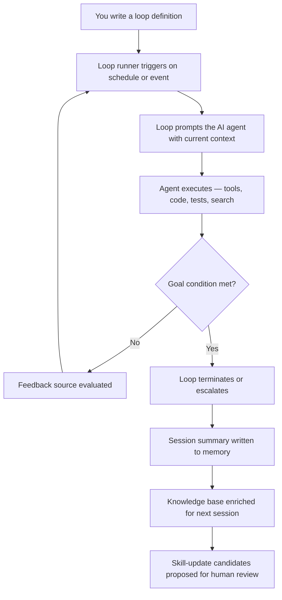

# 01 · Introduction

## What the prometheus-skill-pack is

The prometheus-skill-pack is a self-improving AI skill execution engine. It ships production-grade skills across eight language domains, a four-layer orchestration pipeline, a Karpathy-pattern knowledge-learning loop, a code-generation enrichment engine, a native-agent generator, and Cedar-governed self-optimization. It installs to ten AI tools. It runs the same durable state substrate underneath all of them.

That is the inventory. The premise is more important than the inventory.

The premise is that the loop, not the prompt, is your primary unit of work. Boris Cherny — who created Claude Code as a side project, watched it become the tool behind close to 4% of all public GitHub commits, and now runs it at Anthropic — put it plainly in mid-2026: *"I don't prompt Claude anymore. I have loops running. They're the ones that are prompting Claude and figuring out what to do. My job is to write loops."* He was not being provocative. He was reporting state. He manages fleets of agents — hundreds on a normal day, tens of thousands on a big one — and has not written a line of code by hand in months.

What Cherny described is not a feature. It is a design posture. And a posture, unlike a feature, has to be built into infrastructure before a team can adopt it. That infrastructure is what this skill pack is.

## Who it is for

This is built for teams deploying AI agents in production, where capability improvement has to be governed, audited, and reproducible. If you are running an agent unattended against a real codebase, three questions decide whether that is an asset or a liability:

- When the agent learns something on Monday, is that learning available on Wednesday?
- When the agent reflects on its own work, is anything stopping it from grading its own homework?
- When you change tools — from Claude Code to OpenCode, from Codex to Kimi — does the agent start over from zero?

The prometheus-skill-pack answers all three with the same word: no. Learning persists. Reflection is gated by a model that did not write the code. The substrate is shared across every tool. Those three properties are the reason the pack exists, and most of this documentation is about how they are implemented.

## The autonomy ladder

Autonomy is not binary. It is a ladder, and most teams are stuck on the same rung.

```
Level 0 — Manual prompt:    You type. The model responds. You type again.
Level 1 — Tool use:         The model calls tools. You approve or observe.
Level 2 — Agentic:          The model chains tool calls across a task. You watch.
Level 3 — Loop:             The loop prompts the model. The model works. The loop checks.
Level 4 — Self-improving:   The loop writes to memory. Next time, it knows what it learned.
```

Most teams in 2026 sit at Level 2. They call it agentic coding and they are impressed that the agent can run tests and fix its own errors. That is a real advance over manual prompting. It is also a ceiling. At Level 2, every session starts from the same baseline; the work is fast but it does not compound.

The prometheus-skill-pack is designed for Level 3 bleeding into Level 4. The difference between Level 2 and Level 3 is structural, not cosmetic. The difference between prompting an agent and running a loop is the difference between throwing a ball and designing a machine that throws balls on a schedule while you do something else. The output can look similar. The architecture is not.



A loop has exactly three structural requirements: a **trigger** (when does it fire?), a **termination condition** (how does it know when to stop?), and a **feedback source** (how does it evaluate progress?). Everything else in this system — the skills, the sandboxing, the MCP servers, the memory — exists to make those three components more accurate. That framing is worth holding onto, because it is the lens through which every other page in this guide makes sense.

## What you get over a bare loop

Claude Code's native loop primitives — `/loop`, `/goal`, `/schedule`, and the Agent View dashboard — are a genuine advance, and the skill pack builds on them rather than replacing them. But on their own they do not compound. Each run starts from the same baseline, the reflection at session end is evaluated by the same model that produced the work being reflected upon, and none of it crosses tool boundaries.

Here is the difference, stated as a scorecard.

| Capability | Bare `/loop` | `/loop` + prometheus-skill-pack |
|---|---|---|
| Repeating agent execution | Yes | Yes |
| Goal-conditioned termination | Yes (`/goal`) | Yes (+ `loop-tick.sh` feedback sources) |
| Worktree isolation | Yes | Yes (and portable across tools) |
| Cross-session memory | No | Yes (surreal-memory + prometheus-knowledge) |
| Context priming at loop start | No | Yes (bounded committed `pk context`) |
| Anti-sycophancy gate on reflection | No | Yes (`sycophancy-correction` MCP) |
| Cross-tool support | No (Claude Code only) | Yes (ten AI tools) |
| Self-hosted web extraction | No | Yes (Firecrawl, self-hostable) |
| Self-updating skills (human-gated) | No | Yes (`pmpo-skill-creator --update`) |
| Structured phase discipline | No | Yes (KBD: assess → analyze → plan → execute → reflect) |
| Periodic background KB enrichment | No | Yes (4-hour nudge agent) |
| Learning-log → skill-candidate pipeline | No | Yes (`evaluate-session` → `propose-skill-update`) |
| Progress signals across context windows | No | Yes (`position-reminder.txt` protocol) |

The structural difference is compounding. A bare loop runs at constant capability. A prometheus-skill-pack loop runs at increasing capability: each session writes to memory, each memory enriches the next session's context, each approved skill update makes the next loop turn more accurate. That is not a feature differential. It is a different answer to the question of what a loop is for.

## How to read the rest of this guide

The next three pages are the conceptual core. [Metaprompting, PMPO, and KBD](02-metaprompting-pmpo-kbd.md) grounds the methodology — these are Prometheus AGS terms, and using them without definition would make this guide useful only to insiders. [Loop Architecture](03-loop-architecture.md) is the mechanical heart: how the loops nest, terminate, and escalate. [The Four-Layer Pipeline](04-four-layer-pipeline.md) shows how a request flows from an under-specified idea to enriched, implemented code.

After that, the guide becomes a reference. Read the foundations once. Return to the catalog and the engine-room pages when you need a specific skill, tool, or script.

---

*Next: [02 · Metaprompting, PMPO, and KBD →](02-metaprompting-pmpo-kbd.md)*

*Sources for external claims on this page are collected in the [Glossary & Sources](23-glossary.md).*
