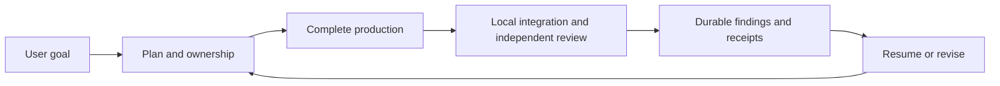

# 01 · Introduction

Prometheus Skill Pack supplies reusable skills, local KBD workflows, team definitions, hook delivery and optional learning/execution services. A workflow records its plan, task ownership and evidence so another session can resume deliberate work.

## What is shared

Skills and local workflow records can be used by supported harnesses. Installed discovery, hook support, model controls and permissions remain harness-specific. A generated definition is not proof of native activation. Team memory is delivered by owner and scope; Codex parent context receives a metadata digest so a fork does not inherit another role's private lesson text.

The full pack includes shell/Python helpers and optional native services. Mini supplies a Node-only subset for Windows, macOS and Linux. Companion separately owns connected control and synchronization. All three boundaries are explicit: the packs remain usable without Companion.

## Work as a loop

A useful loop has a trigger, a termination condition and an evidence source. It can plan work, assign ownership, produce an implementation and inspect the result. Learning can improve later context when publication and retrieval succeed; a loop does not automatically improve simply because it repeats.

```mermaid
flowchart LR
  Goal[User goal] --> Plan[Plan and ownership]
  Plan --> Work[Complete production]
  Work --> Gate[Local integration and independent review]
  Gate --> Evidence[Durable findings and receipts]
  Evidence --> Next[Resume or revise]
  Next --> Plan
```

Local KBD records workflow authority. Team task/handoff records describe responsibilities but do not grant permissions to another repository. Prometheus Exec adds a separate bounded operation and signed-receipt boundary when execution evidence is required. Knowledge/memory publication remains its own protocol.

## Choose your entry point

- [Quick Start](00-quick-start.md): install skills and begin a workflow.
- [Metaprompting, PMPO and KBD](02-metaprompting-pmpo-kbd.md): workflow concepts.
- [Loop Architecture](03-loop-architecture.md): nested loops and stopping conditions.
- [The Four-Layer Pipeline](04-four-layer-pipeline.md): production roles and responsibilities.
- [Agent Teams](24-agent-teams.md): native limits, handoffs, memory and model evidence.
- [Services, ownership and recovery](26-service-operations.md): optional components and platforms.
- [Dynamic Operations](/docs/execution/overview-and-use-cases): evidenced bounded execution.

Component versions and support follow their source manifests and release evidence. Reading this guide, building a binary or registering a service does not certify an installed machine.
