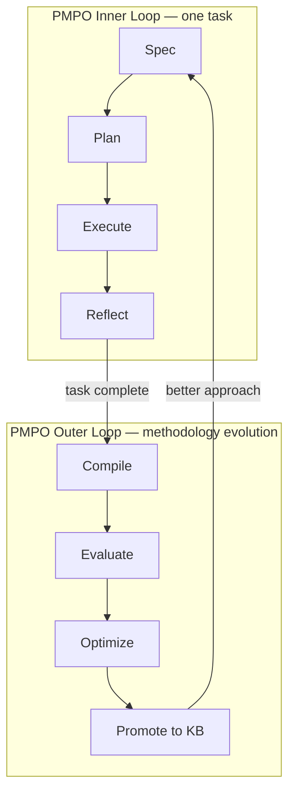
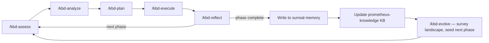

# 02 · Metaprompting, PMPO, and KBD

Before the loop architecture makes sense, the terminology needs grounding. KBD and PMPO are Prometheus AGS methodologies. They are not industry-standard terms. Using them without explanation is the kind of assumption that makes documentation useful only to people who already know the answer. This page defines all three concepts — metaprompting, PMPO, and KBD — and the theory that connects them.

## Metaprompting

Metaprompting is the practice of designing a *system of prompts* — rather than writing a single prompt — to produce more reliable, bounded, and evaluable agent behavior. Where a prompt tells a model what to do once, a metaprompt defines the routing, critique, cross-checking, and evaluation logic that governs *how the model is prompted over time*.

The distinction matters at scale. A single well-crafted prompt degrades as tasks grow complex: the model accumulates context drift, conflates phases, and eventually produces output that satisfies the surface request while missing the structural intent. A metaprompting system prevents that by separating the task — what to produce — from the orchestration — when to produce it, who checks it, and what happens when it fails.

This is now a well-established pattern in the research literature. Meta-prompting has been formalized as task-agnostic scaffolding that turns a single model into a "conductor" managing multiple expert instances of itself, and the use of a *separate* model as a critic — to provide structured feedback and act as a judge over outputs — is a standard technique in the self-improving-AI literature. Claude Code's `/goal` command is a direct instance of this: a separate, faster model checks whether the termination condition is met, rather than the model that did the work. The goal-checker is a meta-level prompt governing the primary agent.

That separation is the whole point. The model that wrote the code has an obvious structural bias toward believing the code is done. A critic that receives only the artifact and the condition — not the generation history — does not share that bias. Metaprompting is how you build that separation into the system instead of hoping for it.

## PMPO — Prometheus Meta-Prompting Orchestration

**PMPO** is the Prometheus AGS metaprompting methodology. It defines a two-loop cognitive architecture for agent-driven software development.

```
Inner loop (Task loop):       Spec → Plan → Execute → Reflect
Outer loop (Evolution loop):  Compile → Evaluate → Optimize → Promote
```

The inner loop governs a single development task. The outer loop governs the evolution of the methodology itself: it compiles what the inner loop produced, evaluates it against goals, optimizes the approach, and promotes lessons into the durable knowledge base.

PMPO's core architectural claim is that **phase discipline is the immune system of the recursive loop**. An agent allowed to reflect while still in execute mode will self-validate rather than surface deltas. An agent allowed to plan while still in assess mode will anchor on assumptions it never stress-tested. The hard phase boundaries are not procedural formality — they are the structural mechanism that prevents the loop from collapsing into a single-pass execution model dressed up as iteration.

The `sycophancy-correction` MCP server enforces this structurally at the most dangerous boundary: the reflect-phase output is checked for sycophantic patterns before it is logged, because a reflection that leads with what worked is not a reflection — it is a summary. Summaries do not improve loops. Deltas do. (The mechanics are on the [Sycophancy Correction](07-sycophancy-correction.md) page.)



## KBD — Knowledge-Based Development

**KBD** is the Prometheus AGS methodology for keeping domain knowledge and implementation in continuous alignment. It addresses the translation-loss problem: the gap between what a domain expert knows, what an AI agent understands, and what the code actually does. Each translation across that chain loses fidelity. KBD's job is to close the gap rather than let it widen with every session.

KBD has three mechanisms.

**1 · Knowledge base as session substrate.** Every development session starts with knowledge-base context priming and ends with knowledge-base enrichment. The agent never starts from zero. On the way in, `pk-focus-on-prompt.sh` pulls relevant prior context. On the way out, the session's learning is written back. The knowledge base is not a reference the agent occasionally consults — it is the ground the agent stands on.

**2 · Phase discipline via KBD skills.** Six KBD phases — assess, analyze, plan, execute, reflect, and (at the strategic layer) evolve — are enforced as hard boundaries. Each phase produces a specific artifact and a clean handoff to the next phase. No cross-phase contamination. The orchestrator that drives this is documented on the [Process & Orchestration Skills](09-process-skills.md) page.

**3 · Waypoint continuity.** The `.kbd-orchestrator/position-reminder.txt` protocol ensures that when a context window ends and a new session starts, the agent reads its exact position before doing anything else. The loop does not lose its place. This is the difference between "we ran a bunch of agents at this repository" and "we know exactly what state we left it in."

KBD is what you reach for when work spans multiple sessions, multiple phases, and multiple agents. It is the structure that prevents long-horizon work from dissolving into uncoordinated activity.



## How the three fit together

These are not three competing ideas. They are three levels of the same idea.

- **Metaprompting** is the general principle: orchestrate prompts, isolate the critic, separate task from evaluation.
- **PMPO** is the specific two-loop architecture that applies metaprompting to development work, with phase discipline as its load-bearing constraint.
- **KBD** is the inner-loop discipline that keeps knowledge and code aligned across sessions, implemented as the six phase skills plus the memory substrate.

The relationship is hierarchical. KBD executes a phase. The `iterative-evolver` — PMPO's outer loop made executable — decides which phase to execute next. PMPO is the methodology that governs both. The prometheus-skill-pack implements all three as executable skills, which is what distinguishes it from a collection of scripts. The scripts implement the methodology; the methodology is what makes the loop compound rather than merely repeat.

## The theory and principles behind the design

A handful of principles recur throughout the system. They are worth stating directly, because once you see them you will recognize them in every component.

**Critic-context isolation.** The model that evaluates work must not be the model that produced it, and must not see the generation history. This is why `/goal` uses a separate model, why the sycophancy gate receives only the reflection artifact, and why auto-applying skill updates is forbidden.

**Phase discipline as an immune system.** Hard boundaries between assess, plan, execute, and reflect prevent the most common failure mode of iterative agents — collapsing into a single pass that performs the *shape* of iteration without its substance.

**Bounded everything.** Every loop has a hard ceiling: maximum ticks, maximum iterations, maximum turns, maximum budget, maximum no-progress ticks. Even the elicitation primitive that researches unknowns is bounded (six sources, ten minutes). An unbounded loop is not autonomy; it is a runaway.

**Human gates at the architecture layer, autonomy at the execution layer.** Agents execute without interruption. Operators approve changes to the system that governs those agents — loop definitions, skill updates, knowledge-base promotions. (The full treatment is in [Loop Architecture](03-loop-architecture.md).)

**Graceful degradation.** Every component that depends on a service checks for it first and continues without it if it is absent. Memory features no-op when surreal-memory is unreachable. The sycophancy gate passes through when its binary is missing. The system never blocks on infrastructure it cannot reach.

**State is harness-agnostic; the loop body is harness-specific.** The durable on-disk state — `.kbd-orchestrator/`, `.evolver/`, `openspec/` — is identical no matter which AI tool is driving. You swap the driver and the cadence, never the state. This is what makes the pack genuinely cross-tool rather than cross-tool in name only.

Hold these six principles in mind. The rest of the guide is, in large part, the story of how they are enforced.

---

*Previous: [← 01 · Introduction](01-introduction.md) · Next: [03 · Loop Architecture →](03-loop-architecture.md)*
