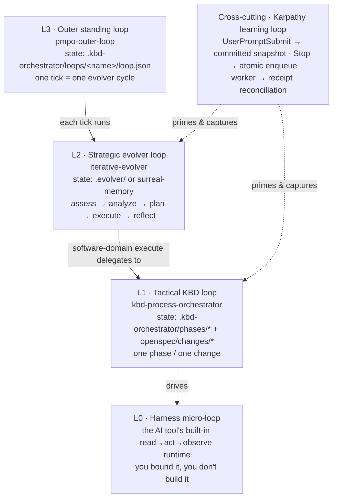
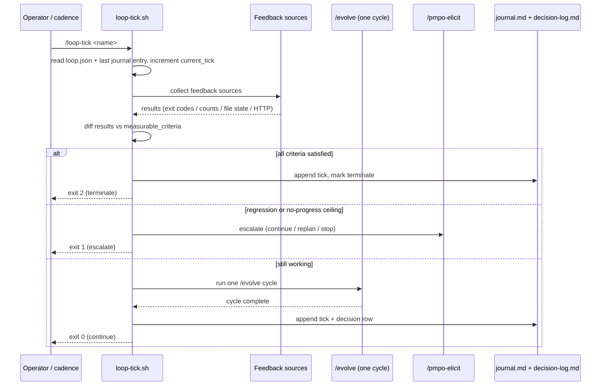
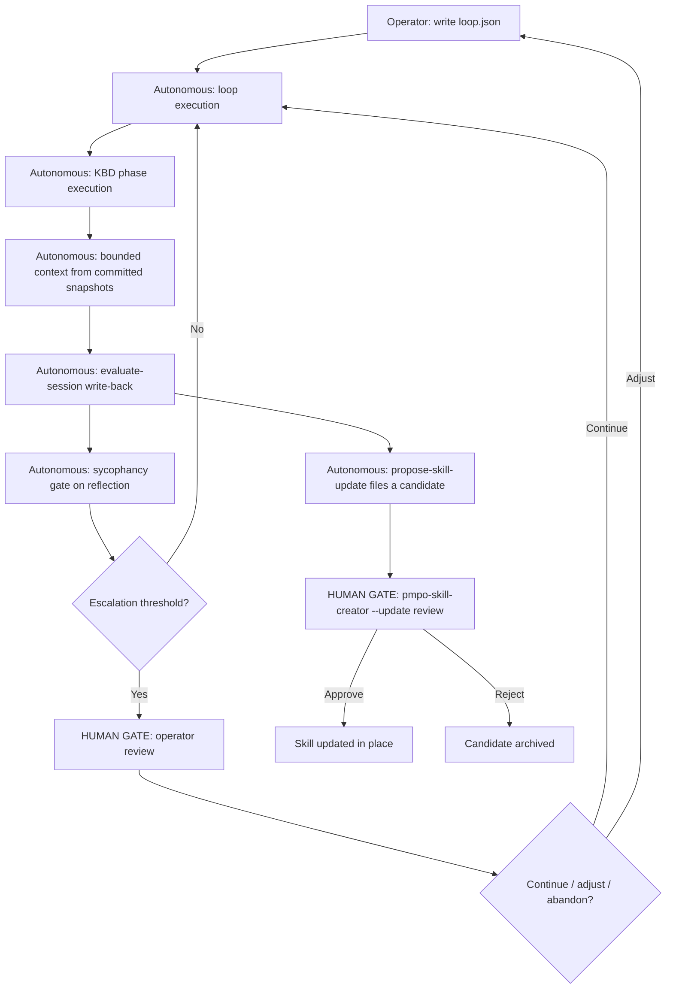

# 03 · Loop Architecture

The loop architecture is the mechanical heart of the system. This page is the most important reference in the guide, because nearly every failure mode of loop systems is the same mistake: using a construct from one level to do the job of another and wondering why the system does not compound over time. Get the levels right and the rest follows.

The governing idea is one sentence: **the loop body is harness-specific, but the loop state is harness-agnostic.** The same durable on-disk state runs under Claude Code with Opus 4.8, under OpenCode with GLM-5.2, and under Codex with GPT-5.5. Swap the driver and the cadence; never swap the state.

## The four loop levels

The architecture defines four levels, L0 through L3, plus one cross-cutting loop that runs orthogonal to all of them.



### L0 — the harness micro-loop

This is the AI tool's own built-in agent runtime: read context, act with a tool, observe the result, repeat. You do not build this loop; you bound it. The bounds are the tool's native knobs — `--max-turns`, the `/loop` interval, an effort setting, `--max-budget-usd`. Everything above L0 exists to give this micro-loop better context going in and stricter accountability coming out.

### L1 — the tactical KBD loop

Driven by the `kbd-process-orchestrator` skill. One turn through the loop is one KBD phase: assess → analyze → plan → execute → reflect, scoped to a single phase or change. Its state lives in `.kbd-orchestrator/phases/*` and, when the OpenSpec backend is active, `openspec/changes/*`. The execute backend can be `openspec`, a native tool, a hybrid, or manual.

The phases are hard-bounded, and that is the point. A plan produced during assess is contaminated by assumptions that were never stress-tested. A reflect that leads with what worked rather than what diverged is sycophantic by structure. The phase sequence exists to prevent both.

Child KBD skills are invoked by name from within a parent execution — the **nested loop** pattern. The parent loop manages phase transitions; child loops handle individual changes within a phase.

```bash
# Parent: executing a phase
/kbd-execute self-learning-loop-integration

# Inside, the executor spawns child invocations per change:
# Starting change 3 of 10: change-slli-003
# ... work happens ...
# Completed change 3 of 10: change-slli-003
```

### L2 — the strategic evolver loop

Driven by the `iterative-evolver` skill, PMPO's outer loop made executable. It manages goal-level coherence across multiple KBD phases: assess → analyze → plan → execute → reflect → persist, across any of eight domains (software, business, product, research, content, operations, compliance, generic). In the software domain, the execute phase delegates downward to the L1 KBD loop. Its state lives in `.evolver/` or, when reachable, surreal-memory. Its default termination targets are target-state alignment ≥ 90% and a maximum of five iterations.

### L3 — the outer standing loop

Driven by the `pmpo-outer-loop` skill. This is the level that most directly realizes Cherny's posture — "my job is to write loops." It is a thin wrapper over the evolver: **one tick equals one evolver cycle**. There is no new engine and no daemon. The loop is defined by a goal, a set of feedback sources, a termination contract, and a cadence. You define it once with `/loop-define`, advance it with `/loop-tick`, and inspect it with `/loop-report`.

### The cross-cutting Karpathy learning loop

Orthogonal to L0–L3 and always running: `UserPromptSubmit` calls the canonical dispatcher for bounded committed `pk context`; `Stop` atomically enqueues one metadata-only learning job; the supervised worker performs reflection, receipt reconciliation, and snapshot publication. The sycophancy gate remains part of review, outside the latency-sensitive hook path. This loop is what makes every other loop compound. It is documented in full on the [Memory and Learning](06-memory-and-learning.md) page.

## The loop definition — `loop.json`

`/loop-define <name>` writes `.kbd-orchestrator/loops/<name>/loop.json`. The schema is the contract for everything the outer loop does.

```json
{
  "name": "continuous-quality",
  "goal": {
    "description": "All failing tests resolved and no HIGH/CRITICAL sycophancy patterns in reflect output",
    "measurable_criteria": [
      "npm test exits 0",
      "sycophancy reflect score < 0.4"
    ]
  },
  "feedback_sources": [
    { "type": "command", "run": "npm test", "interpret": "exit-code" },
    { "type": "command", "run": "sycophancy-check-reflection.sh", "interpret": "exit-code" }
  ],
  "termination": {
    "max_ticks": 20,
    "goal_satisfied": true,
    "max_no_progress_ticks": 2,
    "budget": { "max_minutes_per_tick": 30 }
  },
  "escalation_points": [
    { "type": "threshold", "value": 3 }
  ],
  "cadence": { "mode": "background", "schedule": "interval:30m" },
  "evolution_name": "continuous-quality"
}
```

The required top-level fields are `name`, `goal`, `termination`, and `evolution_name` (the evolver key that backs the loop). The four feedback-source types are:

| Type | Source key | How it is interpreted |
|---|---|---|
| `command` | `run` | Shell command run via `eval`; interpreted by exit code |
| `gh-query` | `run` | GitHub state query; interpreted by exit code or count delta |
| `file` | `path` | Checked for existence and parsed |
| `url` | `fetch` | `curl` with a 10-second max-time; success on HTTP 2xx |

## The `loop-tick.sh` exit-code contract

`scripts/loop-tick.sh` is the runner that advances one tick. Its exit code is a contract — it is what separates a real loop from a `while true`. The loop does not decide it is done; the feedback sources decide.

| Exit code | Meaning |
|---|---|
| `0` | Continue — feedback not yet green, within thresholds; re-arm the cadence |
| `1` | Escalate — regression detected or `max_no_progress_ticks` exceeded; stop and notify the operator |
| `2` | Terminate successfully — goal satisfied, or already-terminal status, or `max_ticks` ceiling reached |
| `3` | Error — the runner itself failed |

> **A note on accuracy:** the prose in `docs/loops-architecture-spec.md` describes the contract as "0=continue, 1=escalate, 2=terminate." The script itself adds the `3=error` code. This guide documents the script's actual behavior.

A single tick does the following:



## Feedback, termination, and escalation

**Feedback** is evaluated every tick from the declared sources. The diff against `measurable_criteria` is what determines the next action.

**Termination** is bounded three ways: `goal_satisfied` (the success path), `max_ticks` (a hard ceiling, default 20, that terminates regardless), and `max_no_progress_ticks` (default 2, a stall detector that escalates rather than spinning).

**Escalation** routes through `/pmpo-elicit`, the elicitation primitive, which offers the operator a bounded set of choices — continue, re-plan, or stop. Escalation is triggered only at declared decision points: a regression in feedback, a stall, a ZeeSpec NO-GO, a capability gap that failed. This is not a limitation of the loop. It is the correct division of cognitive labor.

## The cadence options

The outer loop has no daemon of its own. Cadence is delegated to the host platform's primitives:

- **manual** — you run `/loop-tick <name>` yourself.
- **background** — a Claude Code background task runs `claude -p "/loop-tick <name>"` on an interval.
- **cron** — a scheduled cloud agent fires the tick on a calendar schedule.

This is deliberate. Building a bespoke scheduler would mean re-implementing, worse, what the host tools already do well.

## Autonomy: where the human gates are

Full autonomy is a spectrum, and the question is never "is this autonomous?" It is "at which decision points does the system require human input, and are those the right ones?" The prometheus-skill-pack takes a specific position: **autonomous at the execution layer, human-gated at the architecture layer.** Agents execute without interruption; operators approve changes to the system that governs those agents.

There are five gates, and each one is load-bearing.



1. **Loop definition.** The operator writes `loop.json`. What the loop tries to do, what counts as done, and what triggers escalation are human decisions.
2. **Skill updates.** Candidates are filed automatically but never applied automatically. Auto-applying a skill update is a structural sycophancy risk: the system rewriting its own instructions based on its own evaluation of its own output, with no adversarial review.
3. **Escalation handling.** When a tick exits `1`, the loop stops and notifies. The operator decides whether to resume, adjust, or abandon.
4. **Phase boundaries.** The KBD phases are hard-bounded; agents do not cross them autonomously. The position-reminder protocol lets the operator resume from any boundary.
5. **KB promotion.** Learning becomes knowledge-base-promoted only on operator confirmation. The knowledge base is the substrate for all future loops; a contaminated knowledge base corrupts them.

Everything else — execution within a phase, test fixing, error recovery, context priming, reflection writing, session-summary generation, the periodic nudge — runs autonomously.

## Progress signals across context windows

Long-horizon work outlives any single context window. The progress-signal protocol is the invariant that keeps it debuggable. The first tool call of every orchestration turn reads `.kbd-orchestrator/position-reminder.txt` (falling back to `current-waypoint.json`), so the agent restores its exact position before doing anything else. Every phase and task then emits start and completion signals:

```
Starting kbd-execute — self-learning-loop-integration (step 3 of 10)
Starting change 3 of 10: change-slli-003
Completed change 3 of 10: change-slli-003
Completed kbd-execute — self-learning-loop-integration (step 3 of 10)
```

This is not ceremony. It is what makes a loop resumable when the window that started it is long gone.

---

*Previous: [← 02 · Metaprompting, PMPO, and KBD](02-metaprompting-pmpo-kbd.md) · Next: [04 · The Four-Layer Pipeline →](04-four-layer-pipeline.md)*
