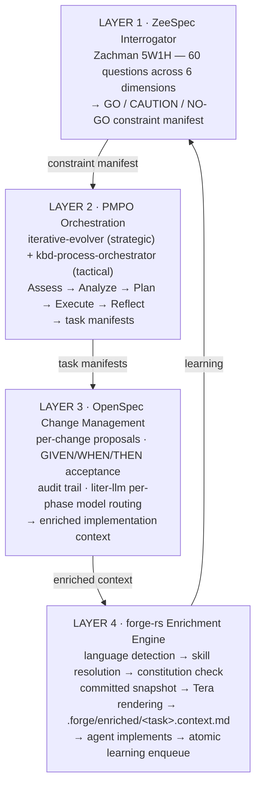
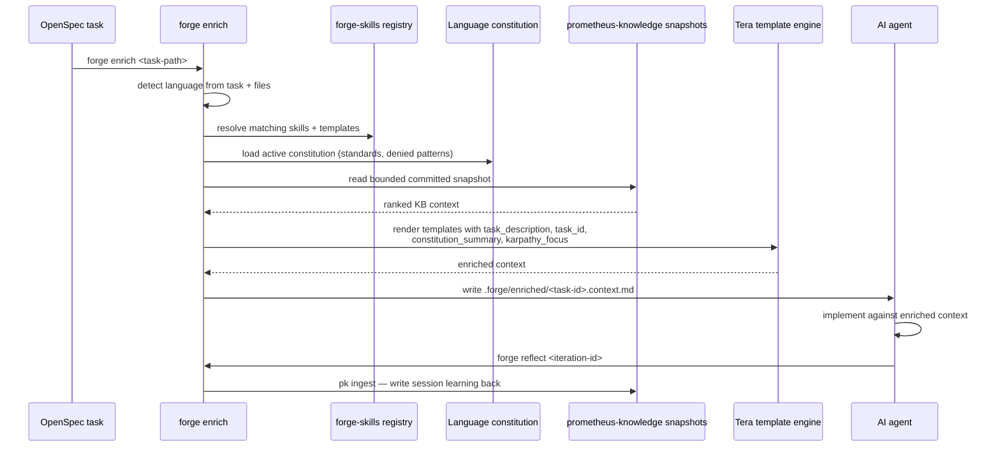
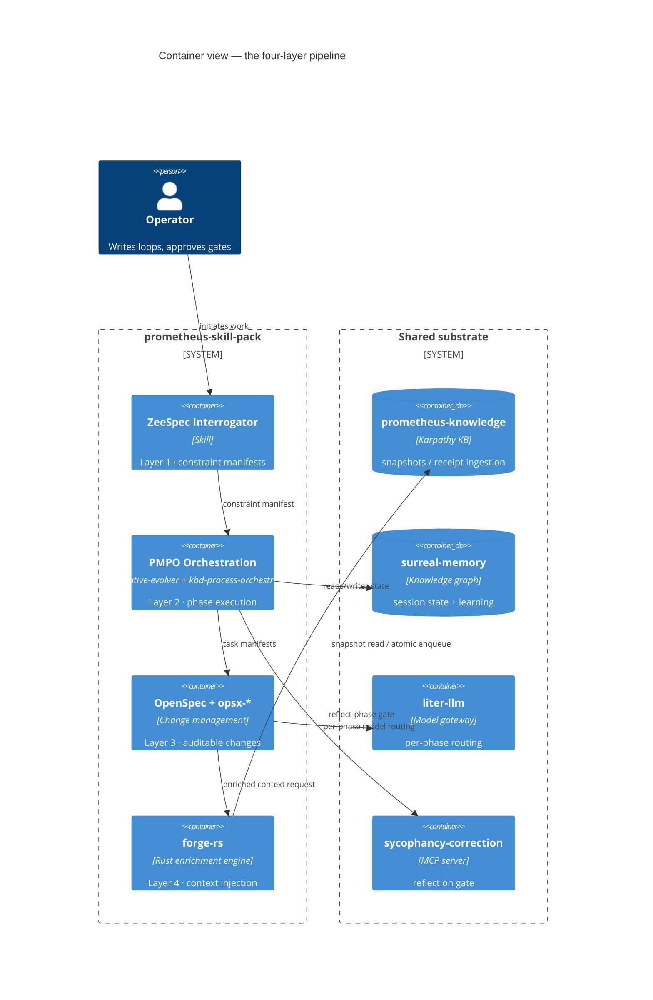

# 04 · The Four-Layer Pipeline

Where the [loop architecture](03-loop-architecture.md) describes how work *repeats*, the four-layer pipeline describes how a single unit of work *flows* — from an under-specified idea to enriched, implemented code. Every piece of work moves through four layers, and each layer feeds the next. The loops drive the pipeline; the pipeline is what the loops are driving.

The reason for four discrete layers is the same reason for the loop levels: each layer has a single responsibility, and blending responsibilities is how systems quietly fail. Layer 1 decides whether the work is even well-enough specified to start. Layer 2 decides what to do and in what order. Layer 3 manages the change as an auditable unit. Layer 4 injects the language-specific knowledge the agent needs the moment before it writes code.

## Layer 1 — ZeeSpec Interrogator

The pipeline begins with a question the rest of the industry skips: *is this work specified well enough to start?*

The `zeespec-interrogator` skill applies the Zachman Framework's 5W1H lens — **What, Where, Who, When, Why, How** — as sixty questions, ten per dimension. It scores the answers and produces a **constraint manifest** with a single recommendation: **GO**, **CAUTION**, or **NO-GO**. Coverage ≥ 85% is sufficient (GO); 60–84% is partial (CAUTION); below 60% is insufficient (NO-GO). Individual dimensions can override the aggregate — a Why score below 70% or a Who score below 65% will gate the work regardless of the total.

This is the metaprompting principle of bounded-everything applied at the front door. An under-specified task handed to an autonomous loop does not fail loudly; it fails by producing something plausible and wrong. The interrogator makes the under-specification visible before any tokens are spent on implementation. It is invoked standalone via `/zeespec-interrogate "<subject>"`, and automatically by the orchestrators when spec coverage falls below threshold.

## Layer 2 — PMPO Orchestration

With a constraint manifest in hand, Layer 2 decides what to do. This is the PMPO loop running at two granularities at once: the strategic `iterative-evolver` (L2 in the loop hierarchy) deciding *which* phases to run, and the tactical `kbd-process-orchestrator` (L1) executing each phase as assess → analyze → plan → execute → reflect.

The handoff between them is mediated by a small, important file: `evolver-bridge.json`. When a KBD phase completes a change, it appends a record — change ID, the evolution item it satisfied, and status — to that file. The evolver reads it back during reflect to know which of its evolution goals actually landed. That single file is what lets the strategic loop and the tactical loop stay coherent without either one having to understand the other's internal state.

Layer 2's output is a set of task manifests: concrete, ordered units of work with acceptance criteria, ready to be managed as changes.

## Layer 3 — OpenSpec Change Management

Layer 3 turns each task into an auditable change. Every change gets a proposal with GIVEN/WHEN/THEN acceptance criteria, a documentation trail scoped to that change, and a lifecycle managed through the OpenSpec command set: `/opsx-new` creates the change, `/opsx-continue` advances to the next ready artifact, `/opsx-verify` validates, `/opsx-apply` applies the spec deltas, and `/opsx-archive` retires it. In the KBD orchestrator, `/kbd-apply` wraps the OpenSpec apply one task at a time so the loop advances a single artifact per tick.

This is also where `liter-llm` does per-phase model routing: assess, analyze, plan, and reflect run on a frontier model; execute runs on a tiered selection; status runs on a small, cheap model. The expensive reasoning happens only where reasoning is expensive. (See [Tools Reference](13-tools-reference.md) for the routing detail.)

## Layer 4 — forge-rs, the enrichment engine

Layer 4 is where the system's distinctive idea lives. `forge-rs` sits between an OpenSpec task and the agent that will implement it, and it injects language-specific knowledge *before the agent touches any code*.

The enrichment sequence is mechanical and fast:

The four Tera template variables are the seams where knowledge enters:
`task_description` and `task_id` come from the OpenSpec task;
`constitution_summary` is the active language constitution's standards; and
`karpathy_focus` is bounded context from the committed snapshot. The result is
a single enriched context file. After implementation, the Stop hook atomically
enqueues learning and the worker publishes a new immutable snapshot only after
receipt reconciliation.

## The pipeline as a system

Seen as one system, the four layers map cleanly onto the components documented elsewhere in this guide.

A request enters at Layer 1 and is refused if it is not specified well enough to proceed. It is planned and sequenced at Layer 2. It is managed as an auditable change at Layer 3. It is enriched with exactly the right language knowledge at Layer 4, implemented, and reflected upon — and the reflection feeds the knowledge base that primes the next request. The loops keep this cycle turning; the substrate keeps it compounding.

---

*Previous: [← 03 · Loop Architecture](03-loop-architecture.md) · Next: [05 · The MCP Server Substrate →](05-mcp-substrate.md)*
