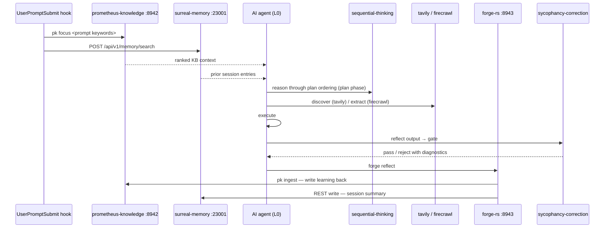
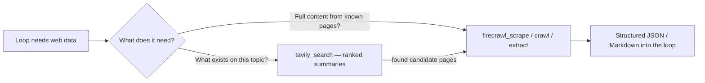

# 05 · The MCP Server Substrate

The eight MCP servers installed by the prometheus-skill-pack are not tools bolted onto the loop. They are the connective tissue that makes the loop coherent across sessions, across tools, and across time. Each runs as a service — the HTTP-based ones as macOS `launchd` agents, the stdio-based ones on-demand through the MCP client — and all are addressable by any AI tool configured to reach them.

This shared addressability is the whole reason the architecture is cross-tool. When OpenCode or Codex runs the loop instead of Claude Code, it connects to the *same* surreal-memory server, reads the *same* knowledge-base context, and writes the *same* session summaries. The substrate is shared even when the agent client changes.

## The canonical port table

`scripts/mcp-port-table.json` is the declared source of truth for MCP connectivity. `configure-mcp-all-tools.sh` merges these entries into each tool's native config.

| Server | Transport | Endpoint / command | Port | Role in the loop |
|---|---|---|---|---|
| **surreal-memory** | SSE / HTTP | `http://localhost:23001/mcp/sse` | 23001 | Semantic knowledge graph. Session learning writes here; loop start reads here. The memory substrate. |
| **prometheus-knowledge** (`pk-cherry`) | SSE / HTTP | `http://localhost:8942/mcp` | 8942 | Karpathy-pattern flat-file knowledge base. `pk focus` primes the loop with relevant context before execution. |
| **forge-rs** | SSE / HTTP | `http://localhost:8943/mcp` | 8943 | Code-enrichment engine. `forge reflect` writes reflection output; `pk ingest` writes session summaries back. |
| **sycophancy-correction** | stdio | `sycophancy-correction --config skill.toml` | — | Structural quality gate. The reflector hook calls it before any reflection is logged. |
| **liter-llm** | stdio | `liter-llm mcp --transport stdio` | — | Multi-provider LLM gateway (140+ providers). Per-phase model routing without per-loop key management. |
| **sequential-thinking** | stdio | `npx -y @modelcontextprotocol/server-sequential-thinking` | — | Structured reasoning for multi-step loop planning. Used during plan to reason through change ordering. |
| **tavily** | stdio | `npx -y` tavily MCP (env `TAVILY_API_KEY`) | — | Search-first web access inside loops. Ranked, summarized results. |
| **firecrawl** | stdio | `npx -y firecrawl-mcp` (env `FIRECRAWL_API_URL`, `FIRECRAWL_API_KEY`) | — | Extraction-first web access. Scrape, crawl, map, extract, search, interact. Self-hostable. |

> **A note on accuracy.** Two MCP config sources exist in the repository and they are not byte-identical. `.mcp.json` (the Claude Code plugin manifest) currently lists seven servers and omits firecrawl, and its `tavily`/`sequential-thinking` package names differ from those in `mcp-port-table.json`. The port table is the broader source of truth and includes firecrawl; treat it as canonical and expect `configure-mcp-all-tools.sh` to be the reconciling installer. The stdio servers (sycophancy-correction, liter-llm) have no network port by design.

## How the servers participate in a single loop turn

The servers are not consulted ad hoc. They participate at fixed points in the loop, which is what makes their behavior predictable.



The detail of the memory write-back chain is on the [Memory and Learning](06-memory-and-learning.md) page; the reflection gate is on the [Sycophancy Correction](07-sycophancy-correction.md) page. What matters here is the shape: read at the start, reason and act in the middle, gate and write at the end.

## Firecrawl vs. Tavily — not interchangeable

Both Firecrawl and Tavily give a loop web access, but they solve different parts of the problem, and using them interchangeably produces the wrong tool for each job.

**Tavily is search-first.** It fans out to multiple sources, ranks results, and returns synthesized, LLM-optimized summaries. For loops that need to know *what exists* on a topic — issue research, technology scouting, competitive landscape — Tavily is the right reach. The trade-off is that it returns snippets and summaries, not full page content, and it is hosted-only with no self-host option.

**Firecrawl is extraction-first.** It returns clean Markdown of full web pages and runs the whole Find → Extract → Clean → Use workflow in one API: scrape, crawl, map, structured `extract`, search, and interactive actions (click, scroll, form submission). For loops that need to pull full page content, parse documentation sites, or interact with dynamic UIs, Firecrawl is the correct substrate. Independent 2026 benchmarks put Firecrawl's coverage ahead of Tavily's (roughly 77% vs. 68%), and at high volume it is dramatically cheaper.

The architecture decision is simple: **Tavily for discovery, Firecrawl for extraction.** A loop that needs to find relevant pages and then pull structured data from them uses both in sequence.



### Self-hosting Firecrawl

Firecrawl's engine is AGPL-3.0 and can run as a self-hosted Docker service. For loops operating against internal documentation, private repositories, or air-gapped environments, self-hosting is the only viable option, because web data never transits a third-party service. The AGPL license carries an obligation — modify and redistribute the engine and you must release your changes — and the operational footprint is non-trivial (Postgres, Redis, workers). Tavily has no self-hosted option. Point the firecrawl MCP server at a local instance by setting `FIRECRAWL_API_URL` to the local endpoint rather than the cloud API.

## Bringing the servers up

The HTTP servers run as persistent background services; the stdio servers are invoked on demand by the MCP client.

```bash
# Build and install all local binaries (forge, pk, pk-cherry, liter-llm, surreal-memory-server, ...)
bash scripts/check-prerequisites.sh --build-tools

# macOS: render LaunchAgents and start the HTTP MCP services
bash scripts/install-mcp-services.sh
bash scripts/prometheus-services.sh load
bash scripts/prometheus-services.sh status

# Configure all servers into every installed AI tool's native config
bash scripts/configure-mcp-all-tools.sh

# Health check — launchctl state + HTTP probe for each service
bash scripts/check-mcp-health.sh
```

On macOS the `launchd` agents manage `pk-cherry` on `127.0.0.1:8942` and `forge mcp` on `127.0.0.1:8943`; surreal-memory remains Docker-managed on `127.0.0.1:23001` and the service script reports only whether that port is ready. On Linux, use systemd user services or cron-style scheduled jobs in place of LaunchAgents. Full installation detail is on the [Installation](19-installation.md) page.

Graceful degradation is built in everywhere. Every script that depends on one of these servers checks for it first and continues without it if it is absent — memory features no-op when surreal-memory is unreachable, the sycophancy gate passes through when its binary is missing, and `pk focus` silently does nothing when `pk` is not installed. The loop never blocks on infrastructure it cannot reach.

---

*Previous: [← 04 · The Four-Layer Pipeline](04-four-layer-pipeline.md) · Next: [06 · Memory and Karpathy-Pattern Learning →](06-memory-and-learning.md)*
