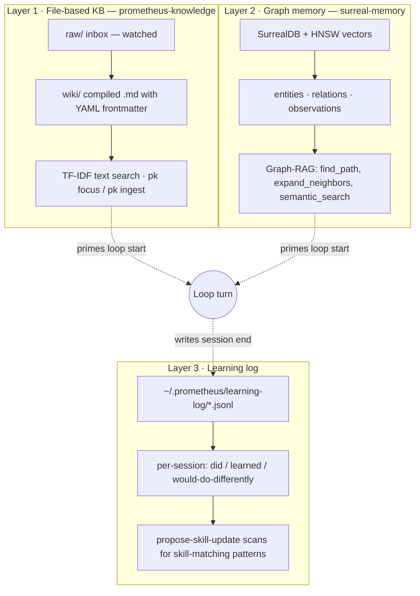
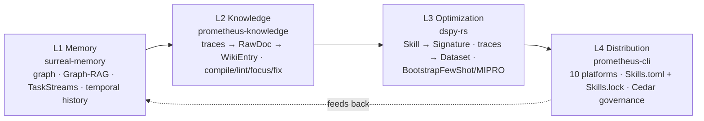

# 06 · Memory and Karpathy-Pattern Learning

A loop that forgets is a very fast way to do the same thing many times. A loop that remembers gets better at the task it was built to do. The difference between those two is the memory architecture, and this page documents it in full — the three storage layers, the four-layer self-learning engine that sits on top of them, and the exact write-back sequence that runs at the end of every session.

## The Karpathy pattern

Andrej Karpathy's flat-file knowledge-base pattern is the epistemic substrate of the system. The idea is to skip retrieval infrastructure entirely: store knowledge as plain Markdown files, treat those files as the source of truth, and let a long-context model reason over them directly. It is reportedly far more efficient than vector RAG for knowledge of this scale, and — more importantly for an audited production system — it avoids the black-box problem of embeddings. Every claim the system makes can be traced back to a specific `.md` file a human can read, edit, or delete.

The crucial inversion in the pattern: instead of *you* maintaining a knowledge base and occasionally asking the AI about it, *the AI* builds and maintains the knowledge base for you. The knowledge base is not a database of facts. It is a growing substrate of what the system has learned about how to work. The same lineage shows up in the Rust toolchain — the `karpathy-tokenizer` skill builds GPT-style BPE tokenizers following Karpathy's `minbpe` approach (see [Language & Domain Skills](10-language-skills.md)).

## The three storage layers



**Layer 1 — the file-based KB (`prometheus-knowledge`).** The Karpathy-pattern flat-file wiki. Human-readable, version-controlled, queryable. A `raw/` inbox is watched (via FSEvents/inotify); a librarian compiles raw documents into `wiki/` entries — Markdown with YAML frontmatter (id, title, tags, links, sources, timestamps, revision). Search is TF-IDF over the text; there is no vector database. This is the primary substrate for context priming, queried by `pk focus`. Every session that produces a keepable learning writes to it via `pk ingest`.

**Layer 2 — the graph memory (`surreal-memory`).** The semantic knowledge graph: SurrealDB with HNSW vector indexing. It stores *relationships* between concepts, not just facts, so the loop can reason about what it knows rather than only retrieve it. Writes go through `POST /api/v1/memory` — plain REST, available to any shell script, not just MCP clients — and reads through `POST /api/v1/memory/search`. The MCP surface is broad: knowledge-graph tools (`create_entity`, `create_relation`, `semantic_search`), Graph-RAG traversal (`find_path`, `expand_neighbors`, `get_related`), mem0-compatible scoped memory, TaskStreams, TaskSteps, Mindmaps, and an optional Memory Palace. (Full tool inventory in [Tools Reference](13-tools-reference.md).)

**Layer 3 — the learning log (`~/.prometheus/learning-log/`).** Session-level JSONL written by `evaluate-session.sh` when the executor subagent stops. Each entry records what the session did, what it learned, and what it would do differently. `propose-skill-update.sh` reads these entries, identifies patterns that match an installed skill, and files a candidate to `~/.prometheus/skill-updates/` — a candidate, never an applied change.

## The self-learning engine — four layers

The three storage layers feed a four-layer self-improving engine (a Hermes/GEPA-style architecture). This is the structure documented in `shared/references/self-learning-architecture.md`.



The loop runs EXECUTE → EVALUATE → COMPILE → OPTIMIZE → DISTRIBUTE. Crucially, skill mutation is governed: the **Cedar Skill-Mutation PEP** is default-deny and gates the operations `skill.mutate`, `skill.generate`, `skill.promote`, and `trace.capture` per environment (development, staging, production). The system can learn, but it cannot rewrite its own skills in production without passing policy. The optimization layer (`dspy-rs`) treats a skill as a DSPy signature and its captured traces as a dataset, then runs few-shot/MIPRO optimization — but the result is a *candidate*, subject to the same human gate described in [Loop Architecture](03-loop-architecture.md).

## The session write-back sequence

The order of the Stop-hook chain is a correctness constraint, not a convenience. It runs in this exact order:

```bash
# 1 · write-session-summary.sh runs FIRST — everything downstream reads its output
write-session-summary.sh → ~/.prometheus/last-session-summary.txt

# 2 · forge-reflect-on-stop.sh reads the summary, reflects, and ingests to the KB
forge-reflect-on-stop.sh → forge reflect (if .forge/iterations exists) else pk ingest < summary

# 3 · evaluate-session.sh writes structured learning (SubagentStop[executor])
evaluate-session.sh → ~/.prometheus/learning-log/<date>.jsonl + surreal-memory REST

# 4 · propose-skill-update.sh scans the learning log for skill-matching patterns
propose-skill-update.sh → ~/.prometheus/skill-updates/  (candidate only — never applied)
```

A periodic nudge keeps the knowledge base warm between sessions. `scripts/scheduled/periodic-nudge.sh` runs every four hours as a `launchd` agent (`ai.prometheus.prometheus-nudge`), POSTs a heartbeat to surreal-memory's REST API after checking `/health`, and silently no-ops when the server is unreachable. The effect is that what was learned in the morning session is available to the afternoon session even if no one manually triggered enrichment.

## What compounding actually looks like

This is the structural question that separates loop engineering from loop marketing. Here is the concrete mechanism, traced across three sessions and two repositories.

1. **Session N** runs the auth-module loop. Tests fail. The agent fixes them. The session summary notes the failure was a missing Redis-client mock in the test environment.
2. `evaluate-session.sh` writes this to the learning log, tagged to the auth module.
3. `propose-skill-update.sh` detects that the pattern — "Redis mock missing in test setup" — matches the `testing` skill's known failure modes and files a candidate.
4. In **session N+1**, `pk-focus-on-prompt.sh` retrieves that learning-log entry as part of context priming.
5. The agent starts session N+1 already knowing about the Redis mock issue. It does not reproduce the failure.
6. The operator reviews the candidate and approves it with `pmpo-skill-creator --update testing`. The `testing` skill now includes Redis-mock setup as a first-class step.
7. In **session N+2**, on a *different repository with a different operator*, the `testing` skill carries the Redis-mock learning. The failure does not happen there either.

That is cross-session learning compounding at the structural level. Not magic. Not emergent. Engineered — and, at the one step that rewrites the system's own instructions, human-gated.

## Where the data lives

| Path | Contents |
|---|---|
| `~/.prometheus/knowledge/{shared,project}/` | The Karpathy KB (`raw/`, `wiki/`, `wiki/.index`) |
| `~/.prometheus/learning-log/*.jsonl` | Per-session structured learning |
| `~/.prometheus/skill-updates/` | Pending skill-update candidates (human review) |
| `~/.prometheus/last-session-summary.txt` | The most recent session summary |
| `~/.prometheus/traces/<skill>/<timestamp>.json` | Execution traces (written by the `prometheus-learn` crate) |
| `.prometheus/` (project) + surreal-memory tables | Project-scoped state and graph memory |

KB scope resolves in priority order: an explicit `--kb-dir`/`PK_KB_DIR`, then the shared scope, then the project scope, then the global scope. Memory degrades gracefully at every layer — if surreal-memory is down, the file-based KB still primes context; if `pk` is absent, the loop still runs. Nothing here is load-bearing in a way that takes the loop down when a service is missing.

---

*Previous: [← 05 · The MCP Server Substrate](05-mcp-substrate.md) · Next: [07 · Sycophancy Correction →](07-sycophancy-correction.md)*
