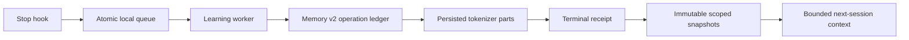

# 06 · Deterministic Memory and Learning

The learning pipeline separates fast local publication from durable remote acknowledgement. Stop hooks atomically enqueue work and return. A supervised worker extracts learning, submits stable v2 operation IDs, reconciles exact receipts, and publishes immutable project, shared, and global prompt snapshots.

## Runtime flow

```mermaid
flowchart LR
  Hook["Stop hook"] --> Queue["Atomic local queue"]
  Queue --> Worker["Learning worker"]
  Worker --> Ledger["Memory v2 operation ledger"]
  Ledger --> Parts["Persisted tokenizer parts"]
  Parts --> Receipt["Terminal receipt"]
  Receipt --> Snapshots["Immutable scoped snapshots"]
  Snapshots --> Prompt["Bounded next-session context"]
```

The hook performs no inference, network request, inline remote persistence, or service-manager work. Queue states make uncertainty explicit. Learning records move through `pending → processing → completed | rejected`; memory delivery moves through `pending → submitting → accepted → completed | rejected`.

## Durable Memory v2

New writes use `POST /api/v2/operations`. A request contains a caller-generated `operation_id`, schema version, operation kind, dependencies, canonical payload hash, and payload. `202` proves durable acceptance. Only `committed` or `rejected` is terminal.

After response loss, callers GET the receipt by ID or resume ordered SSE events. Reusing the same ID and hash returns the exact stored receipt. Reusing the ID with another hash returns `409` and preserves the original operation.

Long logical memories are planned using the active tokenizer. Each part and embedding state is persisted. Executor restart reuses the plan, skips indexed parts, and commits one logical memory only after every part validates.

## Immutable knowledge snapshots

Project, shared, and global scope publish independently. Each writer stages and validates a content-addressed generation, then atomically advances `current`. Prompt assembly reads a bounded, deterministic selection from one complete generation per scope.

## Health and recovery

`/health` proves process liveness. `/ready` proves whether the durable ledger can ingest operations and reports model/search warm-up separately. Wall-clock time and attempt counters never prove success; receipts and ordered events do.

Queue backlog is judged by age, not by presence. `prometheus doctor` (`learning.queue`) treats a memory record as healthy while it is younger than `PROMETHEUS_LEARNING_STALE_AFTER` (default 6h) and only warns once it is older. A warning is advisory and never fails the run. Restarting services does not clear it; use `prometheus-learning-worker quarantine --older-than 6h [--dry-run]` to move stale records to `memory/stalled`, `prometheus-learning-worker release --all` to return them, or the memory server's `POST /api/v2/operations/{id}/retry` and `/reject` for a single operation.

## Scoped recall and Codex policy

Team hooks deliver owner-scoped lessons; Codex parent SessionStart assembles only local team digest metadata before any lesson-source merge. Final guards require a digest kind/channel and the selected team digest scope. Role recall and Claude lead recall follow their own audience contracts. See [team memory](24-agent-teams.md#keep-lessons-scoped-to-their-audience) and [memory tiers](memory-tiers.md).

The direct role writer is distinct from the supervised Stop queue: it records the durable primary lesson and may start a bounded optional Cortex mirror. Saturation/unavailable Cortex does not discard the primary record; mirror launch is not remote acknowledgement.

Codex's startup feature gate controls consolidation. The helper sets `features.memories=false`, `memories.generate_memories=false` and `memories.use_memories=false`, overriding the old generation-only policy. It archives only `memories/memory_summary.md` and sibling `memories_v2/memory_summary.md` into distinguishable collision-safe archives. Other memory files and databases remain intact.

The helper validates TOML before replacing it, preserves unrelated text/comments, backs up recoverably and fails explicitly on unsupported target syntax. `--check` is read-only. The full installer calls it at the effective Codex home even for a new config. Doctor checks all three flags and both summary paths, and offers an absolute remediation command only after installed-helper provenance verifies. Profiles, CLI overrides and in-flight sessions can retain different effective configuration; restart into a new session after a reviewed change. This page does not claim a machine fix was applied.

Canonical documentation:

- [Memory overview](/docs/memory/overview)
- [Operation API](/docs/memory/operation-api)
- [Executor and recovery](/docs/memory/executor-and-recovery)
- [Snapshots and bounded context](/docs/knowledge-learning/snapshots-and-context)
- [Hooks, worker, queues, and receipts](/docs/knowledge-learning/hooks-worker-and-receipts)

---

*Previous: [← 05 · The MCP Server Substrate](05-mcp-substrate.md) · Next: [07 · Sycophancy Correction →](07-sycophancy-correction.md)*
