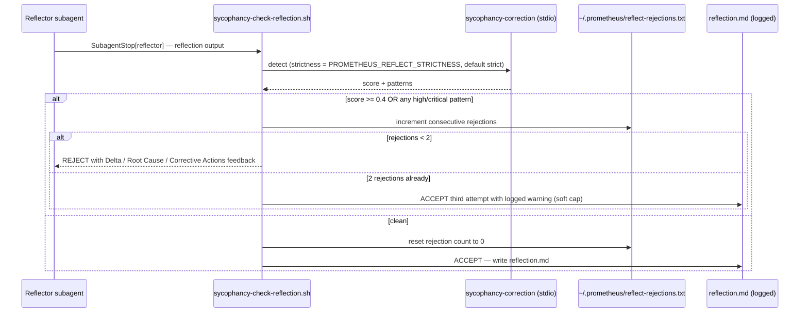

# 07 · Sycophancy Correction

This is the component that keeps the self-improving loop honest. Without it, a system that learns from its own reflections degrades: the agent grades its own homework, decides it did well, and writes that flattering judgment into the substrate that primes the next session. The sycophancy-correction skill breaks that loop structurally. It deserves a chapter of its own, and this is it.

## The problem it solves

A reflection that leads with what worked is not a reflection. It is a summary. Summaries do not improve loops; deltas do. But an agent reflecting on its own output has a built-in bias toward self-validation — the same model that produced the work is now judging whether the work was good. Left unchecked, that bias makes the loop believe it did better than it did, which corrupts the next iteration's planning assumptions. The corruption compounds, because the memory architecture is designed to carry learning forward.

The fix is the metaprompting principle of critic-context isolation, applied structurally: the reflect-phase output is checked for sycophantic patterns *before* it is logged, by a contract that does not care how good the agent felt about the work.

## What it is

`sycophancy-correction` is an AgentSkills.io-compliant skill distributed as a **Rust MCP server binary**, with Claude Code plugin and marketplace support. It is version `1.0.0`, MIT-licensed, authored by Prometheus AGS, skill id `sycophancy.correction`, PMPO-compliant and UAR-compatible. It is built from two crates:

- `crates/sycophancy-core` — detection, correction, hooks, and PMPO orchestration (the domain logic).
- `crates/sycophancy-mcp` — the MCP server and tool boundary (the transport).

It is a **stdio MCP server** — there is no network port. Diagnostics go to stderr only. It supports Cedar governance and a priority-ordered hook chain.

## The eight patterns (S-01 – S-08)

Detection classifies content against eight canonical patterns, each with a default severity. These are the patterns confirmed by the server's own `skill_info` tool.

| Pattern | Name | Default severity | What it catches |
|---|---|---|---|
| **S-01** | Unprompted Affirmation | Medium | Praise no one asked for ("Great question!") |
| **S-02** | Agreement Without Grounding | High | Agreeing with a premise without evidence |
| **S-03** | Caveat Collapse | Critical | Dropping necessary qualifications to sound confident |
| **S-04** | Self-Rationalization | Critical | Justifying a prior decision instead of evaluating it |
| **S-05** | Context Bleed Alignment | High | Drifting toward what earlier turns implied was wanted |
| **S-06** | Confidence Without Basis | Medium | Asserting certainty the artifact does not support |
| **S-07** | Scope Creep Flattery | Low | Padding scope to seem more helpful |
| **S-08** | Reflect Phase Inversion | High | Leading a reflection with success instead of delta |

S-03, S-04, and S-08 are the ones that matter most for a self-improving loop: collapsing caveats, rationalizing past choices, and inverting the reflect phase are precisely the failures that corrupt the knowledge base.

## The four MCP tools

| Tool | Purpose |
|---|---|
| `detect_sycophancy` | Score content `0.0`–`1.0`, classify patterns with severity and rationale, return an audit trail. Read-only. |
| `correct_sycophancy` | Detect and rewrite in one call. Returns the corrected artifact and a delta summary of what changed and why. |
| `analyze_reflect_phase` | A PMPO Reflect specialist — enforces the **Delta → Root Cause → Corrective Actions** structure. |
| `skill_info` | Returns the pattern library, modes, strictness levels, and capability metadata. No arguments. |

## Modes and strictness

**Modes** (in increasing force):

- `detect_only` — score and classify; change nothing.
- `annotate` — flag patterns inline without rewriting.
- `rewrite` — correct the text.
- `full_restructure` — rebuild the artifact's architecture; runs a second validation pass. Use this for agent descriptors and pipeline configs.

**Strictness levels** exposed by the server: `permissive`, `standard`, `strict`.

The parent `CLAUDE.md` references a longer set — `loose`, `permissive`, `standard`, `strict`, `adversarial` — set via `PROMETHEUS_REFLECT_STRICTNESS`. Those are the *reflector-gate hook's* mapping onto this server (`loose` maps to permissive, `adversarial` maps to strict), not enums defined inside the skill itself. The gate defaults to `strict`.

## Configuration — `skill.toml`

The server reads its thresholds from `skill.toml`:

| Section | Key | Default | Meaning |
|---|---|---|---|
| detection | `divergence_threshold` | `0.35` | Sensitivity for divergence checks |
| detection | `sample_n` | `3` | Critic samples per evaluation |
| detection | `sample_temperature` | `0.7` | Sampling temperature for the critic |
| correction | `mandatory_correction_threshold` | `0.6` | At/above this score, correction is required |
| correction | `max_passes` | `2` | Maximum rewrite passes |
| correction | `clean_threshold` | `0.10` | At/below this score, the artifact is considered clean |
| correction | `critic_model` / `rewrite_model` | `claude-sonnet-4-6` | Models used for critique and rewrite |
| hooks | built-in | `tracing_hook`, `audit_hook` | External hooks via `libloading` are a future capability |
| validation | contract | `strict` | The validation contract |

> **A note on accuracy.** The Anthropic client in the current `1.0.0` release is stubbed — the live, deterministic behaviors are pattern detection and contract validation; full LLM-backed rewrite is wired but depends on a configured `ANTHROPIC_API_KEY` and model client. This is exactly the kind of detail official documentation should state plainly rather than imply otherwise.

## The reflection gate in the loop

The gate is wired through hooks at two points (see [Hooks & Lifecycle](15-hooks-and-lifecycle.md) for the full chain):



A reflection is rejected if it scores ≥ 0.4 or contains any high/critical pattern. The rejection comes with actionable feedback explaining what is missing — specifically, that a passing reflection must name concrete gaps between plan and delivery, state root causes, and provide corrective actions. A **two-rejection soft cap** prevents infinite loops: after two consecutive rejections the third attempt is accepted with a logged warning, and the count resets to zero on any passing reflection. State lives in `~/.prometheus/reflect-rejections.txt`. When the binary is absent, the hook logs a warning and exits 0 — graceful degradation, never a hard block.

A parallel gate, `sycophancy-check-artifact.sh`, runs on `PostToolUse(Write|Edit)` for `**/reflection.md` and `**/assessment.md`, blocking the write (exit 2) with the same Delta/Root-Cause/Corrective-Actions feedback and setting `reflect_gate=rejected` in the phase `progress.json`, with the same two-rejection cap.

## Using it directly

Beyond the automatic gate, the server is available as four MCP tools and through the `prometheus` CLI:

```bash
# Via the prometheus CLI
prometheus sycophancy detect  reflection.md --strictness strict
prometheus sycophancy score   reflection.md
prometheus sycophancy correct reflection.md --strictness standard

# Build the binary from the submodule
cd skills/imported/sycophancy-correction
cargo build --release
cp target/release/sycophancy-correction ~/.local/bin/
./scripts/smoke-test.sh
```

## How this documentation used it

This guide is held to the standard it describes. The narrative sections — particularly the advantages and impact analysis — were run through `detect_sycophancy` before publication, the same structural gate the skill pack runs on its own reflection output. The point of doing so is not ceremony; it is to keep this documentation from doing the exact thing the skill exists to prevent: leading with what is great about the system and quietly dropping the caveats. Where the tool flagged unprompted affirmation (S-01) or confidence without basis (S-06), the text was revised toward claims the repository actually supports. The "notes on accuracy" scattered through this guide — version drift, the stubbed Anthropic client, the two non-identical MCP configs — are the visible result of that discipline. A document that only tells you what works is not documentation. It is the thing this skill was built to catch.

---

*Previous: [← 06 · Memory and Karpathy-Pattern Learning](06-memory-and-learning.md) · Next: [08 · Skills Overview →](08-skills-overview.md)*
