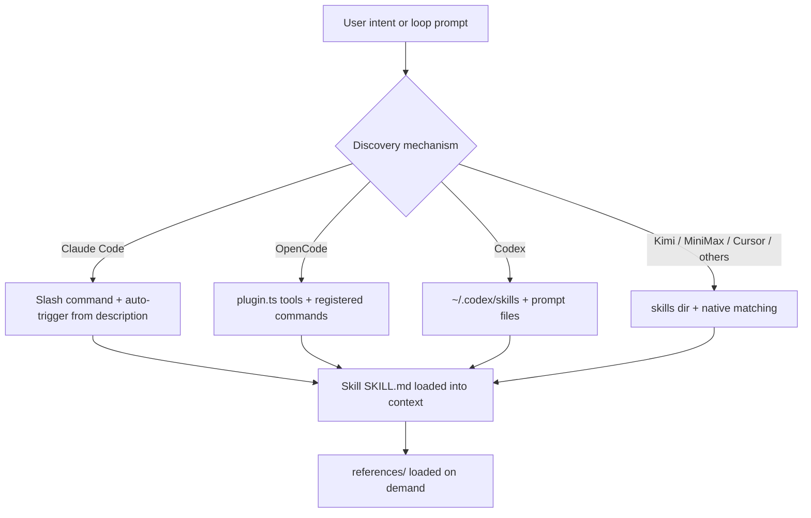

# 08 · Skills Overview

A skill is a self-contained, portable unit of capability: a `SKILL.md` manifest with YAML frontmatter, optionally accompanied by `scripts/`, `references/`, and `assets/`. The prometheus-skill-pack ships 35 top-level skills across 13 categories — 95+ skills counting sub-skills — and every one of them is documented in the three pages that follow this one. This page explains the model: how skills are structured, how they are discovered, the standard they conform to, and where to find each category.

## The skills model

Every skill follows the same shape, which is what makes them portable across ten AI tools.

```
skills/<category>/<skill-name>/
├── SKILL.md          ← manifest: YAML frontmatter + instructions (under 500 lines)
├── scripts/          ← executable code (optional)
├── references/       ← detailed docs, loaded on demand (optional)
├── assets/           ← templates, schemas, examples (optional)
└── templates/        ← Tera (.tera) code-generation templates (forge-rs skills)
```

The frontmatter is the contract. A `name` (lowercase, hyphens, matching the directory) and a `description` (1–1024 characters, searchable) are required. For new skills, strict validation also requires `license`, `version`, and a non-empty `metadata.tags` array.

```yaml
---
name: axum-patterns
description: Production Axum web API patterns — routing, middleware, state, extractors
license: MIT
metadata:
  author: Prometheus AGS
  version: '1.0.0'
  category: rust
  tags: [rust, axum, web, api, middleware]
---
```

Two design principles govern every skill. **Progressive disclosure**: the main `SKILL.md` stays under 500 lines, and detail lives in `references/` that is loaded only when needed — this keeps context lean. **Third-person, imperative voice**: "Run the command," not "you should run." These are not style preferences; they are what keeps a large skill library usable inside a finite context window.

## How skills are discovered and triggered

Skills surface differently depending on the AI tool, but the mechanism is consistent: a skill's `description` and `metadata.tags` are what the tool matches against the user's intent.



In Claude Code, the flat installer turns each skill into a slash command (`/kbd-init`, `/evolve`, `/refine-ui`, and so on) and the description drives auto-triggering. The native agent generator's own skills engine uses **TF-IDF selection** over the configured skill directories to pick the most relevant skill for a task — the same lightweight, explainable matching the Karpathy KB uses, applied to skill selection. Discovery per tool is covered on the [Platform Support](17-platform-support.md) page.

## The AgentSkills.io standard

Every native skill conforms strictly to the [AgentSkills.io specification](https://agentskills.io/specification). That conformance is what makes a skill portable to any platform that reads the standard — not just Claude Code, but Kimi, MiniMax, OpenCode, Codex, Cursor, Windsurf, Gemini CLI, Roo Code, and Amp. The repository's validator (`scripts/validate-skills.js`) enforces the spec: frontmatter schema, the name pattern `^[a-z0-9]+(-[a-z0-9]+)*$`, name/directory consistency, forward-slash paths only, script executability, and — in strict mode — the presence of `license`, `version`, and `metadata.tags`. The validation gates are documented on the [Contributing](21-contributing.md) page.

## The full category index

| Category | Count | Skills | Documented in |
|---|---|---|---|
| **Process** | 9 | zeespec-interrogator, iterative-evolver, kbd-process-orchestrator, pmpo-elicit, pmpo-outer-loop, pmpo-skill-creator, native-agent, liter-llm-bridge, ideation-mindmap (+ kbd-evolve) | [09 · Process Skills](09-process-skills.md) |
| **Rust** | 10 | actor-model, async-patterns, axum-patterns, error-handling, karpathy-tokenizer, librefang-wasm-skill, mcp-server, performance, prometheus-rust-auditor, workspace-structure | [10 · Language & Domain Skills](10-language-skills.md) |
| **React** | 2 | react-vite-stack, prometheus-entity-skills (8 sub-skills) | [10](10-language-skills.md) |
| **Flutter** | 1 | flutter-rust-ffi | [10](10-language-skills.md) |
| **Tauri** | 1 | tauri-react-vite | [10](10-language-skills.md) |
| **HTMX** | 1 | htmx-alpine-lit | [10](10-language-skills.md) |
| **TypeScript** | 1 | typescript-base-patterns | [10](10-language-skills.md) |
| **Go** | 1 | go-base-patterns | [10](10-language-skills.md) |
| **Python** | 1 | pyo3-bridge | [10](10-language-skills.md) |
| **Architecture** | 1 | clean-architecture | [10](10-language-skills.md) |
| **Testing** | 2 | bdd-testing, bdd-video-proof | [10](10-language-skills.md) |
| **DevOps** | 4 | argocd-multicloud, gitops-bootstrap, gitops-transform, kustomize-overlay | [10](10-language-skills.md) |
| **Document extraction** | 1 | kreuzberg | [10](10-language-skills.md) |
| **Flint** | 6 | flint-sdk-csharp, -dart, -go, -kotlin, -swift, -ts | [10](10-language-skills.md) |
| **Imported (submodules)** | 2 | artifact-refiner, sycophancy-correction | [11](11-artifact-refiner.md), [07](07-sycophancy-correction.md) |

## Native, imported, and forge-rs skills

There are three kinds of skill in the repository, and the distinction matters for how you maintain them.

**Native skills** live directly under `skills/<category>/` and are maintained in this repository. Most are uniform `v1.0.0`, MIT-licensed, with `metadata.tags`. (One exception worth knowing: `kreuzberg` is Elastic-2.0 licensed, not MIT.)

**Imported skills** live under `skills/imported/` as git submodules, because they have independent development lifecycles. The two current imports are `artifact-refiner` and `sycophancy-correction`. You never edit an imported skill in place — you update its submodule pointer. (See [Contributing](21-contributing.md).)

**forge-rs skills** carry `.tera` templates under `templates/`. forge-rs scans `skills/<language>/<skill-name>/templates/*.tera`, and each skill's `skill.toml` declares which templates it ships. The four template variables (`task_description`, `task_id`, `constitution_summary`, `karpathy_focus`) are filled at enrichment time. This is how a skill contributes not just guidance but actual code scaffolding — covered on the [Rust Toolchain](14-rust-toolchain.md) page.

The pack also generates new skills on demand. `pmpo-skill-creator` produces production-ready skills via the PMPO loop in four modes (create, clone, extend, update), and the meta-template system in forge-rs scaffolds new skills and templates from the command line. Both are documented in the pages ahead.

---

*Previous: [← 07 · Sycophancy Correction](07-sycophancy-correction.md) · Next: [09 · Process & Orchestration Skills →](09-process-skills.md)*
