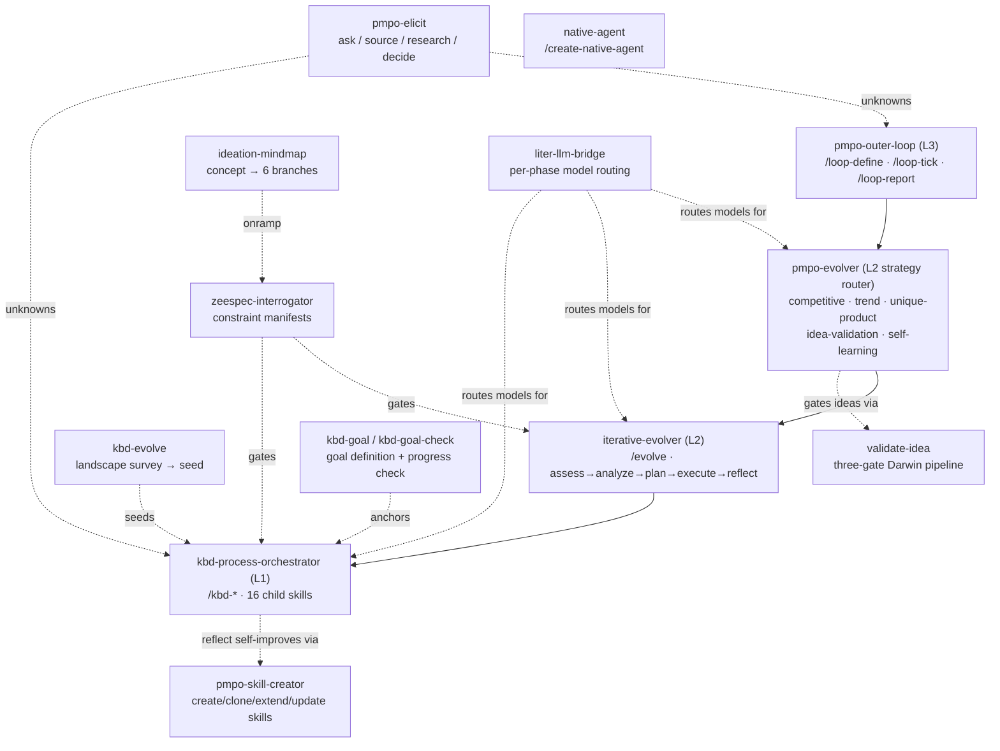
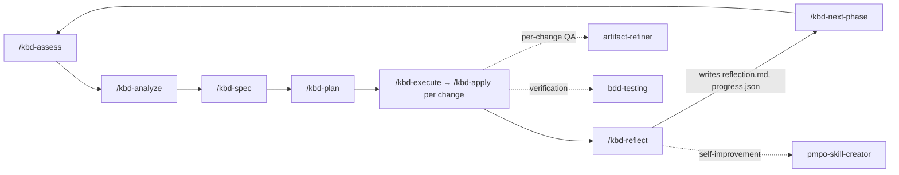

# 09 · Process & Orchestration Skills

The process skills are the engine. The language skills know *how to write good Rust or React*; the process skills know *how to run a self-improving loop that produces it*. This page documents each one exhaustively — its purpose, how it is invoked, what it reads and writes, and how it composes with the others. Read [Loop Architecture](03-loop-architecture.md) first; this page assumes the L0–L3 vocabulary.

---

## zeespec-interrogator

**Purpose.** Zachman Framework 5W1H interrogation — surfaces undefined constraints across six dimensions (What, Where, Who, When, Why, How), ten questions each, before planning begins. Produces a GO / CAUTION / NO-GO constraint manifest.

**Invocation.** `/zeespec-interrogate "<subject>"`, `/zeespec-score`, `/zeespec-status "<subject>"`. Auto-triggered by the KBD orchestrator and the evolver when spec coverage falls below the threshold (default 70%).

**Flow.** Resolve provider → init/resume → load the six dimension references → loop: interrogate → score → manifest → persist. Model routing: interrogate and manifest run frontier; score, persist, and status run small.

**Scoring.** ≥ 85% sufficient (GO); 60–84% partial (CAUTION); < 60% insufficient (NO-GO). Per-dimension critical overrides: Why < 70%, Who < 65%, When < 60%, What/Where/How < 50% gate regardless of aggregate.

**State & outputs.** `.zeespec/registry.json` and `.zeespec/subjects/<name>/{state.json, manifest.json, checkpoints/, history/}`. The manifest carries the aggregate and per-dimension scores, the GO recommendation, categorized gaps (critical/major/implicit), and `caller_enrichment` that, when called from KBD, is written straight into the OpenSpec proposal spec. Provider tiering: env config → local `.zeespec-provider.json` → `~/.zeespec/provider.json` → state MCP → memory MCP → filesystem.

---

## iterative-evolver

**Purpose.** The PMPO outer loop made executable — the L2 strategic loop. Domain-agnostic evolution: assess → analyze → plan → execute → reflect, across software, business, product, research, content, operations, compliance, and generic domains.

**Invocation.** `/evolve "<name>"`, plus per-phase entry points `/evolve-assess`, `/evolve-analyze`, `/evolve-plan`, `/evolve-execute`, `/evolve-status`, `/evolve-report`.

**Flow.** Startup checks local services and resolves the provider, then loads the domain adapter. The loop runs each phase via its prompt file, persists, and either loops or terminates. In the **software domain, execute delegates to the KBD orchestrator** (the L1 inner loop). Termination defaults: target alignment ≥ 90%, maximum five iterations. Model routing: assess/analyze/plan/reflect frontier, execute tiered, status small.

**The evolver bridge.** The canonical write-back contract between L2 and L1 is `evolver-bridge.json`, written at `.kbd-orchestrator/phases/<phase>/evolver-bridge.json`. After each change completes, KBD appends `{change_id, evolver_item_id, status, completed_at}` to `execution_results[]`. During reflect, the evolver reads it back, computes per-item status, and writes `kbd_results` into `.evolver/evolutions/<name>/state.json`. No bridge file means the loops simply run independently — no write-back, no error.

**State.** `.evolver/registry.json` and `.evolver/evolutions/<name>/{state.json, checkpoints/, history/}`, or surreal-memory when reachable. Startup runs `prometheus-services.sh doctor` to check surreal-memory (`:23001`), prometheus-knowledge (`:8942`), and forge-rs (`:8943`).

---

## kbd-process-orchestrator

**Purpose.** The universal Knowledge-Based Development orchestrator — the L1 tactical loop. Drives the full PMPO lifecycle at three granularities (global phase → OpenSpec change → artifact QA) and coordinates multiple AI tools through `.kbd-orchestrator/` as the file-based source of truth. It implements the methodology spec `TJ-KBD-UNIVERSAL-001`.

**Invocation.** A rich command set: `/kbd-init`, `/kbd-assess`, `/kbd-analyze`, `/kbd-spec`, `/kbd-plan`, `/kbd-execute`, `/kbd-apply <change>`, `/kbd-reflect`, `/kbd-status`, `/kbd-new-phase`, `/kbd-new-child`, `/kbd-next-child`, `/kbd-next-phase`, `/kbd-child-exit`, `/kbd-memory-recall`, `/kbd-inject-agent-rules`, `/kbd-full-phase`. `/kbd-apply` wraps the OpenSpec CLI one task at a time, replacing a bare apply so the loop advances a single artifact per tick.

**The 16 child skills.** `kbd-init`, `kbd-assess`, `kbd-analyze`, `kbd-spec`, `kbd-plan`, `kbd-apply`, `kbd-execute`, `kbd-reflect`, `kbd-status`, `kbd-new-phase`, `kbd-new-child`, `kbd-next-child`, `kbd-next-phase`, `kbd-child-exit`, `kbd-memory-recall`, `kbd-inject-agent-rules`. Several have companion `.sh` runners.

**State — the source of truth.** Everything lives under `.kbd-orchestrator/`:

| File | Role |
|---|---|
| `current-waypoint.json` / `.md` | Resume contract: active phase, backend, last/next change, re-entry skill, exact next command, fallback. Supports arbitrary-depth nested phases via a `path[]` chain. |
| `position.json` | Position sync written by the orchestrator. |
| `project.json` | Generated by `/kbd-init`, never shipped. |
| `phases/<phase>/progress.json` | Per-task status (PENDING/IN_PROGRESS/DONE/BLOCKED/SKIPPED), counts, who started/completed, blockers. Updated on every task start and completion. |
| `phases/<phase>/{assessment.md, analysis.md, plan.md, execution.md, reflection.md, handoffs/*.json}` | Per-phase artifacts. |
| `position-reminder.txt` | The first thing every orchestration turn reads. |

**Integration layer.** Four global skills are invoked by reference (never copied): `iterative-evolver` at assess, `artifact-refiner` for per-change QA at execute, `bdd-testing` as the execute verification gate, and `pmpo-skill-creator` for meta self-improvement at reflect. Backends: `openspec`, `native-kbd` (with `[ ]`/`[/]`/`[x]` status markers), or a designated tool. The tool registry spans Claude Code, Codex, Cursor, Cline, Roo Code, Kilo Code, Windsurf Cascade, OpenCode, Antigravity, and Human.

**Memory.** Default-on when surreal-memory is reachable: every hook fire is mirrored as a `kbd_lifecycle_event` entity, and `/kbd-memory-recall` surfaces history. No-ops when unreachable.

---

## pmpo-elicit

**Purpose.** The elicitation primitive. When any stage hits an unknown, it asks the user, points to a source, or researches autonomously — and records the answer with provenance instead of silently guessing.

**Invocation.** `/pmpo-elicit "<question>" [--hints "a;b"] [--criticality high|blocking] [--caller <stage>]`. It is the escalation channel for the outer loop and is called by any KBD/PMPO stage.

**The four option classes, always offered in order.** (1) Direct answers — two to four inferred options via the question UI. (2) "Here's the source" — fetch via Firecrawl or Read, recording `provenance: source`. (3) "Research it for me" — *always* present, bounded to six sources and ten minutes, recording `provenance: research`. (4) "Decide for me" — record an implicit default with rationale, `provenance: implicit`.

**Why it matters.** The research option is never unbounded — six sources, ten minutes, then a partial answer at lowered confidence. That bound mirrors the two-rejection cap on the sycophancy gate: every autonomous activity in the system has a ceiling. Requests are written to `elicitations/<id>/request.json`; results with provenance, confidence, evidence, and cost to `elicitations/<id>/result.json`.

---

## pmpo-outer-loop

**Purpose.** The L3 standing loop — define, run, and report a loop with a goal, feedback sources, termination, and cadence. A thin wrapper over the evolver: one tick equals one evolver cycle. No new engine, no daemon. This is "the Boris Cherny shape" made operable.

**Invocation.** `/loop-define <name>`, `/loop-tick <name>`, `/loop-report <name>`. The full `loop.json` schema, the `loop-tick.sh` exit-code contract (0 continue / 1 escalate / 2 terminate / 3 error), the feedback-source types, and the cadence options are all on the [Loop Architecture](03-loop-architecture.md) page — this skill is their implementation.

**State.** `.kbd-orchestrator/loops/<name>/loop.json`, plus per-tick `journal.md` and `decision-log.md`. Cadence is delegated to platform primitives: manual, background task, or cron.

---

## pmpo-skill-creator

**Purpose.** A PMPO-driven generator for production-ready skills, conforming to AgentSkills.io, the Claude Code plugin/marketplace format, and OpenCode tools. Four modes: create, clone, extend, update.

**Invocation.** `/create-skill`, `/clone-skill`, `/extend-skill`, `/validate-skill`, and the human-gated `/pmpo-skill-creator --update <skill-name>`.

**The `--update` flow — human-gated by design.** It reads the target skill's `SKILL.md`, searches the learning log (`~/.prometheus/learning-log/*.jsonl`) and surreal-memory for matching patterns, generates a unified diff, writes it to `~/.prometheus/skill-updates/<skill>-<date>.diff`, presents it, and prompts "Apply this update? (y/N)". It applies only on explicit `y`, then re-runs `npm run validate:strict`. It never auto-applies. The companion `propose-skill-update.sh` only files candidates; it changes nothing. This is the gate that keeps the system from rewriting its own instructions based on its own judgment.

**Flow.** Specify → Plan → Execute → Reflect → Persist, with per-phase checkpoint and workflow-dispatch hooks. It generates the full skill tree — `SKILL.md`, prompts, agents, references, schemas, scripts, sub-skills, `hooks/hooks.json`, and `.claude-plugin/plugin.json`. State in `.creator/`.

---

## native-agent

**Purpose.** Generates a complete, production-ready native Rust agent application with a Supabase-style management CLI. The generated binary embeds an Axum HTTP server, a React 19 chat frontend, liter-llm provider routing, an MCP client, and the skill-pack selection engine. This skill gets its own chapter — see [The Native Agent Generator](12-native-agent-generator.md) — but it lives in the process category.

**Invocation.** `/create-native-agent` (Docker target by default; `librefang-wasm` or `both` are options). Child skills: `create-native-agent`, `upload-to-bossfang`, `start-business-build`.

---

## liter-llm-bridge

**Purpose.** Harness-agnostic multi-model routing. It builds and configures `liter-llm` (a Rust LLM proxy with a built-in MCP server) so any MCP-capable harness can route each phase to the cheapest viable model.

**Invocation.** `/liter-llm-bridge install`, `/liter-llm-bridge configure`, `/liter-llm-bridge route`. Run in order on first setup; only `configure` re-runs when adding providers.

**Fallback semantics — the important part.** No provider for a class → fall through to the host model with a warning (do not fail). But a **class downgrade** — running a frontier phase on a small model — emits `MODEL MISMATCH` and **stops**. That is the dangerous silent failure the bridge refuses to allow: quietly running expensive reasoning on a cheap model produces plausible, wrong output. `liter-llm` exposes 22 MCP tools (routing, virtual keys, rate limits, cost tracking, caching) and is started via `liter-llm mcp --transport stdio`. (See [Tools Reference](13-tools-reference.md).)

---

## ideation-mindmap

**Purpose.** The stage-zero onramp for `/start-business-build`. Turns a one-line concept into a six-branch concept tree using surreal-memory's `generate_ideation_mindmap`, formatted for handoff to `/zeespec-interrogate`.

**Invocation.** `/ideation-mindmap <concept>`. Auto-invoked as stage 1 of the business-build pipeline.

**Dependency.** Requires the surreal-memory MCP server. When it is unreachable, it falls back to a manual six-branch expansion clearly labeled `[fallback — surreal-memory unavailable]`. Verify availability with `npm run doctor`.

---

## kbd-evolve

**Purpose.** Domain-landscape-first evolution. Where `/kbd-next-phase` advances the next *planned* phase, `/kbd-evolve` surveys the external problem-domain landscape, scores opportunities against a criteria profile, and produces a ranked evolution brief that `/kbd-new-phase` consumes as a seed.

**Invocation.** `/kbd-evolve [name] [--criteria effort-impact|strategic|risk-adjusted|custom] [--depth quick|standard|deep]`. Depth controls research breadth: quick (2–3 sources), standard (5–8), deep (10+).

**Flow.** Assess current state from `.kbd-orchestrator/` → research the landscape (web search, Tavily, Firecrawl, GitHub) → analyze gaps → score (default `effort-impact`: impact × 0.40 + (6 − effort) × 0.25 + alignment × 0.20 + feasibility × 0.15) → write a brief to `.kbd-orchestrator/evolution-briefs/<name>.md`. The brief recommends a concrete `/kbd-new-phase <name> --seed <brief>`, and the `--seed` flag tells the orchestrator to use it as assessment input. When surreal-memory is available, the cycle is recorded as a `KbdEvolution` entity.

---

## pmpo-evolver

**Purpose.** A strategy router for five distinct evolution perspectives, designed for projects that have reached a stable release and need principled, research-backed direction for what to do next. It is the L2 peer to `iterative-evolver` — `iterative-evolver` runs the generic PMPO cycle; `pmpo-evolver` decides *which dimension of the problem space to evolve* before the cycle begins.

**The five perspectives.**

| Perspective | What it does |
|---|---|
| `competitive` | Competitor registry init + changelog ingestion → feature-parity and improvement delta |
| `trend` | Domain taxonomy scan (6 clusters) → anticipated innovations and standards from web research |
| `unique-product` | Unique-product research → next logical evolution step; anchors on carry-forwards from prior KBD reflect |
| `idea-validation` | Darwin three-gate idea pipeline: Gate 1 (small/plausibility) → Gate 2 (medium/domain-research) → Gate 3 (frontier/spec+human-gate) |
| `self-learning` | Commit history analysis + gh issues digest + feedback-source ingestion → learning signals |

**Invocation.** `/pmpo-evolver [project-name] [--perspective <value>]` (default `auto` — router picks the perspective with the most stale data). `/pmpo-evolver-status` prints the current perspective cursor, last-run timestamps per perspective, and pending learning signals.

**Model routing.** All model calls carry `[MODEL_ROUTING] phase=evolver-<key> class=<small|medium|frontier>` directives; `liter-llm` routes to the cheapest viable model. Gate 1 of idea validation: small. Gate 2: medium. Gate 3 and strategic dreaming: frontier. Carry-forward aggregation: pure bash (no model needed).

**Post-cycle strategic dreaming.** After each KBD reflect, `post-cycle-dream.sh` invokes the frontier model to ask "what did we learn about product direction?" and appends structured `evolver_lessons[]` to `state.json`. This is distinct from PMPO Reflect (execution quality) — dreaming asks about *where the product should go next*.

**Inner-loop bridge.** `evolver-seed-phase.sh` takes an approved idea from the Archive of Stepping Stones and creates a ready-to-assess KBD phase: `goals.md`, `progress.json`, `evolver-bridge.json`. This is the handoff from L2 strategic decision to L1 tactical execution.

**State.** `.evolver/evolutions/<name>/state.json` (extended with `learning_signals[]`, `perspective`, `perspective_cursor`, `evolver_lessons[]`), `.evolver/<name>/archive/<idea-id>/manifest.json` (Archive of Stepping Stones), and per-perspective data under `.evolver/<name>/competitors/`, `.evolver/<name>/signals/`.

**Sub-skill: validate-idea.** A discrete three-gate idea validation pipeline callable as `/validate-idea "<idea text>" [--evolution-name <name>] [--auto-gate]`. Gate 1 runs `idea-gate-1.sh` (keyword scan vs. `skills/`, backlog check, liter-llm binary classification) in ~30 s. Gate 2 runs domain research + feasibility scoring (0–100) + prior art + competitive check in ~5 min. Gate 3 produces a `SPEC.md`, runs a verifiability check, and escalates via `/pmpo-elicit` for the human gate. Each idea is archived to the Archive of Stepping Stones with a `revisit_weight`: 1.0 (approved), 0.5 (approved but not yet executed), 0.3 (Gate 2 reject), 0.1 (Gate 1 reject), 0.0 (hard reject).

**Outer-loop integration.** `loop.json` accepts a `perspective` field (`competitive|trend|unique-product|idea-validation|self-learning|auto`). When set, each `/loop-tick` passes `--perspective <value>` to the evolver. This means a standing outer loop can be locked to a single perspective for a sprint, then switched.

**Key scripts.** `competitor-registry-init.sh`, `changelog-fetch.sh`, `commit-history-analyze.sh`, `feedback-digest.sh`, `carry-forward-aggregate.sh`, `post-cycle-dream.sh`, `evolver-seed-phase.sh`, `idea-gate-1.sh`.

**References.** `competitive-analysis.md`, `learning-signals.md`, `strategic-dreaming.md`, `domain-taxonomy.md`, `context-management.md`, `model-routing.md`, `liter-llm-bridge/references/model-discovery.md`.

---

## kbd-goal

**Purpose.** Structured goal definition for a KBD phase. Produces a `goals.md` with named goals, acceptance criteria, success metrics, timebox, and a cross-tool compatibility note so any AI harness (Claude Code, Codex, OpenCode, Kimi, Zed) can interpret the goal contract identically.

**Invocation.** `/kbd-goal [phase-name]`. Reads any existing `goals.md`; prompts for goals, success criteria, and timebox when not supplied; writes the canonical `goals.md` and updates `current-waypoint.json`.

**Cross-tool parity.** Goal files are plain Markdown and are designed to be interpretable by any harness — the format is intentionally harness-agnostic. Goal text and acceptance criteria use no platform-specific syntax.

---

## kbd-goal-check

**Purpose.** Goal progress check and milestone verification. Reads the active phase's `goals.md` and `progress.json`, runs a goal-backward analysis against the delivered changes, and emits a structured verification report.

**Invocation.** `/kbd-goal-check [phase-name]`. Designed to be called at any point during execute (mid-phase check) or at reflect (final verification). Produces a table of goals with MET / PARTIAL / NOT MET status and concrete evidence from completed changes.

---

## How they compose

The composition is strictly hierarchical, and that is what keeps it debuggable. The outer loop (L3, `pmpo-outer-loop`) ticks the strategy router (`pmpo-evolver`), which decides *which dimension of the problem space to evolve* — competitive, trend, unique-product, idea-validation, or self-learning — and then hands off to `iterative-evolver` (the generic L2 PMPO cycle). The evolver, in the software domain, delegates execute to the KBD orchestrator (L1); the orchestrator runs phases and, at each gate, calls ZeeSpec (when under-constrained), `pmpo-elicit` (for unknowns), `artifact-refiner` and `bdd-testing` (for QA), and `pmpo-skill-creator` (for self-improvement). When the evolver approves an idea, `evolver-seed-phase.sh` seeds a new KBD phase from the Archive of Stepping Stones. `kbd-goal` and `kbd-goal-check` anchor goals at phase boundaries. `kbd-evolve` and `ideation-mindmap` seed new work; `liter-llm-bridge` supplies the model routing underneath all of it; `native-agent` is the one that produces standalone, deployable artifacts. Every one of these is a discrete skill with a discrete responsibility — which is precisely why the system compounds instead of tangling.

---

*Previous: [← 08 · Skills Overview](08-skills-overview.md) · Next: [10 · Language & Domain Skills →](10-language-skills.md)*
