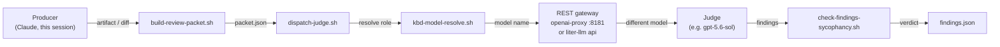

# 09a · Adversarial Review & Model Configuration

The single most important quality gate in the pack, and the one that is easiest to have
running in a state where it does nothing.

Adversarial review dispatches a **fresh-context LLM judge** with an explicit mandate to
find problems in a KBD artifact or change diff. The rule it exists to enforce is one
sentence long:

> **The model that produced the work is never the model that reviews it.**

That is not a stylistic preference. A critic that shares the producer's blind spots
cannot see the producer's blind spots. If Claude writes a plan and Claude reviews it,
the review will systematically miss exactly the class of error Claude is prone to — and
it will return `PASS`, which reads like evidence of quality.

## The failure this page exists to prevent

Every one of the first eight stored reviews in this repository recorded:

```json
{
  "isolation_mode": "harness-native",
  "judge_model": "harness-subagent (claude, parent-session family)",
  "verdict": "PASS"
}
```

Claude reviewing Claude, eight times, all passing. The pipeline ran, wrote artifacts, and
reported success. It had never once reached a second model.

It failed silently for five compounding reasons — worth knowing, because each is a trap
you can re-enter:

1. **Three parallel config surfaces, none authoritative.** `project.json → model_policy`
   was declared as `policy_source` by five skills and read by none.
2. **A schema mismatch.** The file the code read used a flat `[aliases]` table; liter-llm's
   real schema is an `[[aliases]]` *array*. The parse silently yielded nothing and the
   dispatcher sent the literal string `"frontier"` as a model id.
3. **The collision guard never fired.** Every packet carried `producer_model: "unknown"`,
   so `candidate != producer` passed trivially.
4. **`isolation_mode` was a hardcoded literal.** It said `"liter-llm"` regardless of what
   answered, so a self-grade was indistinguishable from a real cross-model review.
5. **The gateway config could not serve a request** — see [Mandatory
   sections](#three-contracts-that-will-bite-you) below.

Everything on this page is designed so that when it is broken, it says so.

## Architecture



The judge receives **only** the review packet — the diff or artifact, its acceptance
criteria or phase goals, the file tree, and blocking constraints. It never sees the
producing session's conversation. Isolation is structural, not honour-system.

## Two files, one gateway

Configuration is split so that **neither file is a script**, and neither requires editing
one:

| File | Owns |
|---|---|
| `~/.prometheus/kbd/models.toml` | role → model **name** (KBD owns) |
| `~/.config/liter-llm/liter-llm-proxy.toml` | name → provider + `base_url` + `${KEY}` (liter-llm owns) |

Adding a provider edits liter-llm's file. Repointing a role edits `models.toml`. This
split is the whole point: a previous session "fixed" model routing by editing pack
scripts **inside a plugin cache** — edits the next install destroys and git never sees.

```toml
# ~/.prometheus/kbd/models.toml
[gateway]
candidates = ["http://localhost:8181/v1", "http://localhost:4000/v1"]

[roles]
# The producer. Intentionally NOT a [[models]] entry — it is the harness itself and is
# never dispatched. It is named so the collision check has something concrete to compare
# against instead of the literal "unknown".
generator = "kbd-frontier"
critic    = "kbd-critic"    # MUST differ from generator
judge     = "kbd-judge"
```

## Resolution order

Implemented once, in `shared/scripts/lib/kbd-model-resolve.sh`. AWS-CLI convention,
highest wins:

```
explicit argument
  > PROMETHEUS_KBD_<ROLE>_MODEL     e.g. PROMETHEUS_KBD_JUDGE_MODEL
  > ~/.prometheus/kbd/models.toml   [roles]
  > .kbd-orchestrator/project.json  model_policy
  > built-in default                kbd-judge / kbd-critic / kbd-frontier
```

`preflight-models.sh` prints **which layer supplied each role**, so "where did that model
come from?" is never a guess:

```json
{
  "status": "ok",
  "gateway": "http://localhost:8181/v1",
  "roles": {
    "judge":  { "model": "kbd-judge",  "source": "~/.prometheus/kbd/models.toml" },
    "critic": { "model": "kbd-critic", "source": "~/.prometheus/kbd/models.toml" }
  },
  "distinct_models": 2,
  "config_defects": []
}
```

## Three contracts that will bite you

All three were simultaneously broken in the config this repo shipped before 2026-07-30,
which is why the judge could not reach a second model. Each produces a failure that
points *away* from its cause.

### 1. `/v1/*` requires a Bearer token unconditionally

A config with no `[general] master_key` and no `[[keys]]` answers **401 to everything**,
`/v1/models` included. The symptom looks like a bad credential in the caller.

```toml
[general]
master_key = "${LITER_LLM_MASTER_KEY}"
```

### 2. `deny_private` blocks loopback

`[security].outbound_policy` defaults to `deny_private`, which **refuses** any `localhost`
/ `127.0.0.1` `base_url` with `OutboundForbidden`. The symptom looks like a dead service.

```toml
[security]
outbound_policy = "off"
# or, if this host also reaches untrusted networks:
#   outbound_policy = "allowlist"
#   outbound_allowlist = ["http://localhost:8181"]
```

### 3. liter-llm never searches `$HOME`

`ProxyConfig::discover()` walks the **current directory upward** looking for
`liter-llm-proxy.toml`. It does not look in `~/.config`. Always pass an absolute
`--config`:

```bash
liter-llm api --config ~/.config/liter-llm/liter-llm-proxy.toml
liter-llm mcp --transport stdio --config ~/.config/liter-llm/liter-llm-proxy.toml
```

Without it, `liter-llm mcp` does not merely load zero models — it **fails to start**,
because `[mcp] stdio_trust_local` lives in the config it was never given.

## Configuring providers

```bash
S="${CLAUDE_PLUGIN_ROOT}/skills/process/liter-llm-bridge/scripts/configure-models.sh"

bash "$S" check                    # report state; change nothing
bash "$S" repair                   # add ONLY the missing mandatory pieces
bash "$S" add-provider glm-coding  # local-proxy|kimi|minimax|qwen|glm|glm-coding|kimi-coding
bash "$S" verify                   # live 1-token completion per role
bash "$S" migrate                  # retire the legacy config.toml
```

`repair` merges and never clobbers — a hand-added `[[models]]` entry survives a re-run.

### Provider reference

liter-llm has first-class providers for all of these; use the real registry prefixes.

| Provider | `provider_model` | `base_url` | key var |
|---|---|---|---|
| openai-proxy (local) | `openai/gpt-5.6-sol` | `http://localhost:8181/v1` | none — `sk-proxy-local` placeholder |
| Kimi / Moonshot | `moonshot/kimi-k2.5` | `https://api.moonshot.ai/v1` | `MOONSHOT_API_KEY` |
| MiniMax | `minimax/MiniMax-M2.5` | `https://api.minimax.io/v1` | `MINIMAX_API_KEY` |
| Qwen / DashScope | `dashscope/qwen3-coder-plus` | `https://dashscope-intl.aliyuncs.com/compatible-mode/v1` | `DASHSCOPE_API_KEY` |
| Z.ai GLM | `zai/glm-4.7` | `https://api.z.ai/api/paas/v4` | `ZAI_API_KEY` |

### Coding plans need a different endpoint

The `*-coding-plan` identifiers in liter-llm's catalog are **metadata, not routable
providers** — `provider_model = "kimi-for-coding/k3"` will not route. Keep a routable
prefix and override the endpoint:

```toml
[[models]]
name = "kbd-glm"
provider_model = "zai/glm-5.2"
base_url = "https://api.z.ai/api/coding/paas/v4"   # coding path, NOT /api/paas/v4
api_key  = "${ZAI_API_KEY}"
```

Z.ai's documentation is explicit that a Coding Plan **must** use `/api/coding/paas/v4`
or the subscription quota is not drawn. `add-provider glm-coding` writes this for you.

**OAuth-only subscription plans** (MiniMax/Qwen portals, some Kimi coding plans) expose
*Anthropic*-shaped endpoints that an OpenAI-REST caller cannot use. The wizard detects
and refuses these rather than writing config that 404s later.

## Secrets

Never in the TOML. Keys live in `~/.prometheus/kbd/secrets.env` (`0600`, outside any
repo) and are referenced as `${VAR}`:

```bash
set -a; . ~/.prometheus/kbd/secrets.env; set +a
```

liter-llm supports `${VAR}` **only** — no `${VAR:-default}` — and expands an **unset**
variable to `""`, which surfaces much later as an unexplained 401. Both `configure-models.sh
check` and `scripts/check-model-config.sh` verify every referenced variable is actually set.

## Running a review

```bash
SKILL_DIR="${CLAUDE_PLUGIN_ROOT}/skills/process/adversarial-review"

# 0. Load the gateway credential and DECLARE THE PRODUCER.
#    Without KBD_PRODUCER_MODEL the collision check passes trivially.
set -a; . ~/.prometheus/kbd/secrets.env; set +a
export KBD_PRODUCER_MODEL="claude-opus-5"

bash "$SKILL_DIR/scripts/preflight-models.sh"
bash "$SKILL_DIR/scripts/build-review-packet.sh" --mode diff --phase "$PHASE" \
  --target "$CHANGE_ID" --out ".../packet.json"
bash "$SKILL_DIR/scripts/dispatch-judge.sh" --mode diff \
  --packet ".../packet.json" --out ".../findings.json"
bash "$SKILL_DIR/scripts/check-findings-sycophancy.sh" \
  --findings ".../findings.json" --counter-key "adv-review-$CHANGE_ID"
```

Two modes:

- **`--mode diff`** — post-implementation, in kbd-execute's QA gate. Reviews a change's
  diff against its acceptance criteria, after `refine-validate` passes and before archive.
- **`--mode artifact`** — pre-implementation, in assess/analyze/plan. Vets `assessment.md`,
  `analysis.md`, or `plan.md` before the stage hands off.

## Reading the artifact

This is how you tell a real review from theatre.

| Field | Meaning |
|---|---|
| `isolation_mode` | `rest-gateway:<url>` — the endpoint that actually served it |
| `cross_model_check` | `verified-distinct` · `same-model-collision` · `unverified-producer-unknown` |
| `judge_model` / `producer_model` | the compared pair |
| `verdict` | `BLOCK` iff any `CRITICAL` finding |

A healthy review:

```json
{
  "verdict": "BLOCK",
  "judge_model": "kbd-judge",
  "producer_model": "claude-opus-5",
  "isolation_mode": "rest-gateway:http://localhost:8181/v1",
  "cross_model_check": "verified-distinct"
}
```

**`unverified-producer-unknown`** means the packet carried no `producer_model`, so the
guarantee could not be enforced — export `KBD_PRODUCER_MODEL`. **`harness-native`** means
no gateway was reachable and a same-family subagent reviewed instead: a weaker guarantee,
stated rather than hidden.

## Fallback chain

Warn, never silently degrade, never block the pipeline:

1. **REST gateway** — full isolation, true cross-model. Exit 0.
2. **Harness-native subagent** — when no gateway answers (exit 3). Prompt is *exactly* the
   mandate plus the packet, nothing else. Recorded as `harness-native`.
3. **Skip with warning** (exit 4) — no judge available at all.

> There is **no `liter-llm complete`**. The binary ships only `api` and `mcp` — it is a
> proxy *server*. Earlier revisions called that non-existent subcommand; because the guard
> only checked that the *binary* existed, the failure surfaced as "liter-llm unavailable"
> rather than as the CLI-contract mismatch it was. See
> [09b · liter-llm](09b-liter-llm.md).

## Troubleshooting

Start here:

```bash
bash scripts/check-model-config.sh
```

It prints the resolved gateway, the model per role, the `isolation_mode` a review *would*
record, and audits for cache drift. **Exit 2 means an installed copy under
`~/.claude/plugins/cache/...` differs from the repo** — someone edited the wrong file.
Fix the repo, then `bash scripts/update-skill-pack.sh --force`.

| Symptom | Cause | Fix |
|---|---|---|
| `HTTP 401` on everything | no `master_key` | `configure-models.sh repair` |
| `OutboundForbidden` | `deny_private` vs localhost | set `outbound_policy` |
| MCP server won't start | missing `--config` | pass an absolute path |
| `status: config_broken` | see `config_defects` | `configure-models.sh repair` |
| `cross_model_check: unverified-producer-unknown` | no producer declared | export `KBD_PRODUCER_MODEL` |
| `JUDGE_MODEL_COLLISION` | judge == producer, no alternative | add a second provider |
| Unset `${VAR}` → later 401 | liter-llm expands unset to `""` | source `secrets.env` |

## Anti-theatre gate

The judge's own report is screened by
[sycophancy-correction](07-sycophancy-correction.md) before it is surfaced. A zero-finding
report must carry `checked_classes` — the failure classes the judge examined and why each
does not apply. A clean report with no due-diligence trail is rejected as theatre, not
accepted as praise.

## See also

- [09 · Process Skills](09-process-skills.md) — where this sits in the pipeline
- [09b · liter-llm](09b-liter-llm.md) — the gateway in full
- [07 · Sycophancy Correction](07-sycophancy-correction.md) — the anti-theatre screen
- `skills/process/adversarial-review/references/model-configuration.md` — the in-repo reference
