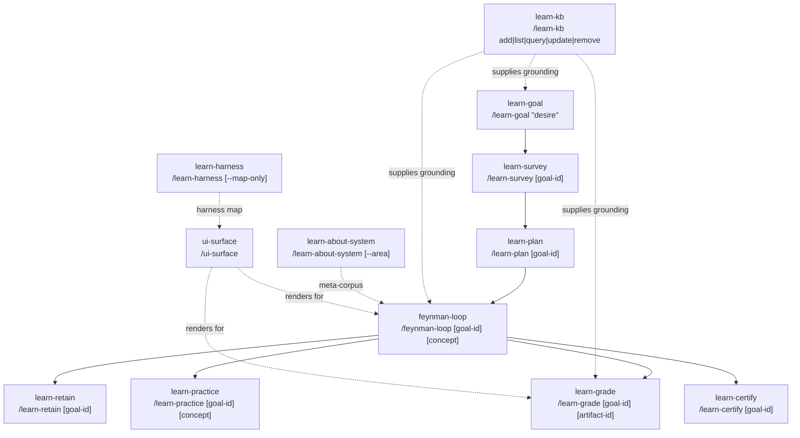

# 10 · Learn Domain Skills

The learn domain is a four-layer adaptive learning engine built into the skill pack. **Layer A** is the substrate — three Rust crates (`storage-provider`, `learner-model`, `surface-bridge`) that handle durable storage, FSRS-6 spaced retrieval, and surface-tier rendering. **Layer B** is `ui-surface`, the cross-harness rendering primitive that detects which UI tier is available and routes accordingly. **Layer C** is the twelve operator skills that drive the full learning arc — from goal definition through credentialing. **Layer D** is the KB adapter system: four adapter types (`dify:`, `palace:`, `local:`, `web:`) that wire external knowledge into every grading and planning operation.

The architecture is intentional: skills in Layer C never embed storage or UI logic directly. They delegate down — to the substrate crates for persistence, to `ui-surface` for rendering, and to `content-grounding-kb.sh` for retrieval — which is why the same skill works identically in a text terminal and in a GUI harness.



---

## ui-surface

**Purpose.** Cross-harness rendering primitive. Detects which surface tier is available at runtime and routes UI intents to the correct rendering path, ensuring every learn skill displays output appropriately regardless of the host tool.

**Invocation.** `/ui-surface` (auto-triggered by learn skills; rarely called directly).

**Key behavior.** Three tiers: Tier 0 emits plain Markdown text (works everywhere). Tier 1 uses `AskUserQuestion` for interactive prompts and writes artefact files for rich content. Tier 2 connects to the `surface-bridge` MCP App (Axum server on `127.0.0.1:7890`), which exposes `/mcp/detect-surface-tier`, `/mcp/render-ui-intent`, and `/mcp/collect-response`. The bridge is started automatically when the substrate crate is built and running.

**State & outputs.** Tier detection is cached per session. The surface-bridge process writes to `~/.prometheus/learn/surface-state.json`.

---

## learn-goal

**Purpose.** Entry point for a new learning objective. The operator states a learning desire in natural language; deep research scopes the subject space; a feasibility gate (GREEN / YELLOW / RED) determines whether to proceed.

**Invocation.** `/learn-goal "desire"`. Optional `--kb <adapter>` flag to wire a KB into the research phase from the start.

**Key behavior.** Runs a bounded deep-research pass (Firecrawl + palace RAG if available) to map the subject landscape. Emits a feasibility signal: GREEN (clear scope, quality sources found), YELLOW (partial scope or thin sources — proceed with caveats), RED (unreachable or incoherent subject — escalates via `pmpo-elicit`). The `--kb flag` writes the adapter binding into `goal.json` so every downstream skill inherits it without re-specifying.

**State & outputs.** Writes `~/.prometheus/learn/goals/<goal-id>/goal.json` (subject, scope, feasibility, KB binding, source list).

---

## learn-survey

**Purpose.** Diagnostic placement. Establishes where the learner starts before a curriculum is built, so the plan is calibrated to actual knowledge rather than assumed knowledge.

**Invocation.** `/learn-survey [goal-id]`.

**Key behavior.** Administers 11 items: 5 conceptual (can you explain X?), 3 procedural (can you apply X?), 3 misconception probes (is the following statement true?). Scores responses against a grounding corpus and sets the `recursion_floor` — the Feynman loop's minimum depth — proportional to measured gaps. Seeds the learner model in the `learner-model` substrate crate via JSON-RPC.

**State & outputs.** Writes `~/.prometheus/learn/goals/<goal-id>/survey-result.json` (item scores, conceptual gaps, misconceptions, recursion_floor).

---

## learn-plan

**Purpose.** Curriculum builder. Converts a scoped goal and survey result into an ordered concept graph and time-boxed curriculum.

**Invocation.** `/learn-plan [goal-id]`. `--replan` flag rebuilds the curriculum from the current mastery state without losing history.

**Key behavior.** Constructs a concept DAG in surreal-memory (nodes = concepts, edges = prerequisite-of). Runs a topological sort to derive the learning order. Estimates time per concept based on survey gaps and complexity. The `--replan` flag reads current `mastery_scores` from the learner model and re-weights the remaining concepts rather than restarting from zero.

**State & outputs.** Writes `~/.prometheus/learn/goals/<goal-id>/curriculum.json` (ordered concept list, DAG reference, per-concept time estimates).

---

## feynman-loop

**Purpose.** The core learning loop. Implements the Feynman Technique as a full PMPO cycle: Spec → Plan → Execute → Reflect, with vertical recursion into sub-concepts and horizontal escalation across audience tiers.

**Invocation.** `/feynman-loop [goal-id] [concept]`.

**Key behavior.**

- **Spec** — concept + depth (defaults to `recursion_floor` from survey; max depth 3).
- **Plan** — explanation structure: breakdown, analogies, expected misconceptions.
- **Execute** — produce explanation + analogies + teach-the-skeptic challenge.
- **Reflect** — `learn-grade` grades the explanation against the grounding corpus; gaps are identified.

*Vertical recursion*: if a gap exposes a prerequisite concept the learner cannot explain, the loop recurses one level deeper (floor guard: recursion_floor ≤ current_depth ≤ 3). *Horizontal escalation*: after novice-tier explanation is graded, the loop steps up to peer-tier, then skeptic-tier, raising the standard progressively.

Three mastery closure criteria — all required: (1) `learn-grade` passes (score ≥ 0.7, no misconceptions); (2) two novel transfer problems each scored ≥ 0.7; (3) `learn-retain` check at ≥ 24 h interval passes. The loop does not close until all three are met.

**State & outputs.** Progress written to `~/.prometheus/learn/goals/<goal-id>/feynman/<concept>/state.json`. Grade artifacts written by `learn-grade`.

---

## learn-grade

**Purpose.** External, source-grounded grader. Evaluates a learner-produced explanation or artifact against the grounding corpus. Includes a structural sycophancy check (S-02) so the grader does not score up to please.

**Invocation.** `/learn-grade [goal-id] [artifact-id]`.

**Key behavior.** Retrieves the grounding corpus via the KB priority chain (see Content Grounding below). Scores the artifact on accuracy, coverage, and absence of misconceptions (0.0–1.0). Emits two novel transfer problems the learner has not yet seen. Pass threshold: score ≥ 0.7 AND no active misconceptions. The S-02 sycophancy check is applied to the grade output before it is written — if the checker detects inflated praise without evidence, the grade is held and re-evaluated.

**State & outputs.** Writes `~/.prometheus/learn/goals/<goal-id>/grades/<artifact-id>.json` (score, misconceptions, transfer problems, grounding sources, sycophancy check result).

---

## learn-retain

**Purpose.** Spaced retrieval via FSRS-6. Reads the due queue from the learner model, administers cued recall items, and updates scheduling parameters.

**Invocation.** `/learn-retain [goal-id]`.

**Key behavior.** The `learner-model` crate (FSRS-6 scheduler) manages stability, difficulty, and due dates per concept. Items due within the next session window are presented. Retention responses map to FSRS-6 ratings: ≥ 0.9 → Easy, 0.7–0.9 → Good, 0.5–0.7 → Hard, < 0.5 → Again. The crate recomputes the next due date and writes it back. The feynman-loop's third closure criterion — the ≥ 24 h retention check — calls this skill and reads the resulting retention score.

**State & outputs.** Updates `~/.prometheus/learn/goals/<goal-id>/retention/` via the `learner-model` JSON-RPC interface.

---

## learn-practice

**Purpose.** Active application. Three modes — derivation (work from first principles), implementation (write code or produce artefact), transfer (apply to a novel domain) — gated behind mastery threshold.

**Invocation.** `/learn-practice [goal-id] [concept]`.

**Key behavior.** Before presenting a problem, checks mastery score for the concept from the learner model. If mastery < 0.6, redirects to the Feynman loop. An interleaved schedule mixes concepts from the current curriculum to reduce blocking interference. Problems are drawn from the transfer problem bank populated by `learn-grade`.

**State & outputs.** Logs practice attempts to `~/.prometheus/learn/goals/<goal-id>/practice/<concept>/`.

---

## learn-certify

**Purpose.** Credential issuance. Produces an Open Badges 3.0 / W3C Verifiable Credentials JSON-LD credential for a completed learning goal.

**Invocation.** `/learn-certify [goal-id] [--checkpoint | --final]`. `--checkpoint` issues a partial badge for a concept cluster; `--final` issues the full credential for the goal.

**Key behavior.** Reads the mastery record from the learner model and the grade history. Applies an integrity guardrail: if the delta between the survey baseline mastery and the current mastery is > 0.4, an `integrityNote` is attached to the credential explaining the magnitude of the gain (this is unusual and warrants transparency, not a block). The credential is signed and written to `~/.prometheus/learn/credentials/`.

**State & outputs.** Writes `~/.prometheus/learn/credentials/<goal-id>-<timestamp>.vc.json`.

---

## learn-kb

**Purpose.** KB registry management. Registers, lists, queries, updates, and removes knowledge bases that downstream learn skills use for content grounding.

**Invocation.** `/learn-kb add|list|query|update|remove`.

**Key behavior.** Manages `~/.prometheus/learn/kb-registry.json`. The `add` subcommand accepts any of the four adapter types and validates connectivity before writing the registry entry. The `query` subcommand runs a test retrieval so the operator can confirm the KB is returning useful content before wiring it to a goal. Adapters are described in the KB Adapter Guide below.

**State & outputs.** Writes `~/.prometheus/learn/kb-registry.json`.

---

## learn-about-system

**Purpose.** Zero-friction adoption entry for the Prometheus stack itself. Bootstraps learning about KBD, skills, or harness capabilities using curated meta-corpus files — no external KB required.

**Invocation.** `/learn-about-system [--area kbd|skills|harness]`.

**Key behavior.**

- `--area kbd` → loads `docs/learn/meta-corpus/kbd-lifecycle-corpus.json` (18 sources, 8 documented misconceptions about the KBD lifecycle).
- `--area skills` → loads `docs/learn/meta-corpus/skill-pack-corpus.json` (15 sources, 9 documented misconceptions about skill architecture and invocation).
- `--area harness` → combines surface-tier detection data with learn-harness output as the corpus.

After loading the corpus, it drives a self-teaching Feynman loop with the corpus as the grounding source. This is the recommended first command for a new operator who wants to understand the system.

**State & outputs.** Creates a synthetic goal under `~/.prometheus/learn/goals/system-<area>-<date>/` and proceeds through the standard learn arc.

---

## learn-harness

**Purpose.** Harness orientation. Detects the current AI tool and renders a five-harness capability map showing which features are available in each supported platform.

**Invocation.** `/learn-harness [--map-only]`. `--map-only` skips detection and prints the full capability map without orientation content.

**Key behavior.** Calls `detect-surface-tier` from the surface-bridge to identify the active harness. Renders a structured comparison of Claude Code, OpenCode, Codex, Kimi Code, and Cursor/Windsurf across: skill discovery, hook support, MCP server support, plugin marketplace, and multi-agent delegation. Provides a per-harness orientation paragraph tailored to the detected tool.

**State & outputs.** No persistent state; output is rendered to the current session.

---

## KB Adapter Guide

Learn skills retrieve grounding content through `content-grounding-kb.sh`. The script accepts any registered adapter and returns ranked chunks. Four adapter types are supported:

| Adapter | Syntax | Backend | Requires |
|---|---|---|---|
| Dify KB | `dify:<kb-name>` | Dify knowledge base via MCP | `DIFY_API_KEY` env var |
| Palace RAG | `palace:<collection>` | surreal-memory palace; local, fully offline | surreal-memory running on `:23001` |
| Local files | `local:<path>` | Filesystem markdown files; never leaves the machine | Read permission on `<path>` |
| Live web | `web:<url>` | Firecrawl fetch at query time | Internet + Firecrawl API key |

**Privacy guarantee.** `content-grounding-kb.sh` never forwards KB content to external APIs. If `DIFY_API_KEY`, `FIRECRAWL_API_KEY`, or other external keys are set in the environment while a `local:` or `palace:` adapter is active, the script emits a privacy warning and confirms that no content left the local machine.

**Adding a KB.**

```bash
/learn-kb add palace:prometheus-concepts
/learn-kb add local:/Users/me/notes/physics
/learn-kb add dify:team-knowledge-base
/learn-kb add web:https://docs.example.com
```

**Using with learn-goal.** Pass `--kb <adapter>` to wire the adapter into all downstream skills for a goal:

```bash
/learn-goal "understand transformer attention mechanisms" --kb palace:ml-papers
```

The binding is stored in `goal.json`; no flag is needed on subsequent commands.

---

## Meta-Learning: Adopting the Prometheus Stack

`learn-about-system` makes the Prometheus stack self-documenting. Instead of reading this guide linearly, an operator can learn the system *through the system*, with the same spaced retrieval, misconception probing, and graded explanation that any other learning goal uses.

**The three `--area` options** map to the two largest sources of onboarding confusion:

- `--area kbd` — the most common onboarding confusion is about phase sequencing and the difference between L1, L2, and L3 loops. The corpus encodes 8 documented misconceptions (e.g., "kbd-reflect is the same as pmpo-outer-loop's reflect"; "evolver-bridge.json is optional even in the software domain").
- `--area skills` — the most common confusion is about skill discovery and invocation patterns. The corpus encodes 9 misconceptions (e.g., "skills auto-invoke when mentioned"; "the plugin format and the AgentSkills.io format are different files").
- `--area harness` — dynamically built from the detected harness; no static corpus file.

**Self-teaching loop.** `learn-about-system` seeds a full `feynman-loop` using the meta-corpus as the grounding source. The loop's mastery closure criteria apply normally: grade ≥ 0.7, two transfer problems, retention check. An operator who completes the KBD area loop has demonstrably understood the lifecycle, not just read about it.

---

## Mastery Criterion

The Feynman loop closes a concept only when **all three** of the following conditions are met:

1. **learn-grade passes** — the explanation artifact scores ≥ 0.7 against the grounding corpus AND no active misconceptions are present. A score of 0.7 with one unresolved misconception does not pass.

2. **Two novel transfer problems scored ≥ 0.7** — `learn-grade` emits two transfer problems the learner has not previously seen. Both must be independently scored ≥ 0.7. This guards against memorisation: a learner who understands the concept can apply it to a novel domain; one who has memorised the explanation cannot.

3. **Retention check via learn-retain at ≥ 24 h interval** — the learner must return at least 24 hours after the explanation session and demonstrate cued recall above the FSRS-6 Good threshold. This is the only condition that cannot be met in a single sitting, by design.

---

## Content Grounding Priority Chain

When a learn skill needs grounding content (for research, grading, or planning), `content-grounding-kb.sh` queries sources in this order, stopping at the first that returns sufficient chunks:

1. **Dify KB** (if a `dify:` adapter is bound to the goal and `DIFY_API_KEY` is set)
2. **Palace RAG** via surreal-memory (if a `palace:` adapter is bound, or if surreal-memory is running and has relevant content)
3. **MCP filesystem** (if a `local:` adapter is bound, or as a fallback for files in the project)
4. **Firecrawl web** (if a `web:` adapter is bound, or as the last resort)

The chain degrades gracefully: if surreal-memory is not running, the palace step is skipped without error. If Firecrawl is not configured, the web step emits a warning and the skill proceeds with whatever content was found upstream. The grading skill always reports which sources it used so the operator can audit the evidence chain.

---

## How they compose

A complete learning arc runs as follows: the operator defines a goal with `/learn-goal`, which scopes the subject and runs a feasibility check; `/learn-survey` calibrates the recursion floor and seeds the learner model; `/learn-plan` builds the concept DAG and topologically sorts the curriculum; then for each concept, `/feynman-loop` drives Spec → Plan → Execute → Reflect, calling `/learn-grade` after each explanation to score accuracy and emit transfer problems, `/learn-retain` at the 24-hour boundary to check retention, and `/learn-practice` for deliberate application once mastery clears 0.6; when all three closure criteria are met for every concept in the curriculum, `/learn-certify` issues an Open Badges 3.0 credential. Orthogonally, `/learn-kb` manages the KB registry that feeds `content-grounding-kb.sh` at every grounding step; `/learn-about-system` runs the same arc with the meta-corpus as the source, making the Prometheus stack itself the subject; and `/learn-harness` and `/ui-surface` ensure that every interaction is rendered appropriately for the detected AI tool. The substrate crates — `learner-model` for FSRS-6 scheduling, `storage-provider` for durable state, and `surface-bridge` for tier-aware rendering — are the foundation that the twelve skills delegate to rather than re-implement.

---

*Previous: [← 09 · Process & Orchestration Skills](09-process-skills.md) · Next: [11 · The Artifact Refiner →](11-artifact-refiner.md)*
