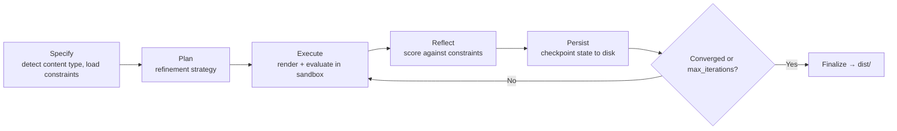
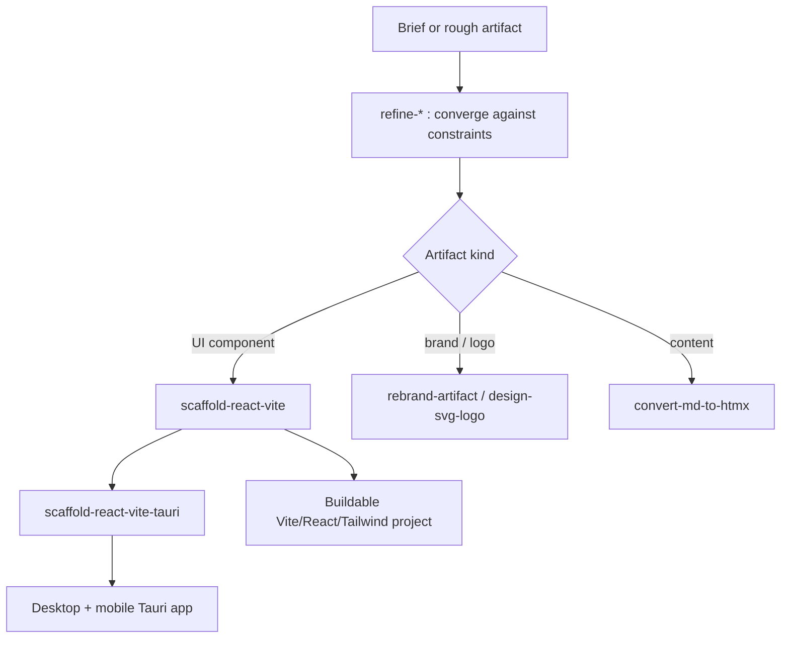

# 11 · The Artifact Refiner

Most of the skill pack is about generating code. The artifact-refiner is about *improving any artifact until it converges* — a logo, a React component, an A2UI spec, a blog post, an image prompt, a meta-prompt — using the same PMPO loop discipline that governs everything else. It is an imported submodule, it is one of the largest skills in the system, and it earns its own chapter.

## What it is

The artifact-refiner is a PMPO-driven, artifact-centric refinement engine. Three properties define it: **state is persisted to disk, never held in the conversation**; it is **tool-augmented**, running real code in a sandbox to actually render and evaluate what it produces; and it is **constraint-driven**, refining against explicit constraints with severity levels until convergence rules are met, bounded by a `max_iterations = 5` guard.

It is authored by Travis James, licensed MIT, and vendored as a git submodule at version **1.4.1** (consistent across `SKILL.md` and `.claude-plugin/plugin.json`). Upstream: [`GQAdonis/artifact-refiner-skill`](https://github.com/GQAdonis/artifact-refiner-skill).

The thesis, from its own theory document:

> **Conversation is not state. Artifacts are state.**
>
> **AI thinks. Tools transform. PMPO orchestrates.**

At a high level it behaves like a compiler: intent is parsed, constraints are structured, an execution plan is generated, deterministic code runs, output is validated, and refinement loops until stable. Refinement as infrastructure.

## The refinement loop



The startup protocol resolves a state provider, initializes the artifact's state, and detects its content type. Each phase fires checkpoint and workflow-dispatch hooks; finalization writes the result to `dist/`. Model routing keeps it cheap: iterate runs on a small model, evaluate on a medium model, finalize on a small model — expensive judgment only where judgment is expensive.

## Direct vs. meta content types

The refiner distinguishes two fundamentally different kinds of artifact, and the distinction changes what "the output" is.

**Direct** content types — the output *is* the artifact: `direct:react`, `direct:html`, `direct:content`, `direct:image`, `direct:code`, `direct:a2ui`, `direct:ag-ui`.

**Meta** content types — the output is a *prompt that drives* the artifact: `meta:image-prompt`, `meta:video-prompt`, `meta:agent-prompt`, `meta:workflow`, `meta:composite`. This is the seam where the refiner connects to the rest of the metaprompting system: `pmpo-skill-creator` can delegate to it with `content_type: meta:agent-prompt` to refine an agent's driving prompt against constraints.

## State and tooling

State lives under `.refiner/`: `artifacts/<name>/state.json`, `registry.json`, plus per-artifact `artifact_manifest.json`, `constraints.json`, `refinement_log.md`, `decisions.md`, and `dist/` (with `dist/previews/`). The provider resolves in priority order: env config → `.refiner-provider.json` → `~/.refiner/provider.json` → state MCP → agent memory → filesystem.

It requires a code interpreter or e2b sandbox plus the file system; optionally image generation and a browser renderer, with local fallbacks (`node scripts/compile-tsx-preview.mjs`, `node scripts/render-preview.mjs`). Workflow triggers fire on phase complete, iteration complete, refinement complete, regression, and approval-required.

## The sixteen commands

The refiner bundles sixteen skills/commands. The ones marked ⌘ are quick-start slash commands.

| Command | Trigger | What it refines / does |
|---|---|---|
| **artifact-refiner** | — | The core PMPO refinement entry skill. |
| **refine-logo** | ⌘ `/refine-logo` | Logos, brand marks, icons, wordmarks, favicons. |
| **refine-ui** | ⌘ `/refine-ui` | React/HTML UI components and design systems. |
| **refine-content** | ⌘ `/refine-content` | Blog posts, documentation, READMEs. |
| **refine-image** | ⌘ `/refine-image` | Image assets and thumbnails. |
| **refine-a2ui** | ⌘ `/refine-a2ui` | A2UI (Artifact-to-UI) protocol specifications. |
| **refine-status** | ⌘ `/refine-status` | Report iteration count, constraint satisfaction, convergence. |
| **refine-validate** | ⌘ `/refine-validate` | Validate schemas, file integrity, constraint satisfaction, completeness. |
| **refine-moodboard** | — | Synthesize a single-file HTMX moodboard from a brief (LLM → JSON → Minijinja render; placeholder fallback when the inference proxy is unreachable). |
| **design-svg-logo** | — | Lightweight SVG logo ideation — LLM-suggested SVG with strict parseability/XSS validation vs. a deterministic Minijinja placeholder; PNG export via `rsvg-convert` when present. |
| **rebrand-artifact** | — | Swap one brand's tokens for another inside a TSX artifact — mechanical AST hex-literal swap, regenerated brand-vars CSS, WCAG contrast reported (not gated). |
| **convert-md-to-htmx** | — | Markdown → self-contained branded HTMX via a markdown-it pipeline (frontmatter, semantic HTML, brand-CSS injection). |
| **convert-htmx-react** | — | HTMX+Alpine HTML → React TSX, ready for scaffolding; mechanical transforms with judgment items surfaced as a sidecar Markdown file. |
| **convert-htmx-pdf** | — | Branded HTML → paginated, print-correct PDF via Playwright/Chromium — headers, footers, page numbers, embedded fonts, optional page-1 preview raster. |
| **scaffold-react-vite** | — | Refined TSX → a buildable Vite 8 + React 19 + TS + Tailwind 4 + shadcn-on-Base-UI project, kebab-case files, feature-based clean architecture; optional Rust+Axum binary embedding the dist via rust-embed. |
| **scaffold-react-vite-tauri** | — | Wrap the scaffolded Vite/React app in a Tauri 2 shell (desktop + iOS/Android), with responsive primitives driving form factor. |

## The five subagents

The architecture's most important property is enforced at the **permission layer**, not by
instruction: of the five agents, exactly one can write.

| Agent | Tools | Role |
|---|---|---|
| `pmpo-specifier` | `Read, Grep, Glob` | ambiguous intent → structured spec |
| `pmpo-planner` | `Read, Grep, Glob` | spec → staged, dependency-ordered plan |
| `pmpo-executor` | `Read, Write, Edit, Bash, Glob, e2b sandbox` | **the only writer** |
| `pmpo-reflector` | `Read, Grep, Glob` | evaluate against constraints; decide convergence |
| `artifact-validator` | `Read, Grep, Glob, Bash` | schema, file integrity, completeness |

The specifier, planner, and reflector are *structurally incapable* of mutating state. That
is what "separation of cognition and computation" means here — a critic that cannot edit
the thing it is critiquing cannot quietly fix and then approve it.

The planner enforces a fixed dependency order:

1. Source generation first (SVG, Markdown, component code)
2. Derivative generation second (PNG rasterization, HTML rendering)
3. Showcase/report generation last
4. Manifest update always final

## Constraints

A constraint is the unit of "done". Each requires an `id`, a `description`, and a
`severity`:

| Severity | Effect on convergence |
|---|---|
| `blocking` | must be satisfied to terminate |
| `high` | must be satisfied *unless* `max_iterations` is reached |
| `medium` / `low` | reported, never blocking |

Constraints may carry a `target_metric` (`metric`, `operator` ∈ `> >= < <= ==`, `value`)
and a `validation` block declaring whether satisfying them
`requires_code_execution`. The schema is strict — `additionalProperties: false`.

> The schema's `artifact_type` enum currently lists only `logo`, `ui`, `a2ui`, `image`,
> `content` — it does not include `code`, `meta-prompt`, `ag-ui`, `html`, `react`, `svg`,
> `pdf`, `scaffold`, or `scaffold-hybrid`, all of which the sub-skills use. Constraint
> files for those types will fail strict schema validation.

## How convergence is decided

Four layers, in order:

```
IF all blocking constraints satisfied
   AND all required files exist in dist/
   AND manifest validates against schema
   AND (no high constraints violated OR iteration >= max_iterations)
THEN → TERMINATE
ELSE → INCREMENT iteration, LOOP back to Plan
```

Note the loop-back target is **Plan**, not Specify — the specification is written once and
reused, so a refinement cycle cannot quietly redefine its own success criteria.

**The iteration cap is 5.** On reaching it: log a warning, run a final Persist, set the
decision to `terminate` with reason `max_iterations_exceeded`, and output what exists —
*partial results are better than infinite loops*.

**Regression gate.** Before declaring convergence the reflector verifies that no
previously-satisfied constraint is now violated, no file has disappeared from `dist/`, the
manifest file count has not decreased, no severity was downgraded without an explicit
decision, and no generated file is 0 bytes. Any regression forces `continue`.

A real reflector verdict:

```yaml
reflection:
  iteration: 2
  max_iterations: 5
  constraint_status:
    blocking_satisfied: 3
    blocking_violated: 0
    high_satisfied: 2
    high_violated: 1
  target_alignment: "85% — dark variant missing icon-only version"
  regression_check: "No regressions detected"
  convergence:
    decision: continue
    reason: "1 high constraint violated (icon-only dark variant)"
    next_focus: "Generate dark variant icon and rasterize"
```

If the spec sets `requires_approval: true`, the loop pauses after Reflect and waits for an
explicit continue/terminate, logged to `decisions.md`. Otherwise it runs autonomously.

## Preview evidence

For `ui` and `a2ui` artifacts, convergence requires *proof it rendered* — not a claim that
it would. A converged UI refinement carries:

```
dist/previews/card/preview.html          # renderable document
dist/previews/card/screenshot.png        # captured browser screenshot
dist/previews/card/preview-report.json   # console errors, request failures
```

and the manifest records the verdict:

```json
"validation": {
  "preview_status": "pass",
  "has_console_errors": false,
  "has_request_failures": false
}
```

This is the same principle as adversarial review's `checked_classes`: an assertion of
success must carry its evidence, or it does not count.

## Graceful degradation

Only two things are hard requirements: a **code interpreter or e2b sandbox**, and **file
system** access. Everything else degrades:

| Missing | Behaviour |
|---|---|
| `browser_renderer` MCP | falls back to `node scripts/render-preview.mjs` |
| browser deps entirely | explicit diagnostics, soft-fail |
| openai-proxy unreachable | `refine-moodboard` → deterministic placeholder mode |
| LLM SVG fails validation | `design-svg-logo` → placeholder *for that variant only* |
| `rsvg-convert` | SVG still emitted; PNG raster set skipped |
| Xcode / Android SDK | `scaffold-react-vite-tauri` skips those targets |
| any state provider | falls through to the filesystem provider |

Two commands **hard-fail** by design rather than produce something wrong:
`convert-htmx-pdf` requires Playwright/Chromium, and `scaffold-react-vite` pre-flights for
`pnpm`, `node`, and `template-forge`.

On PDF conversion the skill is unusually opinionated, and correctly so:

> **Do not reach for WeasyPrint, pdfkit, or wkhtmltopdf here.** Their CSS support diverges
> from the browser in exactly the areas branded artifacts depend on, which defeats the
> purpose of converting a designed page.

## Model routing

Advisory, not mandatory — cooperating harnesses read a `MODEL_ROUTING` block at the top of
each phase controller and switch models per phase; others ignore it and the loop still
works.

| Phase | Class | Why |
|---|---|---|
| `refiner-iterate` | small | mechanical constraint-diff edits |
| `refiner-evaluate` | medium | calibrated scoring judgment |
| `refiner-finalize` | small | manifest write, log commit, archive |

## Where it fits in the system

The artifact-refiner is the per-change QA layer of the KBD orchestrator (Layer 3 in the orchestrator's three-level model) and the QA delegate of the evolver. When the orchestrator executes a change that produces a UI component or a brand asset, it can hand that artifact to the refiner, which renders it in a sandbox, scores it against constraints, and iterates to convergence — instead of trusting that the first generation was good enough. Combined with `scaffold-react-vite`, it spans the full distance from a refined component to a buildable, deployable project. That end-to-end reach — refine the artifact, then scaffold the application around it — is why it is one of the most-used skills in real workflows.



---

## See also

- [12 · Agent Creator](12-native-agent-generator.md) — the sibling generator for services
- [14a · forge-rs & Template Runtimes](14a-forge-rs.md) — `template-forge`, which `scaffold-react-vite` and `rebrand-artifact` shell out to
- [22a · Self-Extending Agents](22a-self-extending-agents.md) — how this composes with the loops

---

*Previous: [← 10 · Language & Domain Skills](10-language-skills.md) · Next: [12 · The Agent Creator →](12-native-agent-generator.md)*
