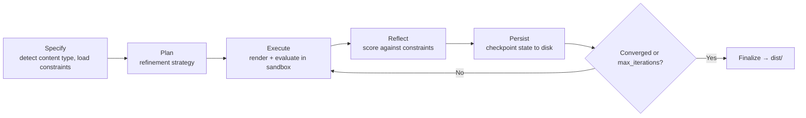
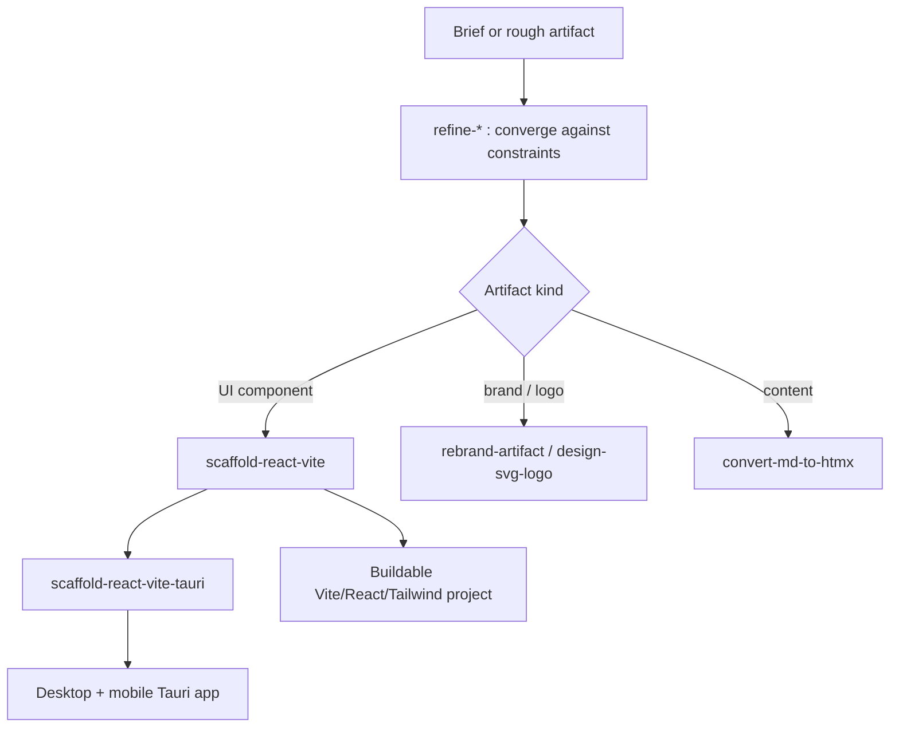

# 11 · The Artifact Refiner

Most of the skill pack is about generating code. The artifact-refiner is about *improving any artifact until it converges* — a logo, a React component, an A2UI spec, a blog post, an image prompt, a meta-prompt — using the same PMPO loop discipline that governs everything else. It is an imported submodule, it is one of the largest skills in the system, and it earns its own chapter.

## What it is

The artifact-refiner is a PMPO-driven, artifact-centric refinement engine. Three properties define it: **state is persisted to disk, never held in the conversation**; it is **tool-augmented**, running real code in a sandbox to actually render and evaluate what it produces; and it is **constraint-driven**, refining against explicit constraints with severity levels until convergence rules are met, bounded by a `max_iterations = 5` guard.

It is authored by Travis James and licensed MIT. One honest note up front: its version is reported inconsistently across its own manifests — the README says `1.1.0`, the root `SKILL.md` says `1.2.0`, and the plugin manifest says `1.3.0`. That drift is a real artifact of submodule maintenance and is flagged here rather than smoothed over.

## The refinement loop

The startup protocol resolves a state provider, initializes the artifact's state, and detects its content type. Each phase fires checkpoint and workflow-dispatch hooks; finalization writes the result to `dist/`. Model routing keeps it cheap: iterate runs on a small model, evaluate on a medium model, finalize on a small model — expensive judgment only where judgment is expensive.

## Direct vs. meta content types

The refiner distinguishes two fundamentally different kinds of artifact, and the distinction changes what "the output" is.

**Direct** content types — the output *is* the artifact: `direct:react`, `direct:html`, `direct:content`, `direct:image`, `direct:code`, `direct:a2ui`, `direct:ag-ui`.

**Meta** content types — the output is a *prompt that drives* the artifact: `meta:image-prompt`, `meta:video-prompt`, `meta:agent-prompt`, `meta:workflow`, `meta:composite`. This is the seam where the refiner connects to the rest of the metaprompting system: `pmpo-skill-creator` can delegate to it with `content_type: meta:agent-prompt` to refine an agent's driving prompt against constraints.

## State and tooling

State lives under `.refiner/`: `artifacts/<name>/state.json`, `registry.json`, plus per-artifact `artifact_manifest.json`, `constraints.json`, `refinement_log.md`, `decisions.md`, and `dist/` (with `dist/previews/`). The provider resolves in priority order: env config → `.refiner-provider.json` → `~/.refiner/provider.json` → state MCP → agent memory → filesystem.

It requires a code interpreter or e2b sandbox plus the file system; optionally image generation and a browser renderer, with local fallbacks (`node scripts/compile-tsx-preview.mjs`, `node scripts/render-preview.mjs`). Workflow triggers fire on phase complete, iteration complete, refinement complete, regression, and approval-required.

## The fifteen commands

The refiner bundles fifteen skills/commands. The ones marked ⌘ are quick-start slash commands.

| Command | Trigger | What it refines / does |
|---|---|---|
| **artifact-refiner** | — | The core PMPO refinement entry skill. |
| **refine-logo** | ⌘ `/refine-logo` | Logos, brand marks, icons, wordmarks, favicons. |
| **refine-ui** | ⌘ `/refine-ui` | React/HTML UI components and design systems. |
| **refine-content** | ⌘ `/refine-content` | Blog posts, documentation, READMEs. |
| **refine-image** | ⌘ `/refine-image` | Image assets and thumbnails. |
| **refine-a2ui** | ⌘ `/refine-a2ui` | A2UI (Artifact-to-UI) protocol specifications. |
| **refine-status** | ⌘ `/refine-status` | Report iteration count, constraint satisfaction, convergence. |
| **refine-validate** | ⌘ `/refine-validate` | Validate schemas, file integrity, constraint satisfaction, completeness. |
| **refine-moodboard** | — | Synthesize a single-file HTMX moodboard from a brief (LLM → JSON → Minijinja render; placeholder fallback when the inference proxy is unreachable). |
| **design-svg-logo** | — | Lightweight SVG logo ideation — LLM-suggested SVG with strict parseability/XSS validation vs. a deterministic Minijinja placeholder; PNG export via `rsvg-convert` when present. |
| **rebrand-artifact** | — | Swap one brand's tokens for another inside a TSX artifact — mechanical AST hex-literal swap, regenerated brand-vars CSS, WCAG contrast reported (not gated). |
| **convert-md-to-htmx** | — | Markdown → self-contained branded HTMX via a markdown-it pipeline (frontmatter, semantic HTML, brand-CSS injection). |
| **convert-htmx-react** | — | HTMX+Alpine HTML → React TSX, ready for scaffolding; mechanical transforms with judgment items surfaced as a sidecar Markdown file. |
| **scaffold-react-vite** | — | Refined TSX → a buildable Vite 8 + React 19 + TS + Tailwind 4 + shadcn-on-Base-UI project, kebab-case files, feature-based clean architecture; optional Rust+Axum binary embedding the dist via rust-embed. |
| **scaffold-react-vite-tauri** | — | Wrap the scaffolded Vite/React app in a Tauri 2 shell (desktop + iOS/Android), with responsive primitives driving form factor. |

## Where it fits in the system

The artifact-refiner is the per-change QA layer of the KBD orchestrator (Layer 3 in the orchestrator's three-level model) and the QA delegate of the evolver. When the orchestrator executes a change that produces a UI component or a brand asset, it can hand that artifact to the refiner, which renders it in a sandbox, scores it against constraints, and iterates to convergence — instead of trusting that the first generation was good enough. Combined with `scaffold-react-vite`, it spans the full distance from a refined component to a buildable, deployable project. That end-to-end reach — refine the artifact, then scaffold the application around it — is why it is one of the most-used skills in real workflows.

---

*Previous: [← 10 · Language & Domain Skills](10-language-skills.md) · Next: [12 · The Native Agent Generator →](12-native-agent-generator.md)*
