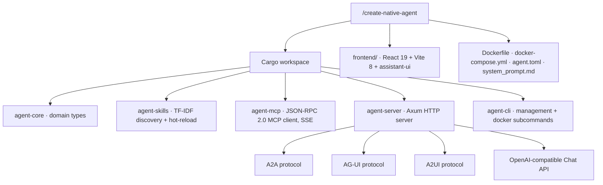
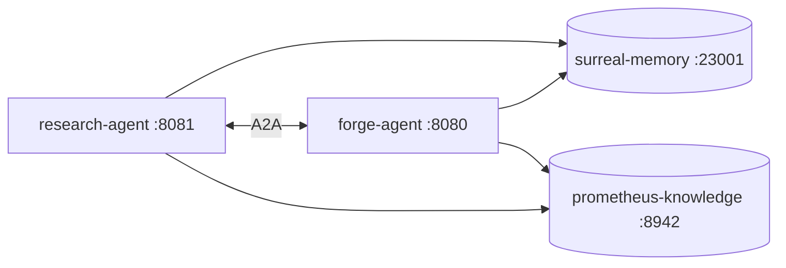

# 12 · The Native Agent Generator

The skill pack can generate skills, templates, and CLIs. The native-agent generator goes further: it generates a complete, production-ready, standalone AI agent — a Rust binary with an HTTP server, a React 19 chat frontend, multi-provider model routing, an MCP client, and a Supabase-style management CLI — in one command. This is the most ambitious generation capability in the system, and it is what lets the pack produce *deployable products*, not just better code.

## One command

```
/create-native-agent
→ prompts for name, description, provider, port
→ generates a complete Rust workspace + React 19 frontend
→ validates with cargo check + npm install
→ ready to run
```

The default build target is Docker. Pass `target: librefang-wasm` to produce a WASM-ABI skill instead, or `target: both`. A companion command, `/native-agent-status`, reports on a generated agent. The generation flow runs the PMPO phases — specify (frontier), plan (frontier), generate (tiered), validate (small) — and the specify phase auto-detects whether it is running in a Docker environment.

## What gets generated



The workspace is a five-crate Rust project. `agent-core` holds the domain types. `agent-skills` is the skill engine — TF-IDF selection over configured skill directories, hot-reloadable. `agent-mcp` is a JSON-RPC 2.0 MCP client with SSE. `agent-server` is the Axum HTTP server. `agent-cli` is the management binary. The `frontend/` is a React 19 + Vite 8 app using `assistant-ui`, with a `Chat.tsx` that adapts the AG-UI SSE stream. Infrastructure comes with it: a multi-stage `Dockerfile` (cargo-chef + Node, ending at a non-root `debian:bookworm-slim`), `docker-compose.yml`, `agent.toml`, `system_prompt.md`, and `.env.example`.

## The three protocols

A generated agent speaks three agent-interoperability protocols plus an OpenAI-compatible chat API. This is what lets generated agents plug into existing ecosystems rather than being islands.

**A2A (Agent-to-Agent).** An agent card at `GET /.well-known/agent.json` advertises capabilities; tasks are submitted to `POST /a2a/tasks` as `{task_id, message, context}` and return `{task_id, status, result}`. This is the protocol that lets agents call each other.

**AG-UI (CopilotKit-compatible).** A run is started with `POST /agui/run` (`{model, provider, messages}` → `{run_id}`) and streamed from `GET /agui/events/:run_id` as Server-Sent Events: `agui.run.started`, `agui.text.delta`, `agui.tool.call.started`, `agui.tool.call.result`, `agui.run.complete`. This is what drives the live chat frontend.

**A2UI (the Prometheus combined protocol).** `POST /a2ui/session` (`{message, session_id, stream}`) combines agent interaction and UI streaming.

**Chat API.** `POST /api/chat` is OpenAI-compatible, and `GET /*` serves the frontend.

## The management CLI

The generated binary ships a Supabase-style management CLI — the agent manages itself the way a modern service does.

```bash
my-agent start [--port 8080] [--background]    # start the server
my-agent stop / status / logs                  # lifecycle
my-agent providers list / set-default anthropic
my-agent models set-default claude-haiku-4-5
my-agent mcp add forge http://localhost:8943/mcp
my-agent mcp remove / ping / list
my-agent skills list / reload                  # hot-reload skills
my-agent config show / get / set

# Docker subcommands
my-agent docker detect / build / load / up / down / ps / logs / push / shell
```

All model calls route through `liter-llm`, so switching providers or models is a CLI command, not a code change. The skills engine hot-reloads from configured directories, so adding a skill does not require a rebuild.

## Agent networks

Because every generated agent speaks A2A, multiple agents form a network by pointing at each other's A2A endpoints — and they share the same memory and knowledge substrate.



A research agent can hand a task to a forge agent over A2A; both read and write the same surreal-memory graph at port 23001 and the same knowledge base at 8942. The substrate that makes a single loop compound is the same substrate that lets a *network* of agents share what they learn. The full protocol specification lives in the skill's `references/protocols.md`.

## Build targets and the WASM path

The default target wraps the agent in Docker. The `librefang-wasm` target instead produces a `crates/agent-skill/` with a `skill.toml`, compiled against the LibreFang Guest ABI for `wasm32-unknown-unknown` — a sandboxed, capability-checked skill that runs in a wasmtime host. This connects to the `librefang-wasm-skill` Rust skill ([Language & Domain Skills](10-language-skills.md)) and the upload-to-bossfang child skill, which handles distribution. The `both` target produces both. The choice is about deployment surface: Docker for a standalone service, WASM for a sandboxed skill that runs inside another host. The next page — [The Rust Toolchain](14-rust-toolchain.md) — covers how all of this gets built.

---

*Previous: [← 11 · The Artifact Refiner](11-artifact-refiner.md) · Next: [13 · Tools Reference →](13-tools-reference.md)*
