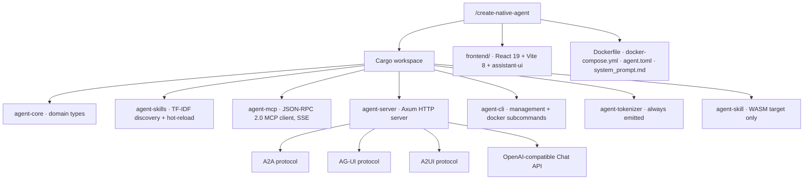
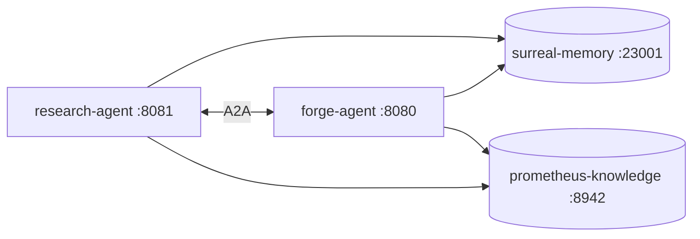

# 12 · The Agent Creator (`native-agent`)

The skill pack can generate skills, templates, and CLIs. The native-agent generator goes further: it generates a complete, production-ready, standalone AI agent — a Rust binary with an HTTP server, a React 19 chat frontend, multi-provider model routing, an MCP client, and a Supabase-style management CLI — in one command. This is the most ambitious generation capability in the system, and it is what lets the pack produce *deployable products*, not just better code.

## One command

```
/create-native-agent
→ prompts for name, description, provider, port
→ generates a complete Rust workspace + React 19 frontend
→ validates with cargo check + npm install
→ ready to run
```

The default build target is Docker. Pass `target: librefang-wasm` to produce a WASM-ABI skill instead, or `target: both`. The generation flow has two prompt phases — **specify** (interactive Q&A) and **generate** (render + verify); validation is a section inside generate, not a separate phase. The specify phase auto-detects Docker.

## Why you would reach for it

A generated agent is a **service**, not a delegation. Use it when you need:

- **Something other agents can call.** It self-advertises at `GET /.well-known/agent.json`.
  Another agent adds one `[[mcp_servers]]` entry and yours becomes a tool in its tool list.
- **Its own model policy** — `agent.toml` routes through liter-llm and is switchable at
  runtime, independent of whatever harness spawned it.
- **A user-facing surface** — a React 19 assistant-ui chat served at `GET /*`.
- **A deployable artifact** — a Docker image, or a `.lf-skill.zip` for a remote host.
- **Lifecycle independence** — `start --background` writes `.agent.pid`; it outlives the
  session that created it.

If none of those apply, you want a skill or a subagent instead. See
[22a · Self-Extending Agents](22a-self-extending-agents.md).

## Native agent versus Dynamic Operations

A generated native agent is a persistent product: its own process, port, model policy, skills engine, protocols, UI, and lifecycle. [Prometheus Exec](/docs/execution/overview-and-use-cases) owns one bounded operation: declared code and inputs enter; ordered events, content-addressed artifacts, and a signed receipt come back.

| Need | Use |
| --- | --- |
| A chat UI, A2A endpoint, model routing, or a service that survives the session | `/create-native-agent` |
| A generated Python, Node, or Bash calculation with OS isolation and an attested receipt | Prometheus Exec Tier P |
| A portable deterministic Prometheus WIT component | Prometheus Exec Tier W |
| A persistent agent that sometimes needs evidenced calculations | Native agent plus an explicit Exec adapter for those sub-jobs |

The current generator does not wire Prometheus Exec automatically. Its MCP client is network-oriented, while Exec exposes stdio MCP and private Unix-socket REST. Add a deliberate local adapter when composition is required.

The generator's `librefang-wasm` output is also not a Tier W component. It is a `wasm32-unknown-unknown` core module using the LibreFang Guest ABI. Tier W requires `prometheus:component@0.1.0`; shared domain logic needs separate adapters for the two hosts. The complete decision guide is [Choose a skill, program, operation, or native agent](/docs/execution/choosing-the-right-capability).

## What Specify asks

Everything is asked before anything is written.

| Field | Default | Validation |
|---|---|---|
| `agent_name` | — | `^[a-z][a-z0-9-]+$` |
| `agent_description` | `A Prometheus AGS native agent` | required |
| `port` | `8080` | `1024–65535` |
| `default_provider` | `anthropic` | `anthropic` / `openai` / `local` |
| `default_model` | `claude-sonnet-4-6` | required |
| `enable_surreal` / `enable_forge` / `enable_pk` | `true` | adds each as an MCP server |
| `target` | `docker` | `docker` · `librefang-wasm` · `both` |

Docker detection then runs, and only if Docker is present does it ask about
`enable_docker`, `image_tag`, whether to build now (offered only when Desktop is actually
running), and whether to `compose up`. A confirmation summary precedes generation.

Verification is automatic:

```bash
cargo check --workspace --manifest-path <output_dir>/Cargo.toml
npm install --prefix <output_dir>/frontend --silent
```

## What gets generated



The workspace is a **six-crate** Rust project (seven with the WASM target). Earlier documentation said five; `agent-tokenizer` is always a workspace member, and `agent-skill` is added for `librefang-wasm` or `both`. `agent-core` holds the domain types. `agent-skills` is the skill engine — TF-IDF selection over configured skill directories, hot-reloadable. `agent-mcp` is a JSON-RPC 2.0 MCP client with SSE. `agent-server` is the Axum HTTP server. `agent-cli` is the management binary. The `frontend/` is a React 19 + Vite 8 app using `assistant-ui`, with a `Chat.tsx` that adapts the AG-UI SSE stream. Infrastructure comes with it: a multi-stage `Dockerfile` (cargo-chef + Node, ending at a non-root `debian:bookworm-slim`), `docker-compose.yml`, `agent.toml`, `system_prompt.md`, and `.env.example`.

## The three protocols

A generated agent speaks three agent-interoperability protocols plus an OpenAI-compatible chat API. This is what lets generated agents plug into existing ecosystems rather than being islands.

**A2A (Agent-to-Agent).** An agent card at `GET /.well-known/agent.json` advertises capabilities; tasks are submitted to `POST /a2a/tasks` as `{task_id, message, context}` and return `{task_id, status, result}`. This is the protocol that lets agents call each other.

**AG-UI (CopilotKit-compatible).** A run is started with `POST /agui/run` (`{model, provider, messages}` → `{run_id}`) and streamed from `GET /agui/events/:run_id` as Server-Sent Events: `agui.run.started`, `agui.text.delta`, `agui.tool.call.started`, `agui.tool.call.result`, `agui.run.complete`. This is what drives the live chat frontend.

**A2UI (the Prometheus combined protocol).** `POST /a2ui/session` (`{message, session_id, stream}`) combines agent interaction and UI streaming.

**Chat API.** `POST /api/chat` is OpenAI-compatible, and `GET /*` serves the frontend.

## The management CLI

The generated binary ships a Supabase-style management CLI — the agent manages itself the way a modern service does.

```bash
my-agent start [--port 8080] [--background]    # start the server
my-agent stop / status / logs                  # lifecycle
my-agent providers list / set-default anthropic
my-agent models set-default claude-haiku-4-5
my-agent mcp add forge http://localhost:8943/mcp
my-agent mcp remove / ping / list
my-agent skills list / reload                  # hot-reload skills
my-agent config show / get / set

# Docker subcommands
my-agent docker detect / build / load / up / down / ps / logs / push / shell
```

All model calls route through `liter-llm`, so switching providers or models is a CLI command, not a code change. The skills engine hot-reloads from configured directories, so adding a skill does not require a rebuild.

## Agent networks

Because every generated agent speaks A2A, multiple agents form a network by pointing at each other's A2A endpoints — and they share the same memory and knowledge substrate.



A research agent can hand a task to a forge agent over A2A; both read and write the same surreal-memory graph at port 23001 and the same knowledge base at 8942. The substrate that makes a single loop compound is the same substrate that lets a *network* of agents share what they learn. The full protocol specification lives in the skill's `references/protocols.md`.

## Build targets and the WASM path

The default target wraps the agent in Docker. The `librefang-wasm` target instead produces a `crates/agent-skill/` with a `skill.toml`, compiled against the LibreFang Guest ABI for `wasm32-unknown-unknown` — a sandboxed, capability-checked skill that runs in a wasmtime host. This connects to the `librefang-wasm-skill` Rust skill ([Language & Domain Skills](10-language-skills.md)) and the upload-to-bossfang child skill, which handles distribution. The `both` target produces both. The choice is about deployment surface: Docker for a standalone service, WASM for a sandboxed skill that runs inside another host. The next page — [The Rust Toolchain](14-rust-toolchain.md) — covers how all of this gets built.

## Generated agent vs plain subagent

Both get called "agents". They are different artifacts entirely.

| | Subagent (`agents/*.md`) | Generated native agent |
|---|---|---|
| Artifact | one markdown file | Cargo workspace + React app + Docker stack |
| Runtime | inside the harness process | own OS process, own port |
| Lifecycle | spawned per task | `start --background`, survives the session |
| Reachable by | only its parent | any HTTP client; other agents via A2A |
| Model | whatever the harness assigns | own `agent.toml`, switchable at runtime |
| Tools | harness tools | own MCP client aggregating servers |
| UI | none | bundled React chat |
| Ship it | copy a file | Docker image or `.lf-skill.zip` |

**Use a subagent** for bounded delegation inside one session — review, verify, critique.
The pack ships six: `kbd-idea-critic`, `kbd-spec-reviewer`, `kbd-goal-evaluator`,
`kbd-task-verifier`, `rust-auditor`, `gitops-architect`.

**Use a generated agent** when the work outlives the session, needs its own address, needs
its own model policy, or ships to someone else.

## End to end: `/start-business-build`

The fullest demonstration of composition in the pack — a child skill chaining ideation →
specification → planning → generation → packaging → deployment:

```
$ /start-business-build "track shipping-cost trends across our top 5 carriers"

Stage 1: Ideation mindmap...                            ✅
Stage 2: ZeeSpec — 60 questions answered, 4 NO-GO       ✅
Stage 3: Evolver plan — 3 changes ordered               ✅
Stage 4: OpenSpec changes generated                     ✅
Stage 5: change-001 (carrier-data-scraper)              ✅ accepted
Stage 5: change-002 (price-trend-analyzer)              ✅ accepted
Stage 5: change-003 (alert-dispatch)                    ⚠ rejected (carrier API rate limits)
        pk ingest captured: "carrier API rate limits force alerting to be daily"
Stage 6: forge package-librefang ./shipping-cost-watch  ✅ → .lf-skill.zip (78 KB)
Stage 6: /upload-to-bossfang?                           y  → installed and verified
```

The *rejection* is the interesting line: a constraint discovered during implementation is
captured into the knowledge base rather than discarded. `--dry-run` estimates first —
`Estimated cost: $4.20 (frontier) + $0.80 (tiered)` / `Estimated wall time: 20m`.

## Deployment hardening

`/upload-to-bossfang` is deny-by-default against SSRF: scheme allowlist, rejection of
embedded credentials, DNS resolution with blocks on loopback, RFC1918, link-local
(`169.254.0.0/16` — cloud metadata), CGNAT, multicast and reserved ranges, a required
host:port allowlist at `~/.config/prometheus-skill-pack/bossfang-allowlist.toml`, and
`curl --max-redirs 0 --resolve` pinning to the validated IP.

## Known gaps

Documented so they do not surprise you mid-generation:

- **Docker CLI wiring is model-generated, not template-rendered.** `agent_cli.rs.tera` has
  no `Docker` arm; the generate prompt instructs the model to add `mod docker;` and wire
  `DockerAction` by hand. If `my-agent docker ...` is missing, that step was skipped.
- **Four frontend files have no template** — `main.tsx`, `vite.config.ts`, `index.html`,
  and `App.tsx` are generated inline.
- **Frontend deps are loosely pinned.** Seven are pinned to the literal `"latest"`; pin
  them before committing a generated project.
- **The frontmatter `model_routing` block is aspirational.** It names four phases and a
  `references/model-routing.md` that does not exist; no script in the skill reads a model
  policy.

## See also

- [12a · Skill Creator](12a-pmpo-skill-creator.md) — the sibling generator, for skills
- [22a · Self-Extending Agents](22a-self-extending-agents.md) — skill vs agent vs both
- [14a · forge-rs](14a-forge-rs.md) — `forge package-librefang`, the WASM packager
- `skills/process/native-agent/references/protocols.md` — A2A/AG-UI/A2UI wire formats

---

*Previous: [← 11 · The Artifact Refiner](11-artifact-refiner.md) · Next: [13 · Tools Reference →](13-tools-reference.md)*
