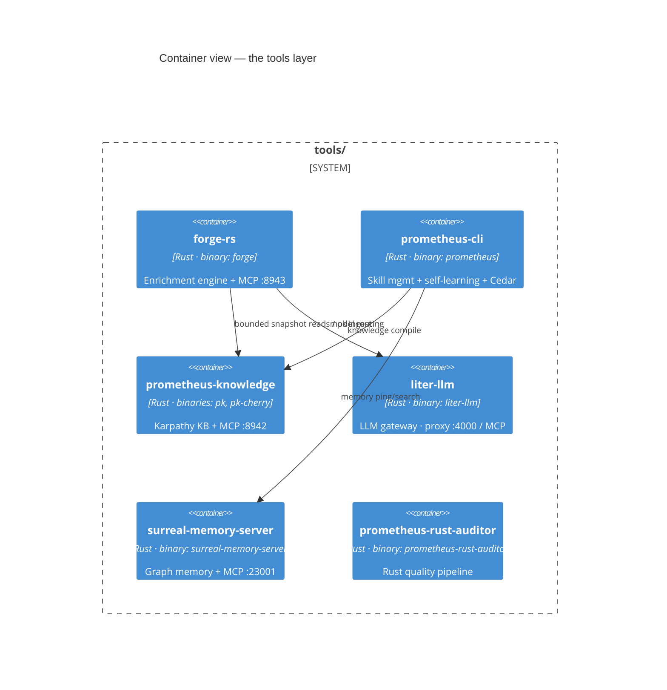

# 13 · Tools Reference

Underneath the skills sit six Rust projects in `tools/`. Three are git submodules with independent lifecycles (`surreal-memory-server`, `prometheus-knowledge`, `liter-llm`); three are in-tree (`forge-rs`, `prometheus-cli`, `prometheus-rust-auditor`). This page documents each one in full — its purpose, its workspace layout, its CLI surface, and its MCP/REST endpoints. These are the binaries the skills shell out to and the MCP servers the loops talk to.



---

## forge-rs

**Purpose.** The code-generation enrichment engine — Layer 4 of the pipeline. It sits between an OpenSpec task and the implementing agent and injects language-specific knowledge before the agent writes code, then processes the agent's reflection back into the Karpathy loop.

**Workspace.** Six crates: `forge-core` (domain types — `Constitution`, `SkillManifest`, `EnrichmentContext`, `IterationRecord`, `DriftReport`), `forge-skills` (skill discovery, resolution, Tera rendering, dependency ordering), `forge-enricher` (task reading, language detection, bounded snapshot context), `forge-reflect` (drift computation, `pk ingest`, iteration archival), `forge-mcp` (the Axum MCP server), and `forge-cli` (the `forge` binary).

**CLI — `forge`.**

```bash
forge init                                       # scaffold .forge/ in the current project
forge enrich <task-path>                         # enrich an OpenSpec task → .forge/enriched/<id>.context.md
forge reflect <iteration-id>                     # process an iteration into the Karpathy loop
forge drift [--language rust]                    # report stale skill candidates
forge validate <file> --language rust            # check a file against the constitution (exits 1 on Error-severity violations)
forge status                                     # show forge environment health: constitutions, drift, pk_mcp_url, features
forge mcp [--port 8943] [--bind 127.0.0.1]      # start the MCP server (loopback-only by default)
forge skill list | add <name> | sync            # manage skills
forge constitution <lang>                        # show/edit the language constitution
forge template new skill <lang> <name>           # scaffold a new skill
forge template new template <skill-path> <name>  # add a template to an existing skill
forge template render <tmpl> [--var k=v]         # render a template
forge template list [--language] | validate <skill-path> | edit <tmpl>
```

**MCP server.** Default port **8943**, JSON-RPC 2.0 over `POST /mcp` plus a `GET /events` SSE stream, binding **`127.0.0.1:8943`** (loopback-only by default; pass `--bind 0.0.0.0` to expose on all interfaces, which prints a security warning). All requests to `/mcp` require a **Bearer token** — set `FORGE_MCP_TOKEN` in the environment; if unset, a token is auto-generated and printed to stderr on startup. The `/health` endpoint is unauthenticated. Tools: `forge_enrich {task_path}`, `forge_reflect {iteration_id}`, `forge_drift {language}`, `forge_validate {content, language}`.

**Security.** `task_path` in `forge_enrich` is canonicalized via `std::fs::canonicalize()` and verified with `starts_with()` to be inside the working directory before any file read — path traversal is rejected with a 400 error. No API keys or credentials are stored in source code; `TAVILY_API_KEY` and `FIRECRAWL_API_KEY` must be provided as environment variables.

**Environment & state.** `PK_MCP_URL`, `LITER_LLM_URL`, `FORGE_SKILLS_ROOT`, `ZEESPEC_STATE_DIR`, `EDITOR`. Writes to `.forge/` (`constitution/`, `enriched/<id>.context.md`, `memory/iterations/`, `memory/drift/`, `skills/`). Supported languages with per-language constitutions: Rust, TypeScript, React 19, Flutter, HTMX, Tauri, Go, Python. **Build:** `cargo build --release -p forge-cli`.

---

## prometheus-cli

**Purpose.** The CLI companion for the whole pack — manages skills, validates GitOps, and runs the self-learning pipeline. This is the binary that ties the four-layer self-learning engine together across the 14-target distribution matrix.

**Workspace.** `prometheus-cli` (the binary), `prometheus-agents` (platform detection, install, trace protocol), `prometheus-learn` (trace capture, grading, knowledge compilation, DSPy optimization — designed to be embeddable in the UAR), and `prometheus-cedar` (the Cedar Skill-Mutation policy enforcement point, on `cedar-policy 4`).

**CLI — `prometheus`.**

```bash
prometheus install [--agent <a>] [--local] [--no-symlink] [--plugin]
prometheus uninstall <name> [--agent <a>]
prometheus list [--all --global --project --verbose]
prometheus search <query> [--limit N]
prometheus audit [path]                          # Rust workspace audit
prometheus verify [--update]
prometheus doctor                                # read-only diagnosis
prometheus doctor --json                         # machine-readable report
prometheus doctor --fix --dry-run                # safe repair planning
prometheus doctor --refresh --dry-run            # pinned-source refresh planning
prometheus doctor --exclude <check-or-service>   # repeatable pre-execution exclusion
prometheus status [path]
prometheus generate <path> [--language]          # forge-style generation
prometheus validate [path]
prometheus build <service> <overlay> [--gitops-path]
prometheus memory <ping|stats|search <q>|install>
prometheus evolve <name> [--domain --phase]
prometheus learn [--capture-session --seed --compile --lint --dry-run]
prometheus learning status --json                # worker and queue state machine
prometheus optimize <skill> [--min-traces N --dry-run]
prometheus policy <show|validate|check>
prometheus sycophancy <detect|score|correct> <file> [-s strictness]
prometheus setup [--non-interactive --dry-run --check --rebuild]
prometheus skill lint [--json]
prometheus skill budget --harness <name> [--budget-chars N] [--json]
prometheus skill eval --harness <name> [--corpus <file> --trace <file> --json]
prometheus kbd --path <project> status [--json]
prometheus kbd --path <project> <pause|revise|resume|cancel>
prometheus kbd --path <project> <audit|watch|migrate|rollout>
prometheus kbd --path <project> <phase|stage|change|task|completion|decision|blocker>
```

The `policy check` subcommand gates the operations `skill.mutate`, `skill.generate`, `skill.promote`, and `trace.capture` against the Cedar policy per environment. The `sycophancy` subcommands are a CLI front-end to the [sycophancy-correction](07-sycophancy-correction.md) server. **Build:** `cargo build --release -p prometheus-cli` → copied to `~/.local/bin/prometheus`. (This crate has no README; its surface is documented here from `Cargo.toml` and the clap definitions in `main.rs`.)

`prometheus skill` validates the instruction inventory, measures
trace-backed harness discovery budgets without inventing unknown ceilings, and
grades the 30-prompt critical-skill activation corpus.

`prometheus kbd` is the canonical control client. It submits typed,
idempotent commands to Sovereign Sync, reads signed state, manages the
single-writer journal, migrates legacy ledgers, and records rollout evidence.
The detailed operator reference is in [CLI & Scripts](16-cli-and-scripts.md);
token, journal, and troubleshooting runbooks are published in the
[KBD section](/docs/kbd/overview).

---

## prometheus-knowledge

**Purpose.** The Karpathy LLM-knowledge-base method implemented in Rust — a self-maintaining, human-readable Markdown wiki, compiled and linted by LLMs, with no vector database and TF-IDF text search.

**Workspace.** `pk-core` (`WikiEntry`, `RawDoc`, `LintReport`, `LibrarianEvent`), `pk-store` (flat-file Markdown store + in-memory TF-IDF), `pk-watcher` (notify-rs FSEvents/inotify → tokio inbox), `pk-librarian` (compile/lint/focus/auto-fix + a model router), `pk-mcp` (Axum SSE server), `pk-uar`, `pk-cherry` (the Cherry Studio MCP bridge binary), `pk-event-store`, and `pk-cli` (the `pk` binary).

**CLI — `pk`.**

```bash
pk ingest <file|stdin> [--source --scope project|shared --yes]
pk lint [--fix]
pk search <query>
pk get <id> | pk list | pk stats
pk init [--name --stack --yes]
pk doctor [--json]                  # non-mutating generation, snapshot, queue health
pk migrate [--execute]
pk codegraph extract [--ci]         # BDD scenario → source mapping
pk events list [--kind --limit --json] | for-entry --json
```

KB directory resolution: `--kb-dir`/`PK_KB_DIR` → shared (`~/.prometheus/knowledge/shared/`) → project (`<root>/.prometheus/knowledge/`) → global (`~/.prometheus/knowledge/`).

**MCP server and worker.** `pk-cherry` binds `127.0.0.1:8942` (env `PK_BIND`) and exposes `POST /mcp` plus `GET /events`. `prometheus-learning-worker` owns durable queue reconciliation and immutable project/shared/global snapshot publication. Model routing uses `PK_COMPILE_MODEL`/`CLOUD_LLM_URL` and `PK_LINT_MODEL`/`LOCAL_LLM_URL`. **Build:** `cargo build --release -p pk-cherry -p pk-cli -p prometheus-learning-worker`.

---

## liter-llm

**Purpose.** A universal LLM API client — 140+ providers, streaming, tool calling — Rust-powered with polyglot bindings. In the skill pack it is the model gateway that makes per-phase routing possible without per-loop key management.

**Workspace.** A core `liter-llm` library plus bindings: `liter-llm-cli`, `-ffi`, `-jni`, `-node` (napi), `-php`, `-proxy`, `-py`, `-wasm`, and Dart/Swift packages. Edition 2024, version `1.4.0-rc.27`.

**CLI — `liter-llm`.** Two subcommands:

```bash
liter-llm api  [--config --host 0.0.0.0 -p 4000 --master-key --debug]   # OpenAI-compatible proxy
liter-llm mcp  [--config --transport stdio|http --host 127.0.0.1 --port 3001]   # MCP tool server
```

The proxy defaults to port **4000** with a 600-second request timeout and a 10 MiB body limit. In the skill pack, liter-llm is registered as a stdio MCP server (`liter-llm mcp --transport stdio`) and described as exposing **22 MCP tools** for routing, virtual keys, rate limits, cost tracking, and caching. (Its `Cargo.toml` cites "142+ providers"; the skill-pack configs say "140+." Both numbers appear in the repository — the discrepancy is noted rather than resolved.)

---

## surreal-memory-server

**Purpose.** A production-grade, dual-transport AI memory system in Rust — a knowledge graph plus mem0-compatible scoped memory plus an optional Memory Palace, backed by SurrealDB with HNSW vector search. It exposes both MCP (stdio + HTTP) and a REST API.

**Workspace.** A root binary `surreal-memory-server` plus an embeddable `crates/surreal-memory` library (embeddings via OpenAI/Cohere/Candle; SurrealDB storage + migrations; an opt-in `palace` feature; memory types Episodic/Semantic/Procedural/Associative across User/Session/Agent scopes; mindmaps; model profiles; task streams). The server exposes API modules (a2a, entities, memory, mindmaps, palace, search), MCP handlers ("42+ tools"), and a TTL worker.

**MCP & REST.** Canonical MCP URL in the skill pack is **`http://localhost:23001/mcp/sse`**. MCP tool families cover the knowledge graph, Graph-RAG, scoped memory, TaskStreams, TaskSteps, Mindmaps, and optional Memory Palace. Durable writes use `POST /api/v2/operations`; reconciliation uses `GET /api/v2/operations/{operation_id}` and resumable `/events?after=` SSE. `/health` reports liveness and `/ready` reports ledger/model capabilities. Existing v1 read/search resources remain available for compatibility. See the canonical [Operation API](/docs/memory/operation-api).

**Build.** `cargo build --release` builds the canonical native service (embedded SurrealDB client + local Candle embeddings); `--features palace` and `--features cuda|metal` add optional capabilities. The managed local service binds **23001** and uses the dedicated SurrealDB instance on **28000**. Containers are optional development packaging, not an installation requirement. Environment defaults: `SURREAL_MEMORY_URL`, `SURREAL_MEMORY_NAMESPACE` (`prometheus`), `SURREAL_MEMORY_DATABASE` (`skillpack`).

---

## prometheus-rust-auditor

**Purpose.** A staged, autonomous Rust code-quality remediation pipeline. It is both a tool here and a skill in `skills/rust/`.

**CLI — `prometheus-rust-auditor`.** Global args `-c/--config <FILE>` (default `./prometheus-auditor.toml`), `--format text|json|sarif`, `-v/--verbose`. Subcommands map to phases:

```bash
prometheus-rust-auditor audit        # run all phases
prometheus-rust-auditor enforce      # Phase 1 · Clippy
prometheus-rust-auditor format       # Phase 2 · cargo fmt
prometheus-rust-auditor deps         # Phase 3 · cargo-deny + cargo-audit
prometheus-rust-auditor inventory    # Phase 4 · crate inventory
prometheus-rust-auditor partition    # Phase 5 · per-partition architectural invariants
prometheus-rust-auditor ci           # Phase 10 · CI workflow generation
prometheus-rust-auditor autonomous   # Phases 6–9 · AI audit loop (requires the claude CLI)
```

The config defines workspace partitions (actor/mcp/wasm/persistence/runtime/networking by crate-name glob), architectural invariants (e.g. `actor_no_shared_mutable_state`, `wasm_unsafe_confined`, `async_cancellation_safe`), and Clippy lint policy (pedantic/nursery warn; `unwrap_used`/`panic`/`await_holding_lock` deny). **Build:** `cargo build --release`.

---

## prometheus-exec

**Purpose.** An optional evidence-producing execution service. It runs native Python/Node/Bash through fail-closed Tier P process isolation or authorized WebAssembly components through deterministic Tier W. Its primary output is a signed receipt bound to request, code, inputs, capabilities, limits, environment, streams, and content-addressed artifacts.

**Boundary.** `prometheus-exec` executes eligible bytes; it does not generate programs or host an autonomous agent. Forge and installed language toolchains author/build code. `/create-native-agent` produces a persistent addressable service. Tier P does not accept arbitrary native binaries, and Tier W's Prometheus component ABI is distinct from the native-agent LibreFang WASM ABI.

**Surfaces.** The same durable facade backs the mode-`0600` same-user Unix-socket REST API, CLI, and six MCP stdio tools. Embedded desktop/mobile hosts use the estate-free Rust/FFI boundary. Estate-only Tier R dispatch uses enrolled peer identities and per-target immutable queues without coupling local execution to KBD or Sovereign services.

```bash
prometheus-exec daemon --socket ./exec.sock --state-dir ./state --identity ./identity.json
prometheus-exec run --socket ./exec.sock --state-dir ./state --identity ./identity.json \
  --runtime python3 --code ./job.py --format json
prometheus-exec verify-bundle --index ./execution-evidence.json --format json
```

See the canonical [Dynamic Operations section](/docs/execution/overview-and-use-cases), [capability decision guide](/docs/execution/choosing-the-right-capability), and [OpenAPI 3.1 specification](/openapi/prometheus-exec.openapi.json).

## A note on the submodule discrepancies

This page documents two intentional skill-pack standardizations that differ from upstream defaults, because a reader cross-checking against the upstream repos will otherwise be confused: surreal-memory runs on **23001** here (upstream default `3000`), and liter-llm's tool/provider counts are cited slightly differently across the repository ("22 MCP tools," "140+"/"142+ providers"). Where a tool has no README — `prometheus-cli` and `prometheus-rust-auditor` — the CLI surface above was reconstructed from `Cargo.toml`, `main.rs`, and the default config, and should be treated as accurate-but-source-derived. The next page explains how the Rust binaries are built and installed together.

---

*Previous: [← 12 · The Native Agent Generator](12-native-agent-generator.md) · Next: [14 · The Rust Toolchain & Dynamic Generation →](14-rust-toolchain.md)*
