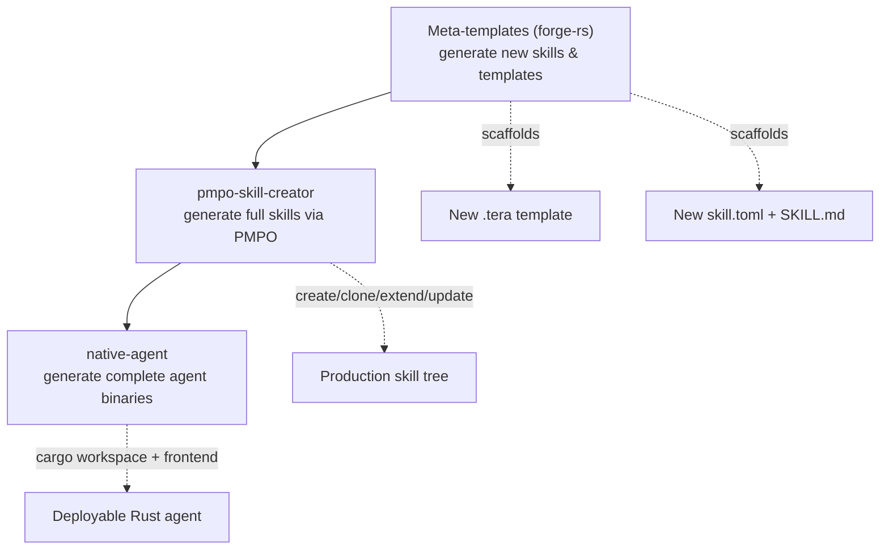

# 14 · The Rust Toolchain & Dynamic Generation

Every binary in this system is Rust. That is not an aesthetic choice — it is a structural one, and it is what makes the most distinctive capability of the pack possible: the system can generate new skills, new CLIs, new MCP servers, and complete agents *on demand*, compile them, and install them. This page covers why Rust, how the binaries are built, and how the dynamic-generation machinery works.

## Why Rust

The tools in this pack run as persistent background services that loops depend on every turn — the knowledge base, the memory graph, the enrichment engine, the model gateway. For that role, three Rust properties are load-bearing.

**Predictable tail latency.** A loop turn that stalls because a service hit a garbage-collection pause is a loop turn that wastes tokens and erodes trust. The `performance` and `rust-perf-primitives` patterns in this pack — jemalloc, `#[cold]` error paths, `MaybeUninit`, `parking_lot` over `std::sync` — exist specifically to keep p99 latency flat under production load.

**A single binary with no runtime.** Each tool ships as one statically-useful binary copied to `~/.local/bin/`. There is no interpreter to provision, no virtual environment to activate, no dependency tree to resolve at runtime. That is what lets `install-binaries.sh` set up the whole toolchain on a fresh machine in one pass.

**Compile-time guarantees at the FFI and WASM boundaries.** The pack crosses language boundaries constantly — Rust↔Python via PyO3, Rust↔Dart via flutter_rust_bridge, Rust→WASM via the LibreFang ABI. Rust's ownership model is what makes those boundaries safe to generate automatically rather than hand-audit every time.

## Installing the toolchain

The Rust toolchain itself is the one prerequisite the pack cannot install silently, because it is the thing that builds everything else.

```bash
# Install rustup + the stable toolchain
curl --proto '=https' --tlsv1.2 -sSf https://sh.rustup.rs | sh

# Add the WASM target used by librefang-wasm-skill and the native-agent WASM build
rustup target add wasm32-unknown-unknown

# Confirm
rustup show
cargo --version
```

Go and Node are detected and, where possible, installed by the prerequisite script; the Go toolchain backs the `go/go-base-patterns` skill and the Flint Go SDK, and Node backs the React/TypeScript/HTMX skills and the JS-based installers. The full prerequisite and install flow is on the [Installation](19-installation.md) page. The single command that builds and installs all six tool binaries is:

```bash
bash scripts/install-binaries.sh
# builds and installs: prometheus, forge, pk, pk-cherry, liter-llm,
#                      surreal-memory-server, prometheus-rust-auditor → ~/.local/bin/

# or, the higher-level path that also checks prerequisites:
bash scripts/check-prerequisites.sh --install --build-tools
# (npm run doctor wraps this and the smoke test)
```

## Dynamic generation — three layers

The pack generates new capability at three levels, each building on the one below.



### Layer 1 — the forge-rs meta-template system

The lowest layer generates the building blocks themselves. forge-rs ships meta-templates in `tools/forge-rs/templates/meta/` — templates that generate templates:

- `new_skill_toml.tera` — generates a `skill.toml`
- `new_skill_md.tera` — generates a `SKILL.md`
- `new_tera_template.tera` — generates a new `.tera` file with variable documentation
- `new_constitution_toml.tera` — generates a language constitution

The CLI surface:

```bash
forge template new skill rust my-skill                      # scaffold a new skill
forge template new template skills/rust/my-skill/ handler.rs # add a template to it
forge template validate skills/rust/my-skill/                # check Tera syntax
forge template render handler.rs --var name=Widget          # render with variables
```

A template becomes useful through its four variables, filled at enrichment time:
`task_description` and `task_id` from the OpenSpec task,
`constitution_summary` from the active language constitution, and
`karpathy_focus` from the bounded committed prompt snapshot.

### Layer 2 — pmpo-skill-creator

The middle layer generates *complete skills* through the PMPO loop, in four modes — create, clone, extend, update — producing a full tree (`SKILL.md`, prompts, agents, references, schemas, scripts, sub-skills, `hooks/hooks.json`, `.claude-plugin/plugin.json`) that passes strict validation. Its human-gated `--update` mode is what turns observed learning into an actual skill change, and it is covered in detail on the [Process & Orchestration Skills](09-process-skills.md) page. The important property: a generated skill is held to the same `npm run validate:strict` bar as a hand-written one.

### Layer 3 — native-agent

The top layer generates a complete, deployable agent — a five-crate Cargo workspace, a React 19 frontend, three interop protocols, and a management CLI — validated with `cargo check` and `npm install` before it is handed back. The full treatment is on [The Native Agent Generator](12-native-agent-generator.md) page. The WASM build target compiles the generated skill against the LibreFang Guest ABI for `wasm32-unknown-unknown`, which is the same target you added with `rustup target add` above.

## Generating native skills, CLIs, and MCP servers

Three Rust skills exist specifically so that the things the pack generates are themselves well-formed:

- **mcp-server** encodes the canonical Axum MCP server (JSON-RPC 2.0 over `POST /mcp`, SSE at `GET /events`, stdio transport). Every MCP server the pack generates follows this pattern.
- **workspace-structure** encodes the multi-crate layout (`*-core`/`*-store`/`*-librarian`/`*-mcp`/`*-cli`) that every generated tool workspace uses.
- **librefang-wasm-skill** encodes the WASM-ABI skill shape for sandboxed, capability-checked execution.

The result is a closed loop at the toolchain level: the pack uses Rust skills to generate Rust tools that the loops depend on, audits them with `prometheus-rust-auditor`, and — when a generated skill proves useful — promotes it through the human-gated update flow. The `start-business-build` pipeline chains the whole sequence: ideation-mindmap → zeespec-interrogator → skill/agent generation → validation. That is dynamic creation of agents, skills, and native tools, end to end.

## Quality enforcement on generated Rust

Generated Rust does not get a pass on quality. `prometheus-rust-auditor` runs the same staged pipeline — Clippy enforcement, formatting, dependency policy, workspace inventory, partition-based architectural invariants, and CI generation — against generated code as against hand-written code. The architectural invariants (`actor_no_shared_mutable_state`, `wasm_unsafe_confined`, `async_cancellation_safe`) are exactly the properties that are easy to violate when generating concurrent Rust automatically, which is why they are checked rather than assumed.

---

*Previous: [← 13 · Tools Reference](13-tools-reference.md) · Next: [15 · Hooks & Lifecycle →](15-hooks-and-lifecycle.md)*
