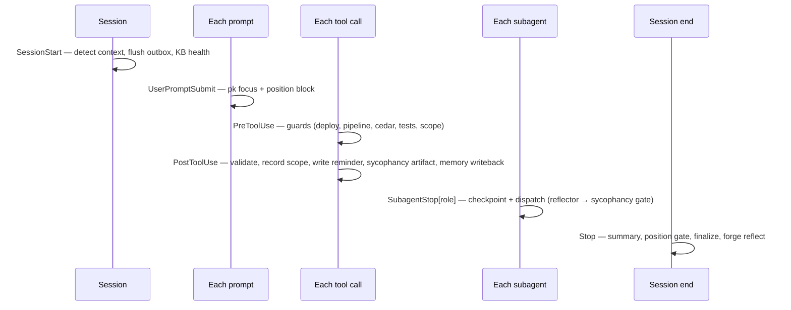

# 15 · Hooks & Lifecycle

The loops and skills are visible. The hooks are not — and they are where most of the system's discipline actually lives. Hooks are scripts that fire at lifecycle events: a session starting, a prompt being submitted, a tool about to write a file, a subagent stopping, a session ending. Every guarantee in this guide that sounds automatic — context priming, scope enforcement, the sycophancy gate, the immutable-tests rule, memory write-back — is a hook. This page documents every event and every script that runs on it.

The canonical source is `hooks/hooks.json`. (Per the project's own rules, that physical file is the single source of truth; `.claude-plugin/hooks/hooks.json` is a symlink to it, and CI validates the symlink on every PR.)

## The lifecycle at a glance

## SessionStart

Runs once when a session begins. Sets the stage.

| Order | Script | Purpose |
|---|---|---|
| 1 | `detect-project-context.sh` | Detect GitOps (Kustomize overlays, ArgoCD CRs) and cloud context |
| 2 | `memory-outbox-flush.sh` | Drain the surreal-memory write outbox when reachable (failed lines stay queued) |
| 3 | `pk-health.sh` | Surface KB health once per 24h; no-op if `pk` is absent |

## UserPromptSubmit

Runs on every prompt. This is the context-priming edge of the Karpathy loop.

| Order | Script | Purpose |
|---|---|---|
| 1 | `pk-focus-on-prompt.sh` (3s) | Inject `pk focus` context for the prompt — semantic path via surreal-memory; disable with `PROMETHEUS_FOCUS_SEMANTIC=0` |
| 2 | `position-on-prompt.sh` (5s) | Inject the KBD position block so the turn knows where it is |

## PreToolUse — the guards

These are blocking gates. They run *before* a tool executes and can refuse it (exit 2). This is where the system's safety rules are enforced.

**Matcher `Bash`:**

| Script | What it blocks |
|---|---|
| `guard-direct-deploy.sh` | `kubectl apply` / `helm upgrade` used as deploy mechanisms — in GitOps, the cluster is owned by Git, not by an agent |
| `pipeline-enforce.sh Bash` | KBD layer-order violations — blocks `kbd-execute`/`kbd-reflect` without the prerequisite artifacts, and when `reflect_gate=rejected` |

**Matcher `Write|Edit|MultiEdit`:**

| Script | What it enforces |
|---|---|
| `cedar-skill-gate.sh` | Edits to `SKILL.md` must pass the name pattern and carry required frontmatter (name, description, license, metadata.tags, metadata.version); no backslashes |
| `protect-tests.sh` | The **BDD Immutable-Tests Rule** — blocks edits to existing `tests/steps/*`, `tests/support/*`, `tests/features/*.feature`; allows new files under `tests/features/drafts/` |
| `scope-guard.sh` | Writes outside the active KBD change's `scoped_paths` (modes off/warn/ask via `PROMETHEUS_SCOPE_ENFORCE`); always allows `.kbd-orchestrator/**` and `SCRATCHPAD.md` |
| `check-child-scope.sh` | Child-phase scope enforcement (orchestrator-internal) |

The immutable-tests rule deserves emphasis. A code-generation agent under pressure to make a failing test pass has an obvious shortcut: edit the test. That shortcut destroys the test's value. `protect-tests.sh` removes the shortcut structurally — the agent *cannot* edit an existing step definition or feature file; it can only add new draft scenarios for human review. This is the same principle as the sycophancy gate, applied to tests: prevent the agent from grading its own homework.

## PostToolUse

Runs after a `Write|Edit|MultiEdit` succeeds. This is where validation, scope recording, and memory write-back happen.

| Order | Script | Purpose |
|---|---|---|
| 1 | `validate-state.sh` (evolver) | Validate evolver state after a write |
| 2 | `validate-gitops-write.sh` (10s) | Confirm written files conform to `TJ-CICD-001` |
| 3 | `scope-record.sh` | Record approved out-of-scope writes to the waypoint so they are not re-flagged |
| 4 | `write-position-reminder.sh` | Refresh `.kbd-orchestrator/position-reminder.txt` |
| 5 | `sycophancy-check-artifact.sh` (35s) | Gate `**/reflection.md` and `**/assessment.md` — exit 2 with Delta/Root-Cause/Corrective-Actions feedback, set `reflect_gate=rejected`; two-rejection soft cap |
| 6 | `memory-writeback.sh` (8s) | Persist accepted reflection Delta + Corrective Actions to surreal-memory; route `[GLOBAL]` lines to `user_id=global`; skip if `reflect_gate=rejected` |

## SubagentStop — per-role

Each KBD role has its own matcher. Every role runs a checkpoint and a workflow dispatch; two roles run additional gates.

| Matcher | Scripts (in order) |
|---|---|
| `assessor` | `state-checkpoint(assess)` → `workflow-dispatch(assess)` |
| `analyst` | `state-checkpoint(analyze)` → `workflow-dispatch(analyze)` |
| `planner` | `state-checkpoint(plan)` → `workflow-dispatch(plan)` |
| `executor` | `validate-state.sh` → `state-checkpoint(execute)` → **`evaluate-session.sh` (30s)** → `workflow-dispatch(execute)` |
| `reflector` | **`sycophancy-check-reflection.sh` (35s)** → `log-reflection.sh` → `state-checkpoint(reflect)` → `workflow-dispatch(reflect)` |
| *(fallback, no matcher)* | `subagent-checkpoint-fallback.sh` |

The two bolded scripts are the heart of the self-learning loop. On the executor's stop, `evaluate-session.sh` extracts patterns and ingests them into the KB and learning log (and `propose-skill-update.sh` files candidates from there). On the reflector's stop, the sycophancy gate runs before anything is logged. The fallback matcher guarantees that even an unrecognized subagent gets a checkpoint — no role falls through silently.

## Stop — the session-end chain

Order is a correctness constraint here; each script depends on the output of the ones before it.

| Order | Script | Purpose |
|---|---|---|
| 1 | `write-session-summary.sh` (5s) | Write the structured summary to `~/.prometheus/last-session-summary.txt` — everything downstream reads this |
| 2 | `position-stop-gate.sh` (5s) | Block the stop *once* if the final message lacks the position footer (single enforced retry, never loops) |
| 3 | `state-finalize.sh` (evolver) | Finalize evolver state |
| 4 | `workflow-dispatch.sh ... cycle_complete` | Dispatch the cycle-complete workflow |
| 5 | `finalize-session.sh` | Session finalization |
| 6 | `forge-reflect-on-stop.sh` | Run `forge reflect` if `.forge/iterations` exists, else `pk ingest` from the summary |

No `SubagentStart` or `PreCompact` events are defined — the pack relies on `SessionStart` and `UserPromptSubmit` for priming.

## Progress signaling

A lifecycle concern that is not a hook but is mandatory in every orchestration turn: the progress-signal protocol. The first tool call of a KBD/loop turn reads `.kbd-orchestrator/position-reminder.txt` (falling back to `current-waypoint.json` and the phase `progress.json`). Every phase and task then emits start/completion signals with accurate counts read from `progress.json` — never estimated. The `validate-progress-signals.js` script is a merge gate requiring every process skill to declare a `## Progress Signals` section, with a ratchet baseline that can only shrink. This is what keeps long, multi-session work scannable and resumable. The mechanics are also covered in [Loop Architecture](03-loop-architecture.md).

## Strictness and degradation

Two environment knobs govern hook behavior. `PROMETHEUS_REFLECT_STRICTNESS` (loose / standard / strict / adversarial, default strict) sets the sycophancy gate's sensitivity. `PROMETHEUS_SCOPE_ENFORCE` (off / warn / ask) sets the scope guard's force. And the universal rule across all hook scripts: they source `lib/hook-log.sh` and **always exit 0 unless they are deliberate blocking gates**. A missing binary, an unreachable service, a degraded dependency — none of these take a session down. The hooks add discipline when the infrastructure is present and get out of the way when it is not.

---

*Previous: [← 14 · The Rust Toolchain & Dynamic Generation](14-rust-toolchain.md) · Next: [16 · CLI & Scripts Reference →](16-cli-and-scripts.md)*
