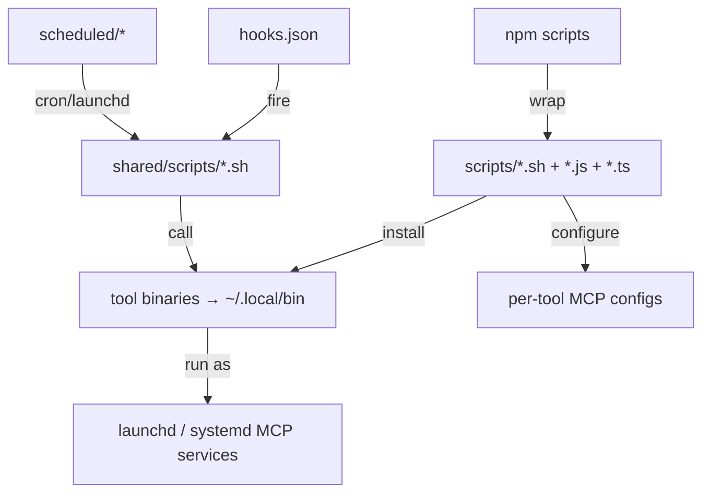

# 16 · CLI & Scripts Reference

This page is the exhaustive index of every command-line surface the pack exposes: the binary CLIs (cross-referenced), the npm scripts, every installer and validator in `scripts/`, the runtime hook scripts in `shared/scripts/`, and the scheduled jobs. If you are looking for "what command does X," it is here.

## The binary CLIs

Documented in full on the [Tools Reference](13-tools-reference.md) page; summarized here for completeness.

| Binary | Role | Documented in |
|---|---|---|
| `prometheus` | Skill management, canonical KBD control/audit, self-learning, GitOps validation, Cedar policy, sycophancy | [13](13-tools-reference.md) |
| `forge` | Enrichment, reflection, drift, templates, MCP server | [13](13-tools-reference.md) |
| `pk` / `pk-cherry` | Karpathy KB CLI / MCP bridge | [13](13-tools-reference.md) |
| `liter-llm` | LLM proxy + MCP tool server | [13](13-tools-reference.md) |
| `surreal-memory-server` | Graph memory + MCP + durable v2 receipt API | [13](13-tools-reference.md) |
| `prometheus-learning-worker` | Queue, receipt, and snapshot reconciliation | [13](13-tools-reference.md) |
| `prometheus-rust-auditor` | Staged Rust quality pipeline | [13](13-tools-reference.md) |

## The npm script surface

`package.json` (v1.8.0, ES module) is the most common entry point.

| Command | What it does |
|---|---|
| `npm run validate` | Validate native skills (excludes submodules), 0 errors required |
| `npm run validate:strict` | Strict validation — `license`, `version`, `metadata.tags` become errors; the gate for new skills |
| `npm run validate:skill <path>` | Validate one skill (lenient; includes imported) |
| `npm run validate:signals` | Lint that every process skill declares a `## Progress Signals` section |
| `npm run doctor` | Canonical local diagnosis parity with `prometheus doctor` |
| `npm run docs:check` | Public safety, OpenAPI/examples, semantic drift, links/sidebars, production build |
| `npm run build` | Build the marketplace distribution (the `.claude-plugin/` symlinks) |
| `npm run install:user` / `install:project` | Install skills to `~/.claude/skills/` or `.claude/skills/` |
| `npm run install:platforms` | Multi-platform installer (tsx) with full plugin support |
| `npm run install:opencode` / `install:skills` | OpenCode install / immutable generation projection |
| `npm run generate:commands` / `register:commands` / `unregister:commands` | Generate/register native slash commands |
| `npm run skill-matrix` / `skill-matrix:ci` | Pairwise skill-similarity collision report |
| `npm run update` / `update:force` | Pull and delta-install changed skills |
| `npm run format` / `check-format` | Prettier |

## `scripts/` — installers, validators, generators

| Script | Purpose |
|---|---|
| `install-plugin-generation.js` | Stage, hash, verify, activate, roll back, or uninstall an immutable 14-target generation. `[--verify] [--rollback] [--uninstall]` |
| `install-prometheus-exec.sh` | Build/select, version-check, stage, sign, atomically install, and hash-readback `prometheus-exec 1.7.0`. Builds from inside the crate dir so `rust-toolchain.toml` is honored. `[--dry-run]` |
| `install-prometheus-exec-service.sh` | Render and optionally load the private macOS execution LaunchAgent (`ai.prometheus.exec`, socket daemon). Called automatically by `install-mcp-services.sh`. `[--dry-run] [--no-load]` |
| `install-platforms.ts` | Multi-platform symlink installer for Claude Code, OpenCode, Cursor, Codex, etc. `[--platform] [--scope] [--uninstall] [--list]` |
| `install.js` | Copy skills to user or project scope |
| `install-binaries.sh` | Build and install all six tool binaries to `~/.local/bin/` |
| `install-mcp-services.sh` | Render/reload allowed launchd or systemd user services, including `ai.prometheus.exec` via its delegated installer. Repeatable `--exclude` prevents rendering, restart, or rewrite of a service. `[--unload] [--restart] [--user] [--dry-run] [--exclude]` |
| `configure-mcp-all-tools.sh` | Merge `mcp-port-table.json` into each tool's native MCP config (idempotent). `[--dry-run] [--tool]` |
| `prometheus-services.sh` | Manage MCP services as macOS user LaunchAgents (`install`/`load`/`status`/`doctor`/…) |
| `register-slash-commands.sh` | Register skills as OpenCode commands and Codex prompt files. `[--uninstall]` |
| `generate-commands.js` | Generate Claude Code slash-command files from skill frontmatter. `[--output] [--uninstall]` |
| `check-prerequisites.sh` | Check/install Node, Rust, npm deps; build tool binaries. `[--install] [--build-tools]` |
| `check-mcp-health.sh` | Health table (service state + HTTP readiness) for non-excluded services. `[--json] [--exclude]` |
| `certify-memory-operations.sh` | Mutating local proof of exact replay, conflict, response-loss reconciliation, terminal receipts, SSE resume, and optional long memory. |
| `smoke-test.sh` | Confirm every tool binary is reachable and answers `--version` |
| `detect-command-conflicts.sh` | Detect slash-command name collisions across installed command dirs |
| `skill-matrix.js` | Pairwise Jaccard similarity of skill name+description; CI fails on un-allowlisted collisions |
| `validate-skills.js` | The AgentSkills.io validator (Ajv schema). `[--strict] [--exclude-submodules]` |
| `validate-progress-signals.js` | Merge gate for the `## Progress Signals` section; ratchet baseline |
| `backfill-strict-fields.js` | Backfill missing `version`/`license`/`metadata.tags` into SKILL.md. `[--dry-run]` |
| `build-marketplace.js` | Build the `.claude-plugin/` symlink distribution |
| `update-skill-pack.sh` | Git-pull then delta-install changed skills across platforms (tracks last SHA). `[--force]` |
| `generate-harness-adapters.js` | Generate Claude Code, Codex, OpenCode, and Kimi lifecycle adapters from one capability manifest |
| `check-harness-adapters.js` | Reject drift between the manifest and generated adapters |
| `check-kbd-direct-writers.js` | Reject new direct writers to canonical KBD compatibility projections |
| `validate-kbd-state.js` | Validate KBD projection schemas and revision relationships |
| `test-kbd-control-plane.sh` | Run runtime/journal/control-plane fixture tests |
| `generate-skill-eval-corpus.js` / `check-skill-evals.js` | Maintain and validate the 30-prompt critical-skill activation corpus |

### `prometheus kbd`

The canonical control CLI accepts a global project path before the subcommand:

```bash
prometheus kbd --path "/path/to/project" status --json
```

| Command | Purpose |
|---|---|
| `status [--json]` | Lifecycle, revision, plan, checkpoint, active path, and completion |
| `projects [--json] [--prune-missing [--apply]]` | List registered replicas or explicitly inventory/apply recoverable cleanup of missing checkout paths |
| `pause --reason <text>` | Create the emergency valve and durable checkpoint |
| `revise --reason <text> [--exact-next-work <text>]` | Append immutable plan revision N+1 |
| `resume [--plan-revision <n>]` | Validate checkpoint and resume |
| `cancel --reason <text>` | Terminal cancellation with audit history |
| `audit [--since <revision-or-event>] [--json]` / `watch` | Inspect immutable events |
| `migrate --check|--apply` | Inventory or import legacy ledgers |
| `rollout status|observe|promote` | Record non-authoritative shadow/canary evidence |
| `phase`, `stage`, `change`, `task` | Submit typed work-structure mutations |
| `completion`, `decision`, `blocker` | Record independent completion, decisions, and blockers |

Full runbooks: [KBD control plane](/docs/kbd/control-plane),
[tokens](/docs/kbd/tokens-and-authentication), and
[operator controls](/docs/kbd/operator-controls).

Registry maintenance keeps the KBD-global `--path` option before the `projects`
subcommand and the maintenance flags after it:

```bash
prometheus kbd --path "/path/to/project" projects --prune-missing --json
prometheus kbd --path "/path/to/project" projects --prune-missing --apply --json
```

See [Identity & Authentication](/docs/kbd/tokens-and-authentication#maintain-missing-registry-entries)
for backup evidence and rollback behavior.

### The MCP port table

`scripts/mcp-port-table.json` is the declared source of truth for MCP connectivity. The full table is on the [MCP Substrate](05-mcp-substrate.md) page; in brief: surreal-memory (23001, SSE), prometheus-knowledge (8942, SSE), forge-rs (8943, SSE), and the stdio servers sycophancy-correction, liter-llm, sequential-thinking, tavily, and firecrawl.

### `scripts/scheduled/`

| File | Purpose |
|---|---|
| `periodic-nudge.sh` | Runs every 4 hours (`launchd` `ai.prometheus.prometheus-nudge`); POSTs a heartbeat to surreal-memory REST after a `/health` check; no-ops when unreachable; logs to `~/.prometheus/logs/` |

## `shared/scripts/` — the runtime hooks

These are the scripts the hooks fire (the events are mapped on the [Hooks & Lifecycle](15-hooks-and-lifecycle.md) page). Grouped by function:

**Context injection** — immutable scoped snapshot readers, `position-on-prompt.sh`, `detect-project-context.sh`, `pk-health.sh`, `memory-outbox-flush.sh`.

**Stop event** — `kbd-harness-adapter.sh stop <harness>` queues bounded,
noncritical work and never blocks operator stop. Older summary/position
utilities remain implementation helpers but are no longer the installed
Claude Stop chain.

**Position / waypoint** — `write-position-reminder.sh`, plus `lib/waypoint-render.sh`.

**Memory** — `enqueue-memory-operation.py`, `memory-outbox-flush.sh`, and `lib/memory-bridge.sh`. Hooks publish locally; the worker owns remote receipt reconciliation.

**Certification integrity** — `verify-protected-tests.mjs` compares committed
Git states and validates SSH-signed approval manifests. It does not intercept
Bash, Python, Edit, or Write. `scope-guard.sh`,
`pipeline-enforce.sh`, `cedar-skill-gate.sh`, `guard-direct-deploy.sh`, and
`check-child-scope.sh` were unwired from `PreToolUse` — see
[Hooks & Lifecycle](15-hooks-and-lifecycle.md#what-was-removed-and-why). The
scripts remain on disk and can still be invoked directly during local work.

**PostToolUse companions** — `scope-record.sh`, `validate-gitops-write.sh`, `sycophancy-check-artifact.sh`.

**SubagentStop gates** — `sycophancy-check-reflection.sh`, `evaluate-session.sh`, `propose-skill-update.sh`, `subagent-checkpoint-fallback.sh`.

**KBD lifecycle and journal authority** — `kbd-harness-adapter.sh`,
`kbd-phase-status.sh`, `kbd-next-phase.sh`, and
`lib/runtime-authority.sh`.

**Lint / health / verification** — `pk-lint.sh`, `pk-health.sh`, `verify-trace-state.sh`.

**Shared libraries (`lib/`)** — `hook-log.sh`, `path-scope.sh`,
`sycophancy.sh`, `memory-bridge.sh`, `runtime-authority.sh`, and
`waypoint-render.sh`.

**Scheduled (`shared/scripts/scheduled/`)** — `ai.prometheus.mem0-compress.plist`, `ai.prometheus.pk-lint.plist`, `mem0-compress.cron`, `pk-lint.cron`. The mem0 compression runs weekly; the `pk lint --fix` sweep runs weekly.

### `prometheus-exec`

`init`, `daemon`, `mcp`, `run`, `status`, `doctor`, `verify`, `verify-bundle`, and `contracts` are the complete CLI command surface. `doctor`, `verify`, and `verify-bundle` are non-mutating. The generated CLI flag, REST route, request/receipt field, MCP tool, component, target, and evidence tables live in the [generated runtime reference](/docs/operations/generated-reference).

## How the surfaces relate



The mental model: `npm run` is the human entry point; it wraps the shell/JS/TS scripts in `scripts/`; those build the binaries and write the configs; the binaries run as background MCP services; and the hook scripts in `shared/scripts/` call those binaries at lifecycle events. The next pages — [Installation](19-installation.md) and [Updating](20-updating.md) — put these commands in the order you actually run them.

---

*Previous: [← 15 · Hooks & Lifecycle](15-hooks-and-lifecycle.md) · Next: [17 · Platform Support →](17-platform-support.md)*
