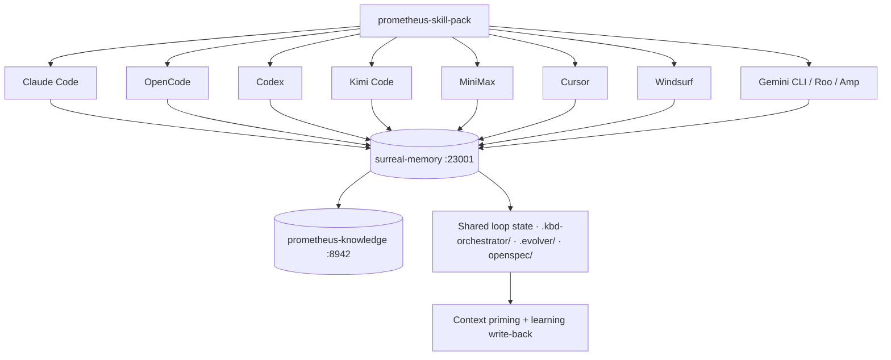

# 17 · Platform Support

The prometheus-skill-pack installs to ten AI tools and runs the same shared substrate underneath all of them. This page documents what each tool gets, how the loop architecture maps onto it, and where its config lives. The governing principle, from the loop architecture, is the one that makes this possible: **the loop body is harness-specific, but the loop state is harness-agnostic.** Swap the driver and the cadence; never swap the state.

## The compatibility matrix

| Platform | Skills | MCP servers | Plugin manifest | Loop primitives |
|---|---|---|---|---|
| **Claude Code** (CLI/Desktop) | Yes | Yes — `.mcp.json` | Yes — `.claude-plugin/plugin.json` | First-party `/loop`, `/goal`, `/schedule`, Agent View |
| **OpenCode** | Yes | Yes — `~/.opencode/opencode.json` | Yes — `.opencode/plugin.ts` | Plugin tools + commands |
| **Codex CLI** | Yes | Yes — `~/.codex/config.toml` | — | `/goal` + external shell drivers |
| **Kimi Code CLI** | Yes | Yes — `~/.kimi-code/config.toml` | — | Coding-plan engine + shell wrappers |
| **MiniMax / Mavis** | Yes — `_meta.json` | Yes — `~/.minimax/mcp/mcp.json` | — | Shell wrappers |
| **Cursor** | Yes | Yes — `~/.cursor/mcp.json` | — | Shell wrappers |
| **Windsurf** | Yes | (config-dependent) | — | Shell wrappers |
| **Gemini CLI** | Yes | — | — | Shell wrappers |
| **Roo Code** | Yes | — | — | Shell wrappers |
| **Amp** | Yes | — | — | Shell wrappers |

The shared substrate — surreal-memory at 23001, prometheus-knowledge at 8942, the sycophancy gate, liter-llm routing — is identical across every row. That is the whole point: when you change the tool driving the loop, the loop does not lose its memory or its discipline.



## Claude Code

The reference platform, and where the loop primitives are most developed. `/loop`, `/goal`, `/schedule`, `/workflows`, and Agent View ship first-party, and worktree isolation (`isolation: "worktree"`) is built into the Agent tool. The flat installer turns each skill into a slash command; the plugin manifest (`.claude-plugin/plugin.json`) declares skills, agents, hooks, and MCP servers. The hooks documented on the [Hooks & Lifecycle](15-hooks-and-lifecycle.md) page run natively. For any loop where you want native primitives and zero-config worktree sandboxing, Claude Code is the correct substrate. Drivers live in `.claude/commands/*`; a background tick is just `claude -p "/loop-tick <name>"`.

## OpenCode

The open-source terminal agent, and the one with first-class plugin support beyond Claude Code. `.opencode/plugin.ts` (using `@opencode-ai/plugin`) registers three tools — `evolve`, `gitops`, and `kbd` — that expose the orchestration skills as native OpenCode tools. The `evolve` tool takes `evolution_name`, `domain`, `goals[]`, and `phase`. MCP servers are written into `~/.opencode/opencode.json` by the installers. OpenCode injects `PROMETHEUS_SKILL_PACK=1` into the shell environment and uses `tool.execute.before/after` hooks for the Karpathy context layer. The trade-off versus Claude Code: loop primitives require the shell-wrapper drivers rather than first-party slash commands. The advantages: model-agnostic, no vendor lock, and access through the OpenCode Zen gateway to a wide model set including GLM-5.2 (High/Max) with a 1M context window.

## Codex CLI

OpenAI's agent, and the one with the strongest sandboxing primitive in the group: **kernel-level syscall filtering**. For any loop executing arbitrary or dynamically generated code, Codex's sandbox is architecturally superior. The pack configures Codex MCP connectivity in `~/.codex/config.toml` (surreal-memory over SSE, liter-llm, sequential-thinking, sycophancy-correction, tavily) and installs skills to `~/.codex/skills/` with prompt files in `~/.codex/prompts/`. Codex reaches the sycophancy gate as MCP tools (`detect_sycophancy`/`correct_sycophancy`) rather than as shell hooks. Loop orchestration is driven externally via the shared scripts and `codex exec`; it reads `AGENTS.md` for context and supports `/goal`.

## Kimi Code CLI

Not the newcomer anymore — a serious contender. Two Moonshot models matter, and they serve different roles in a loop. **Kimi K2.6** is the general-purpose agentic model — a 1T-parameter MoE with 32B active per token and a 256K context window — good for fast tool calls in tight iterations and multi-step planning at loop start. **Kimi K2.7 Code** (released June 12, 2026) is the coding-specialized refinement: same MoE architecture, forced thinking mode by default, and measured gains over K2.6 of +21.8% on Kimi Code Bench v2, +11.0% on Program Bench, and +31.5% on MLS Bench Lite, while cutting reasoning-token usage by roughly 30%. It is open-source under a Modified MIT license on Hugging Face.

That combination — better accuracy, lower token burn, more reliable long-context instruction-following — is exactly what unattended loop execution needs, because the most common loop failure mode is the agent that drifts from the original intent across many turns. The Kimi Code CLI is not just a prompt interface; it generates an inspectable **coding plan** before execution, then executes against it and iterates on validation failures autonomously, with `--continue` and `--session <id>` for persistence. The pack installs skills to `~/.kimi-code/skills/` and merges all MCP servers into `~/.kimi-code/config.toml`; the `kimi` CLI is detected by `check-prerequisites.sh`.

## Sandboxing across tools

Blast radius is the structural issue with fully autonomous loops. The isolation options, weakest to strongest:

```
Git worktree isolation → Filesystem isolation → Process isolation → Kernel-level sandbox
```

- **Worktree isolation** (Claude Code native, portable to all tools): each run gets its own git checkout; changes are sequestered until the agent finishes; the tree is deleted if nothing lands. The default recommendation for most loops.
- **Filesystem isolation** (Docker-wrappable on any tool): the agent can only touch the mounted directory.
- **Kernel-level sandboxing** (Codex native): syscall filtering prevents the agent from touching anything outside the declared scope. The right choice for untrusted or generated code.

For the pack's own loops, worktree isolation is the default. For loops that run arbitrary shell scripts or hit external infrastructure, wrap in Docker or use Codex's native sandbox.

## MiniMax, Cursor, Windsurf, Gemini CLI, Roo Code, Amp

These tools receive the skills (MiniMax also gets `_meta.json` metadata and an MCP config at `~/.minimax/mcp/mcp.json`; Cursor gets `~/.cursor/mcp.json`). They run the same shared substrate where MCP is supported, and loop orchestration is driven through the shared shell scripts rather than first-party primitives. The skill content and the durable loop state are identical to every other platform — which means a loop started under Claude Code can be inspected and resumed under any of these, because the state lives on disk, not in the tool.

## A note on Zed and other editors

The repository's configuration directories (`.cursor`, `.windsurf`, `.clinerules`, `.codex`, `.opencode`, `.agents`) reflect the tools the pack has been tested against and ships first-class config for. Editors and agents not listed in the matrix above can still consume the skills — they conform to the AgentSkills.io standard — but MCP wiring and loop drivers for them are not pre-built and would need to follow the same pattern the supported tools use: install the skills, point the tool's MCP config at the shared port table, and drive the loop with the shell scripts. The pack's design makes that straightforward; it does not make it automatic for tools outside the matrix.

---

*Previous: [← 16 · CLI & Scripts Reference](16-cli-and-scripts.md) · Next: [18 · Plugins & Marketplace →](18-plugins-and-marketplace.md)*
