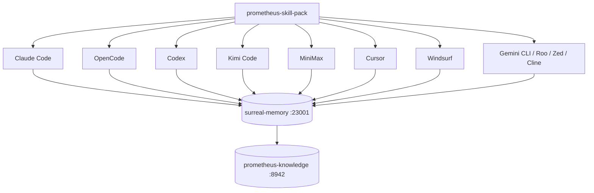

# 17 · Platform Support

The prometheus-skill-pack projects one immutable generation into 14 verified target directories. Some tools have multiple compatible locations, so target count is deliberately more precise than a marketing count of tools. The governing principle is: **the loop body is harness-specific, but receipts, queues, snapshots, and generation state are harness-agnostic.**

## The compatibility matrix

| Platform | Skills | MCP servers | Plugin manifest | Loop primitives |
|---|---|---|---|---|
| **Claude Code** (CLI/Desktop) | Yes | Yes — `.mcp.json` | Yes — `.claude-plugin/plugin.json` | First-party `/loop`, `/goal`, `/schedule`, Agent View |
| **OpenCode** | Yes | Yes — `~/.opencode/opencode.json` | Yes — `.opencode/plugin.ts` | Plugin tools + commands |
| **Codex CLI** | Yes | Yes — `~/.codex/config.toml` | — | `/goal` + external shell drivers |
| **Kimi Code CLI** | Yes | Yes — `~/.kimi-code/config.toml` | — | Coding-plan engine + shell wrappers |
| **MiniMax / Mavis** | Yes — `_meta.json` | Yes — `~/.minimax/mcp/mcp.json` | — | Shell wrappers |
| **Cursor** | Yes | Yes — `~/.cursor/mcp.json` | — | Shell wrappers |
| **Windsurf** | Yes | (config-dependent) | — | Shell wrappers |
| **Gemini CLI** | Yes | — | — | Shell wrappers |
| **Roo Code** | Yes | — | — | Shell wrappers |
| **Zed** | Yes — two target locations | config-dependent | — | Editor agent primitives |
| **Cline** | Yes | config-dependent | — | Extension agent primitives |
| **Generic AgentSkills clients** | Yes — `.agents/skills` | client-dependent | — | Client-specific |

The shared deterministic-learning substrate — Memory at 23001,
prometheus-knowledge at 8942, the learning worker, immutable snapshots,
the sycophancy gate, and liter-llm routing — is identical across every writer-capable row. One capability manifest maps
each harness's native lifecycle events to the same session, compact, prompt,
interrupt, and post-mutation contract. The pre-mutation event was removed from
the contract: it existed only to gate tool calls on KBD lifecycle
state, which blocked ordinary cross-project work.



## Claude Code

The reference platform, and where the loop primitives are most developed.
`/loop`, `/goal`, `/schedule`, `/workflows`, and Agent View ship first-party,
and worktree isolation (`isolation: "worktree"`) is built into the Agent tool.
The immutable generation installer projects verified skills while the plugin
manifest declares skills, agents, hooks, and MCP servers. Prometheus installs no
mutation-blocking `PreToolUse` guard; protected BDD integrity is checked from Git
state at final local certification. The hooks documented on the
[Hooks & Lifecycle](15-hooks-and-lifecycle.md) page run natively.

## OpenCode

The open-source terminal agent, and the one with first-class plugin support beyond Claude Code. `.opencode/plugin.ts` registers orchestration tools and installs the KBD control adapter into both legacy and XDG OpenCode configurations. Session create/compact/idle/cancel events map into the same lifecycle vocabulary as Claude Code; no tool-call interception is installed. MCP servers are written into the active OpenCode config by the installers.

## Codex CLI

OpenAI's agent, and the one with the strongest sandboxing primitive in the group: **kernel-level syscall filtering**. The pack configures Codex MCP connectivity in `~/.codex/config.toml` and installs a receipt-bearing copy to `~/.codex/skills/`. Generated lifecycle adapters observe session events; they do not gate tool calls. Real installed-host acceptance remains a production gate even though fixtures and payload generation pass.

## Kimi Code CLI

Not the newcomer anymore — a serious contender. Two Moonshot models matter, and they serve different roles in a loop. **Kimi K2.6** is the general-purpose agentic model — a 1T-parameter MoE with 32B active per token and a 256K context window — good for fast tool calls in tight iterations and multi-step planning at loop start. **Kimi K2.7 Code** (released June 12, 2026) is the coding-specialized refinement: same MoE architecture, forced thinking mode by default, and measured gains over K2.6 of +21.8% on Kimi Code Bench v2, +11.0% on Program Bench, and +31.5% on MLS Bench Lite, while cutting reasoning-token usage by roughly 30%. It is open-source under a Modified MIT license on Hugging Face.

That combination — better accuracy, lower token burn, more reliable long-context instruction-following — is exactly what unattended loop execution needs. The pack installs skills to `~/.kimi-code/skills/`, merges MCP servers into `~/.kimi-code/config.toml`, and generates SessionStart/PreCompact/PostCompact/Prompt/Stop/Interrupt/PreToolUse/PostToolUse mappings. Kimi uses harness ID `kimi`; real native-host adapter acceptance remains a production gate.

## Sandboxing across tools

Blast radius is the structural issue with fully autonomous loops. The isolation options, weakest to strongest:

```
Git worktree isolation → Filesystem isolation → Process isolation → Kernel-level sandbox
```

- **Worktree isolation** (Claude Code native, portable to all tools): each run gets its own git checkout; changes are sequestered until the agent finishes; the tree is deleted if nothing lands. The default recommendation for most loops.
- **Filesystem isolation** (Docker-wrappable on any tool): the agent can only touch the mounted directory.
- **Kernel-level sandboxing** (Codex native): syscall filtering prevents the agent from touching anything outside the declared scope. The right choice for untrusted or generated code.

For the pack's own loops, worktree isolation is the default. For loops that run arbitrary shell scripts or hit external infrastructure, wrap in Docker or use Codex's native sandbox.

## MiniMax, Cursor, Windsurf, Gemini CLI, Roo Code, Zed, and Cline

These tools receive the skills (MiniMax also gets `_meta.json` metadata and an MCP config at `~/.minimax/mcp/mcp.json`; Cursor gets `~/.cursor/mcp.json`). They run the same shared substrate where MCP is supported, and loop orchestration is driven through the shared shell scripts rather than first-party primitives. The skill content and the durable loop state are identical to every other platform — which means a loop started under Claude Code can be inspected and resumed under any of these, because the state lives on disk, not in the tool.

## Target receipts and copy modes

Codex and MiniMax require verified real-directory copies with generation receipts. The other 12 targets link through the active content-addressed generation. Activation fails on a collision, missing receipt, wrong mode, stale path, or dispatcher that resolves outside `generations/`. See [Targets and stable dispatchers](/docs/plugin-distribution/targets-and-dispatchers).

---

*Previous: [← 16 · CLI & Scripts Reference](16-cli-and-scripts.md) · Next: [18 · Plugins & Marketplace →](18-plugins-and-marketplace.md)*
