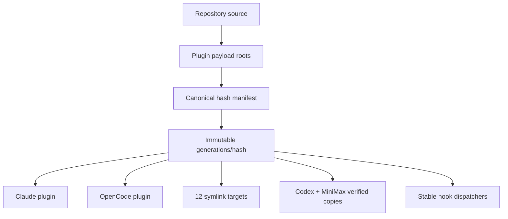

# 18 · Plugins and Immutable Distribution

Prometheus 1.7.0 distributes one certified source tree as harness-native plugins and as a verified 14-target AgentSkills generation. The generation is content-addressed; host paths never point at a mutable staging directory or a hardcoded release version.

## Packaging model



The generation includes skills, agents, hooks, shared scripts, plugin manifests, and MCP configuration. The manifest records every file hash and mode plus the expected target projection. Installation verifies the complete generation before activation.

## Claude Code and OpenCode

`.claude-plugin/plugin.json` describes the Claude plugin surface; `.opencode/plugin.ts` supplies OpenCode-native tools. Both consume payload from the same certified generation. Marketplace slices remain available for incremental adoption, but they do not bypass generation verification.

## Activation

```bash
node scripts/install-plugin-generation.js
node scripts/install-plugin-generation.js --verify
```

The installer stages privately, validates all payloads and target receipts, updates `previous`, then atomically switches `current`. Hook registrations point at stable dispatchers, so activation requires no hook rewrite.

## Rollback and uninstall

```bash
node scripts/install-plugin-generation.js --rollback
node scripts/install-plugin-generation.js --verify
node scripts/install-plugin-generation.js --uninstall
```

Rollback selects the previous complete generation and restores copy targets. Uninstall removes only Prometheus-owned projections carrying valid ownership evidence; unrelated collisions are preserved and reported.

See the canonical [Plugin Distribution](/docs/plugin-distribution/immutable-generations) section for the manifest design, full target matrix, stable dispatcher contract, collision behavior, rollback, and stale-cache removal.

---

*Previous: [← 17 · Platform Support](17-platform-support.md) · Next: [19 · Installation →](19-installation.md)*
