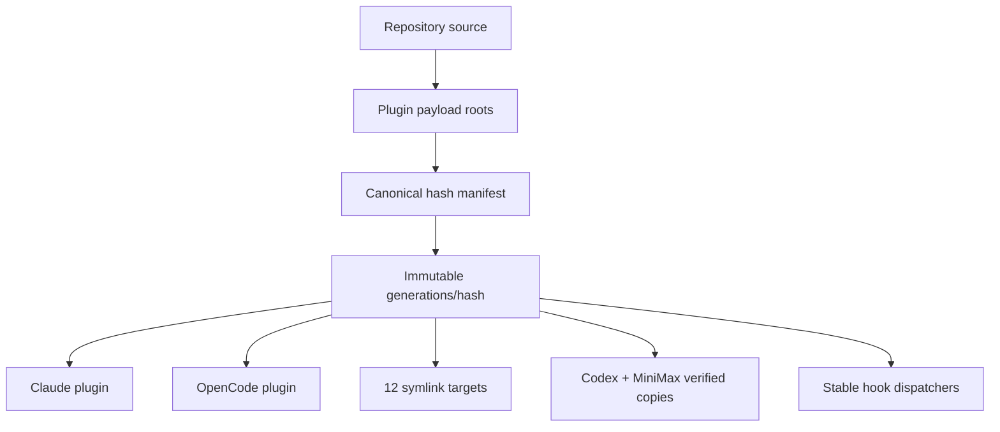

# 18 · Plugins and Immutable Distribution

Prometheus 1.7.0 distributes one certified source tree as harness-native plugins and as a verified 14-target AgentSkills generation. The generation is content-addressed; host paths never point at a mutable staging directory or a hardcoded release version.

## Packaging model



The generation includes skills, agents, hooks, shared scripts, plugin manifests, and MCP configuration. The manifest records every file hash and mode plus the expected target projection. Installation verifies the complete generation before activation.

## Claude Code and OpenCode

Only marketplace manifests live at the repository root. Self-contained native
packages are generated at `dist/plugins/claude/prometheus-skill-pack` and
`dist/plugins/codex/prometheus-skill-pack`; every skill is materialized as
`skills/<skill-name>/` with its scripts, references, templates, assets, and file
modes intact. Claude auto-discovers its supported hook file. Codex intentionally
omits hooks and uses the validated interface/default-prompt schema.

The root `skill-system.json` is the machine-readable authority for release and
minimum-active versions, imports and SHAs, inventory exclusions, profiles,
targets, projection modes, platform boundaries, marketplaces, and generated
outputs. `artifact-refiner` and `sycophancy-correction` are adjacent pinned
entries, not automatic umbrella dependencies.

## Activation

```bash
./install.sh --profile skills --targets detected
./install.sh --verify --targets detected --non-interactive
```

The installer stages privately, validates all payloads and target receipts, updates `previous`, then atomically switches `current`. Hook registrations point at stable dispatchers, so activation requires no hook rewrite.

## Rollback and uninstall

```bash
node scripts/install-plugin-generation.js --rollback
node scripts/install-plugin-generation.js --verify
./install.sh --uninstall --targets detected
```

Rollback selects the previous complete generation and restores copy targets. Uninstall removes only Prometheus-owned projections carrying valid ownership evidence; unrelated collisions are preserved and reported.

See the canonical [Plugin Distribution](/docs/plugin-distribution/immutable-generations) section for the manifest design, full target matrix, stable dispatcher contract, collision behavior, rollback, and stale-cache removal.

---

*Previous: [← 17 · Platform Support](17-platform-support.md) · Next: [19 · Installation →](19-installation.md)*
