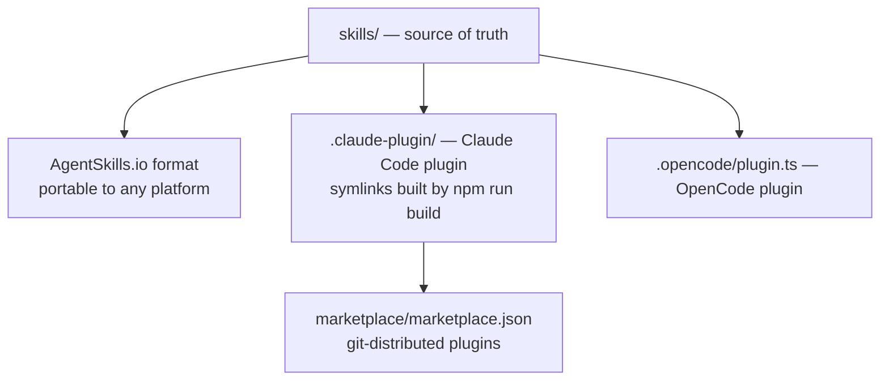

# 18 · Plugins & Marketplace

The skill pack is distributed three ways: as a Claude Code plugin, through a Claude Code marketplace, and as an OpenCode plugin. This page documents each distribution surface — what it declares, how it is built, and how a user installs it. The single source of truth for skills is the `skills/` directory; everything here is a packaging layer on top of it.

## The dual-format model

The repository supports two distribution formats simultaneously from one source tree.



The `skills/` directory is the canonical source. The `.claude-plugin/` directory contains *symlinks* into it, created by `npm run build` (`build-marketplace.js`) — `skills`, `agents`, and `hooks` each symlink to `../`. This keeps a single source of truth while presenting the Claude Code plugin shape. Editing through the symlinks is forbidden by the project rules; you edit the real files and rebuild.

## The Claude Code plugin

`.claude-plugin/plugin.json` is the plugin manifest: `name: prometheus-skill-pack`, `version: 1.2.0`, MIT, category productivity. It declares thirteen skills (the React entity suite; the process skills iterative-evolver, kbd-process-orchestrator, pmpo-skill-creator, pmpo-elicit, pmpo-outer-loop; bdd-testing; the imported artifact-refiner and sycophancy-correction; the four DevOps skills; and prometheus-rust-auditor), plus `agents`, `hooks` (pointing at `./hooks/hooks.json`), `mcpServers` (pointing at `./.mcp.json`), and the shared scripts/templates/utils directories. Its `compatibility.platforms` lists all ten supported tools and requires Node ≥ 18.

A note on the hooks path, because it matters for contributors: `plugin.json` declares `"hooks": "./hooks/hooks.json"` relative to `.claude-plugin/`, which resolves through the `.claude-plugin/hooks → ../hooks` directory symlink to the one physical file at `hooks/hooks.json`. Always edit that physical file; CI validates the symlink on every PR.

## The Claude Code marketplace

`marketplace/marketplace.json` (marketplace version `1.0.0`, authored by Travis James) publishes six installable plugins, all sourced from the same git repository. This is what lets a user install the whole pack or just the slice they need.

| Plugin | Source path | Notes |
|---|---|---|
| Full pack | `.claude-plugin` | The complete `prometheus-skill-pack` v1.2.0 |
| prometheus-react-skills | `skills/react/prometheus-entity-skills` | The React entity suite |
| prometheus-process-skills | `skills/process` | The orchestration skills |
| prometheus-devops-skills | `skills/devops` | GitOps CI/CD |
| prometheus-testing-skills | `skills/testing` | BDD testing |
| prometheus-librefang-skills | `skills/rust/librefang-wasm-skill` | The WASM-ABI skill |

A user adds the marketplace and installs from it with Claude Code's plugin commands:

```bash
# Add the marketplace
/plugin marketplace add Prometheus-AGS/prometheus-skill-pack

# Install the full pack, or a single slice
/plugin install prometheus-skill-pack
/plugin install prometheus-process-skills
```

The granular plugins exist for a real reason: a team that only wants the GitOps skills should not have to take the entire process-orchestration stack and its eight MCP servers. The marketplace lets adoption be incremental.

## The OpenCode plugin

`.opencode/plugin.ts` is a genuine OpenCode plugin (built on `@opencode-ai/plugin`), not just a skills drop. It registers three native OpenCode tools, defined in `tools/evolve.ts`, `tools/gitops.ts`, and `tools/kbd.ts`:

- **`evolve`** — runs the iterative-evolver. Arguments: `evolution_name`, `domain` (software/business/product/research/content/operations/compliance/generic), `goals[]`, and `phase` (assess/analyze/plan/execute/reflect/full).
- **`gitops`** — runs the GitOps skills.
- **`kbd`** — runs the KBD orchestrator.

Alongside the plugin, the `.opencode/` directory ships `commands/` and `skills/`. The MCP servers are written into `~/.opencode/opencode.json` at install time by `configure-mcp-all-tools.sh` and `register-slash-commands.sh` — the repository does not check in a top-level `opencode.json`, because that file is per-user. This is what gives OpenCode the orchestration skills as first-class tools rather than as shell scripts.

## Other tools' packaging

Codex and Kimi do not have a formal plugin manifest in the way Claude Code and OpenCode do. They receive skills plus MCP configuration: Codex via prompt files in `~/.codex/prompts/` and MCP servers in `~/.codex/config.toml`; Kimi via skills in `~/.kimi-code/skills/` and MCP servers in `~/.kimi-code/config.toml`. The [Platform Support](17-platform-support.md) page covers the per-tool detail. Plugins, in other words, are a richer packaging that two tools support; everywhere else, the skills-plus-MCP install gives equivalent capability through a thinner wrapper.

## Cowork and Claude Code plugins more broadly

Both Cowork and Claude Code support plugins as installable bundles of MCP servers, skills, and tools, and plugins can be grouped into marketplaces — which is exactly the model this pack uses. If you are building your own plugin from these pieces, the relevant generators are in the pack itself: `pmpo-skill-creator` produces skills in the Claude Code plugin/marketplace format, and the meta-template system in forge-rs scaffolds the manifest structure. The distribution model documented here is the same one your own derived plugin would follow.

---

*Previous: [← 17 · Platform Support](17-platform-support.md) · Next: [19 · Installation →](19-installation.md)*
