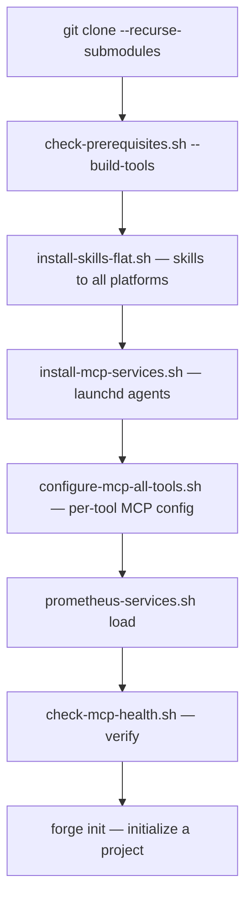

# 19 · Installation

This page is the procedure for getting from a fresh clone to a running, self-improving loop. It covers prerequisites, the toolchain, the one-command install, the MCP services, and verification — in the order you actually run them.

## Prerequisites

Two things are hard requirements; the rest are installed or built for you.

**Required:** Node.js ≥ 18 and Git.

**For the Rust tools and Rust skills:** the Rust toolchain. This is the one prerequisite the pack cannot install silently, because it is what builds everything else.

```bash
curl --proto '=https' --tlsv1.2 -sSf https://sh.rustup.rs | sh
rustup target add wasm32-unknown-unknown   # for librefang-wasm and the native-agent WASM build
rustup show
```

**For Go skills:** a Go 1.22+ toolchain (backs `go/base-patterns` and the Flint Go SDK). **For graph memory:** Docker (the recommended way to run surreal-memory). The prerequisite script detects all of these and reports what is missing.

```bash
# Check everything at once — toolchains, services, Prometheus binaries
bash shared/scripts/detect-toolchain.sh
bash shared/scripts/detect-toolchain.sh --json   # machine-readable
```

## The install flow



### Step 1 — clone with submodules

The imported skills and three of the tools are git submodules, so a plain clone is not enough.

```bash
git clone --recurse-submodules https://github.com/Prometheus-AGS/prometheus-skill-pack
cd prometheus-skill-pack

# If you already cloned without --recurse-submodules:
git submodule init && git submodule update
```

### Step 2 — build the tools

```bash
# Check/install prerequisites and build all six tool binaries to ~/.local/bin/
bash scripts/check-prerequisites.sh --install --build-tools

# This is what `npm run doctor` wraps, and it ends by running the smoke test.
npm run doctor
```

After this, `~/.local/bin/` holds `prometheus`, `forge`, `pk`, `pk-cherry`, `liter-llm`, `surreal-memory-server`, and `prometheus-rust-auditor`. Make sure `~/.local/bin` is on your `PATH`.

### Step 3 — install the skills to every platform

```bash
# Flat-symlink install into each detected platform's skills dir
bash scripts/install-skills-flat.sh
```

This installs to Claude Code (`~/.claude/skills/`), Kimi (`~/.kimi-code/skills/`), MiniMax (`~/.minimax/skills/`), OpenCode (`~/.opencode/skills/`), Codex (`~/.codex/skills/`), Cursor (`~/.cursor/skills/`), and the others — turning each skill into a slash command — and configures kimi-code MCP along the way. For full plugin support on OpenCode and the richer per-platform install, use `npm run install:platforms`.

### Step 4 — bring up the MCP services

```bash
# macOS: render LaunchAgents into ~/Library/LaunchAgents and bootstrap them
bash scripts/install-mcp-services.sh

# Configure all MCP servers into every installed AI tool's native config
bash scripts/configure-mcp-all-tools.sh

# Load and check
bash scripts/prometheus-services.sh load
bash scripts/prometheus-services.sh status
bash scripts/check-mcp-health.sh
```

On macOS the `launchd` agents manage `pk-cherry` on `127.0.0.1:8942` and `forge mcp` on `127.0.0.1:8943`. surreal-memory is Docker-managed on `127.0.0.1:23001`:

```bash
cd tools/surreal-memory-server && docker compose up -d
curl -s http://localhost:23001/health | jq .
```

On Linux, use systemd user services or cron-style scheduled jobs in place of LaunchAgents — the binaries and ports are identical; only the service manager differs.

### Step 5 — verify

```bash
npm run doctor                 # full system health
bash scripts/check-mcp-health.sh   # launchctl + HTTP probe per service
pk doctor --json               # KB / hooks / sycophancy binary / scoping
prometheus doctor              # CLI-side health
```

## First run

With everything up, initialize forge in a project and define your first loop:

```bash
# Initialize the enrichment engine in your project
forge init

# Define and tick a continuous quality loop
cat > loop.json << 'EOF'
{
  "name": "quality-gate",
  "goal": {
    "description": "All tests pass and no CRITICAL/HIGH lint errors",
    "measurable_criteria": ["npm test exits 0", "npm run lint exits 0"]
  },
  "feedback_sources": [
    { "type": "command", "run": "npm test", "interpret": "exit-code" },
    { "type": "command", "run": "npm run lint", "interpret": "exit-code" }
  ],
  "termination": { "max_ticks": 20, "goal_satisfied": true, "max_no_progress_ticks": 2 },
  "escalation_points": [{ "type": "threshold", "value": 3 }],
  "cadence": { "mode": "background", "schedule": "interval:30m" },
  "evolution_name": "quality-gate"
}
EOF

/loop-define --from loop.json
/loop-tick quality-gate
```

For structured development work, `/create-native-agent` scaffolds a complete agent and the KBD orchestrator handles the full lifecycle. The nested-loop pattern is automatic: the outer loop coordinates phase transitions, the inner loop executes changes, and the child skills handle individual technical tasks.

## Platform-specific quick starts

| Platform | Command |
|---|---|
| Claude Code | `bash scripts/install-skills-flat.sh` (or `npm run install:user`) |
| Kimi Code | `bash scripts/install-skills-flat.sh` — skills load from `~/.kimi-code/skills/` |
| MiniMax | `bash scripts/install-skills-flat.sh` — skills + `_meta.json` in `~/.minimax/skills/` |
| OpenCode | `npm run install:platforms -- --platform opencode` (full plugin) |
| Codex | `bash scripts/install-skills-flat.sh` — skills to `~/.codex/skills/` |
| Cursor / Windsurf / others | `bash scripts/install-skills-flat.sh` |

## When a service is missing

Nothing here is fragile. Every component degrades gracefully: memory features no-op when surreal-memory is unreachable, `pk focus` does nothing when `pk` is absent, the sycophancy gate passes through when its binary is missing. You can run the loop with no services at all and add them incrementally — the difference is that without the substrate the loop runs at constant capability instead of compounding. The smoke test treats `forge`, `pk`, `liter-llm`, and `prometheus` as required and the rest as presence-only optional, which is a fair description of what the loop actually needs to function versus what makes it better.

---

*Previous: [← 18 · Plugins & Marketplace](18-plugins-and-marketplace.md) · Next: [20 · Updating →](20-updating.md)*
