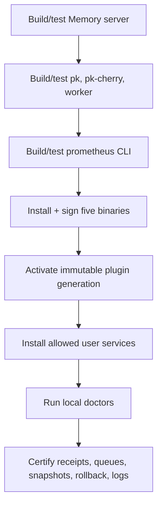

# 19 · Installation

This procedure builds, signs, installs, and locally certifies Prometheus 1.6.1. The canonical deployment is native user services on macOS or systemd user services on Linux; containers remain optional development packaging.

## Prerequisites

Required: Git, Node.js 18+, Rust, `jq`, `curl`, and platform service-manager tools. Clone with submodules:

```bash
git clone --recurse-submodules https://github.com/Prometheus-AGS/prometheus-skill-system
cd prometheus-skill-system
```

Keep Rust caches on an internal SSD:

```bash
export CARGO_HOME="$HOME/.cargo"
export CARGO_TARGET_DIR="/path/on/internal-ssd/prometheus-target"
```

## Build order



The five release binaries are `surreal-memory-server`, `pk`, `pk-cherry`, `prometheus-learning-worker`, and `prometheus`. Run `cargo fmt --check`, `cargo check --all-targets`, Clippy with warnings denied, and tests in each workspace before installation.

## Plugin generation

```bash
node scripts/install-plugin-generation.js
node scripts/install-plugin-generation.js --verify
```

This validates the manifest, 14 target receipts, copy-versus-symlink modes, stable dispatchers, active/previous pointers, and stale-path absence.

## Services with explicit exclusions

Preview first:

```bash
bash scripts/install-mcp-services.sh --dry-run --exclude sovereign-sync
```

Then install only the reviewed services:

```bash
bash scripts/install-mcp-services.sh --exclude sovereign-sync
```

The managed deterministic-learning surface includes the native Memory server, `pk-cherry`, learning worker, and owner-only hook log rotation. An excluded service is not rendered, initialized, stopped, started, restarted, or rewritten.

## Verify

```bash
prometheus doctor --json \
  --exclude control.kbd-runtime \
  --exclude state.kbd-orchestrator \
  --exclude control.kbd-rollout \
  --exclude service:sovereign-sync

pk doctor --json
bash scripts/prometheus-services.sh doctor --exclude sovereign-sync
bash scripts/check-mcp-health.sh --json --exclude sovereign-sync
prometheus learning status --json
```

`/health` proves liveness; `/ready` proves durable ingestion readiness. Finally, run the intentionally mutating operation certification:

```bash
bash scripts/certify-memory-operations.sh --long-memory
```

It verifies exact replay, hash conflict, response-loss reconciliation, terminal receipts, and SSE resume. Archive redacted JSON reports and exact commands. Every warning needs a disposition; required checks must be green.

See [Installation and upgrades](/docs/operations/installation-and-upgrades) and [Doctors and Mac certification](/docs/operations/doctors-and-mac-certification).

---

*Previous: [← 18 · Plugins & Marketplace](18-plugins-and-marketplace.md) · Next: [20 · Updating →](20-updating.md)*
