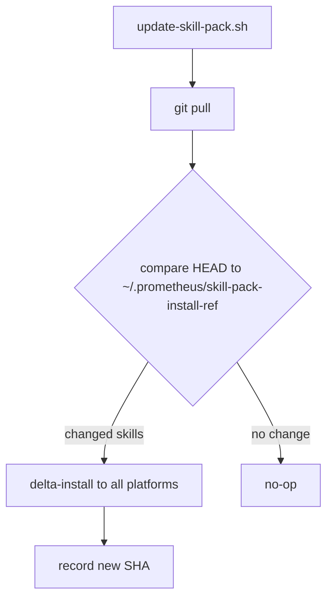

# 20 · Updating

Keeping the pack current means updating four things that move on different schedules: the skills, the tool binaries, the git submodules, and the MCP service configuration. This page is the procedure for updating each without breaking the others. The design goal throughout is a smooth update — delta installs, tracked install refs, idempotent configuration — so that pulling the latest never means re-running the whole installer from scratch.

## The one-command update

For routine updates, a single script handles the common case:

```bash
# Pull the latest and delta-install only the skills that changed
bash scripts/update-skill-pack.sh

# Force a full re-install of all skills regardless of diff
bash scripts/update-skill-pack.sh --force

# Or via npm
npm run update
npm run update:force
```

`update-skill-pack.sh` does a git pull, then installs only the skills that changed since the last run — it tracks the last installed SHA in `~/.prometheus/skill-pack-install-ref`. That delta behavior is what makes the update fast and safe: unchanged skills are left exactly as they are.



## Updating the git submodules

The imported skills (`artifact-refiner`, `sycophancy-correction`, `prometheus-entity-management`) and three of the tools (`surreal-memory-server`, `prometheus-knowledge`, `liter-llm`) are submodules with independent lifecycles. They update separately from the main repo.

```bash
# Update every submodule to its tracked branch's latest
git submodule update --remote
git add skills/imported tools/
git commit -m "chore: bump submodule pointers"

# Update a single submodule
cd skills/imported/artifact-refiner
git pull origin main
cd -
git add skills/imported/artifact-refiner && git commit -m "chore: bump artifact-refiner"

# Check status
git submodule status
```

In production, pin submodules to a tag rather than tracking a moving branch — check out the tag inside the submodule and commit the pointer. This is what keeps a production deployment reproducible. The full submodule workflow is on the [Contributing](21-contributing.md) page.

## Rebuilding the tool binaries

When a tool submodule moves, its binary needs rebuilding.

```bash
# Rebuild and reinstall all six binaries
bash scripts/install-binaries.sh

# Or the full prerequisite + build + smoke-test path
npm run doctor
```

After rebuilding, restart the MCP services so they pick up the new binaries:

```bash
bash scripts/prometheus-services.sh reload   # or: unload then load
bash scripts/check-mcp-health.sh
```

## Reconciling MCP configuration

The MCP configuration writers are idempotent — running them again after an update reconciles each tool's config against the current `mcp-port-table.json` without duplicating entries.

```bash
# Re-merge the canonical port table into every tool's config
bash scripts/configure-mcp-all-tools.sh

# Preview without writing
bash scripts/configure-mcp-all-tools.sh --dry-run

# Just one tool
bash scripts/configure-mcp-all-tools.sh --tool opencode
```

## A recommended update sequence

Run these in order after pulling a release:

```bash
git pull
git submodule update --remote          # 1 · move submodules
bash scripts/install-binaries.sh       # 2 · rebuild binaries
bash scripts/update-skill-pack.sh      # 3 · delta-install skills
bash scripts/configure-mcp-all-tools.sh # 4 · reconcile MCP config
bash scripts/prometheus-services.sh reload  # 5 · restart services
npm run doctor                         # 6 · verify
```

## Verifying nothing broke

After any update, three checks confirm the system is healthy:

```bash
npm run validate          # all native skills still pass the spec
npm run validate:strict   # strict gate (new/changed skills)
bash scripts/check-mcp-health.sh   # services reachable
```

If `validate:strict` fails on a skill that just changed, the cause is almost always a missing strict field — `license`, `version`, or a non-empty `metadata.tags`. `scripts/backfill-strict-fields.js --dry-run` will show what is missing. The [Contributing](21-contributing.md) page covers the validation gates in full.

## Scheduled maintenance that runs itself

Some upkeep does not need a manual update at all — it runs on a schedule:

- The **4-hour KB nudge** (`periodic-nudge.sh`, `launchd` `ai.prometheus.prometheus-nudge`) keeps the knowledge base warm between sessions.
- The **weekly `pk lint --fix` sweep** (`pk-lint.sh`) keeps the knowledge base clean.
- The **weekly mem0 compression** (`mem0-compress.sh`) keeps scoped memory from growing without bound.

These are installed as `launchd` plists (or cron jobs) by the service installer and require no manual intervention. The point of the whole update model is that the parts that change rarely are explicit commands you run, and the parts that need constant attention run themselves.

---

*Previous: [← 19 · Installation](19-installation.md) · Next: [21 · Contributing →](21-contributing.md)*
