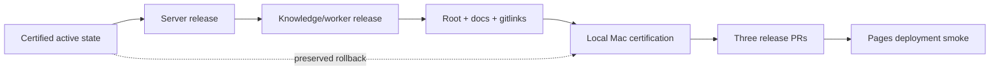

# 20 · Updating

An upgrade moves three independently certified repositories plus installed host state. Preserve recovery records and validate locally before pushing any branch.

## Safe sequence

1. Record server, knowledge, and root commits plus active/previous plugin generations.
2. Preserve terminal receipts, operation events, queue records, immutable snapshots, and owner-only logs.
3. Update and certify the Memory server.
4. Update and certify knowledge tools and the learning worker.
5. Update root gitlinks, CLI, Docusaurus, and release metadata.
6. Build and test all workspaces using internal-SSD Cargo directories.
7. Generate the excluded doctor/refresh plan; inspect it before any repair.
8. Install/sign binaries, activate the plugin generation, and reload only allowed services.
9. Run the full local health and certification matrix.
10. Push in dependency order. All validation remains local; hosted automation is not release evidence.



## Submodule pins

Do not advance a root gitlink until its dependency commit passes its local gates. After dependency PRs merge, update root gitlinks to the resulting `main` commits and rerun the root/docs certification. Never rewrite published recovery history.

## Plugin upgrade and rollback

```bash
git pull --ff-only
./install.sh --profile skills --targets detected --non-interactive --yes
./install.sh --verify --targets detected --non-interactive
```

Activation keeps `previous`. If installed-host certification fails:

```bash
node scripts/install-plugin-generation.js --rollback
node scripts/install-plugin-generation.js --verify
```

Do not patch an active generation or a copied target by hand.

The umbrella generation, enabled Claude/Codex umbrella plugins, and target
receipts must never select a release below `1.7.0`. For the one-time cache
migration use `scripts/migrate-skill-system-1.7.0.sh`: it performs a clean
checkout activation, supported native refresh, rollback-on-refresh-failure,
Claude prune, receipt-aware generation prune, and writes a migration receipt
under `~/.prometheus/migrations/`. Unsigned or referenced legacy generations
are refused rather than deleted.

## Service refresh

```bash
bash scripts/install-mcp-services.sh --dry-run --restart --exclude sovereign-sync
bash scripts/install-mcp-services.sh --restart --exclude sovereign-sync
bash scripts/check-mcp-health.sh --json --exclude sovereign-sync
```

On macOS, a complete bootout/bootstrap cycle is required when a LaunchAgent definition changes; kickstart alone does not reload its environment.

## Documentation and release gates

```bash
npm run docs:check
```

The gate validates public safety, OpenAPI examples, semantic drift, internal links and sidebars, deterministic generated artifacts, and a production Docusaurus build with broken links treated as errors.

See [Installation and upgrades](/docs/operations/installation-and-upgrades) for the canonical runbook.

---

*Previous: [← 19 · Installation](19-installation.md) · Next: [21 · Contributing →](21-contributing.md)*
