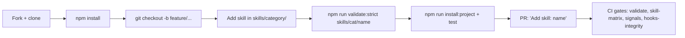

# 21 · Contributing

The prometheus-skill-pack is open source under the MIT license, and contributions are welcome. This page is the practical guide: the workflow for adding a skill, the validation gates a contribution must pass, how the submodule and import processes work, and the rules that keep a large multi-platform skill library coherent.

## The workflow



1. **Fork and clone**, then `npm install`.
2. **Branch**: `git checkout -b feature/<name>`.
3. **Add your skill** in the correct category directory.
4. **Validate** locally — strict mode for anything new.
5. **Test** with `npm run install:project` and exercise the skill in your tool.
6. **Open a PR** titled `Add skill: <name>`.

## Creating a skill

Place the skill in the appropriate `skills/<category>/` directory with a kebab-case name (≤ 64 characters, matching the pattern `^[a-z0-9]+(-[a-z0-9]+)*$`, no consecutive hyphens, matching the frontmatter `name`).

```bash
mkdir -p skills/rust/my-skill
cp docs/SKILL_TEMPLATE.md skills/rust/my-skill/SKILL.md
```

Edit the frontmatter. `name` and `description` are required; for new skills, strict validation also requires `license`, `version`, and a non-empty `metadata.tags`:

```yaml
---
name: my-skill
description: One clear sentence describing what this skill does and when to use it
license: MIT
metadata:
  author: your-name
  version: '1.0.0'
  category: rust
  tags: [rust, relevant, searchable, keywords]
---
```

Then write the instructions, following the conventions that keep skills usable inside a finite context window:

- **Under 500 lines** in `SKILL.md`; push detail to `references/` (progressive disclosure).
- **Third-person, imperative voice** — "Run the command," not "you should run."
- **Forward slashes** in every path, never backslashes.
- **Self-contained scripts** using package runners (`npx`, `uvx`, `bunx`), with structured/JSON output and `chmod +x`.
- **Concrete examples** and a clear statement of when the skill should trigger.

Optional directories: `scripts/` (executable code), `references/` (on-demand docs), `assets/` (templates, schemas), and `templates/` (Tera templates for forge-rs skills).

You can also generate a skill rather than hand-write it: `pmpo-skill-creator` produces a production-ready skill tree through the PMPO loop and runs strict validation on the result. (See [Process & Orchestration Skills](09-process-skills.md).)

## The validation gates

A contribution has to pass the same gates CI runs.

| Gate | Command | What it checks |
|---|---|---|
| Standard validation | `npm run validate` | All native skills against the AgentSkills.io spec; 0 errors |
| Strict validation | `npm run validate:strict` | Adds `license`, `version`, `metadata.tags` as **errors** — required for new skills |
| Single-skill check | `npm run validate:skill skills/cat/name` | One skill, lenient mode (includes submodules) |
| Progress signals | `npm run validate:signals` | Every process skill declares a `## Progress Signals` section (ratchet baseline) |
| Skill matrix | `npm run skill-matrix:ci` | Pairwise name+description similarity; fails on collisions not in the allowlist |
| Format | `npm run check-format` | Prettier |
| Hooks integrity | (CI `hooks-integrity` job) | The `.claude-plugin/hooks` symlink resolves to the physical `hooks/hooks.json` |

The strict gate exists because an under-specified skill — missing a license, missing tags, missing a version — is a skill that degrades discovery for the whole library. The skill-matrix gate exists because two skills with near-identical descriptions confuse the TF-IDF selection that picks which skill to load. Both are about keeping discovery sharp as the library grows.

## Working with submodules

Imported skills live under `skills/imported/` as git submodules because they have independent lifecycles. **You never edit an imported skill in place.** You update its pointer.

```bash
# Update all submodules to their tracked branch latest
git submodule update --remote

# Add a new imported skill
git submodule add <url> skills/imported/<name>   # kebab-case, matches frontmatter name
npm run validate:skill skills/imported/<name>

# Pin to a release in production
cd skills/imported/<name> && git checkout vX.Y.Z && cd -
git add skills/imported/<name> && git commit -m "chore: pin <name> to vX.Y.Z"
```

The current submodules are `artifact-refiner` and `sycophancy-correction` (skills), plus `surreal-memory-server`, `prometheus-knowledge`, and `liter-llm` (tools). Full detail is in `docs/SUBMODULES.md`.

## Importing an external skill

When a skill belongs in its own repository — separate lifecycle, cross-project reuse — import it rather than copying it. The process (full version in `docs/IMPORTING_SKILLS.md`):

1. Inspect the external skill for a valid `SKILL.md` and frontmatter.
2. `git submodule add <url> skills/imported/<name>` (kebab-case, matching the frontmatter name).
3. Validate: `npm run validate:skill skills/imported/<name>` and `bash scripts/check-imported-skill.sh`.
4. Document it in `skills/imported/README.md` and the main README.
5. Pin to a tag and commit the pointer.
6. Test via `npm run install:project`.
7. Commit `.gitmodules` and the pointer; push.

The rule that matters most: never modify imported skill files directly, and pin versions in production. If you need to fix an imported skill, fix it upstream and bump the pointer.

## Publishing checklist

Before a release:

- All skills pass `npm run validate:strict`.
- The marketplace builds: `npm run build`.
- The version is bumped in `package.json` and `plugin.json`.
- `CHANGELOG.md` is updated and the README reflects new skills.
- A git tag is created (`git tag vX.Y.Z`).

## The rules that protect the system

Two project-wide rules apply to any code-generation work in repositories that use this pack, and they are enforced by hooks (see [Hooks & Lifecycle](15-hooks-and-lifecycle.md)):

**The BDD Immutable-Tests Rule (`BDD-006`).** You may not edit existing tests to make failing tests pass. `protect-tests.sh` blocks edits to `tests/steps/*`, `tests/support/*`, and `tests/features/*.feature`; you may add new `.feature` files under `tests/features/drafts/`. Surface failing tests to a human rather than silently rewriting them.

**The Session Scratchpad pattern (`XC-003`).** In-flight session notes go in `SCRATCHPAD.md` at the project root — not committed (it is gitignored), not a plan, disposable. Plans live in `.kbd-orchestrator/phases/*/plan.md`; outcomes go in `reflection.md` or memory; architecture decisions go in `CLAUDE.md`.

These are not bureaucracy. They are the same principle that runs through the whole system — prevent the agent from grading its own homework — applied to the contribution process itself.

---

*Previous: [← 20 · Updating](20-updating.md) · Next: [22 · Advantages & Impact →](22-advantages-and-impact.md)*
