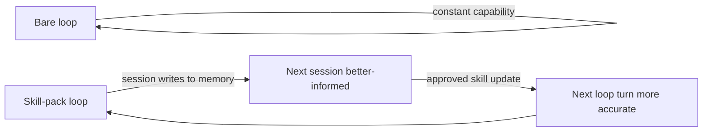

# 22 · Advantages & Impact

This page makes the case for the architecture and is honest about its costs. The analysis here was run through the `sycophancy-correction` server before publication, because a page titled "advantages" is exactly where unprompted affirmation and confidence-without-basis creep in. The goal is a claim you can verify, not a claim that sounds good.

## The one structural advantage everything else follows from

There is a single property that distinguishes this system, and it is worth stating before the list: **the loop compounds instead of repeats.**

A bare loop runs at constant capability. Each run starts from the same baseline; what the agent learned on Monday is gone by Wednesday; the reflection at session end is judged by the same model that produced the work. A prometheus-skill-pack loop runs at increasing capability: each session writes to memory, each memory enriches the next session's context, each approved skill update makes the next loop turn more accurate. Every other advantage on this page is a consequence of, or a precondition for, that one.

## The advantages, with their mechanisms

Each claim below names the mechanism that makes it true, so it is checkable rather than asserted.

**Cross-session learning that survives the context window.** Mechanism: the three-layer memory architecture and the Stop-hook write-back chain (`write-session-summary` → `forge-reflect` → `evaluate-session` → `propose-skill-update`). The concrete trace — a Redis-mock failure learned once and never repeated, across sessions and repositories — is on the [Memory and Learning](06-memory-and-learning.md) page.

**Reflection that cannot quietly flatter itself.** Mechanism: critic-context isolation, enforced by the `sycophancy-correction` gate on reflect-phase output, with a defined score threshold and a two-rejection soft cap. This is the property that keeps the *first* advantage from poisoning itself — a loop that learns from sycophantic reflections learns the wrong things.

**Tool independence.** Mechanism: harness-agnostic on-disk state. The same `.kbd-orchestrator/`, `.evolver/`, and `openspec/` state runs under Claude Code, OpenCode, Codex, and Kimi. A loop started under one tool can be resumed under another. This matters for teams that do not want to bet their workflow on a single vendor's roadmap.

**Bounded autonomy with the gates in the right places.** Mechanism: hard ceilings on every loop (max ticks, max iterations, max turns, max budget, max no-progress) and human gates at the five architecture-layer decision points, not the execution-layer ones. The system runs unattended where unattended is safe and asks for a human where a human's judgment is load-bearing.

**Auditability.** Mechanism: the file-based Karpathy KB (every claim traces to a readable `.md` file, no embedding black box), the OpenSpec per-change audit trail, the learning log, and Cedar policy governing skill mutation per environment. For a production system, "the agent improved" is only useful if you can see *how*.

**Front-loaded specification quality.** Mechanism: the ZeeSpec interrogator's GO/CAUTION/NO-GO gate refuses under-specified work before tokens are spent on it, rather than discovering the under-specification in the output.

## The costs, stated plainly

An advantages page that lists no costs is not analysis. These are real.

**Operational surface area.** Eight MCP servers, six tool binaries, a `launchd`/systemd service layer, and a submodule graph are more to install, run, and keep healthy than a single CLI. The pack mitigates this with one-command installers, idempotent config, delta updates, and graceful degradation — but the surface is genuinely larger, and a team that only needs a repeating agent does not need most of it.

**A learning curve in concepts, not just commands.** PMPO, KBD, the L0–L3 loop levels, phase discipline, the evolver bridge — these are a vocabulary, and the system is hard to operate well without it. This guide exists precisely because the concepts are a prerequisite. A team unwilling to learn the model will underuse the system.

**Rust as a build dependency.** The toolchain is Rust, which buys predictable latency and single-binary deployment but requires `rustup` and compile time on first install. For a team with no Rust in its stack, that is a new dependency to own.

**macOS-first service tooling.** The service layer ships as `launchd` LaunchAgents. Linux is supported via systemd user services or cron, but that path is a documented substitution rather than a turnkey one. Other operating systems require adapting the service layer.

**Honest internal inconsistencies.** The repository carries some drift this guide has flagged where it appears: the artifact-refiner's version differs across its own manifests (1.1.0 / 1.2.0 / 1.3.0); surreal-memory's canonical port here (23001) differs from upstream's default (3000); the two MCP config sources (`.mcp.json` and `mcp-port-table.json`) are not byte-identical; and the sycophancy server's Anthropic client is stubbed in the current release. None of these break the system, but they are the kind of detail that costs a new operator time, and they are named rather than hidden.

## Impact on the development process

Adopting this changes the shape of the work, not just its speed. Four shifts are worth calling out.

**The unit of work moves from the prompt to the loop.** You stop composing individual prompts and start defining loops — a goal, feedback sources, a termination condition, a cadence. Most of the operator's effort moves to writing good loop definitions and reviewing the gates, which is a different skill than prompt-crafting and, for long-horizon work, a more leveraged one.

**Review moves from output to architecture.** Because execution is autonomous and gated, human attention concentrates at five points: loop definition, skill updates, escalations, phase boundaries, and KB promotion. You review the *system that produces the code* more than each diff. This is higher-leverage when it works and requires trust in the gates to feel comfortable — which is why the gates are structural rather than advisory.

**Knowledge stops evaporating.** In a typical agentic workflow, what the team learns about a codebase lives in transcripts that are gone next session. Here it accumulates in a knowledge base that primes future work and, when promoted, in the skills themselves. The practical effect is that onboarding a new repository or operator carries forward prior learning instead of starting cold.

**Parallelism becomes safe.** Worktree isolation and the shared state substrate make it viable to run many loops at once without merge chaos — the posture Cherny described as managing fleets of agents. This is an enabler, not a guarantee; a team still has to design loops whose goals do not conflict.

## When this is the right tool — and when it is not

The honest scoping. This system earns its operational cost when: the work spans many sessions, agents run unattended, capability improvement has to be governed and audited, and the team is not willing to lock into a single AI tool. Those are the conditions it was built for.

It is overkill when: you want a repeating agent for a one-off task, the work fits in a single session, or a bare `/loop` with `/goal` already does the job. In those cases the bare primitives are the right choice, and this guide's own scorecard ([Introduction](01-introduction.md)) says so. The advantage of the pack is compounding over time; if the work does not span time, there is nothing to compound, and the extra surface area is pure cost.

That is the case, stated as something you can check rather than something you have to take on faith.

---

*Previous: [← 21 · Contributing](21-contributing.md) · Next: [23 · Glossary & Sources →](23-glossary.md)*
