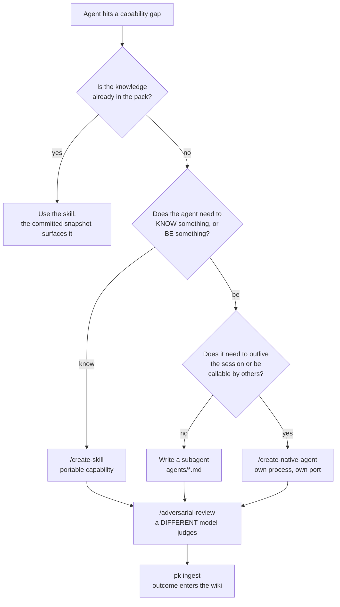

# 22a · Self-Extending Agents

Every other page in this guide documents a part. This one is about what the parts do
together, and it is the reason to install the whole toolset rather than cherry-pick.

The claim is narrow and concrete:

> An agent working in this environment can notice that it lacks a capability, decide
> whether that gap is best filled by a **skill**, a **native agent**, or **both**, build the
> thing, have a *different model* review it, and carry what it learned into the next task.

None of those steps requires a human in the loop. All of them are gated so that the agent
cannot quietly grade its own homework.

## The two loops

Everything rests on two learning loops running at different frequencies. They are covered
in [03 · Loop Architecture](03-loop-architecture.md) and
[06 · Memory and Learning](06-memory-and-learning.md); here is what matters for composition.

**The Feynman loop** operates *within* a task. Explain the thing simply, find where the
explanation breaks, go learn that, explain again. In this pack it is the
[learn domain](10-learn-skills.md) — and its mastery criterion is deliberately hostile to
self-assessment:

1. `learn-grade` passes at ≥ 0.7 **and** `misconceptions_absent == 1.0`
2. Two novel transfer problems solved at ≥ 0.7
3. Retention verified at ≥ 24 h

**Self-reported fluency never closes a loop.** The grader is routed through
[sycophancy-correction](07-sycophancy-correction.md), so a grade that says "no gaps" when
gaps exist is rewritten before delivery.

**The Karpathy loop** operates *across* tasks. Each session's outcomes are compiled into a
persistent, interlinked wiki that the next session reads before it starts. Concretely: a
`UserPromptSubmit` reads a bounded committed prompt snapshot and injects prior relevant knowledge;
a `Stop` hook ingests what happened. The knowledge compounds whether or not anyone
remembers to write it down.

The interesting property is that these loops feed each other. Feynman finds the gap;
Karpathy remembers that the gap existed and what closed it.

## Deciding: skill, agent, or both

This is the decision the toolset exists to make actionable.



The three-way test, stated plainly:

| Signal | Build |
|---|---|
| "I keep re-deriving the same procedure" | **skill** |
| "I need a bounded second opinion inside this session" | **subagent** (`agents/*.md`) |
| "This needs to still be running tomorrow, or be callable by another agent" | **native agent** |
| "The agent needs new knowledge *and* a place to run it" | **both** |

**Both** is more common than it sounds. A native agent generated by
[`/create-native-agent`](12-native-agent-generator.md) ships with a skills engine and a
`skill_pack_path` — it *loads skills at runtime*. So the natural pattern is: create the
skill that encodes the knowledge, then create the agent that hosts it and exposes it over
A2A. The skill is the capability; the agent is the address.

## Why each tool is in the set

Nothing here is decorative. Each piece closes a specific failure mode of the others.

| Tool | Without it |
|---|---|
| [Feynman loop](10-learn-skills.md) | the agent believes it understands things it does not |
| [Karpathy loop / `pk`](06-memory-and-learning.md) | every session starts from zero; the same mistake recurs forever |
| [Skill creator](12a-pmpo-skill-creator.md) | knowledge stays trapped in one conversation |
| [Agent creator](12-native-agent-generator.md) | capabilities can't outlive a session or be called by anything else |
| [Adversarial review](09a-adversarial-review.md) | the producer grades itself and always passes |
| [Sycophancy correction](07-sycophancy-correction.md) | reflections become self-congratulation and learn nothing |
| [liter-llm](09b-liter-llm.md) | there is no *second* model available to be the critic |
| [forge constitutions](14a-forge-rs.md) | generated code drifts from house conventions |
| [artifact-refiner](11-artifact-refiner.md) | non-code outputs have no convergence criteria at all |

Read that table as a chain of dependencies rather than a menu. Adversarial review is
worthless without a second model, which requires liter-llm to be configured. The Karpathy
loop is worthless if reflections are sycophantic, which requires the correction gate. A
skill creator without a validator produces plausible-looking skills that fail to load.

## The anti-sycophancy spine

This is the part most easily skipped and least safely skipped.

A self-improving system that grades its own work does not improve — it converges on
whatever its own biases reward. This pack blocks that structurally, in three places:

1. **The judge is a different model.** Enforced by `cross_model_check` in every findings
   artifact. Not a preference — the artifact records `verified-distinct`,
   `same-model-collision`, or `unverified-producer-unknown`, so a self-grade is visible
   rather than silent.
2. **Reflections are screened before they count.** The reflector's `SubagentStop` hook
   routes output through sycophancy-correction at `strict`. A reflection scoring ≥ 0.4 is
   rejected with actionable feedback, up to a 2-rejection cap so it cannot loop forever.
3. **Zero-finding reviews must show their work.** A review that finds nothing must carry
   `checked_classes` — the failure classes examined and why each does not apply. A clean
   report with no due-diligence trail is rejected as theatre.

The cost of getting this wrong is documented and real: the first eight adversarial reviews
in this repository were Claude reviewing Claude, all `PASS`, for the five compounding
reasons in [09a](09a-adversarial-review.md#the-failure-this-page-exists-to-prevent). The
pipeline reported success the entire time.

## A full cycle

`/start-business-build` is the closest thing to an end-to-end demonstration, chaining
ideation → specification → planning → generation → packaging → deployment:

```
$ /start-business-build "track shipping-cost trends across our top 5 carriers"

Stage 1: Ideation mindmap...                            ✅
Stage 2: ZeeSpec — 60 questions answered, 4 NO-GO       ✅
Stage 3: Evolver plan — 3 changes ordered               ✅
Stage 4: OpenSpec changes generated                     ✅
Stage 5: change-001 (carrier-data-scraper)              ✅ accepted
Stage 5: change-002 (price-trend-analyzer)              ✅ accepted
Stage 5: change-003 (alert-dispatch)                    ⚠ rejected (carrier API rate limits)
        pk ingest captured: "carrier API rate limits force alerting to be daily, not realtime"
Stage 6: forge package-librefang ./shipping-cost-watch  ✅ → shipping-cost-watch.lf-skill.zip
Stage 6: /upload-to-bossfang?                           y  → installed and verified
```

The important line is the **rejection**. A constraint discovered during implementation —
carrier rate limits — is captured into the knowledge base rather than discarded. The next
plan that touches carrier APIs will surface it before the same wall is hit again. That is
the Karpathy loop closing around code generation.

## Installing the whole thing

The composition only works if the substrate is actually running. In dependency order:

```bash
bash scripts/install-binaries.sh          # 14 CLIs
bash scripts/install-mcp-services.sh      # launchd/systemd daemons
bash scripts/install-skills-flat.sh       # 145 skills → 14 platforms
bash scripts/register-slash-commands.sh   # slash commands
```

Then configure the second model — without it, adversarial review silently degrades to
same-family self-review:

```bash
bash skills/process/liter-llm-bridge/scripts/configure-models.sh repair
bash skills/process/liter-llm-bridge/scripts/configure-models.sh verify
```

And verify:

```bash
prometheus doctor                    # overall health
bash scripts/check-model-config.sh   # gateway, roles, cache drift (exit 2 = drift)
node scripts/verify-installed-skills.js
```

> `prometheus doctor` does not yet verify binaries, LaunchAgents, MCP config, or hooks —
> those checks report `not implemented yet`. The three commands above cover what it skips.

## What this is not

Worth stating plainly, because the framing invites overclaiming:

- **It is not autonomous self-improvement.** Every generator is invoked deliberately. There
  is no background process rewriting skills.
- **It is not unbounded.** Loops are capped — 3 iterations in the skill creator, 5 in
  artifact-refiner, a 2-rejection cap on reflection screening.
- **It does not eliminate review.** It relocates it: a second *model* reviews continuously
  so the human reviews at decision points instead of line by line.

What it does is make the expensive parts cheap: encoding a capability so it persists,
standing up something that runs, getting an adversarial opinion, and never solving the
same problem twice.

## See also

- [03 · Loop Architecture](03-loop-architecture.md) — L0–L3 vocabulary
- [06 · Memory and Learning](06-memory-and-learning.md) — the Karpathy wiki
- [09a · Adversarial Review](09a-adversarial-review.md) — the cross-model gate
- [12 · Agent Creator](12-native-agent-generator.md) · [12a · Skill Creator](12a-pmpo-skill-creator.md)
- [22 · Advantages and Impact](22-advantages-and-impact.md)
