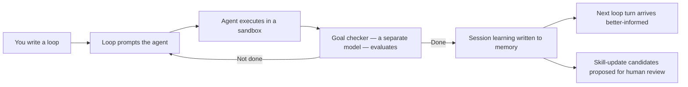

# Prometheus Skill Pack — Official Product Documentation

*Maintained by Travis James, CTO, Prometheus AGS · Licensed MIT*

This is the canonical product documentation for the **prometheus-skill-pack**: a self-improving AI skill execution engine that turns the loop — not the prompt — into your primary unit of work.

Most teams treat an AI coding agent as something you talk to. You type, it responds, you type again. That posture caps out fast. The prometheus-skill-pack is built on a different premise: you design the loop that prompts the agent, the loop remembers what it learned, and the system proposes improvements to its own skills as it discovers better ways to work. The agent executes. You write loops.

That premise is not aspirational. It is implemented — across Claude Code, OpenCode, Codex, Kimi Code, and five more AI tools — as a four-layer pipeline, three nested loop levels, eight MCP servers, a Karpathy-pattern knowledge base, a structural anti-sycophancy gate, and a Rust toolchain that generates new agents, skills, and native tools on demand.

This documentation explains all of it. Every skill, every tool, every CLI, every script, every hook — documented individually and then collectively, with the architecture diagrams that make the design legible.

---

## How this documentation is organized

The guide is built in layers. Read it top to bottom the first time; use it as a reference after that.

### Foundations — the *why* and the *what*

| # | Page | What it covers |
|---|------|----------------|
| 01 | [Introduction](01-introduction.md) | What the skill pack is, who it is for, the autonomy ladder, and the loop posture |
| 02 | [Metaprompting, PMPO, and KBD](02-metaprompting-pmpo-kbd.md) | The methodology: metaprompting, Prometheus Meta-Prompting Orchestration, Knowledge-Based Development, and the theory behind them |
| 03 | [Loop Architecture](03-loop-architecture.md) | The L0–L3 loop levels, nested loops, `loop.json`, the `loop-tick.sh` exit-code contract, feedback sources, escalation, and autonomy gates |
| 04 | [The Four-Layer Pipeline](04-four-layer-pipeline.md) | ZeeSpec → PMPO → OpenSpec → forge-rs, with C4 container diagrams |

### The substrate — what makes loops compound

| # | Page | What it covers |
|---|------|----------------|
| 05 | [The MCP Server Substrate](05-mcp-substrate.md) | All eight MCP servers, the canonical port table, and Firecrawl vs. Tavily |
| 06 | [Memory and Karpathy-Pattern Learning](06-memory-and-learning.md) | The three-layer memory architecture, the self-learning engine, and the cross-session write-back sequence |
| 07 | [Sycophancy Correction](07-sycophancy-correction.md) | The eight patterns (S-01–S-08), modes, strictness, MCP tools, the reflection gate, and how this documentation was checked with it |

### The catalog — every skill

| # | Page | What it covers |
|---|------|----------------|
| 08 | [Skills Overview](08-skills-overview.md) | The skills model, discovery, the AgentSkills.io standard, and the full category index |
| 09 | [Process & Orchestration Skills](09-process-skills.md) | ZeeSpec, iterative-evolver, the KBD orchestrator and its child skills, pmpo-elicit, pmpo-outer-loop, pmpo-skill-creator, native-agent, liter-llm-bridge, ideation-mindmap, kbd-evolve |
| 10 | [Learn Domain Skills](10-learn-skills.md) | The 12 learn skills (ui-surface, learn-goal, learn-survey, learn-plan, feynman-loop, learn-grade, learn-retain, learn-practice, learn-certify, learn-kb, learn-about-system, learn-harness), FSRS-6 spaced retrieval, KB adapters, and meta-learning for the Prometheus stack |
| 10 | [Language & Domain Skills](10-language-skills.md) | Rust, React, Flutter, Tauri, HTMX, TypeScript, Go, Python, architecture, testing, DevOps, document extraction, and the Flint SDK skills |
| 11 | [The Artifact Refiner](11-artifact-refiner.md) | The artifact-centric refinement engine and all fifteen of its commands |
| 12 | [The Native Agent Generator](12-native-agent-generator.md) | Generating complete Rust agents, the A2A/AG-UI/A2UI protocols, and agent networks |

### The engine room — tools, toolchain, lifecycle

| # | Page | What it covers |
|---|------|----------------|
| 13 | [Tools Reference](13-tools-reference.md) | forge-rs, prometheus-cli, prometheus-knowledge, liter-llm, surreal-memory-server, and prometheus-rust-auditor |
| 14 | [The Rust Toolchain & Dynamic Generation](14-rust-toolchain.md) | Why Rust, how the binaries are built, and how the pack generates new skills, CLIs, and MCP servers |
| 15 | [Hooks & Lifecycle](15-hooks-and-lifecycle.md) | Every hook event and script, progress signaling, scope guards, and the immutable-tests rule |
| 16 | [CLI & Scripts Reference](16-cli-and-scripts.md) | Every installer, validator, and runtime script, plus the npm script surface |

### Deployment — install, run, update, contribute

| # | Page | What it covers |
|---|------|----------------|
| 17 | [Platform Support](17-platform-support.md) | Per-tool support: Claude Code, OpenCode, Codex, Kimi Code, MiniMax, Cursor, Windsurf, Gemini CLI, Roo Code, Amp |
| 18 | [Plugins & Marketplace](18-plugins-and-marketplace.md) | Claude Code plugins and marketplace, OpenCode plugins, and the distribution model |
| 19 | [Installation](19-installation.md) | Toolchain install (Rust, Go, Node, Docker), the one-command install, and MCP services |
| 20 | [Updating](20-updating.md) | Keeping skills, tools, submodules, and MCP services current without breaking anything |
| 21 | [Contributing](21-contributing.md) | The open-source workflow, validation gates, submodules, and importing skills |

### Closing

| # | Page | What it covers |
|---|------|----------------|
| 22 | [Advantages & Impact](22-advantages-and-impact.md) | What changes about your development process, and why |
| 23 | [Glossary & Sources](23-glossary.md) | Every term defined, every external claim cited |

### Operational

| Document | What it covers |
|---|---|
| [Production Readiness Report](https://github.com/Prometheus-AGS/prometheus-skill-system/blob/main/docs/production-readiness-report.md) | Evidence table separating artifact, disposable-runtime, installed-service, and external-deployment certification |
| [Deployment Modes](https://github.com/Prometheus-AGS/prometheus-skill-system/blob/main/docs/deployment-modes.md) | Mode 0-3 capability matrix — which services are required for which features |

---

## The thirty-second version

If you read nothing else, read this.

A loop that forgets is a very fast way to do the same thing many times. A loop that remembers gets better at the task it was built to do. The prometheus-skill-pack is the infrastructure that makes the second kind of loop viable — and makes it work the same way no matter which AI tool you point at it.

The agents are ready. The substrate is the question. This is the answer to that question.

---

## A note on accuracy

This documentation is held to the same standard as the system it describes. Every external claim is cited in the [Glossary & Sources](23-glossary.md). Narrative sections were checked against the `sycophancy-correction` MCP server before publication — the same structural quality gate the skill pack runs on its own reflection output. Where the repository contains a known inconsistency (for example, version drift across an imported skill's manifests), this documentation names it rather than papering over it. A document that only tells you what works is not documentation. It is marketing.
