# Runtime architecture and execution tiers

REST, CLI, MCP, and embedded callers converge on the same correctness boundary. No adapter owns a private replay cache or a second definition of success. Each surface submits a signed contract to the durable service and reads the same ledger, event log, content-addressed store, and receipt chain.

```mermaid
flowchart LR
  accTitle: Prometheus Exec trust and data architecture
  accDescr: Authenticated callers submit signed requests through adapters to one facade. Admission validates identity, policy, limits, code, and inputs before durable acceptance. Tier P or Tier W executes, artifacts enter the CAS, and a signed hash-linked receipt becomes available for offline verification.
  Caller["CLI, UDS REST, MCP, embedded, or Tier R target"] --> Auth["Same-user or in-process caller boundary"]
  Auth --> Facade["Shared execution facade"]
  Facade --> Validate["Signature + canonical hash + schema + limits"]
  Validate --> Policy["Baseline policy; Cedar can only tighten"]
  Policy --> Ledger["Durable request/run ledger"]
  Ledger --> Router{"Validated tier and runtime"}
  Router --> P["Tier P\nSeatbelt or bwrap/Landlock"]
  Router --> W["Tier W\nWasmtime Cranelift or Pulley"]
  P --> CAS["SHA-256 CAS\nstreams + artifacts + environment"]
  W --> CAS
  CAS --> Events["Hash-linked event log"]
  Events --> Receipt["Signed hash-linked receipt log"]
  Receipt --> Terminal["Terminal state publication"]
  Terminal --> Offline["Public-key verification and portable bundle"]
```

## Admission before execution

Admission establishes the claim that later evidence can support:

1. Validate the signed request and its RFC 8785 canonical hash.
2. Bind one request ID to one canonical payload.
3. Validate code kind, runtime, inputs, capabilities, provenance, and resource limits.
4. Apply baseline authority rules before any optional Cedar policy.
5. Verify Tier W component authorization before validation, compilation, caching, or linking.
6. Transfer uploaded code and input blobs from temporary pins to durable request ownership.
7. Persist acceptance before a worker can start.

If any step fails, no execution receipt claims that code ran. Cedar is a one-way tightening layer: it may deny authority that baseline policy permits, but it cannot permit undeclared network, environment, filesystem, or output access.

## The durability order

The service persists state in an order designed for crash ambiguity:

- acceptance exists before execution begins;
- a spawn boundary exists before a native process is created;
- events exist before a caller can observe the corresponding lifecycle transition;
- streams and artifacts are stored and receipt-pinned before terminal publication;
- the signed receipt enters the immutable receipt log before the ledger becomes terminal.

After restart, reconciliation can therefore distinguish work that never spawned, work that crossed the spawn boundary without a terminal receipt, and work whose receipt exists but whose final response was lost. It requeues, interrupts, or republishes accordingly; it does not guess from retry counts.

## Tier P: host-attested process execution

Tier P runs one Python, Node, or Bash program under a supported OS sandbox. Baseline policy constrains authority before the process is created. The backend clears the environment, materializes declared inputs read-only, provides a private writable output tree, denies network by default, controls the process group, and applies wall-clock, stream, stack, and artifact ceilings.

The receipt is **attested**: it binds the exact interpreter/toolchain, generated sandbox profile, measured host state, request, outputs, and signer. A different operating system or unavailable sandbox is not silently replaced with direct process execution.

- macOS uses Seatbelt and is the release host with runtime evidence.
- Linux has deterministic bubblewrap/Landlock planning and cross-build evidence, but no release Linux kernel runtime evidence.
- Windows Tier P is unavailable.

Read [Tier P native processes](./tier-p-native-processes.md) for the platform theory and authoring constraints.

## Tier W: portable capability execution

Tier W runs an authorized WebAssembly component implementing `prometheus:component@0.1.0`. The host links only the typed imports present in the capability grant. Closed stdio, empty ambient environment and preopens, disabled TCP/UDP, fixed clocks, deterministic random bytes, fuel, epochs, memory/table/instance limits, and bounded output make the invocation replayable.

The receipt is **verified**: it includes component authorization, engine version, backend profile, and a deterministic projection. The projection binds behaviorally relevant inputs and outputs while excluding backend-specific measurements such as wall time. Cranelift and Pulley can therefore be compared without pretending that their execution profiles are identical.

- Estate desktop mode trusts the active signed plugin generation.
- Standalone embedded mode trusts exact component pins.
- Bundled-mobile mode uses compiled-in pins and Pulley/no-JIT policy.
- Portable verification replays receipt-bound bytes through Pulley.

Read [Tier W portable components](./tier-w-portable-components.md) for WIT, authorization, deterministic capabilities, and platform profiles.

## Tier R: delivery to enrolled targets

Tier R is an estate-only protocol kernel. It signs dispatch envelopes, validates enrolled endpoint/key bindings, persists per-target queues, handles expiry and replay, and verifies peer responses. It does not execute code itself. Each accepted target submits the original request once through its local facade.

The transport is injected. Local execution crates do not depend on KBD or Sovereign Sync, and local health or offline verification does not wait for remote peers. See [Remote dispatch and reconciliation](./remote-dispatch-and-reconciliation.md).

## Three local deployment forms

| Form | Trust source | Transport | Runtime purpose |
| --- | --- | --- | --- |
| Estate sidecar | Active signed plugin generation | Same-user mode-`0600` Unix socket | Managed desktop operation service |
| Standalone embedded | Explicit component hash pins | In-process async Rust API | Desktop/Tauri or service integration |
| Bundled-mobile embedded | Compiled-in component pins | In-process API through FFI | iOS/Android application integration |

The embedded API never creates a Tokio runtime. Blocking Wasmtime, ledger, and CAS operations use the embedding runtime's blocking pool. Thin FFI and Tauri boundaries do not accept private signing-key bytes.

## Separate identities and trust material

The local identity signs requests and receipts. Plugin trust authorizes component bytes. Remote enrollment binds peer endpoints to signing keys. These are different scopes:

- a trusted local device key does not authorize an arbitrary component;
- an authorized component does not enroll a remote peer;
- an enrolled peer cannot broaden a request's capabilities; and
- a portable bundle contains public verification material, never a private signing key.

Next: [Tier P native processes](./tier-p-native-processes.md).
