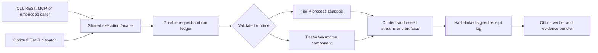

# Architecture and execution tiers

Every local surface converges on one durable service. REST, MCP, CLI, and embedded adapters do not own separate replay or receipt logic. They submit the same signed request, then read the same run ledger, event log, receipt log, and content-addressed artifact store.

## The shared correctness boundary

Acceptance is durable before execution starts. The service binds a request ID to its RFC 8785 canonical unsigned hash. Same ID and same hash replay; same ID and different hash return `409`. A spawn boundary is persisted before native process creation. Ordered events are appended before terminal visibility, and the receipt log is durable before terminal ledger publication. Restart reconciliation therefore has three safe outcomes: requeue work that never spawned, recover a logged receipt, or sign an interrupted terminal receipt for work that crossed the spawn boundary.

Artifact ownership follows the same transaction. Uploaded code and inputs move from temporary upload pins to request ownership. Terminal streams and artifacts are pinned to the signed receipt before the terminal state becomes visible. Failed publication rolls those pins back.

## Tier P: native process isolation

Tier P runs Python, Node, or Bash. Baseline policy rejects undeclared network, environment, filesystem, and output authority before the platform sandbox starts. Cedar may tighten that decision but cannot broaden it.

The locally certified macOS backend is Seatbelt. It launches the real interpreter under a generated profile, clears the environment, restricts reads/writes, denies networking, controls the complete process group, and enforces wall, stream, and artifact ceilings. The receipt is **attested** because the operating-system process sandbox and measured host state are part of the claim.

Linux has deterministic bubblewrap/Landlock planning and cross-build evidence but no kernel runtime evidence from this Mac. Windows Tier P is unavailable. Unsupported platforms remain health-live and readiness-failed instead of falling back to an unsandboxed process.

## Tier W: portable component execution

Tier W accepts WebAssembly components only after authorization. Estate mode requires the active Ed25519-signed plugin generation; standalone and bundled-mobile modes require exact hash pins. Authorization happens before validation, compilation, caching, linking, or instantiation and is bound into the cache identity.

Wasmtime 46 runs either Cranelift or Pulley. The host exposes only typed capabilities explicitly present in the grant. Fixed time and random inputs make replay deterministic. Fuel, epoch, memory, table, instance, stream, stack, and artifact fences map to stable terminal failure kinds. A backend-independent projection lets Cranelift and Pulley results be compared without pretending their engine profiles or measured usage are identical.

## Three local deployment forms

| Form | Trust | Transport | Intended host |
| --- | --- | --- | --- |
| Estate sidecar | Active signed plugin generation | Same-user mode-`0600` Unix socket | Managed Mac workstation |
| Standalone embedded | Explicit component hash pins | In-process async Rust API | Desktop/Tauri or service integration |
| Bundled-mobile embedded | Compiled-in component pins | In-process API through FFI | iOS/Android application |

The embedded API never creates a Tokio runtime. Blocking Wasmtime, ledger, and CAS work is placed on the embedding runtime's blocking pool. Neither FFI nor thin Tauri adapters accept private signing-key bytes.

## Tier R: remote dispatch without local coupling

The estate-only remote crate adds signed origin envelopes, enrollment snapshots, per-target immutable queues, expiry/replay checks, and verified peer receipts. The transport is injected; local crates do not depend on Sovereign Sync or KBD. A remote target hands accepted work to its local facade, so local request idempotency remains authoritative. Slow or unavailable peers cannot delay local health, local execution, or offline verification.

Next: [Local API, CLI, and MCP](./local-api-cli-and-mcp.md).
