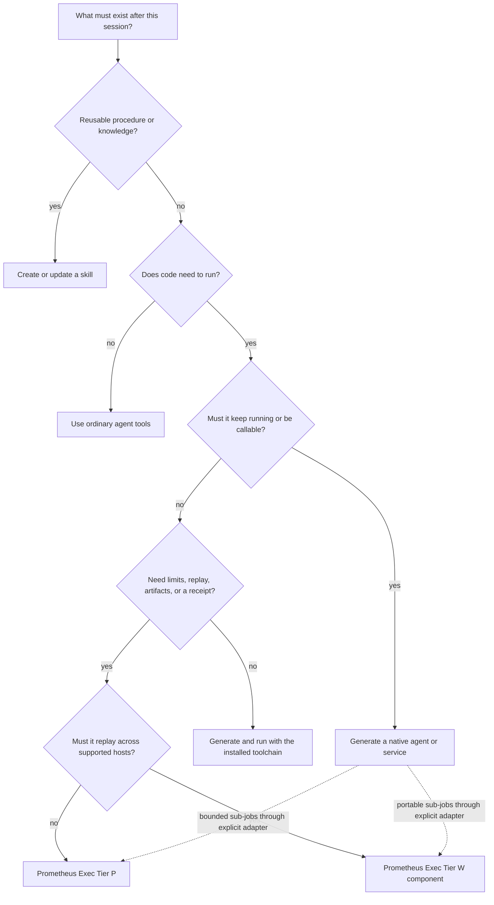
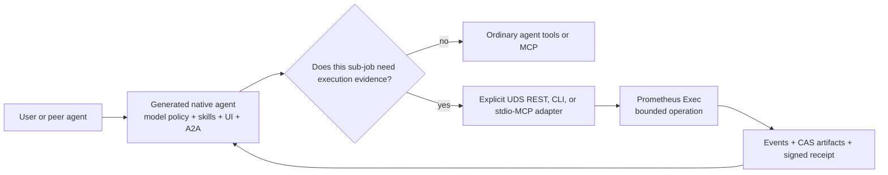

# Choose a skill, program, operation, or native agent

Start with the lifetime and proof requirement, not the implementation language. A 30-line Python report and a six-crate Rust agent can both be “generated code,” but they solve different problems and should not share a deployment path.

## The canonical comparison

| Choice | Produces | Lifetime | Addressable service | Execution isolation | Replay and signed receipt | Use it when |
| --- | --- | --- | --- | --- | --- | --- |
| Ordinary Bash, Python, or agent tools | Session output and files | Current work | No | Whatever the harness or shell supplies | No Prometheus receipt | Exploration, editing, debugging, or low-risk local work |
| Forge and installed language toolchains | Source, packages, binaries, components, or scaffolds | Persisted artifact | Only if the program implements one | Build-time rules, not Prometheus execution policy | Build logs only | You need to author, compile, audit, or package a program |
| Prometheus Exec Tier P | One bounded Python, Node, or Bash run | Durable run record | Private local operation API | OS process sandbox plus baseline/Cedar authority | Host-attested receipt | Generated scripts need bounded authority and evidence |
| Prometheus Exec Tier W | One authorized component invocation | Durable run record | Private local or embedded API | Typed component capabilities and Wasmtime limits | Verified portable projection | A deterministic algorithm must run under explicit portable capabilities |
| Native-agent generator | Rust workspace, HTTP service, React UI, CLI, and optional Docker deployment | Independent process/service | A2A, AG-UI, A2UI, and chat endpoints | Its deployment environment | Not an execution receipt by default | The capability needs a model loop, UI, port, independent lifecycle, or other agents as callers |
| Skill creator | Instructions, schemas, scripts, references, and hooks | Loaded by supported AI tools | No | Harness-dependent | Validation records, not execution receipts | A repeatable procedure or domain method should guide future agents |

## Use ordinary tools when evidence is not the product

Prometheus deliberately preserves creative Bash and Python use. Editing files, exploring an API, compiling a project, running a local formatter, and investigating a failure do not automatically become formal operations. Wrapping every shell command would add friction without improving the evidence that matters.

Promote a command to Prometheus Exec when at least one of these becomes true:

- duplicate execution would be harmful;
- the caller may disconnect and return later;
- code should see only declared inputs, outputs, environment, and network authority;
- artifacts must be retained by digest;
- another person or machine must verify what ran; or
- the outcome will be used as certification evidence.

## Use the installed toolchains to create the program

Cargo, Forge, Node/npm, Python, templates, and code-generation skills create artifacts. They can scaffold a CLI, render a Rust crate, compile a component, or produce a script. They do not add Prometheus request identity, durable event ordering, CAS retention, or signed receipts.

That split is intentional:

1. Generate and inspect the program with the best authoring tool.
2. Choose its deployment form.
3. If it is a bounded eligible operation, submit it to Tier P or Tier W.
4. If it is a persistent product or service, build and deploy it normally.

The [program-generation guide](./generating-programs.md) shows the supported paths.

## Use a native agent when the runtime itself is the product

`/create-native-agent` emits a complete Rust service: model routing, skill selection, MCP client support, A2A/AG-UI/A2UI, a React interface, a management CLI, and optional Docker packaging. Its process can outlive the session and accept work from users or other agents.

Prometheus Exec has none of those responsibilities. It owns one bounded operation lifecycle. It is a worker boundary, not a conversational agent.

The adapter is explicit because the current native-agent template has a network-oriented MCP client while Prometheus Exec exposes same-process stdio MCP and a private Unix-socket REST API. Documentation must not imply that newly generated agents are automatically wired to Exec.

## Two WebAssembly formats that must not be confused

The native-agent generator's `librefang-wasm` target and Prometheus Exec Tier W are separate contracts:

| Property | Native-agent LibreFang target | Prometheus Exec Tier W |
| --- | --- | --- |
| Build target | `wasm32-unknown-unknown` core module | WebAssembly component, normally `wasm32-wasip2` |
| Required ABI | `alloc`, `execute`, memory, and LibreFang host calls | `prometheus:component@0.1.0` WIT world |
| Host purpose | LibreFang/bossfang Agent OS skill | Deterministic evidence-producing operation |
| Authorization | LibreFang `skill.toml` capability manifest | Signed plugin generation or exact component hash pins |
| Interchangeable | No | No |

To offer the same business behavior in both systems, build two adapters around shared domain logic. Do not rename or repackage one binary and claim compatibility.

## Common combinations

- **Skill + Tier P:** the skill explains a domain transformation; generated Python performs one evidenced run.
- **Forge + Tier W:** Forge scaffolds a Rust component; Cargo builds it; plugin distribution authorizes it; Tier W executes it.
- **Native agent + Exec:** the native agent owns conversation and scheduling; an explicit adapter submits high-value bounded jobs and stores receipt references.
- **Toolchain only:** a developer generates and installs a permanent CLI that is operated as normal software.
- **Exec only:** a caller already has eligible code and needs constrained execution, replay, or verification.

Next: [Closed-loop architecture](./closed-loop-architecture.md).
