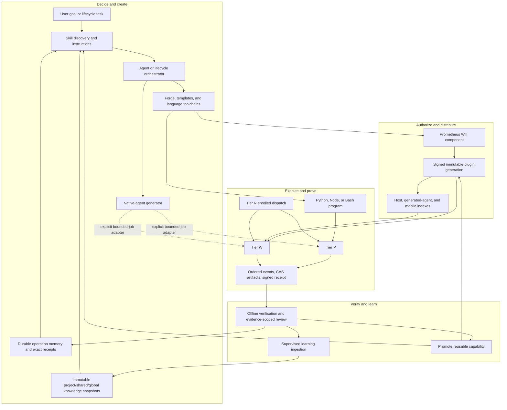

# Closed-loop architecture

Prometheus Exec closes a narrow gap in a larger system. Before it existed, Prometheus could decide what to do, generate an implementation, and remember the result. It could not represent one dynamically generated computation as a durable, independently verifiable operation. The execution layer adds that boundary without absorbing the responsibilities of the systems around it.

## The relationship map

## Responsibility boundaries

### Skills answer “how should an agent approach this?”

A skill is committed operational knowledge: instructions, schemas, references, scripts, and validation rules. It can tell an agent to use Prometheus Exec, but it is not itself an execution sandbox or daemon.

### Memory answers “what durable operation happened?”

The memory system stores idempotent operations and exact receipts for its own domain. Prometheus Exec applies similar durable-operation principles to code execution, but it owns a separate ledger, event log, receipt log, and CAS. Neither system silently uses the other as its correctness boundary.

### Knowledge and learning answer “what should the next session know?”

Verified outcomes can become immutable evidence for the supervised learning worker. Knowledge publication remains asynchronous and snapshot-based. Execution does not mutate prompt context inline, and a receipt is not automatically promoted to a lesson.

### Forge and installed toolchains answer “what artifact should exist?”

Forge enriches and scaffolds code. Cargo, rustc, cargo-component, Node/npm, Python, and shell tooling build or validate it. Prometheus Exec begins after eligible bytes exist. This keeps code-generation creativity separate from execution authority.

### Native-agent generation answers “what independent service should exist?”

The native-agent generator produces an addressable product with a model loop, protocols, UI, and lifecycle. It can be a caller of Dynamic Operations through an intentional adapter, but Prometheus Exec neither generates nor hosts that service.

### Plugin distribution answers “which reusable component bytes are trusted?”

Estate Tier W trusts the active signed plugin generation. The component, capability metadata, search/index state, and target receipts activate together. Standalone and bundled-mobile deployments use exact pins instead. Prometheus Exec verifies trust before component validation or compilation.

### Prometheus Exec answers “what exactly ran, under what authority, and what came out?”

The execution layer owns request identity, admission policy, runtime selection, bounded execution, artifacts, events, receipts, replay, and verification. That is intentionally the smallest responsibility that completes the loop.

## Control flow versus evidence flow

Control and evidence move in opposite directions:

1. **Control flows down:** goal → skill/context → generated artifact → signed request → capability-limited runtime.
2. **Evidence flows up:** output bytes → CAS references → receipt → verification → review → memory and learning.

The return path is what makes the loop compound safely. A model summary alone is not enough; durable evidence lets later systems distinguish what was requested, what actually executed, and what can be independently checked.

## A version-1.0 capability boundary

“Version 1.0” here describes architectural completeness, not a package version change. The skill system now has first-class answers for:

- reusable knowledge: skills;
- durable context: memory and knowledge snapshots;
- artifact creation: Forge, templates, and installed toolchains;
- persistent autonomy: generated native agents;
- trusted distribution: signed plugin generations;
- bounded dynamic work: Prometheus Exec; and
- compounding improvement: evidence-scoped review and supervised learning.

The current release metadata remains `1.7.0`.

Next: [Generating programs for execution](./generating-programs.md).
