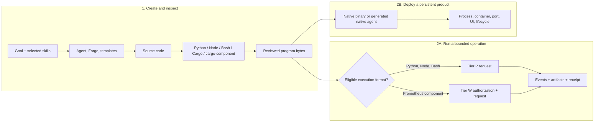

# Generate programs, then choose how they run

Prometheus Exec starts with bytes. It does not prompt a model, render a template, resolve dependencies, or decide what program should be written. That work belongs to the agent and the installed authoring toolchain. The handoff is the point where generated code becomes an operation request.

## Three separate lanes



Do not force one lane through the other. A service is not a bounded operation, and a one-shot transformation does not need an HTTP server and React application.

## Authoring tools and their handoff

| Tool | What it creates or checks | Prometheus Exec handoff |
| --- | --- | --- |
| Ordinary agent code generation | Scripts, modules, configuration, and glue | Submit eligible final bytes after inspection |
| `forge enrich` and templates | Task-specific context, scaffolds, skills, and source templates | Use the resulting Python/Node/Bash file or compile a Prometheus component |
| `prometheus generate` | Forge-style generated project content | Choose Tier P, Tier W, or normal deployment based on artifact type |
| Python | Script source | Tier P `--runtime python3` |
| Node/npm | JavaScript source and packages | Tier P `--runtime node`; bundled ambient dependencies are not automatically granted |
| Bash | Shell program | Tier P `--runtime bash` |
| Cargo and cargo-component | Native binaries, libraries, or WebAssembly components | Only a component implementing `prometheus:component@0.1.0` enters Tier W |
| `prometheus-rust-auditor` | Rust quality and architecture findings | It validates source/build quality; it does not execute an operation |
| `/create-native-agent` | Long-lived Rust agent service and frontend | Deploy normally; add an explicit Exec adapter only for bounded sub-jobs |

## Path A: generated Python, Node, or Bash through Tier P

The checked-in examples under `examples/prometheus-exec/tier-p/` all read named inputs from `PROMETHEUS_INPUT_DIR`, write declared artifacts below `PROMETHEUS_OUTPUT_DIR`, and avoid ambient network or filesystem assumptions.

```bash
prometheus-exec run \
  --socket ./runtime/exec.sock \
  --state-dir ./exec-state \
  --identity ./exec-identity.json \
  --runtime python3 \
  --code ./examples/prometheus-exec/tier-p/transform.py \
  --input records=./examples/prometheus-exec/tier-p/records.json \
  --timeout-ms 5000 \
  --output-mb 2 \
  --format json
```

Tier P materializes the input at `$PROMETHEUS_INPUT_DIR/records`; the input name is part of the signed request. The program writes `summary.json` below `$PROMETHEUS_OUTPUT_DIR`. The resulting stdout, stderr, and artifact bytes are retained by SHA-256 and referenced by the receipt.

The same pattern works for `transform.mjs` and `transform.sh`. Choose the language for authoring ergonomics, not for different evidence semantics.

### Dependencies are authority, not an implementation detail

Tier P clears the environment and restricts filesystem reads. A version-manager shim, undeclared package directory, home-directory cache, or network installer is not an attested dependency. Use the actual interpreter selected by the host and write bounded operations against its available standard facilities. If a transformation needs a large dependency graph, compile it into a reviewed Tier W component or deploy a normal service instead of weakening the sandbox.

## Path B: generated Rust through Tier W

Tier W runs components, not arbitrary `cargo build` outputs. The generated crate must implement the canonical WIT world:

```text
prometheus:component@0.1.0
  export run(input: string) -> result<string, error>
  optional export describe() -> string
  typed imports: log, kv-store, input, output, clock, random
```

The creation path is:

1. Scaffold a Rust component around domain logic.
2. Compile a WebAssembly component for the canonical world, normally through `wasm32-wasip2` and cargo-component.
3. Confirm deterministic double-build output and the expected import surface.
4. Authorize exact bytes through the active signed plugin generation or an explicit standalone/bundled pin.
5. Submit with `--runtime wasm-component`.
6. Retain the request, receipt, public identity, component, inputs, environment, and artifacts for portable verification.

The released `entity-graph-optimize` component is the reference implementation. Its identity and capability surface are pinned in `config/prometheus-exec-component.json` and displayed in the generated runtime reference.

## Path C: generated native program or agent

If Cargo produces a CLI, daemon, or native agent, operate it as normal software:

- validate and audit the source;
- build and sign the release artifact;
- install or package it;
- configure its service lifecycle, network, logs, and upgrades; and
- use its own API or CLI.

Prometheus Exec does not launch arbitrary native binaries. A long-lived executable also conflicts with the bounded terminal-state model. If the service needs an evidenced calculation, isolate that calculation as Python/Node/Bash or a Prometheus component and call Exec through a deliberate adapter.

## The LibreFang native-agent target is a separate build

`/create-native-agent target: librefang-wasm` emits a core `wasm32-unknown-unknown` module exporting `alloc` and `execute` and importing the LibreFang host-call bridge. Tier W expects a WebAssembly component implementing Prometheus WIT. Shared Rust domain logic can support both, but each host needs its own adapter crate and authorization metadata.

## Review before submission

Generated code should be treated like any other supply-chain input:

- inspect source and dependencies;
- choose the smallest declared inputs and outputs;
- keep time, randomness, environment, network, and filesystem authority explicit;
- select limits that make non-termination and output explosion terminal and understandable;
- record the generator, source commit, and component authorization in provenance; and
- use a new request identity when the canonical payload changes.

Next: [Runtime architecture and execution tiers](./architecture-and-tiers.md).
