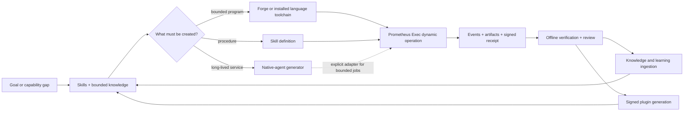

# Dynamic Operations with Prometheus Exec

An agent writes a 20-line Python transform. The transform reads one declared JSON input, produces one declared report, and finishes in 80 milliseconds. Ordinary shell execution can tell you that it printed `42`. Prometheus Exec can also tell you which signed request authorized the run, which code and input bytes were used, which limits and sandbox profile applied, which output bytes were produced, and which device signed the terminal receipt.

That difference is the purpose of Dynamic Operations. `prometheus-exec` turns a bounded code run into durable, portable evidence. It does not replace Bash, Python, code generation, or autonomous agents. It is the execution boundary to choose when the result must survive response loss, restart, later review, or transfer to another machine.

## The capability loop is now closed

The original skill system could discover instructions, generate code, create skills, scaffold complete agents, remember outcomes, and distribute signed capability bundles. Prometheus Exec adds the missing operation boundary: run newly produced code with explicit authority and preserve the result as verifiable evidence.

The arrows matter. A toolchain **creates** a program. Prometheus Exec **runs** an eligible program. A generated native agent **hosts** a long-lived model-driven service. Knowledge and learning **remember** what the verified operation taught the system. Plugin distribution **authorizes and delivers** reusable capability. These are composable responsibilities, not competing names for the same feature.

## What one operation gives you

Every accepted operation has a stable identity and a durable lifecycle:

- an RFC 8785 canonical request hash binds code, inputs, capabilities, limits, targets, and provenance;
- same request ID plus the same canonical payload replays the existing run instead of executing twice;
- the same ID with different content fails as a conflict;
- accepted, started, output, and terminal events have ordered durable cursors;
- stdout, stderr, declared artifacts, and environment records are content-addressed;
- the terminal receipt is signed and appended before terminal state becomes visible; and
- verification can run later with public material and no daemon or network.

The service is optional. It does not intercept or restrict ordinary Bash, Python, Edit, Write, or installed compiler use. Reach for it when the proof matters, not merely because code is being run.

## The three execution tiers

| Tier | Runs | Evidence | Best fit |
| --- | --- | --- | --- |
| **Tier P** | Generated Python, Node, or Bash | Host-attested receipt bound to OS process isolation and measured toolchain state | Bounded native scripts, data transforms, repository analysis, report generation |
| **Tier W** | Authorized `prometheus:component@0.1.0` WebAssembly components | Verified receipt with deterministic capability inputs and backend-independent projection | Portable algorithms, signed plugin components, desktop/embedded replay |
| **Tier R** | An already-signed request delivered to enrolled remote targets | Independently signed per-target results and durable dispatch state | Estate fan-out, offline peers, response-loss reconciliation |

Tier R is delivery, not a fourth runtime. Every target ultimately hands the request to its local Tier P or Tier W facade.

## What Prometheus Exec is not

Prometheus Exec is deliberately narrower than a general application platform:

- It does **not generate code**. Agents, Forge, templates, and language toolchains do that.
- It does **not run arbitrary native executables**. Tier P accepts Python, Node, and Bash; compiled portable work targets Tier W.
- It does **not host an LLM, chat UI, A2A endpoint, or independent model policy**. The native-agent generator produces that long-lived service.
- It does **not make every WebAssembly binary interchangeable**. Tier W requires the Prometheus component world; the native-agent LibreFang target uses a different guest ABI.
- It does **not turn a successful build into a deployment claim**. Artifact, disposable runtime, installed host, remote transport, and physical-device evidence remain separate.

## Representative use cases

### Run a generated transform once, safely

An agent generates a Python or Node program for a supplied dataset. Tier P gives it only declared inputs and output paths, clears the ambient environment, denies network access, enforces resource ceilings, and returns a signed receipt. This is the default example in the [program-generation guide](./generating-programs.md).

### Publish a portable deterministic operation

A Rust toolchain compiles a component against `prometheus:component@0.1.0`. A signed plugin generation or explicit standalone hash pin authorizes the exact bytes. Tier W supplies typed capabilities, fixed time and random material, and portable replay through Pulley. See [Tier W portable components](./tier-w-portable-components.md).

### Recover after the caller loses the response

The caller resubmits the same canonical request or reads status and events using the original ID. Because acceptance precedes execution and the receipt precedes terminal publication, the caller receives the existing result rather than starting a duplicate operation.

### Delegate bounded work from a persistent agent

A generated native agent remains responsible for conversation, model routing, A2A, UI, and lifecycle. When one of its jobs needs constrained execution and a receipt, an explicit local adapter can submit that job to Prometheus Exec. The generator does not add this adapter automatically. See [Choosing the right capability](./choosing-the-right-capability.md).

## Start here

1. Use [Choosing the right capability](./choosing-the-right-capability.md) before creating anything.
2. Read [Generating programs for execution](./generating-programs.md) to understand the toolchain boundary.
3. Follow [Local API, CLI, and MCP](./local-api-cli-and-mcp.md) for a first run.
4. Use the [Use-case cookbook](./use-case-cookbook.md) to adapt a proven pattern.
5. Check [Platform and evidence status](./platform-and-evidence-status.md) before making a platform claim.
