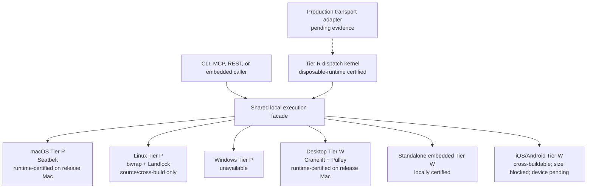

# Platform and evidence status

Readiness is evidence-scoped, not a percentage. Source/build evidence, disposable runtime evidence, installed-host state, remote deployment, mobile size, and physical-device runtime are separate claims.

| Surface | Status | Evidence boundary |
| --- | --- | --- |
| Contract schemas, signatures, receipt log, and offline verifier | Completed | Local unit/property/integration and portable bundle fixtures |
| macOS x86_64 Tier P Seatbelt | Runtime-certified on the release Mac | Real Python/Node/Bash, denial, limit, response-loss, restart, and receipt verification runs |
| Desktop Tier W Cranelift and Pulley | Runtime-certified on the release Mac | Real reference component, capability fences, cross-backend projection, replay, and signed-estate checks |
| Linux Tier P | Source/cross-build/portable-fixture only | No Linux kernel runtime executed in this release |
| Windows Tier P | Unavailable | No sandbox backend is implemented |
| Standalone embedded Tier W | Locally certified | Estate-free exact pins, private ledger/CAS, events, receipts, and restart fixtures |
| iOS/Android bundled-mobile Tier W | Cross-buildable, release blocked | Fair retained-graph binary deltas exceed the 12 MiB requirement |
| Physical iOS/Android runtime | `pending_evidence` | No usable connected physical device produced a signed run bundle |
| Tier R protocol kernel | Disposable-runtime certified | Isolated peer delivery, auth, replay, expiry, response loss, offline resume, restart, and slow-peer fixtures |
| Production remote transport deployment | `pending_evidence` | No external transport/service deployment was invoked or certified |
| Installed host binary/service | Completed for the release Mac | Signed `prometheus-exec 1.7.0` hash readback, service state, and doctor evidence are archived; this does not claim another host is installed |

## Mobile size status

The mobile code path is real and cross-buildable, but release readiness is blocked by measured size, not hidden behind a green compile. Against the fair baseline that retains the generated FFI dispatcher and execution graph, current iOS and Android deltas exceed 12 MiB. Pulley/no-JIT profile selection remains valid build evidence; it does not erase the size failure or substitute for a physical-device run.

## Remote status

The remote kernel is transport-injected and has complete disposable protocol fixtures. The production Sovereign adapter is not deployed or runtime-certified by this phase. No installed Sovereign or KBD service is used as orchestration, memory, or test infrastructure. Local execution and verification stay available when remote evidence is pending.

## How status advances

A platform moves to `completed` only when its named evidence is archived and independently checkable. Examples:

- Linux requires a real supported kernel, sandbox binaries, denial/limit tests, restart evidence, and signed receipt verification.
- Mobile requires size compliance plus physical iOS and Android runs returning value, ordered events, signed receipts, artifacts, and public-key-only verification.
- Remote deployment requires isolated production-adapter peers, enrolled identities, delivery/reconciliation evidence, and verified per-peer receipts without touching unrelated installed state.

The deterministic source for current dimensions is [Prometheus Exec evidence status](/docs/operations/generated-reference). Installation evidence is updated only after final binary/signature/service readback; it is never inferred from a successful build.
