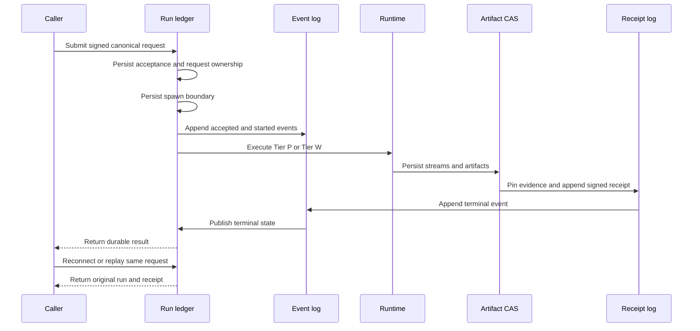
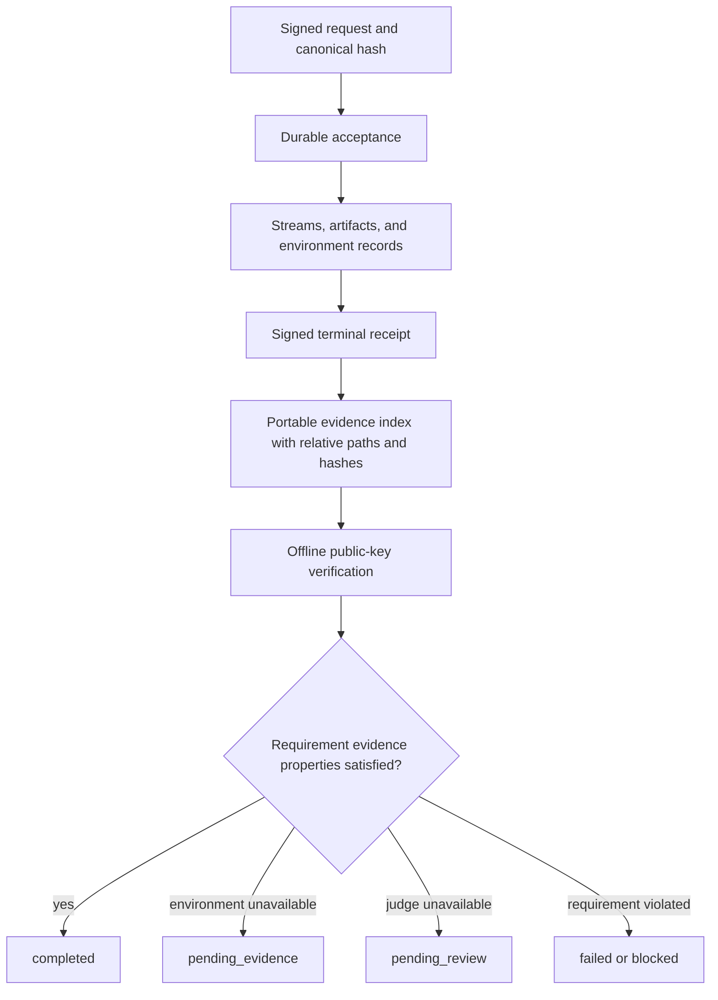

# Receipts, verification, and certification

A terminal receipt answers five concrete questions: which signed request ran, which code and inputs it bound, which authority and limits were enforced, which bytes came out, and which device signed the result.

## Why the publication order matters



The order prevents a caller from observing success before the receipt and referenced bytes are durable. It also lets restart reconciliation distinguish never-spawned work from interrupted work and already-completed work.

## Receipt anatomy

`ExecutionReceipt` includes:

- run ID, canonical request hash, terminal state, tier, and evidence class;
- code, input-set, environment, toolchain, and sandbox-profile hashes;
- backend, exit status or trap, stable failure details, and resource usage;
- SHA-256 references for stdout, stderr, and declared artifacts;
- executing-device key ID, signature algorithm, and signature;
- grants used by Tier P; and
- component authorization, engine version, backend profile, and deterministic projection for Tier W.

Tier P receipts are `attested`; Tier W receipts are `verified`. A successful Tier W receipt must contain component provenance. A rejected or interrupted pre-execution Tier W receipt must name the failure rather than pretending a component ran.



## Offline verification

Verify one receipt and its referenced artifacts without starting a service:

```bash
prometheus-exec verify \
  --receipt ./receipt.json \
  --request ./request.json \
  --public-key '<unpadded-base64url-public-key>' \
  --artifacts ./bundle \
  --format json
```

For Tier W, add `--component ./skill.wasm` and the exact named `--input NAME=PATH` values to re-execute under the portable Pulley profile. Verification first checks the signature/request binding, then compares state, output and artifact hashes, failure, authorization, engine version, and deterministic projection. Timestamps, measured usage, and backend-specific profile identity are not falsely required to match across backends.

Verify an indexed package with no network or daemon state:

```bash
prometheus-exec verify-bundle \
  --index ./execution-evidence.json \
  --root ./bundle \
  --format json
```

The checker rejects absolute or traversing paths, symlinks, duplicate entries, size/hash mismatches, identity mismatch, missing artifacts or environments, and invalid receipt/request binding.

## Certification semantics

Certification is method-independent. A requirement declares evidence properties; any producer may satisfy them with independently verifiable material. `prometheus-exec` is one evidence producer, not a mandatory gate on creative Bash or Python work.

Statuses stay separate:

- `completed`: the named evidence properties verify;
- `pending_evidence`: a required environment, peer, or physical device was unavailable;
- `pending_review`: the distinct review judge was unavailable;
- `blocked`: a known requirement is not satisfied, such as the mobile size budget; and
- `failed`: supplied evidence was present but invalid.

Artifact/source, disposable runtime, installed host, remote deployment, mobile size, physical device, and judge review are independent dimensions. A green source build cannot imply an installed or externally operated service.

## From receipt to learning

A receipt is immutable execution evidence, not automatically a lesson. A supervised workflow may review the request, output, failure, and verification result, then ingest a bounded observation into the knowledge system. Prompt snapshots publish later through the normal learning worker. This separation prevents a generated program from writing its own result directly into future prompt context as unquestioned truth.

Next: [Dynamic Operations use-case cookbook](./use-case-cookbook.md).
