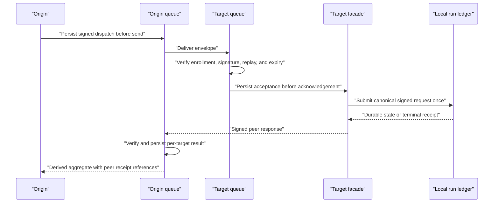

# Remote dispatch and reconciliation

Tier R is an estate-only protocol kernel, not a second execution engine. It delivers one already-signed execution request to enrolled targets and preserves each target's independently verifiable result. The remote crate has no dependency on KBD or Sovereign Sync; production networking is an injected adapter.

## Signed dispatch contract

An origin envelope binds the dispatch ID, canonical execution request hash, origin endpoint, target endpoint, issue time, validity window, and signer identity. The verifier checks the endpoint/signing-key pair against an injected immutable enrollment snapshot before queueing. Unknown endpoints, signer mismatches, stale envelopes, and replay conflicts fail closed.

The enrollment snapshot contains public endpoint/key bindings only. The remote kernel cannot pair devices, mutate an allow-list, derive a group secret, or read a complete pairing ticket. Full tickets and private material do not enter queue records, logs, or receipts.

## Durable per-target state

Origin and target queues are private, immutable, and hash-linked. A target persists accepted or rejected state before returning acknowledgement. Expired work becomes a terminal rejection; it does not disappear. Accepted work is submitted once through the local execution facade, so the target's normal request ledger prevents re-execution.

The origin verifies the enrolled target signature before storing a peer response. Aggregate state is derived from target records and may contain a mix of received, running, applied, rejected, expired, unavailable, or pending-evidence targets. The aggregate never replaces peer receipts with a synthetic success.

## Recovery cases

- **Lost acknowledgement:** redispatch with the same dispatch ID and hash returns the stored target state.
- **Lost terminal response:** query the origin record; the verified peer receipt is stored before terminal aggregate publication.
- **Offline target:** retry within the validity window; queued work resumes without creating a second local run.
- **Restart:** both origin and target reopen their immutable queues and derive the same next action.
- **Slow target:** per-target operations are isolated, so one slow peer cannot delay local health or another peer's result.

## Current evidence boundary

Disposable isolated peer fixtures prove two-peer delivery, replay rejection, authorization failures, expiry, response loss, offline resume, restart, mixed outcomes, and slow-transport isolation. They do not prove a production Sovereign transport deployment. That external runtime requirement remains `pending_evidence`, and local health/verification do not wait for it.

Next: [Receipts, verification, and certification](./receipts-verification-and-certification.md).
