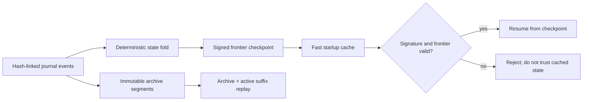

# Checkpoints, compaction, and recovery

KBD derives runtime state from an append-only journal. A checkpoint makes that
fold faster; it does not replace the journal as the source of truth. Each
checkpoint binds the folded state to an exact event count and frontier hash and
is signed by the local runtime identity.

## What is persisted

- `checkpoints/checkpoint-<event-count>-<frontier>.json` contains folded state,
  the frontier hash, signer identity, and signature.
- `checkpoints/current.json` atomically names the preferred checkpoint.
- `journal/archives/events-<first>-<last>.jsonl` stores a compacted immutable
  event prefix.
- Each archive has a hash-linked manifest and rollback metadata naming the
  archive, active suffix, and checkpoint directory.

The runtime retains at least two signed checkpoints before it will compact a
journal. Compaction also retains at least one event in the active suffix. It
moves history into a new immutable segment; it never treats deletion as
compaction.

## Startup and replay

At startup the runtime verifies the checkpoint signature and frontier. A valid
checkpoint seeds the fold, and the runtime applies only the remaining events. A
bad signature, mismatched frontier, malformed archive, or broken archive hash
chain is an integrity error rather than a reason to return an empty state.

For a full recovery proof, replay archive segments in order and then the active
journal suffix. The result must match a cold fold of the same event sequence.
The automated runtime tests compare these paths and reject a tampered
checkpoint.

## Crash windows

Writes use the single-writer journal lock and fsync ordering. If a process dies
while appending, startup preserves an invalid unterminated tail beside the
journal with its SHA-256 checksum before repairing the active file. The tail is
evidence: it is archived, not silently discarded.

Checkpoint and pointer writes are atomic. A crash before the pointer switch
leaves the old checkpoint active; a crash after it leaves a complete new
checkpoint active. Archive segments are created immutably before the active
suffix is rewritten.

## Operator recovery

1. Stop disposable writers and preserve the entire runtime directory.
2. Verify archive manifests, payload hashes, and checkpoint signatures.
3. Replay archives plus the active suffix into a separate recovery directory.
4. Compare the recovered frontier and folded state with the recorded
   checkpoint.
5. Use the generated rollback metadata to restore paths. Do not invent a
   partial rollback or delete the newer artifacts.

Pause is advisory coordination only. It records a causal checkpoint and tells
participants to stop scheduling work; it does not intercept Bash, Python,
Edit, or Write. The journal transaction remains the concurrency boundary.
