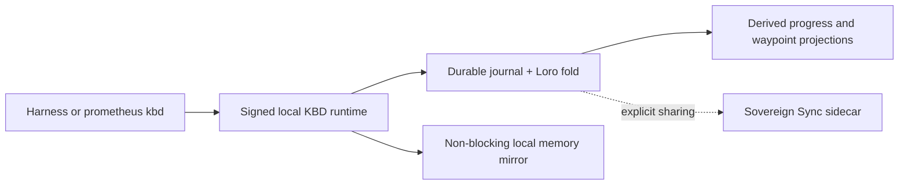

# KBD local recovery and refresh

This recovery makes the signed local runtime the only authority required for
ordinary KBD work. It also hardens long-running phases against lost position,
repairs memory and UI-routing contracts, makes registry cleanup recoverable,
and refreshes every detected harness from one immutable skill generation.

## Why the architecture changed

Putting a continuously running synchronization service in the local command
path created a false dependency: if the sidecar stopped, agents reported KBD
as unavailable even though the durable journal and signer were on the same
machine. The repaired design separates concerns:



- Local authority is always usable without a daemon.
- Sovereign Sync is passive replication enabled only by `--sharing`.
- Plain full setup stops and disables current and legacy sync identities.
- Compatibility files are projections; replay may repair them without changing
  the canonical revision.

## Recovered contracts

### Memory

KBD discovers an explicit memory endpoint first and otherwise probes the
canonical local service. MCP paths are normalized to the server origin.
Lifecycle hooks write valid entities with string observations and remain
non-blocking when memory is unavailable. Recall ranks same-project and
same-phase events, writes at most five results, and distinguishes a reachable
service with no match from an unreachable service.

### Position and boundary receipts

Before and after every task, phase, child transition, and ZeeSpec checkpoint,
the runtime records an idempotent receipt tied to the authoritative revision.
It derives totals from canonical phase order and task sequence and emits:

```text
Starting task i out of n: <canonical name>
Completed task i out of n: <canonical name>
Position: <canonical path> @ revision <n>
```

Outstanding obligations are restored at session start and after compaction.
Missing, duplicated, or out-of-order receipts cannot certify completion.
Projection repair is allowed; guessed canonical mutation is not. Direct
OpenSpec completion without KBD apply receipts remains uncertified.

### UI/UX routing

Presentation work resolves an existing route, file, or incumbent surface before
loading design context. A future path stays a destination, not fabricated
evidence. Optional capabilities are consulted only when installed; the
documented installed fallback is used otherwise. Injector refreshes remain
inside their managed fence and are idempotent.

### Registry maintenance

Missing replica paths are inventoried without mutation. Apply re-evaluates them
under the exclusive registry lock, preserves existing and multi-replica
registrations, and writes the original bytes, SHA-256, receipt, and rollback
instructions before atomic replacement. Runtime journals and checkpoints are
never deleted by registry pruning.

### Review and build discipline

Hot-path boundary evaluation is deterministic and network-free. Adversarial
review is reserved for phase completion, ambiguous authority, or a repeated
violation, and is screened for sycophancy. Implementation is completed before
tests. Only local full-integration gates count as acceptance evidence. Cargo and
`rustc` are serialized machine-wide; worktrees use isolated targets and share
cacheable compilation through `sccache`.

## Refresh this machine

First verify no other Cargo or `rustc` process is active. Build only the native
components changed by the source update, then install their signed artifacts.
Generate and deploy the cross-harness payload once:

```bash
npm run build:distribution
npm run validate:harness-adapters
bash scripts/install-mcp-services.sh --restart
bash scripts/install-skills-flat.sh
npm run verify:skills
npm run validate:codex
npx tsc -p .opencode/tsconfig.json --noEmit --pretty false
```

The installer configures detected Claude Code, Codex, OpenCode, Kimi, MiniMax,
Cursor, Windsurf, Gemini CLI, Roo Code, Amp, and supported compatibility
surfaces from one immutable generation. A client that is not installed or has
no configuration is explicitly skipped. OpenCode loop session JSON is
machine-local resumable state and is ignored by Git; an empty session may be
removed without deleting source work.

Verify core services and the installed runtime locally:

```bash
bash scripts/check-mcp-health.sh
prometheus doctor --json
npm run verify:skills
```

If the learning worker has an accepted queue item, kick or wait for the worker
and rerun the doctor after the item reaches a terminal receipt. An authenticated
model endpoint may return HTTP 401 to an unauthenticated doctor probe; the
doctor confirms the public `/health` endpoint before classifying that response
as healthy rather than reporting the gateway down.

Do not enable the sidecar merely to make the doctor green. When cross-machine
replication is actually required, use the explicit sharing profile:

```bash
prometheus setup --full --sharing
```
